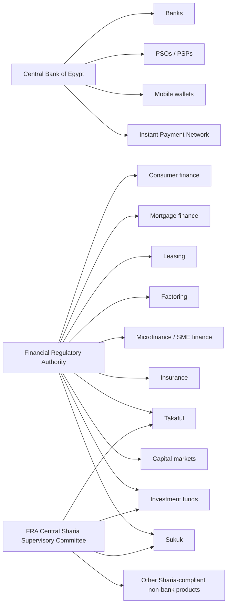
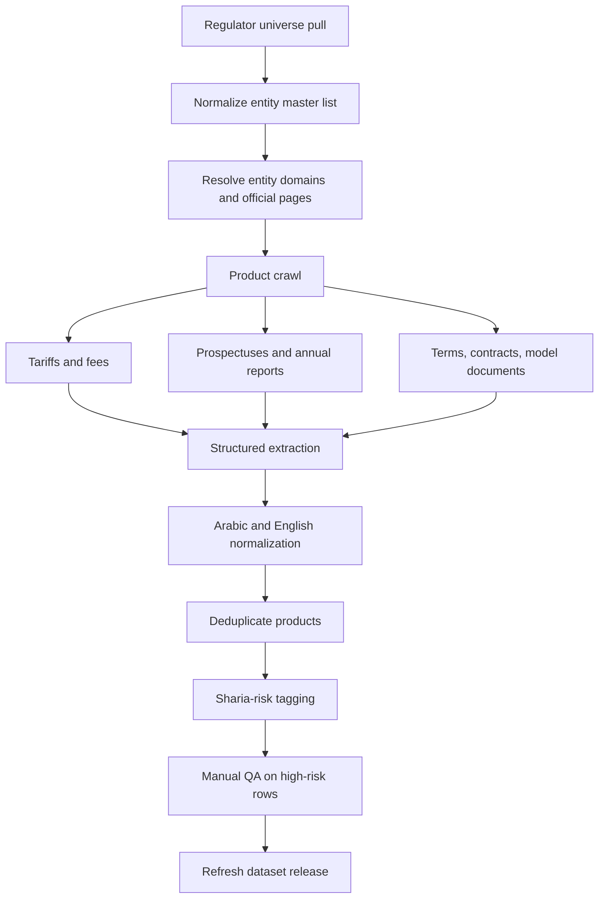
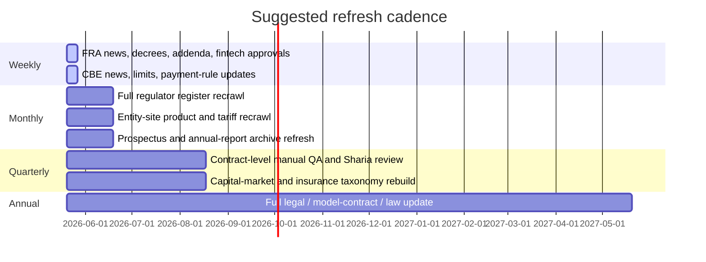

# Egypt Financial Institutions Refresh for Sharia Screening

## Executive summary

A current refresh of Egypt’s regulated financial-entity universe can already be anchored to several strong primary-source buckets. On the banking side, the Central Bank of Egypt states that Egypt’s monetary survey consolidates all currently registered **36** domestic and foreign banks, and the CBE also publishes current “registered banks / operating banks” PDFs. On the FRA side, the live financing register is paginated across **20** pages; the mortgage-finance register shows **28** visible company records across three pages; the leasing register shows **45** visible company records across five pages; the insurance-and-reinsurance company register shows **38** visible companies across two pages; the dedicated fintech-licensee page shows **17** listed companies; the FRA’s takaful page states **10** takaful companies as of end-2023; and the FRA’s Islamic-funds page states **24** Sharia-compliant investment funds with EGP 11.5 billion in value as of September 2025. Consumer finance is one of the most important refresh targets because FRA’s published August 2024 register PDF lists **44** licensed consumer-finance companies/providers, while later FRA decisions and press releases show additional 2025–2026 approvals, including Manzel Fin, Lucky, Orion, Adva, and Tilda. citeturn29search16turn29search0turn14view2turn14view1turn15view0turn18view0turn23view0turn22view1turn21view0turn24view0turn24view1turn16view0turn17view0turn26view0turn27view5turn27view3turn13view0turn5search3turn25search4turn30search0turn30search7

For Sharia-screening purposes, the most valuable public documents are not generic company profiles but **tariff sheets, prospectuses, fund documents, model contracts, annual reports, and regulator rulebooks**. The CBE’s payments stack now also matters materially for screening digital products: it has issued formal licensing rules for PSOs and PSPs, explains the mobile-wallet framework, and publishes IPN / InstaPay limits showing a **daily cap of EGP 120,000 and a monthly cap of EGP 400,000 per bank registered in the app**. On the non-bank Islamic side, FRA’s Central Sharia Supervisory Committee has an explicit mandate to approve Sharia-compliant non-bank products, review subordinate committee reports, and report annually on market compliance; the regulator’s Islamic-funds and takaful pages also provide a legally meaningful starting point for product-by-product Sharia review. citeturn3search0turn29search14turn3search2turn3search8turn27view4turn27view3turn27view5

The immediate conclusion is that a refreshed dataset is feasible, but it should be built in **tiers of confidence**. Tier one should rely on regulator registers, CBE/FRA rulebooks, official bank tariffs, official fund pages, official annual reports, and downloadable prospectuses. Tier two should add entity-site product pages without tariffs. Tier three should flag “Not publicly available” wherever pricing, fees, penalties, collateral, or model agreements are absent. The biggest current public-data gaps are a fully normalized live list of CBE-regulated payment institutions, full filtered extraction of FRA’s paginated microfinance universe, and a fresh regulator-derived split of the capital-markets universe into brokerage, asset management, custody, and related categories. citeturn14view3turn25search6turn25search7turn14view2turn29search12turn3search0

## Scope and methodology

This refresh assumes a **full public-site crawl per entity unless technically blocked**, uses original-language Arabic/English sources where possible, summarizes them in English, and treats the cutoff date as **2026-05-20**. The correct collection order is: regulator register first, then entity master pages, then product/tariff/prospectus/terms pages, then annual reports and disclosures, and finally exception handling for missing contract-level materials. That order is important because the Sharia screen depends less on marketing copy and more on the economic substance visible in fees, late-payment clauses, collateral mechanics, principal-protection language, ownership transfer, insurance bundling, and governance documents. citeturn14view3turn29search12turn27view4turn27view3turn27view5

The uploaded March 2026 workbook and presentation are useful as a **baseline snapshot**, but they should not be treated as a current production universe without rerunning against live regulator sources. Current official CBE snippets already show at least **Kuwait Finance House Bank - Egypt** and **Bank NXT** in the operating-bank universe, which means bank-name drift and registration updates must be reconciled before production use. citeturn29search3turn0search3turn29search0

The practical extraction schema should preserve both **raw text** and **normalized text**. For each row, store the source language, source date, source type, regulator/entity source rank, product name as published, pricing figures exactly as published, and a Sharia-review flag. Where product terms are dynamic, the scraper should also archive the file/PDF hash and crawl timestamp. FRA’s Islamic-funds page is especially useful here because it shows how the regulator itself conceptualizes Islamic products—profit and loss sharing, mudaraba/musharaka/wakala structures, and prospectus-based disclosure. citeturn27view3turn27view4

## Current regulatory universe and refresh map

### Full entity universe by sector with counts and regulator links

| Sector | Current observed universe / count | Primary regulator link | Refresh action | Coverage note |
|---|---:|---|---|---|
| Banks | 36 current registered/operating banks | CBE bank register PDFs and banking-sector analytical accounts citeturn29search0turn29search16 | Re-transcribe the full live CBE bank PDF and compare against the March 2026 baseline workbook | High priority because current CBE snippets show name drift versus older baselines, including KFH Bank Egypt and Bank NXT. citeturn29search3turn0search3 |
| Payment institutions and payment-service providers | Not publicly consolidated in the accessed pages | CBE PSO/PSP licensing rules; CBE licensing pages citeturn3search0turn3search6turn29search12turn29search15 | Build a dedicated payment-institution universe from CBE licensing/rules pages and entity approvals | Public rules are available; a clean public licensee directory was not located in this pass. |
| Mobile wallets | Product framework publicly documented; entity count not consolidated in accessed sources | CBE mobile-wallet page citeturn29search14turn3search1 | Map each participating bank / agent wallet separately during rerun | Payment-service wrappers, not financing contracts. |
| Instant Payment Network | National network linking operating banks; daily EGP 120,000 and monthly EGP 400,000 per bank in-app | CBE IPN page and regulations/news citeturn29search13turn3search2turn3search8turn3search12 | Add IPN/InstaPay as a payment-service layer to each participating bank | Important for wallets, remittances, and transfer-fee screens. |
| Capital-market institutions | **March 2026 uploaded-workbook baseline:** 797 entities; live official count not re-derived in this pass | FRA registration portal and capital-market registration/licensing pages citeturn14view3turn25search6turn25search7 | Run a dedicated capital-markets crawl and split into brokerage, asset management, portfolio management, custody, direct investment, etc. | Official public count was not consolidated in the accessed pages. |
| Insurance and reinsurance companies | 38 visible insurer/reinsurer company records across 2 pages | FRA insurance register pages citeturn16view0turn17view0 | Refresh the insurer subset first, then widen to brokers, adjusters, consultants, funds | The broader insurance universe in the uploaded baseline is much larger because FRA insurance registers include many entity types. citeturn14view0turn14view3 |
| Takaful companies | 10 as of end-2023 | FRA takaful page citeturn27view5 | Add policy wording, surplus-distribution, qard, investment-policy, and Sharia-board fields | Law No. 155 of 2024 now governs takaful/re-takaful articles 192–197. citeturn27view5 |
| Mortgage-finance companies | 28 visible company records across 3 pages | FRA mortgage pages citeturn14view1turn15view0turn18view0 | Download each entity page and all product/application/T&C pages | High-value for collateral, insurance, interest, and default clauses. |
| Leasing companies | 45 visible company records across 5 pages | FRA leasing pages citeturn23view0turn22view1turn21view0turn24view0turn24view1 | Pull company pages and standardized lease templates; map leasing vs leasing+factoring vs multi-activity | Priority for ijara-style vs conventional lease comparisons. |
| Consumer-finance companies and providers | 44 licensed in the August 2024 PDF, plus later 2025–2026 approvals | FRA 2024 consumer-finance PDF and later decisions/news citeturn13view0turn5search3turn25search4turn30search0turn30search7 | Merge the 2024 base register with 2025–2026 addenda and fintech approvals | This is a fast-moving sector and needs incremental refresh logic. |
| Microfinance and SME finance | Complete filtered count not extracted in this pass; live financing register spans 20 pages | FRA financing register and NBFI overview page citeturn14view2turn30search5 | Rerun with activity filters for microfinance and SME finance; do not rely on name-pattern inference alone | “Not publicly available” as a clean, complete filtered count from the specific pages fully extracted in this session. |
| Fintech licensees | 17 visible listed companies on FRA’s dedicated page | FRA fintech-licensee page citeturn26view0 | Crawl each entity to map activity, outsourcing provider, and fintech domain | Useful cross-link layer over consumer finance, brokerage, insurance, and fund distribution. |
| Islamic investment funds | 24 funds, EGP 11.5 billion as of Sep-2025 | FRA Islamic-funds page and prospectus pages citeturn27view3turn7search1turn9search2 | Download every prospectus and extract fees, valuation, Sharia governance, and underlying-asset rules | One of the strongest regulator-side sources for Sharia screening. |
| Sukuk issuances | No single public standing count consolidated in the accessed pages | FRA prospectuses / information memos and CSSC decisions citeturn7search2turn27view4 | Treat sukuk as issue-level data, not static entity data; archive each memo and related CSSC decision | FRA CSSC approved a first participation sukuk for Al Ahly for Securitization valued at EGP 2.8 billion in Feb-2025. citeturn27view4 |

## Detailed product-level extraction table

### High-disclosure product rows ready for the refreshed dataset

| Bank / Financial Entity | Entity Type | Service / Product | Service Category | Contract Type if available | Key Financial Details | Key Contractual Terms | Islamic / Sharia-Compliant Claim | Source | Notes for Sharia Compliance Review |
|---|---|---|---|---|---|---|---|---|---|
| National Bank of Egypt | Bank | Meeza debit card; retail account tariffs | Debit card / retail banking | Deposit-account-linked card | Issuance fee EGP 75; annual fee EGP 75; replacement EGP 75; local ATM cash withdrawal at other banks EGP 5/transaction; balance inquiry at some other local ATMs charged. | Terms and conditions apply; card is tied to account relationship and local/international usage rules. | No Islamic claim on the cited tariff pages. | Official NBE tariff PDFs citeturn1search0turn1search8 | Conventional-fee row; no apparent Sharia marketing. Screen mainly for fee mechanics rather than riba from the card itself. |
| Banque Misr | Bank | Visa / Mastercard debit cards | Debit card / retail banking | Deposit-account-linked card | Issuance EGP 150; annual renewal EGP 150; supplementary issuance/renewal EGP 100; other-bank ATM cash withdrawal in Egypt EGP 5; domestic daily purchase limit EGP 350,000; domestic online monthly limit EGP 400,000. | Issued against current/savings/day-by-day accounts; five-year validity; linked-account functionality; domestic usage limits stated. | No Islamic claim on the cited card pages. | Official BM card / fee pages citeturn1search9turn1search1turn1search5 | Useful benchmark for card-fee normalization across banks. |
| Commercial International Bank | Bank | Personal loan | Loan / consumer banking | Conventional personal loan | Loan size from EGP 10,000 up to EGP 13.5 million; repayment 12–96 months; assessment fee EGP 200; monthly service fee EGP 75–200 by segment; administration fees generally 1%–3%; early settlement 7%–15% depending on secured/unsecured and buyout; late-payment fee adds 5% to applied interest on overdue amount; stamp duty 0.05% quarterly on highest debit balance; life insurance obligatory for unsecured loans. | Unsecured or secured; buyout/top-up options; monthly installment up to 50% of income; documentation and HR/bank-statement support required. | No Islamic claim. | Official CIB product page citeturn1search6turn1search2 | High-priority riba screen because the page explicitly uses interest-based late fees and conventional loan terminology. |
| Abu Dhabi Islamic Bank Egypt | Islamic bank | ADIB Simple; Al Ghina / Al Ghina Plus; Diamond Sukuk | Current/savings/investment | Islamic deposit / savings / sukuk-style retail investment, as marketed | ADIB Simple supports account opening with national ID; daily withdrawal/deposit limit EGP 90,000 and monthly EGP 300,000; Al Ghina / Al Ghina Plus expected profit up to 17.50%; “xcite” floating rate up to 18.50%; Diamond Sukuk expected rate up to 15.25%; AL Ghina Sukuk expected profit up to 19%. | Free digital/mobile access and wallet on cited pages; realized profit timing on Diamond Sukuk may be monthly/quarterly/annually/at maturity; expected-profit language used rather than fixed-interest language. | Yes. ADIB states bank activities are compatible with Islamic Sharia, references oversight by the bank’s Sharia Board, and annual-report material notes Sharia Board meetings and fatwas. | Official ADIB product pages and investor disclosures citeturn1search3turn1search7turn1search11turn12search11turn12search1turn12search9 | Review whether “expected profit” is economically variable or effectively guaranteed; inspect charity-account, late-payment, and purchase/financing documents for treatment of penalties and ownership risk. |
| Al Baraka Bank Egypt | Islamic bank | Yawmi Plus account; savings account; simplified account “Kol El Nas” | Savings / current / simplified account | Islamic deposit/savings, as marketed | Yawmi Plus variable return tiers published effective 1 May 2026 range from 0% to 15.00% by balance tier; standard savings-account minimum balance EGP 3,000; profit on EGP/USD savings is calculated on the minimum monthly balance and credited semi-annually. Schedule-of-charges PDF publishes card/account charges. | Simplified account is marketed for natural persons; public pages describe required documents and balance-linked returns. | Yes. Bank markets Islamic cards and deposit products as Islamic. | Official Al Baraka product and charges pages citeturn2search0turn2search1turn2search4turn2search7 | Review whether profit pools, reserve handling, and penalty treatment are disclosed in annual reports rather than product pages. |
| Faisal Islamic Bank of Egypt | Islamic bank | Current accounts; free investment accounts | Current/investment account | Current account; 3‑month renewable investment account | Current-account minimum opening balance EGP 1,000. Free-investment accounts are described as three-month investment deposits renewable automatically; minimum opening balance EGP 5,000 or foreign-currency equivalents; returns distributed every three months according to actual results. | Account holders can deposit/withdraw by cheques/teller services; investment-account cash deposits and inbound transfer minimums are also specified. | Yes. Faisal describes itself as the first Egyptian commercial Islamic bank, and annual-report language refers to Sharia-compliant finance options. | Official Faisal product/report pages citeturn2search2turn2search5turn2search10turn11search2turn12search6 | Strong candidate for distinguishing qard/current-account treatment from investment-account profit-sharing treatment. |
| Kuwait Finance House Bank Egypt | Islamic bank | Saving certificates; retail account/deposit/financing suite | Certificates / deposits / financing / cards / wallet | Sharia-compliant certificates and Islamic retail banking, as marketed | Savings-certificate page states products are Sharia-compliant and mentions financing up to 90% of certificate value. KFH’s public retail menu includes current accounts, investment accounts, saving accounts, certificates, time deposits, personal and car financing, credit cards, debit cards, mobile wallet, and bancassurance. | Product suite is broad; individual product pricing must be pulled from fund/certificate pages and tariff lists. | Yes. KFH says it is a pioneer in Islamic finance and hosts a dedicated Shariah Board members page. | Official KFH site pages citeturn2search3turn2search9turn2search11turn11search0turn11search4 | High-value Islamic-banking row, but contract-level detail still requires tariff-list and financing-form extraction. |
| Banks / agents under CBE rules | Bank-linked payment service | Mobile wallets | Wallet / payment service | Payment-service wallet | CBE describes wallets as apps for payments, money transfers, and other basic banking operations, provided through banks and their agents (mobile network operators). Services include cash deposit/withdrawal through ATMs, branches, operator stores, and service agents. | Wallet is a regulated service infrastructure layer rather than a financing contract by itself. | No Sharia claim at regulator level. | CBE wallet pages citeturn29search14turn3search1 | Sharia review should focus on whether the wallet only transfers value or embeds lending, fees on float, or prohibited ancillary products. |
| Participating banks via IPN / InstaPay | Bank-linked payment service | Instant Payment Network | Instant payments / transfer rails | Payment-service transfer network | CBE states IPN links all operating banks and publishes a daily transaction limit of EGP 120,000 and monthly limit of EGP 400,000 per bank registered in the app. | Network launched on 22 March 2022; regulation supports account/wallet/card connectivity and remittances. | No Sharia claim at regulator level. | CBE IPN pages and regulations citeturn29search13turn3search2turn3search8turn3search12 | Important to separate payment rails from credit features layered on top by banks/fintechs. |
| Contact Financial / Contact Mortgage | Consumer/mortgage finance company | Real estate financing / mortgage | Mortgage finance | Not publicly specified on the cited page | Contact publicly markets mortgage and home-financing solutions; cited pages do not disclose pricing, interest/profit rate, fees, or penalties. | Public product page is marketing-led; contractual terms were not publicly extracted in this pass. | No Islamic claim on the cited page. | Official Contact pages citeturn28search10turn28search6turn28search13 | A prime example of why model contracts, application forms, and offer letters must be retrieved separately. For now: **Not publicly available** on key pricing mechanics. |
| Thndr Securities Brokerage | Brokerage fintech | Brokerage account; mutual-fund distribution including Sharia funds | Brokerage / mutual-fund distribution | Brokerage mandate / fund-subscription order flow | Thndr states trading is conducted through Thndr Securities Brokerage, regulated by FRA and registered in Egypt no. 804. For Egypt-market orders, transaction fees and regulatory/clearing/tax charges apply. For the Misr Shariah Equity Fund and NM Sharia Equity Fund pages, standard transaction fees apply and fund-management fees are embedded in certificate price rather than separately charged on buy/sell. | Buy/sell execution timing for funds is disclosed; product wrappers are brokerage plus fund distribution. | Brokerage itself: no Islamic claim. The distributed fund pages explicitly market Sharia funds. | Official Thndr pages citeturn28search14turn28search4turn28search8turn28search0turn28search11 | Useful for screening intermediary fees separately from fund-level Sharia claims. |
| Azimut Egypt | Asset manager | az-Gold | Precious-metals investment fund | Open-ended / public fund, under Sharia supervision | az-Gold aims to invest physically in bullion; NAV is calculated based on the gold price announced by EGX; fund follows a passive investment policy; daily indicative pricing is published; the snippet shows NAV 26.80497 EGP on 6 May 2026. | Gold exposure is physical-bullion-based according to the official page; receiving entities and documents are linked from the fund page. | Yes. The page expressly says the fund operates under Shari’a supervision. | Official Azimut fund page citeturn28search5 | High-priority row for verifying physical-backing, custody, creation/redemption mechanics, and treatment of cash balances. |
| Azimut Egypt | Asset manager | az‑Sharia Opportunities | Equity investment fund | Multi-tranche equity fund tracking Sharia EGX 33 methodology | Azimut’s funds page lists “az‑ فرص الشريعة” as an EGP equity fund with daily subscription and redemption. Separate official announcement material states tranche openings follow the regulations of the Sharia EGX 33 index. | Public snippets show multi-tranche fund operation and receiving-entity announcements; full fee schedule was not extracted here. | Yes, by fund name/methodology. | Official Azimut fund and announcement pages citeturn31search10turn31search1 | Screen index methodology, purification policy if any, and whether the prospectus discloses a Sharia reviewer or committee. |
| FRA prospectus universe | Investment-fund issuer / distributor | Bokra Gold first issue | Precious-metals fund | Prospectus-based public fund issuance | FRA’s prospectus pages list “Bokra Gold” as the first issue of a multi-issue precious-metals investment fund compliant with Islamic Sharia, under license no. 976 of 2025. Detailed fee terms were not extracted from the listing excerpt. | Prospectus is available through FRA’s prospectus pages. | Yes, explicitly Sharia-compliant in the title. | FRA prospectus pages citeturn9search2turn9search0 | Download the full prospectus before assigning any compliance label beyond the published claim. |
| FRA prospectus universe | Asset manager / fund issuer | Hermes Sharia EGX 33 | Equity fund | Prospectus-based multi-issue fund | FRA’s listing shows the second issue of Hermes’ multi-issue equities program as “Hermes Sharia EGX 33,” under FRA license no. 996 dated 16/12/2025. Pricing/fee details were not visible in the excerpt. | Requires full prospectus download. | Yes, by issue naming and regulatory listing. | FRA prospectus pages citeturn9search3turn7search1 | Important to capture benchmark/index methodology, purification language, and management-fee terms from the full prospectus. |
| FRA prospectus universe | Asset manager / fund issuer | CI Gold Misr | Precious-metals fund | Prospectus-based public fund issuance | FRA’s pages list “Gold Misr” as a Sharia-compliant daily cumulative-return-and-prizes gold investment fund under license no. 987 of 2025. Full financial charges were not extracted from the listing excerpt. | Full prospectus needed for subscription/redemption charges and custody details. | Yes, explicitly Sharia-compliant in the title. | FRA prospectus pages citeturn9search2turn9search0 | Review prizes/bonuses carefully from a Sharia perspective, along with bullion custody and cash-management mechanics. |
| FRA model-contract regime | Regulator model document | Consumer finance model contract | Model contract / regulatory template | Consumer-finance contract model | The page confirms FRA Chairman Decree No. 869 of 2021 concerns consumer-finance contract models and links to an updated version. Detailed financial terms were not extracted from the landing page itself. | Use latest model text as mandatory baseline for company-level contract scraping. | Not an Islamic claim in itself. | FRA decree page citeturn4search0 | High-priority document because actual consumer-finance offer letters should be compared against the regulator’s minimum data fields and default/penalty language. |
| FRA model-contract regime | Regulator model document | Approved financial-lease contract | Model contract / regulatory template | Financial lease model | FRA hosts an approved financial-lease contract page. Detailed fee language was not visible in the listing page excerpt. | Must be downloaded and parsed in full during rerun. | Not an Islamic claim in itself. | FRA page for approved lease contract citeturn4search1 | Essential for comparing conventional financial leasing against ijara-style Sharia structures. |
| FRA model-contract regime | Regulator model document | Factoring contract for receivables arising from margin purchasing | Model contract / regulatory template | Factoring contract | FRA Decree No. 1725 of 2021 states that factoring contracts for financial rights arising from margin securities purchases must be drafted according to the attached model and that companies are bound by the minimum data fields in that model. | Contract concerns margin-purchase receivables; the model is mandatory at least as to minimum data points. | Not an Islamic claim in itself. | FRA decree / PDF citeturn4search2turn4search5 | Very high-priority Sharia flag because factoring discounted receivables tied to margin transactions raises obvious compliance questions. |

## Core downloadable official documents

The citations below resolve to the official downloadable pages or PDFs that are most useful for rerunning the scrape and refreshing the Sharia-screening dataset:

- CBE registered / operating bank PDFs and the banking-sector 36-bank confirmation. citeturn29search0turn29search1turn29search16
- CBE PSO / PSP licensing rules PDF and IPN regulations PDF. citeturn3search6turn3search10turn3search12
- CBE mobile-wallet and IPN program pages for service features and limits. citeturn29search14turn29search13turn3search2
- NBE tariff PDFs for cards and retail accounts. citeturn1search0turn1search8
- Banque Misr schedule-of-charges PDF for retail accounts. citeturn1search5
- FRA August 2024 consumer-finance register PDF. citeturn5search6turn13view0
- FRA consumer-finance model-contract decree page, approved leasing-contract page, and factoring-contract PDF. citeturn4search0turn4search1turn4search2
- FRA Islamic-funds page and prospectus/index pages for Bokra Gold, Hermes Sharia EGX 33, and other Islamic funds. citeturn27view3turn7search1turn9search2turn9search3
- ADIB annual-report / board-report PDFs and related investor disclosures. citeturn12search9turn12search11

## Data-quality gaps and coverage limitations

The public-source picture is already strong enough to start a disciplined rerun, but several gaps are still material. First, **payment-institution coverage** remains incomplete because the CBE pages accessed here clearly publish rules and service frameworks, but the session did not locate a clean public licensee table for PSOs and PSPs. Second, **microfinance coverage** is incomplete because FRA’s financing register is paginated across 20 pages and this pass did not complete a filter-specific crawl that would isolate every microfinance provider from the broader financing universe. Third, **capital-market segmentation** remains unfinished because the FRA registration portal exposes the right pathways, but a complete public count split into brokerage, custody, asset management, portfolio management, and related sub-sectors was not re-derived in this pass. citeturn3search0turn29search12turn14view2turn14view3turn25search6turn25search7

From a Sharia-review perspective, the highest-risk missing fields are not entity names; they are **late-payment clauses, early-settlement fees, principal-guarantee language, insurance bundling, title/ownership transfer in leasing and mortgage products, gold-custody mechanics, and the beneficiary of penalties**. FRA’s Islamic-funds and takaful pages make clear that Islamic products in Egypt are expected to rest on structures such as mudaraba, musharaka, and wakala, and that takaful should operate on donation/cooperation/mutual-assistance principles rather than profit generation. That means the refresh should aggressively hunt for disclosure that either confirms or undermines those principles at the contract level. citeturn27view3turn27view5turn27view4

## Prioritized next-steps checklist

- Re-transcribe the **live CBE 36-bank list** from the current official PDF and reconcile it against the March 2026 baseline workbook, because current official snippets already show changes in the operating-bank universe. citeturn29search0turn29search3
- Crawl all **FRA financing-register pages** with activity filters for mortgage, leasing, factoring, consumer finance, microfinance, and SME finance, rather than relying on the unfiltered register. citeturn14view2turn30search5
- Merge the **August 2024 consumer-finance register PDF** with all **2025–2026 FRA decisions** to produce a current consumer-finance master table, including fintech-enabled approvals. citeturn13view0turn5search3turn25search4turn30search0turn30search7turn30search9
- Download every **Islamic-fund prospectus** and extract management fees, subscription/redemption charges, valuation frequency, purification language, gold-custody language, and named Sharia governance participants. citeturn27view3turn7search1turn9search2turn9search3
- Pull all **FRA model contracts** and compare them against live lender/company forms to identify any missing or divergent clauses on late fees, default, security, and assignment. citeturn4search0turn4search1turn4search2
- Add a dedicated **takaful policy-wording pack**: policy documents, participant-risk-fund language, operator fee model, surplus distribution, qard provisions, investment-policy wording, and Sharia committee references. citeturn27view5turn16view0turn17view0
- Build a separate **payment-services layer** covering mobile wallets, IPN, card tokenization, SoftPOS, and any bank- or fintech-operated payment wrappers regulated by the CBE. citeturn29search14turn29search13turn3search13turn3search9

## Appendix sector lists

### Banks

The bank list below is best treated as the **March 2026 baseline list reproduced from the uploaded workbook**, not the final refreshed live list. It should be revalidated against the current CBE PDF before production use, because official CBE snippets already show at least **Kuwait Finance House Bank - Egypt** and **Bank NXT** in the operating-bank universe. The baseline list is: Banque Misr; National Bank of Egypt; Egyptian Arab Land Bank; Agricultural Bank of Egypt; Industrial Development Bank; Banque Du Caire; The United Bank; Bank of Alexandria; MIDBank S.A.E; Commercial International Bank (Egypt); Attijariwafa bank Egypt S.A.E; Societe Arabe Internationale de Banque; Credit Agricole Egypt S.A.E; Emirates National Bank of Dubai S.A.E.; Suez Canal Bank; Qatar National Bank Alahli S.A.E; Arab Investment Bank; AL Ahli Bank of Kuwait - Egypt; First Abu Dhabi Bank - Misr; Ahli United Bank - Egypt; Faisal Islamic Bank of Egypt; Housing and Development Bank; Al Baraka Bank of Egypt S.A.E.; National Bank Of Kuwait - Egypt (NBK); Abu Dhabi Islamic Bank - Egypt; ABU DHABI COMMERCIAL BANK EGYPT; Egyptian Gulf Bank; Arab African International Bank; HSBC Bank Egypt S.A.E; Arab Banking Corporation – Egypt S.A.E; Export Development Bank of Egypt; Arab International Bank; Citi Bank N A / Egypt; Arab Bank PLC; Mashreq Bank; National Bank of Greece. citeturn29search0turn29search3turn29search16

### Insurers and reinsurers

The current visible FRA insurer/reinsurer company list comprises: Misr Insurance; Misr Life Insurance; Suez Canal Insurance; Mohandes Insurance; Delta Insurance; GIG Insurance Egypt; MetLife Life Insurance; AXA Life Egypt; Allianz Insurance Egypt; Chubb Insurance Egypt; Allianz Life Egypt; Royal Insurance; Salama Takaful Egypt; Chubb Life Egypt; QNB Life Insurance; Bupa Egypt Insurance; Egyptian Takaful Property & Liability; GIG Egypt Life Takaful; Wethaq Takaful Egypt; Iskan Insurance; Arope Life Egypt; Arope Property & Liability; Lebanese Swiss Takaful Egypt; Tokio Marine Egypt Family Takaful; Cafi Life Insurance; Orient Insurance Egypt; Suez Canal Life Insurance; Delta Life Insurance; Mohandes Life Insurance; AXA Insurance Egypt; Egyptian Emirati Takaful Life Salama; Misr Takaful Property & Liability; Sarwa Life Insurance; Sarwa Insurance; National Insurance Company; MADA Insurance Company; Al Wafaa Life Insurance Egypt; and Misr Takaful Life. citeturn16view0turn17view0

### Mortgage-finance companies

The current visible FRA mortgage-finance company list comprises: United Finance; EFG Financial Solutions; Manzel Fin Consumer Finance and Mortgage Finance; OR Mortgage Finance; Al Tawfeek Leasing AT Lease; Cairo Finance; BM Leasing; NAWY for Real Estate Mortgage; Misr Finance for Financial Services; Beltone Mortgage Finance; CIB Finance; GlobalCorp Consumer and Mortgage Finance Olin; Qastly Mortgage Finance; ADI Finance; Al Taameer Mortgage Finance First; MLF Mortgage Leasing and Factoring; CI Mortgage Finance; Nasser Social Bank; Contact Mortgage Finance; Sakan Mortgage Finance; KFH Finance; Arab African International Mortgage Finance; Al Ahly Mortgage Finance; Bedaya Mortgage Finance; Egyptian Refinancing Company; Amlak Finance Egypt; Tamweel Mortgage Finance; and Egyptian Mortgage Finance EHFC. citeturn14view1turn15view0turn18view0

### Leasing companies

The current visible FRA leasing-company list comprises: MLF Mortgage Leasing and Factoring; Catalyst Leasing and Factoring; GlobalCorp Financial Services; EFG Financial Solutions; Enmaa Finance; Al Taameer Leasing and Factoring First; Tanmia Finance TFC (formerly Egy Lease); EasyLease; United Finance; BM Leasing; Cairo Leasing Corporation; OR Leasing and Factoring; Arab African International Leasing; Beltone Leasing; EHFC Egyptian Mortgage Finance; Sky Lease; Tasaheel Microfinance; Tadbeer Leasing and Factoring; ProLease; Misr Finance for Financial Services; Tamweely Financial Services; Al Ahly Capital Microfinance Tamkeen; EFS Financial Solutions; Technollease; QNB Leasing; Samaa Finance; EMEIL Financial Services; FinLease; CorpLease Egypt; Nile Financial Leasing NFL; Zilla Finance; AT Lease; Tamweel Finance; Al Ahli Kuwait Misr Leasing; Incolease International Financial Leasing; GB Lease; TroFinance Leasing Trolles; UE Finance; Siyaf Aircraft and Equipment Leasing; ADI Finance; KFH Finance; Housing & Development Leasing; Al Ahly Leasing and Factoring; Contact Leasing; and Premier Leasing. citeturn23view0turn22view1turn21view0turn24view0turn24view1

### Consumer-finance companies and providers

The August 2024 FRA consumer-finance register PDF lists the following 44 licensed companies/providers: Contact Finance; Aman Financial Services; Raya Electronics; Al Mansour Automotive “Mansour Chevrolet”; Mantra/Mantrac for Cars; Beltone Consumer Finance formerly Belcash / Seven; B.Tech Trading and Distribution; Sky Finance Consumer Finance; BM Consumer Finance Sohoula formerly CI-related entity; RIZ Group for Trade “Rizkallah”; U Consumer Finance formerly ValU Consumer Finance; Rawag Consumer Finance; Premium International Finance Services formerly Premium International Credit Services; Abdul Latif Jameel Finance; Ezz Elarab – Contact Financial; SMG Installment Services; Contact for Car Installments; Egyptian Consumer Finance; Mashroey for Trade; Blnk Consumer Finance; Halan Consumer Finance; Bavarian Contact Automotive; Star Car Installment; Drive Finance and Non-Banking Financial Services; Abu Dhabi Islamic Consumer Finance; GlobalCorp Consumer Finance; MLF Mortgage Leasing and Factoring; Fawry Consumer Finance; Bedayti Consumer Finance; MID Bank Consumer Finance “Mid Takseet”; Contact Creditech Consumer Finance; One Finance Consumer Finance Services; Abu Ghali Installment Services; Shahry Consumer Finance; Pharos Consumer Finance; Fine Stone Investments; Elkan Finance Financial Services; OR Consumer Finance; Orange Egypt Communications; Aman Consumer Finance; GAST Consumer Finance; O2 Consumer Finance; Ma’ak Consumer Finance; and B.Tech Finance. Later FRA decisions and news then add or confirm subsequent approvals including Lucky Consumer Finance, Manzel Fin, Orion Consumer Finance, Adva Consumer Finance as a fintech startup, and Tilda Consumer Finance as a fintech startup. citeturn13view0turn5search3turn25search4turn30search0turn30search7turn30search9

### Fintech licensees

The dedicated FRA fintech-licensee page currently lists: Flend SME Financing; Contact Creditech Consumer Finance; Thndr Securities Brokerage; Halan Consumer Finance; B.Tech Finance; Olive Finance; MNT Tech Holding for Financial Investments; U Consumer Finance formerly ValU Consumer Finance; Bokra Portfolio Formation and Management; Sarwa Insurance; EFG Holding; Beltone Securities Brokerage; Misr Insurance; EFG Hermes International Securities Brokerage; Tilda Securities Brokerage; Hermes Securities Brokerage; and Azimut Investments Egypt. citeturn26view0

### Microfinance providers

A **complete filtered current microfinance appendix was not publicly available from the official pages fully extracted in this pass**. What is publicly clear is that the live FRA financing register is paginated across **20 pages**, includes microfinance among its activity filters, and currently shows recent microfinance entries such as RALIGHT for Microfinance, Ma’ak Micro Finance, Onwto for Microfinance, Abu Dhabi Islamic Egypt Microfinance, Erada Finance, Ingaz Micro Finance, and Shari for Micro Finance among current visible records. A production refresh should therefore run the financing register **with the microfinance filter applied** and export the full result set rather than infer the microfinance universe from names alone. citeturn14view2turn30search4