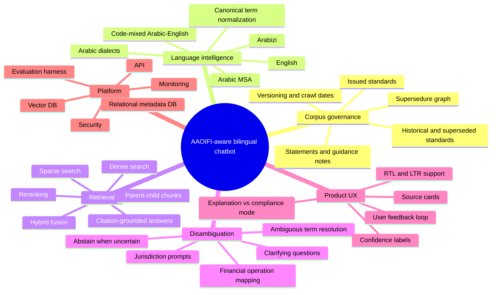
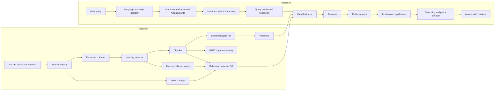
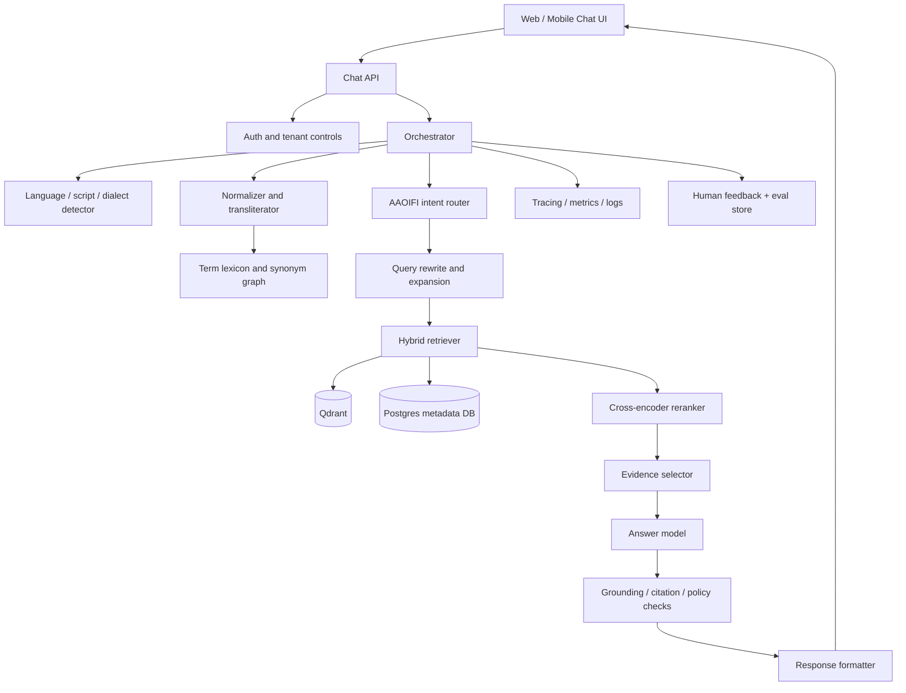
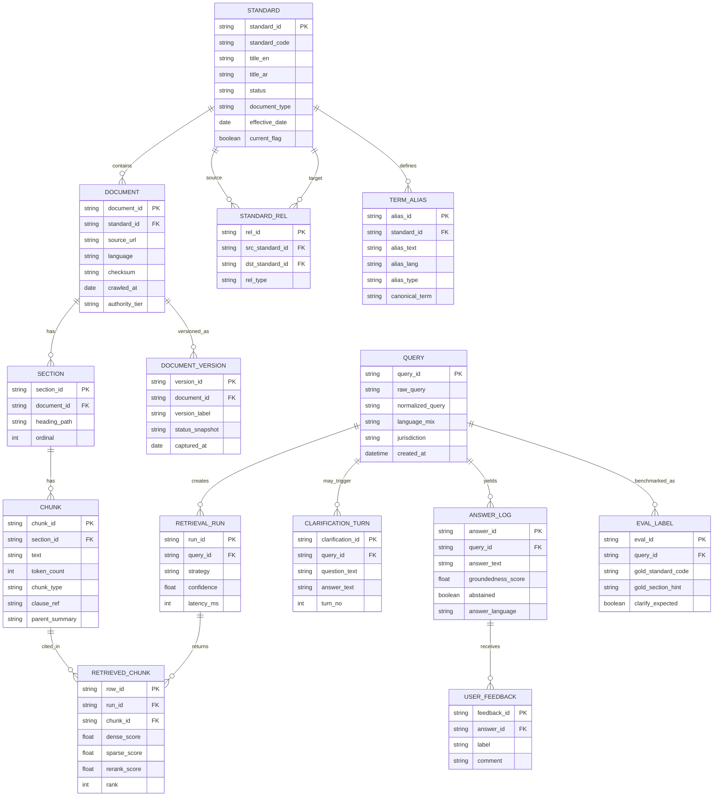
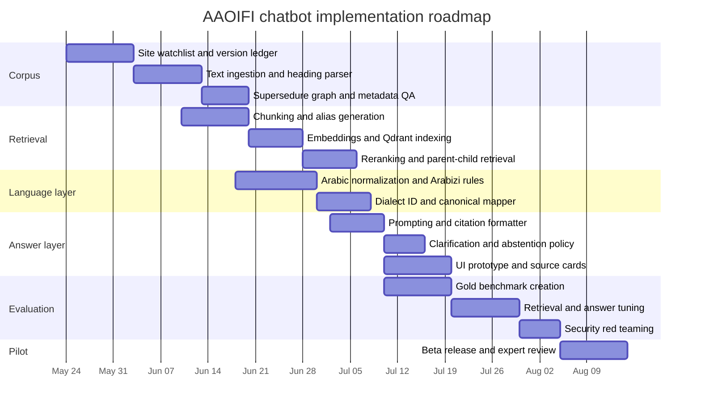

# AAOIFI-Aware Bilingual RAG Chatbot PRD and Open-Source Landscape

## Executive summary

An AAOIFI-aware chatbot should be designed as a **versioned, citation-first, bilingual retrieval system**, not as a generic chat UI with a vector store attached. The official AAOIFI accounting standards page is a living source: it lists currently issued accounting standards, includes both English and Arabic titles, notes which older standards were replaced or superseded, and explicitly states that AAOIFI regularly updates the website and that users should refer to the official site rather than industry copies. The same AAOIFI site also separates standards by status such as issued, exposure drafts, standards in progress, public hearings, and technical releases. That means the corpus must preserve **document type, issuance status, supersedure relationships, and crawl/version dates** as first-class metadata rather than treating every text file as an equal chunk source. citeturn47view0turn3view0

The language problem is equally central. Arabic financial questions may arrive in Modern Standard Arabic, dialectal Arabic, English, Arabizi/Franco-Arabic, or mixed Arabic-English queries. CAMeL Tools explicitly provides Arabic preprocessing, morphology, dialect identification, NER, and sentiment tools; AraBERT ships Arabic preprocessing and tweet/dialect-oriented variants; MARBERT was trained for both dialectal Arabic and MSA; and AlcLaM adds a dedicated dialect-identification pipeline. Arabizi itself is highly variable and commonly uses Latin characters plus numerals, which means a production system needs a preprocessing stage that normalizes Arabic script, code-mixing, and romanized Arabic before retrieval. citeturn22view5turn21view0turn23view3turn34view1turn31search8

For the retrieval stack, the strongest fit is a **hybrid, hierarchical RAG architecture**. Microsoft’s guidance for advanced RAG recommends careful preprocessing, chunking, hierarchical organization, sample-question alignment, query rewriting, query routing, subqueries, reranking, and post-answer checking. Qdrant and Weaviate both support hybrid search; Qdrant additionally supports multi-stage queries, RRF fusion, multiple named vectors, and multivector retrieval. Among open multilingual embedding models, BGE-M3 is particularly well suited because it supports dense, sparse, and multi-vector retrieval in more than 100 languages and up to 8192 tokens, and its own model card recommends hybrid retrieval plus reranking. citeturn12view0turn14view0turn14view1turn15view1turn26view0turn30view0

The recommended production stack is:

| Layer | Recommended choice | Why this is the best default |
|---|---|---|
| Orchestration | **Haystack** | It is built for explicit control over retrieval, routing, filtering, ranking, and generation, which matches the need for transparent compliance-style RAG. citeturn49view2turn19view0 |
| Vector DB | **Qdrant** | Strong fit for hybrid, multistage, and multivector retrieval; Apache-2.0; easy to align with dense+sparse+late-interaction patterns. citeturn14view0turn14view1turn14view2turn43view0 |
| Embeddings | **BGE-M3** | Multilingual, long-context, dense+sparse+multi-vector in one model; designed for hybrid retrieval workflows. citeturn26view0 |
| Reranker | **bge-reranker-v2-m3** | Multilingual reranking, lightweight deployment, and explicit query-passage relevance scoring. citeturn30view0 |
| Arabic NLP | **CAMeL Tools + AraBERT preprocessor + optional AlcLaM DID** | Best open combination for normalization, morphology, dialect awareness, and Arabic-specific preprocessing. citeturn22view5turn21view0turn34view1 |
| Answer model | **Qwen3-14B** for self-hosted, optionally a stronger hosted model for peak quality | Qwen3 supports 100+ languages and dialects, offers long context, and is easy to serve by vLLM/SGLang; JAIS is a strong Arabic-English alternative, while Llama 3.1 does not officially support Arabic. citeturn28view0turn29view1turn29view4 |
| Parsing | **Native text-file ingestion first; Docling only when extending back to PDFs/XBRL** | The current assumption is that AAOIFI files already exist as text; Docling is valuable later for re-crawling PDFs, complex layouts, and XBRL-like financial docs. citeturn40view0turn40view1 |

The report’s main conclusion is that the project should be treated as a **domain-specific bilingual compliance assistant** with four hard requirements: a canonical AAOIFI document graph, Arabic-aware normalization and query routing, hybrid retrieval with reranking, and a formal uncertainty/clarification policy that asks targeted follow-up questions instead of guessing. Because AAOIFI adoption differs by jurisdiction and is sometimes full, partial, or merely guidance-based, the system should also explicitly distinguish between **“what AAOIFI says”** and **“whether this is mandatory where you operate.”** citeturn50view0

## Corpus and requirements landscape

### What the AAOIFI corpus implies

The official AAOIFI accounting standards page currently exposes a bilingual list of issued accounting standards and related pronouncements. The page includes the conceptual framework, FAS items such as Mudaraba Financing, Musharaka Financing, Salam and Parallel Salam, Zakah, Istisnaa, Investment Accounts, Murabaha and Other Deferred Payment Sales, Ijarah, Wa’ad/Khiyar/Tahawwut, Interim Financial Reporting, Takaful presentation and measurement standards, Determining Control of Assets and Business, Quasi-equity, Off-Balance-Sheet Assets Under Management, Transfer of Assets between Investment Pools, FAS 51 Participatory Ventures, and a 2025 AAB statement withdrawing FAS 26 on investment in real estate. The page also records supersedure notes, for example that FAS 2 and FAS 20 were replaced by FAS 28, FAS 5 and FAS 6 were replaced by FAS 27, and FAS 11 was replaced by FAS 30 and FAS 35. citeturn47view0

This structure has direct product implications. The chatbot cannot simply index “AAOIFI text files.” It must maintain a **document graph** with at least these attributes:

- current vs superseded vs withdrawn
- standard vs conceptual framework vs statement vs guidance note vs draft
- English title, Arabic title, aliases, and standard number
- effective version/crawl date
- cross-references and supersedure links
- authority tier, so that “issued and current” outranks “historical” and “draft.” citeturn47view0turn3view0

AAOIFI’s standards pipeline also has published status lanes—issued standards, exposure drafts, standards progress, technical releases, guidance notes, and public hearings. Accordingly, the product should maintain **two retrieval modes**: a default `Issued_Current` corpus that is authoritative, and a clearly labeled `Historical_or_Draft` corpus accessed only when the user asks about consultation papers, historical treatment, or superseded guidance. citeturn3view0turn50view0

A second architectural implication is jurisdiction. AAOIFI itself states that accounting standards are adopted fully or partially in multiple jurisdictions and may also be used as the basis for national standards, voluntary practice, or secondary reporting. Therefore, the system must distinguish **interpretive questions** from **applicability questions**. If the user asks, “What does AAOIFI require?” retrieval can answer from the corpus. If the user asks, “Is this mandatory for my institution?” the bot should ask for jurisdiction/regulator and answer in two layers: AAOIFI interpretation first, local applicability second. citeturn50view0

### Why the language problem is harder than ordinary multilingual chat

Arabic financial support is not only a translation problem. AraBERT’s authors emphasize Arabic’s morphological richness and relative resource scarcity compared with English. CAMeL Tools adds Arabic-specific preprocessing, morphology, dialect identification, NER, and sentiment capabilities that general multilingual stacks often miss. MARBERT was trained specifically on Arabic tweets to cover both dialectal Arabic and MSA, and AlcLaM similarly targets dialect-heavy Arabic use cases and exposes a dialect-identification pipeline. citeturn18academia4turn22view5turn23view3turn34view1

Arabizi complicates retrieval further. Arabizi uses Latin letters and numerals for Arabic sounds, varies regionally, and has no single canonical orthography. That means a single multilingual embedding model is not enough on its own; the front end needs an explicit **normalization and transliteration layer** that generates candidate Arabic-script rewrites before retrieval. citeturn31search8turn31search7

The following mind map captures the scope that the PRD should own.



## PRD and architecture

### PRD scope and success criteria

The product should be scoped as a **domain assistant for AAOIFI accounting interpretation and explanation**, optimized for bilingual user flows and citation-backed responses. The primary user jobs are: finding the correct AAOIFI standard for a transaction or reporting issue, understanding recognition/measurement/disclosure treatment, distinguishing between similar Islamic finance operations, and asking follow-up questions naturally in English, Arabic, or mixed language.

A concise PRD frame is below.

| PRD item | Recommended definition |
|---|---|
| Product goal | Return grounded answers from AAOIFI accounting standards in English or Arabic, even when the user’s phrasing is colloquial, code-mixed, or imprecise. |
| Core promise | “I will tell you **which AAOIFI document** is relevant, **why**, and **where the answer comes from**.” |
| Supported inputs | English, Arabic MSA, dialectal Arabic, Arabizi, mixed Arabic-English, finance shorthand, transliterated AAOIFI terms. |
| Primary outputs | Grounded answer, cited source passages, canonical term mapping, confidence label, and clarifying question when needed. |
| Non-goals for MVP | Pure legal/regulatory advice by jurisdiction, free-form accounting advice without source grounding, and unsupported Arabic speech recognition. |
| North-star KPI | Citation-grounded answer acceptance by expert reviewers on a gold AAOIFI benchmark. |
| Guardrail KPI | False-confidence rate on ambiguous or superseded-standard questions. |

### Data flow diagram

The ingestion and inference flows should be split cleanly, following the broad advanced-RAG phases Microsoft recommends: ingestion, inference pipeline, and evaluation. citeturn12view0turn15view0



### Component architecture

For this use case, the most robust architecture is a **deterministic preprocessing layer plus hybrid retriever plus answer synthesizer**, rather than an agent-first stack. Agentic flows are useful later for deep research or external web browsing, but the AAOIFI domain core should be deterministic and auditable. That is also consistent with Haystack’s framing around explicit control over retrieval, routing, memory, and generation. citeturn49view2turn19view0



### Query sequence and clarification flow

A practical production sequence should support low-confidence branching. Microsoft’s advanced-RAG guidance explicitly discusses query rewriting, subqueries, routers, reranking, and post-completion checks; the clarification policy below is the AAOIFI-specific specialization of that logic. citeturn12view0turn15view0

```mermaid
sequenceDiagram
    participant User
    participant Bot as Chat Orchestrator
    participant Norm as Normalizer
    participant Ret as Hybrid Retriever
    participant Rank as Reranker
    participant LLM as Answer Model

    User->>Bot: Ask question in EN/AR/code-mix
    Bot->>Norm: Detect language, script, dialect, transliteration
    Norm-->>Bot: Normalized query + canonical term candidates
    Bot->>Ret: Retrieve dense + sparse candidates
    Ret-->>Bot: Top-k chunks
    Bot->>Rank: Re-rank chunks against normalized query
    Rank-->>Bot: Ranked evidence + confidence
    alt confidence high
        Bot->>LLM: Synthesize grounded answer with citations
        LLM-->>Bot: Draft answer
        Bot-->>User: Final answer + source list
    else confidence medium
        Bot-->>User: One disambiguating question
        User->>Bot: Clarification
        Bot->>Ret: Retrieve again with clarified query
        Ret-->>Bot: Revised evidence
        Bot->>LLM: Grounded answer
        LLM-->>Bot: Draft answer
        Bot-->>User: Final answer + source list
    else confidence low
        Bot-->>User: Clarify required; no normative answer yet
    end
```

### UX requirements and illustrative mockup

The UX should explicitly support **bi-directional presentation**. The user may ask in Arabic and want an Arabic answer, but the quoted standard title may need to display in English and Arabic together. The interface should also expose the normalized canonical term that the retrieval stack actually used. This is especially important when the user writes in Arabizi, dialect, or a vague colloquial phrase. The product should make uncertainty visible instead of hiding it. That matches the security and trust guidance that LLM outputs should be grounded, structured, and checked rather than passively accepted. citeturn48view0

```text
┌──────────────────────────────────────────────────────────────────────────────┐
│ AAOIFI Assistant                                     [EN] [AR] [AAOIFI-only]│
├──────────────────────────────────────────────────────────────────────────────┤
│ Ask in English, العربية, or Arabizi                                      │
│ Example: "el bank 7att expected loss 3ala murab7a leh?"                   │
├──────────────────────────────────────────────────────────────────────────────┤
│ Assistant                                                                   │
│ Canonical interpretation                                                    │
│   Murabaha receivable + impairment / expected credit loss                  │
│                                                                              │
│ Answer                                                                       │
│   ... grounded explanation ...                                               │
│                                                                              │
│ Sources                                                                      │
│   FAS 28 • Murabaha and Other Deferred Payment Sales                         │
│   FAS 30 • Impairment, Credit Losses and Onerous Commitments                │
│                                                                              │
│ Confidence: Medium                                                           │
│ Clarifying question: Is the issue about initial recognition or later loss?  │
├──────────────────────────────────────────────────────────────────────────────┤
│ Retrieved evidence                                                           │
│   [Chunk A] [Chunk B] [Supersedure note] [Open cited passage]               │
└──────────────────────────────────────────────────────────────────────────────┘
```

UX requirements for MVP should include: RTL/LTR rendering, script-aware input, copyable citations, a visible “AAOIFI-only” mode toggle, a visible “historical standard” warning when a superseded document is involved, and a user feedback action for “wrong standard,” “wrong section,” and “language misunderstanding.” Those affordances support better monitoring and re-labeling later. citeturn47view0turn50view0turn42view2

## Data model and retrieval policy

### ERD for metadata, retrieval, and feedback

The relational model below is designed to preserve AAOIFI document authority, chunk lineage, synonym normalization, and evaluation/feedback signals.



### Vector DB schema and storage plan

Qdrant is the best fit when you want one point to hold multiple retrieval representations. Qdrant’s hybrid query API supports prefetches, RRF fusion, weighted fusion, and multistage retrieval; its docs also show multivector retrieval and late-interaction patterns. That maps cleanly onto a structure with one point per chunk and several named vector slots. citeturn14view0turn14view1turn14view2

A recommended Qdrant point schema is:

| Field | Type | Purpose |
|---|---|---|
| `point_id` | string | Usually identical to `chunk_id`. |
| `dense` | vector(1024) | Dense embedding from BGE-M3 or equivalent. |
| `sparse` | sparse vector | Token-weight retrieval for exact terminology and Arabic morphological cues. |
| `colbert` | multivector | Optional late-interaction representation for high-precision reranking/retrieval. |
| `text` | text | Raw chunk text. |
| `text_norm` | text | Normalized retrieval text, with Arabic cleanup and de-diacritization. |
| `standard_code` | string | e.g. `FAS 28`, `FAS 30`, `AAB Statement 1/2025`. |
| `title_en` | string | English document title. |
| `title_ar` | string | Arabic document title. |
| `document_type` | enum | `FAS`, `Framework`, `Statement`, `Guidance`, `Draft`. |
| `status` | enum | `issued_current`, `issued_historical`, `withdrawn`, `draft`, `public_hearing`. |
| `heading_path` | string | Hierarchical section path. |
| `clause_ref` | string | Clause/subclause if extracted. |
| `language` | enum | `en`, `ar`, `bilingual`, `mixed`. |
| `aliases` | array<string> | Canonical and colloquial term variants. |
| `sample_questions` | array<string> | Generated question labels for alignment optimization. |
| `superseded_by` | array<string> | Links to newer standards if applicable. |
| `supersedes` | array<string> | Links to older standards. |
| `crawl_date` | date | Provenance and freshness. |
| `checksum` | string | Reingestion integrity. |
| `authority_tier` | enum | `official_current`, `official_historical`, `nonauthoritative`. |

### Chunking strategy, metadata generation, and similarity policy

Microsoft recommends deliberate chunking, Small2Big organization, hierarchical indices, metadata extraction, and even sample-question labels attached to chunks. For AAOIFI standards, that guidance points toward a **parent-child chunking scheme** rather than flat paragraph chopping. citeturn12view0

The recommended chunking policy is:

| Item | Recommended starting policy | Rationale |
|---|---|---|
| Primary split unit | Section heading or clause boundary | AAOIFI standards are structured and legal-accounting meaning often follows headings rather than paragraph boundaries. |
| Child chunk size | **350–650 tokens** | Large enough to preserve accounting logic; small enough for reranking and citation packing. |
| Overlap | **60–100 tokens** | Keeps neighboring context for definitions and exceptions. |
| Parent summary | One summary node per section/chapter | Supports Small2Big retrieval and answer assembly. |
| Definitions | Store as standalone “definition chunks” | Definitions often answer short operational questions directly. |
| Tables/lists | Keep intact where possible | Financial standards often encode disclosure rules and comparison items in tables/lists. |
| Sample questions | Generate **2–5 bilingual question hints per chunk** | Improves alignment optimization, especially for colloquial queries. |
| Alias expansion | Generate English, Arabic, dialect, and Arabizi aliases | Essential for code-mixed retrieval. |

The **initial retrieval pipeline** should be:

1. normalize query and generate alias rewrites
2. retrieve top 50 dense and top 50 sparse candidates
3. fuse with RRF
4. rerank top 20
5. send top 6–10 evidence units to synthesis. citeturn14view0turn14view2turn26view0turn30view0

The **starting confidence thresholds** should be treated as calibration targets, not immutable truths:

| Signal | Green | Yellow | Red |
|---|---|---|---|
| Top reranker normalized score | `>= 0.82` | `0.68–0.81` | `< 0.68` |
| Standard consensus | 2+ strong chunks from same current standard, or 1 chunk + 1 supersedure/provenance note | competing standards with small score gap | no stable standard consensus |
| Source status | current issued sources only | mixed current + historical | only historical/draft evidence |
| Bot action | answer directly | ask 1 clarifying question or answer with explicit assumption | abstain from normative answer and clarify |

These numeric cutoffs are recommended **initial operating points** that should be calibrated on a gold AAOIFI benchmark after the first evaluation pass. Their purpose is to force the system to ask a question when the evidence is ambiguous rather than hallucinating confidence. The rationale is fully consistent with Microsoft’s query-routing/reranking guidance and with strong hybrid retrieval support in Qdrant/Weaviate. citeturn12view0turn15view1turn14view1

### Prompt templates and clarification policy

The synthesis layer should rely on three prompts: normalization, clarification, and grounded answering. The model may perform hidden internal reasoning, but the user-visible output should only expose concise clarifying questions and the final grounded answer.

**Normalization prompt template**

```text
You are an AAOIFI query normalizer.
Return JSON only:
- user_language
- scripts_detected
- canonical_financial_operation_candidates
- AAOIFI_standard_candidates
- jurisdiction_detected
- ambiguity_flags
- arabizi_rewrites
- english_rewrites
- retrieval_queries

Normalize colloquial Arabic, MSA, English, code-mix, and Arabizi.
Do not answer the user’s question.
```

**Clarification prompt template**

```text
You are an AAOIFI assistant.
The retrieved evidence is insufficient or ambiguous.
Ask at most two concise questions that will distinguish the relevant standard.
Do not provide a normative answer yet.
Prefer questions about:
- operation type
- reporting stage
- party roles
- product structure
- jurisdiction, only if applicability is asked
```

**Grounded answer template**

```text
You are an AAOIFI accounting assistant.
Answer only from the retrieved evidence.
If evidence is insufficient, say so.
Always include:
- canonical operation interpretation
- current AAOIFI source(s)
- whether any older standard has been superseded or withdrawn
- a concise answer
- quoted section labels / clause references when available
- a short note if jurisdiction-specific applicability is not determined
```

The answer-sourcing rules should be strict:

| Rule | Policy |
|---|---|
| Source priority | `issued_current` > `issued_historical` > `draft/public_hearing` |
| Historical conflict | Prefer current issued source and mention supersedure note |
| Out-of-corpus finance question | Offer either a general explanation clearly labeled “not from AAOIFI corpus,” or ask whether the user wants an AAOIFI-specific interpretation |
| Low-confidence retrieval | Ask a clarification question, not a guess |
| Unsupported compliance question | Ask for jurisdiction/regulator |
| No source found | Say no supporting AAOIFI passage was retrieved |

This policy is also security-positive. OWASP’s 2025 LLM guidance stresses that prompt injection remains a real risk even in RAG systems, and recommends constrained model behavior, strict output structure, input/output filtering, least privilege, source segregation, and adversarial testing. citeturn48view0

### Technology comparison

#### Embedding models

| Option | Strengths | Weaknesses | Recommendation |
|---|---|---|---|
| **BGE-M3** | Supports dense, sparse, and multi-vector retrieval; supports 100+ languages; up to 8192 tokens; explicitly recommends hybrid retrieval + reranking. citeturn26view0 | Slightly more complex to operationalize because its full value appears when hybrid/multivector features are actually used. | **Best default** for AAOIFI RAG. |
| **multilingual-e5-large-instruct** | 94 languages, 1024-dim embeddings, strong multilingual retrieval framing. citeturn27view1turn27view2 | Query-side instructions are required for best performance; less retrieval-mode flexibility than BGE-M3. | Strong fallback if the team prefers E5-style instruction prompting. |
| **gte-multilingual-base** | 75 languages; supports dense embeddings and sparse token weights; deployable via TEI with OpenAI-compatible embeddings endpoint. citeturn27view3turn27view4 | Smaller base model may trade off peak recall on nuanced AAOIFI distinctions. | Best lower-cost alternative or secondary benchmark model. |

#### Vector databases

| Option | Strengths | Weaknesses | Recommendation |
|---|---|---|---|
| **Qdrant** | Hybrid queries with RRF, weighted fusion, multiple prefetches, multi-stage search, multivectors; Apache-2.0. citeturn14view0turn14view1turn14view2turn43view0 | Slightly more engineering effort than “Postgres only” deployments. | **Best fit** for this project. |
| **Weaviate** | Parallel vector+BM25 hybrid search, configurable alpha weighting, max vector-distance threshold, structured filtering, multi-tenancy/RBAC. citeturn15view1turn20view0turn43view2 | Good hybrid support but less natural fit than Qdrant for named-vector multistage designs. | Strong second choice. |
| **pgvector** | Keeps vectors in Postgres with operational metadata; supports exact and ANN search, HNSW, IVFFlat, sparse and half vectors. citeturn44view0turn44view2turn44view3 | Hybrid and multistage retrieval are more manual; scale/search ergonomics weaker than dedicated vector DBs. | Best if the team insists on Postgres-centric simplicity. |
| **Milvus** | Mature cloud-native ANN system, Apache-2.0, strong scale story. citeturn43view4turn43view5 | More infrastructure overhead than needed for an AAOIFI-sized corpus unless future scope expands dramatically. | Use only if very high scale or broader enterprise vector workloads are expected. |

#### RAG frameworks and application layers

| Option | Strengths | Weaknesses | Recommendation |
|---|---|---|---|
| **Haystack** | Explicit control over retrieval, ranking, filtering, routing, generation; modular and production-oriented. citeturn49view2turn19view0 | Slightly more opinionated pipeline engineering than lightweight frameworks. | **Best orchestration default**. |
| **LangChain** | Huge ecosystem, MIT license, agent workflows, strong composability. citeturn49view3turn13view0 | Easy to over-agentize a problem that should stay deterministic. | Use if the team already standardizes on LangChain/LangGraph. |
| **RAGFlow** | Purpose-built open-source RAG engine; strong inspiration for document-centric RAG systems. citeturn49view0turn49view1 | Better as inspiration/partial reuse than as the first AAOIFI-specific product backbone. | Good for borrowing patterns. |
| **Onyx** | MIT community edition; feature-rich AI chat with RAG, connectors, search, artifacts, and deployment options. citeturn41view0turn41view1 | Broad platform surface may exceed the needs of an AAOIFI-focused first release. | Strong optional shell if enterprise connectors are needed. |
| **Open WebUI** | User-friendly self-hosted UI, local RAG support, multilingual interface, many vector DBs, OpenTelemetry support. citeturn42view1turn42view2 | Licensing now includes branding-preservation requirements rather than plain MIT/Apache. citeturn42view0 | Excellent internal admin/prototype UI; review licensing before white-labeling. |

#### Arabic NLP and lexical tools

| Option | Strengths | Weaknesses | Recommendation |
|---|---|---|---|
| **CAMeL Tools** | Open-source Arabic preprocessing, morphology, dialect identification, NER, sentiment; MIT. citeturn22view5turn22view4 | Not a complete end-to-end conversational solution by itself. | **Core preprocessing dependency**. |
| **AraBERT** | Strong Arabic understanding base and explicit preprocessing tools; tweet/dialect variants available. citeturn18academia4turn21view0 | Not a retrieval stack by itself. | Use for preprocessing/classification experiments and enrichment. |
| **MARBERT** | Strong dialect + MSA modeling from 1B Arabic tweets. citeturn23view3 | Hugging Face access is public, but commercial use requires contacting authors. citeturn23view3 | Good benchmark model; use with licensing caution. |
| **AlcLaM** | Arabic dialectal PLM with available DID pipeline and good MADAR performance references; Apache-2.0. citeturn34view1 | Smaller ecosystem and maturity than CAMeL Tools. | Best optional dialect-ID booster. |
| **Qabas** | Open-source Arabic lexicon linking 110 lexicons and 12 corpora, about 58K lemmas; accessible online. citeturn37academia0turn36view1 | Not a mainstream GitHub codebase in this scan. | Use as a synonym/lemma enrichment resource. |

#### Answer models

| Option | Strengths | Weaknesses | Recommendation |
|---|---|---|---|
| **Qwen3-14B** | 100+ languages and dialects, strong multilingual instruction following, 32,768 native context, easy OpenAI-compatible serving via vLLM/SGLang; Apache-2.0. citeturn28view0 | Heavier than smaller bilingual Arabic models. | **Best self-hosted default**. |
| **JAIS family** | Arabic-English bilingual, trained on Arabic/English/code, Apache-2.0, explicitly intended for Arabic-speaking and bilingual use cases. citeturn29view0turn29view1 | Context length and quality vary by model size; generally older than Qwen3. | Strong Arabic-English alternative. |
| **Llama 3.1** | Mature ecosystem and 128k context. citeturn29view2turn29view4 | Arabic is not among its eight officially supported languages. citeturn29view3 | Do **not** use as the default Arabic answer model without targeted fine-tuning and controls. |

## Open-source reuse scan

### Immediate-reuse shortlist

The strongest near-term reuse set is: **Haystack + Qdrant + BGE-M3 + bge-reranker-v2-m3 + CAMeL Tools + Docling + Qwen3-14B**. Haystack gives transparent control; Qdrant fits hybrid multivector retrieval; BGE-M3 and its reranker cover multilingual retrieval and ranking; CAMeL Tools handles Arabic-specific preprocessing; Docling becomes useful if the pipeline returns from text files to PDFs or XBRL-like financial reports; and Qwen3 is the best current self-hosted answer model in this scan for multilingual dialogue. citeturn49view2turn14view1turn26view0turn30view0turn22view5turn40view1turn28view0

The best “borrow, don’t adopt wholesale” systems are **RAGFlow**, **Onyx**, and **Open WebUI**. RAGFlow is useful for document-centric RAG patterns and UX ideas; Onyx is useful if the scope expands into enterprise connectors and agentic workflows; Open WebUI is excellent for internal operations or pilot deployments, but its current licensing should be reviewed carefully before branding it as the final product UI. citeturn49view1turn41view0turn42view0turn42view1

The strongest evaluation and language-enrichment assets are **ArabicaQA**, **Taqyim**, **Qabas**, **FIBO**, **AraBERT**, **MARBERT**, and **AlcLaM**. ArabicaQA provides Arabic QA data and AraDPR; Taqyim provides Arabic task evaluation tooling; Qabas helps lexical enrichment; FIBO fills generic financial ontology gaps outside explicitly Islamic-finance terminology; and the Arabic models improve normalization, classification, and dialect awareness. citeturn33view1turn33view3turn37academia0turn32view0turn21view0turn23view3turn34view1

### OSS repository table

| Category | Repo | URL | License | Maturity | Key files / modules | Integration notes | Relevance |
|---|---|---|---|---|---|---|---|
| RAG orchestration | Haystack | `https://github.com/deepset-ai/haystack` | Apache-2.0 | High; long commit history and active docs. citeturn19view0turn49view2 | `haystack/`, `examples/`, `docker/`, `e2e/`, `releasenotes/` citeturn19view0 | Best as the backend orchestration layer for retrieval, routing, evaluation, and explicit context engineering. | **Directly reusable** |
| App framework | LangChain | `https://github.com/langchain-ai/langchain` | MIT | High; very large ecosystem and release cadence. citeturn49view3 | `libs/`, `README.md`, `LICENSE` citeturn49view3 | Good if the team already uses LangGraph/LangChain; otherwise keep the AAOIFI core more deterministic. | High |
| RAG engine | RAGFlow | `https://github.com/infiniflow/ragflow` | Apache-2.0 | High; very active and widely starred. citeturn49view0turn49view1 | `rag/`, `deepdoc/`, `web/`, `sdk/python/` citeturn38view0 | Useful for inspiration, especially around document pipelines and turnkey RAG features. | High |
| Platform shell | Onyx | `https://github.com/onyx-dot-app/onyx` | MIT for CE | High; many releases and active deployment surface. citeturn41view0turn41view1 | `backend/`, `web/`, `deployment/`, `widget/` citeturn41view0 | Attractive if the project later needs enterprise connectors, search, and deep-research workflows. | High |
| UI shell | Open WebUI | `https://github.com/open-webui/open-webui` | Open WebUI license plus historical license mix | High; major self-hosted UI ecosystem. citeturn42view0 | `README.md`, `LICENSE`, Pipelines plugin framework docs. citeturn42view0turn42view2 | Very strong for internal pilots; confirm branding/license fit before productizing. | Medium-high |
| Vector DB | Qdrant | `https://github.com/qdrant/qdrant` | Apache-2.0 | High; active releases and strong docs. citeturn43view0 | Query API, named vectors, hybrid query docs. citeturn14view1turn14view2 | Best technical match for hybrid, multistage, multilingual AAOIFI RAG. | **Directly reusable** |
| Vector DB | Weaviate | `https://github.com/weaviate/weaviate` | BSD-3-Clause | High; active releases and cloud-native feature set. citeturn20view0turn43view2 | `modules/`, `entities/`, `grpc/`, `cmd/weaviate-server` citeturn20view0 | Strong alternative to Qdrant, especially if the team prefers its fusion/threshold model. | High |
| Vector DB | pgvector | `https://github.com/pgvector/pgvector` | PostgreSQL-style project license | High; mature Postgres extension ecosystem. citeturn44view0 | HNSW / IVFFlat indexing, `vector` / `halfvec` / `sparsevec` support. citeturn44view2turn44view3 | Good if Postgres simplicity matters more than advanced hybrid/multivector features. | Medium-high |
| Vector DB | Milvus | `https://github.com/milvus-io/milvus` | Apache-2.0 | High; cloud-native and large-scale. citeturn43view4turn43view5 | core server, ANN search modules, release artifacts. citeturn20view1 | More infrastructure than needed for AAOIFI alone, but strong if scope expands. | Medium |
| Arabic NLP | CAMeL Tools | `https://github.com/CAMeL-Lab/camel_tools` | MIT | High; stable releases and clear academic grounding. citeturn22view5 | `camel_tools/`, `docs/`, `tests/` citeturn22view5 | Use for preprocessing, lemmatization/morphology, dialect ID, NER, and sentiment layers. | **Directly reusable** |
| Arabic model | AraBERT | `https://github.com/aub-mind/arabert` | Public repo; model family broadly available | Medium-high | `arabert/`, `examples/`, `preprocess.py` citeturn21view0 | Best used as an Arabic preprocessor/feature generator, not the primary retrieval engine. | High |
| Arabic model | MARBERT | `https://github.com/UBC-NLP/marbert` | Public research distribution; commercial use requires author contact | Medium | `examples/`, README, Hugging Face loading examples. citeturn23view3 | Excellent dialect benchmark model; avoid default production use until licensing is cleared. | Medium-high |
| Arabic model | AlcLaM | `https://github.com/amurtadha/Alclam` | Apache-2.0 | Medium; smaller repo, useful DID specialization. citeturn34view1 | `scripts/`, `Ft/`, `fine_tuning.py`, `train_alclam.py` citeturn34view1 | Use as an optional dialect-ID booster or benchmarking component. | Medium |
| Document parsing | Docling | `https://github.com/docling-project/docling` | MIT | High; active releases and many integrations. citeturn40view0turn40view2 | document converter APIs, Markdown/JSON export, integrations. citeturn40view0turn40view3 | Valuable when reingesting AAOIFI PDFs or future financial reports beyond plain text files. | High |
| Document ETL | Unstructured | `https://github.com/Unstructured-IO/unstructured` | Apache-2.0 | High | `unstructured/`, `example-docs/`, ingestion tests. citeturn39view0 | Good alternative parser/ETL layer; weaker fit than “plain text first” for the current MVP. | Medium |
| Eval dataset | ArabicaQA | `https://github.com/DataScienceUIBK/ArabicaQA` | MIT | Medium | `DPR/`, `Inference.py`, `LICENSE`, `README.md` citeturn33view0turn33view1 | Important for Arabic QA benchmarking and retrieval stress tests, though not AAOIFI-specific. | High |
| Eval toolkit | Taqyim | `https://github.com/ARBML/Taqyim` | MIT | Medium | `taqyim/`, `examples/`, `notebooks/`, `eval_results/` citeturn33view3 | Useful for automated Arabic evaluation workflows and rapid benchmark scripting. | High |
| Financial ontology | FIBO | `https://github.com/edmcouncil/fibo` | MIT | High | ontology domain folders such as `LOAN/`, `SEC/`, `DER/`, `FND/`, `README.md`, `ONTOLOGY_GUIDE.md` citeturn32view0 | Use as a supplementary financial ontology to enrich generic finance term normalization. | Medium-high |

A notable gap from this scan is **production-grade Arabizi transliteration OSS**. The scan surfaced Arabizi-capable research references and Arabic-chat-alphabet conventions, but no single GitHub library emerged as the obvious production standard in the way CAMeL Tools does for core Arabic NLP. The practical answer is to implement a **rule-based Arabizi candidate generator**, back it with a finance-specific alias lexicon, and let the retriever/reranker decide which rewrite is most plausible. citeturn31search8turn33view4

## Evaluation and hard cases

### Hard-case query set with routing rationale

The table below is intentionally project-specific. The “likely section family” is an implementation hint inferred from standard titles and typical standard structure; the exact section label should be resolved at runtime from ingested heading metadata, not hard-coded in the chatbot.

| Example user query | Why it is hard | Canonical interpretation | Target AAOIFI file | Likely section family |
|---|---|---|---|---|
| “el bank 7att expected loss 3ala murab7a leh?” | Arabizi + code-mix + vague accounting stage | Murabaha receivable impairment / credit losses | **FAS 28** + **FAS 30** citeturn47view0 | Recognition and later impairment |
| “لو رأس المال مني والإدارة منهم، هذا مضاربة ولا مشاركة؟” | User is discriminating between two similar Islamic finance contracts | Needs distinction between Mudaraba and Musharaka | **FAS 3** vs **FAS 4** citeturn47view0 | Contract classification |
| “الإجارة المنتهية بالتمليك الأصل عند من؟” | Colloquial phrasing and lifecycle ambiguity | Ijarah accounting and control/recognition | **FAS 32**; possibly **FAS 44** if control is the real question citeturn47view0 | Recognition / control |
| “الصكوك دي investment ولا trading؟” | English shorthand; classification requires clearer intent | Investment in sukuk classification/measurement | **FAS 33** citeturn47view0 | Classification / measurement |
| “هل حسابات الاستثمار تعتبر quasi-equity?” | Cross-standard conceptual query | Investment accounts vs quasi-equity | **FAS 27** + **FAS 45** citeturn47view0 | Presentation / classification |
| “العميل سأل عن الوكالة بالاستثمار، الربح ليه ولا أجر الوكيل فقط؟” | Requires understanding of operational roles | Investment agency economics and reporting | **FAS 31** citeturn47view0 | Agency structure / income allocation |
| “كيف أعرض الزكاة في القوائم؟” | Could refer to computation or financial reporting | Reporting for zakah | **FAS 39**, and sometimes **FAS 9** if the user asks about accounting treatment rather than report presentation citeturn47view0 | Presentation / disclosure |
| “التكافل surplus deficit basis وين ينعرض؟” | English-Arabic mix and Takaful-specific wording | Takaful surplus/deficit presentation and measurement | **FAS 13**, **FAS 42**, **FAS 43** citeturn47view0 | Presentation / measurement |
| “عندنا Islamic window في بنك تقليدي، أي قوائم نطلعها؟” | English-Arabic mix and scope ambiguity | Financial reporting for Islamic windows | **FAS 40**, possibly **FAS 18** for services offered by conventional institutions citeturn47view0 | Reporting scope / disclosures |
| “حوّلنا الأصل من investment pool إلى pool ثاني” | Informal operational phrase, no standard code named | Transfer between investment pools | **FAS 47** citeturn47view0 | Transfers / disclosures |
| “real estate under AAOIFI” | Could hit a withdrawn standard if retrieval is naive | Must detect the 2025 withdrawal of FAS 26 | **AAB Statement 1/2025** first, historical **FAS 26** only if user asks previous treatment citeturn47view0 | Withdrawal / transitional provisions |
| “wa’ad hedge for FX risk” | English shorthand and conceptual finance framing | Wa’ad / Khiyar / Tahawwut with FX implications | **FAS 38** and possibly **FAS 16** for foreign currency effects citeturn47view0 | Hedging / FX treatment |

These examples imply a key product behavior: when multiple current standards plausibly apply, the system should **retrieve multiple standards and ask a single disambiguating question** rather than forcing a premature mapping. That is particularly important for pairs like Mudaraba vs Musharaka, FAS 9 vs FAS 39, and FAS 32 vs FAS 44. citeturn47view0turn12view0

### Training and augmentation strategy

The recommended training plan is not “fine-tune the main model on AAOIFI answers first.” The first priority is **retrieval alignment and lexical robustness**.

A strong augmentation pipeline should include:

- **chunk-to-question generation**: for every chunk, generate 2–5 English/Arabic/colloquial query paraphrases and attach them as metadata, directly echoing Microsoft’s alignment-optimization idea of sample questions per chunk. citeturn12view0
- **finance alias graph**: seed the graph from AAOIFI standard titles, bilingual financial nouns, contract names, common abbreviations, and colloquial variants; enrich with Qabas lemmas and, where helpful, FIBO concepts for general financial terminology. citeturn47view0turn37academia0turn32view0
- **Arabizi rewrite generation**: build deterministic rewrite candidates for common numerals and letter substitutions, then use retrieval+rereanking to choose the best canonical Arabic or English interpretation. citeturn31search8turn31search7
- **dialect-aware rewrite classifier**: use CAMeL Tools and optionally AlcLaM to identify dialectal signals and prioritize regionally plausible rewrites or synonyms. citeturn22view5turn34view1
- **hard negative mining**: collect pairs such as Mudaraba/Musharaka, FAS 27/FAS 45, FAS 39/FAS 9, FAS 28/FAS 30, historical FAS 26 vs AAB Statement 1/2025. These are the exact confusions that cause retrieval failures. citeturn47view0
- **citation supervision**: train the answer layer to output standard code and heading path every time, so that groundedness is operationally visible. This is aligned with OWASP’s recommendation to define expected output formats and validate them. citeturn48view0

If the team wants model fine-tuning later, the most useful first fine-tuning targets are likely **query normalization/routing models** and **rerankers**, not the final answer LLM. The authoritative knowledge lives in the AAOIFI corpus and will continue changing; retrieval-first adaptation is more maintainable than answer-model memorization. That is also consistent with the fact that AAOIFI itself says the website is the authoritative, regularly updated reference. citeturn47view0

### Evaluation plan

The evaluation plan should combine retrieval metrics, answer metrics, uncertainty metrics, and security tests.

#### Offline evaluation datasets

The project should maintain at least four benchmark dataframes:

| Dataframe | Core columns | Purpose |
|---|---|---|
| `gold_queries_df` | `query_id`, `raw_query`, `lang`, `dialect`, `script`, `canonical_term`, `gold_standard_code`, `gold_section_hint`, `clarify_expected`, `difficulty` | Main benchmark set |
| `retrieval_runs_df` | `query_id`, `normalized_query`, `retriever_version`, `candidate_chunk_ids`, `dense_scores`, `sparse_scores`, `rerank_scores`, `final_chunk_ids`, `latency_ms` | Retrieval diagnostics |
| `answer_eval_df` | `query_id`, `answer_text`, `cited_chunk_ids`, `groundedness`, `citation_precision`, `language_match`, `abstained`, `review_label` | Answer quality review |
| `clarification_eval_df` | `query_id`, `clarification_question`, `was_needed`, `resolved_correctly`, `extra_turns`, `final_outcome` | Uncertainty-policy tuning |

#### Metrics

The first release should be gated on the following metrics:

| Metric family | Suggested metrics |
|---|---|
| Routing | intent accuracy, standard-family routing accuracy, dialect/script detection accuracy |
| Retrieval | Recall@5, Recall@10, MRR@10, nDCG@10, wrong-standard rate |
| Answer quality | groundedness, citation precision, citation coverage, factual accuracy, language-match score |
| Uncertainty | clarification precision, abstention precision, false-confidence rate |
| UX/ops | p50/p95 latency, per-language latency, rejection rate, user feedback disagreement rate |

ArabicaQA and Taqyim are not AAOIFI benchmarks, but they are still useful scaffolding for Arabic QA baselines, retrieval stress tests, and repeated Arabic evaluation harnesses. citeturn33view1turn33view3

#### Adversarial and security test set

OWASP’s 2025 LLM guidance is especially relevant because prompt injection remains possible even in RAG apps and can arise from both user prompts and external content. The project should therefore include a red-team test set with at least these cases: direct prompt injection in the query, indirect prompt injection hidden in ingested content, multilingual obfuscation, source conflicts between current and superseded standards, non-AAOIFI-but-plausible finance questions, and attempts to override the “AAOIFI-only” instruction layer. citeturn48view0

## Roadmap and recommended stack

### Implementation roadmap

A practical roadmap is shown below as a 14-week engineering plan. The timing is a recommendation, not a claim about staffing.



### Final recommended stack

The strongest default stack for the stated requirements is:

| Layer | Final recommendation | Why |
|---|---|---|
| Backend orchestration | **Haystack** | Best explicit pipeline control for retrieval-heavy, audit-heavy use cases. citeturn49view2 |
| Vector store | **Qdrant** | Best support for hybrid and multistage retrieval patterns needed for bilingual AAOIFI matching. citeturn14view1turn43view0 |
| Relational DB | **Postgres** | Metadata graph, supersedure, query logs, feedback, and benchmark storage. |
| Embeddings | **BGE-M3** | One multilingual model for dense+sparse+multivector retrieval. citeturn26view0 |
| Reranker | **bge-reranker-v2-m3** | Strong multilingual passage reranking. citeturn30view0 |
| Arabic language layer | **CAMeL Tools + AraBERT preprocessor + optional AlcLaM DID** | Best open stack for Arabic normalization, morphology, dialect awareness, and preprocessing. citeturn22view5turn21view0turn34view1 |
| Answer model | **Qwen3-14B**, with **JAIS** as Arabic-English alternative | Qwen3 is the best self-hosted multilingual default; JAIS remains attractive for Arabic-English bilingual positioning. citeturn28view0turn29view1 |
| Parsing | **Text-first ingestion**, then **Docling** if PDF/XBRL scope returns | Aligns with the stated assumption that standards are already available as text files. citeturn40view1 |
| UI | **Custom frontend** for production; **Open WebUI** for internal pilot/admin if desired | Best balance between product control and speed, while respecting current Open WebUI licensing considerations. citeturn42view0turn42view1 |
| Monitoring | **OTel traces + structured retrieval logs + benchmark dashboards** | Needed to track language failures, wrong-standard failures, and clarification behavior; Open WebUI already demonstrates OTel-oriented UX patterns. citeturn42view2 |
| Security | **OWASP LLM Top 10 controls** | Especially important for prompt injection, source segregation, least privilege, and output validation in RAG apps. citeturn48view0 |

The most important architectural choice is not the UI or even the final LLM. It is the decision to treat the AAOIFI corpus as a **versioned authority graph** and to treat Arabic/English/Arabizi normalization as a **deterministic preprocessing problem before retrieval**. If those two foundations are done well, the rest of the system becomes tractable. If they are done poorly, even very strong LLMs will answer from the wrong standard, the wrong language interpretation, or the wrong historical version. citeturn47view0turn12view0turn22view5
