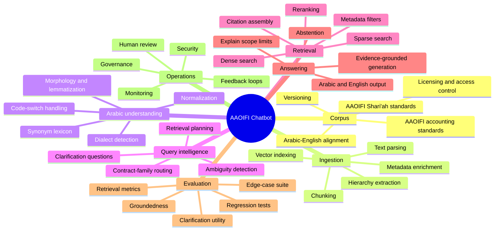
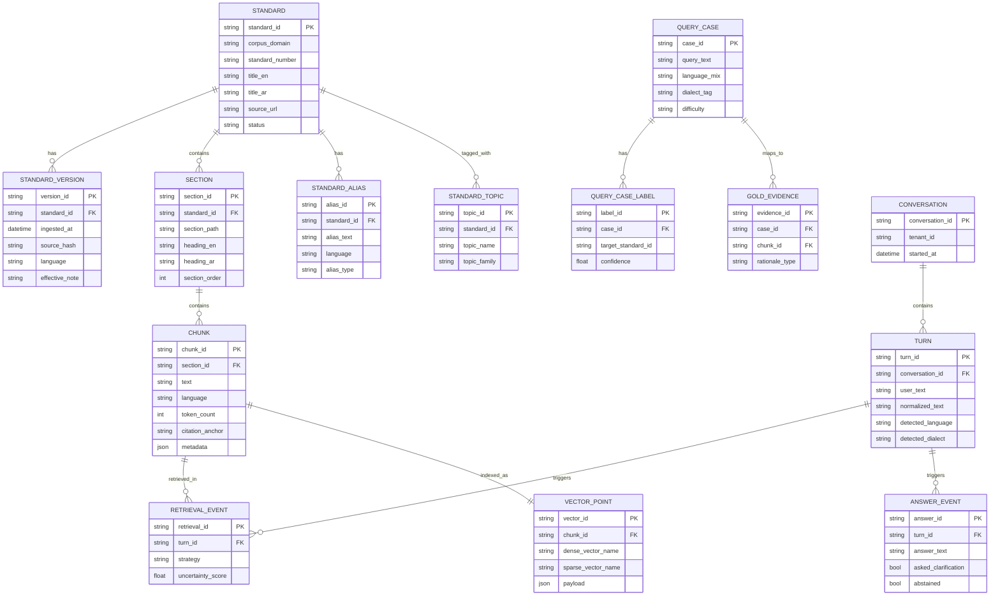
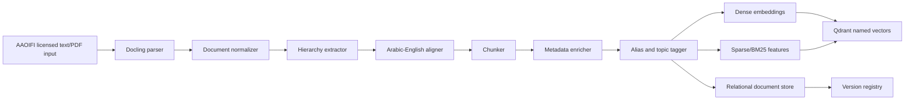
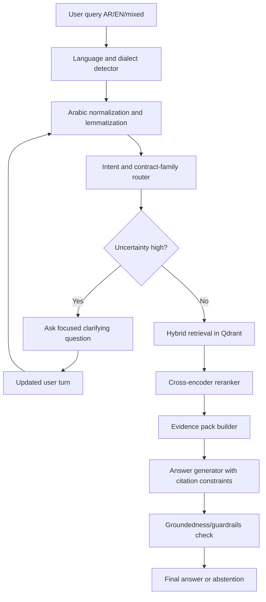
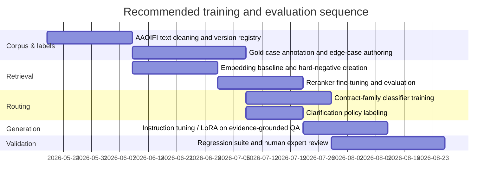

# AAOIFI Standards Bilingual Chatbot PRD and Technical Blueprint

## Executive summary

The right way to build this product is **not** as a generic chatbot with one vector index and one prompt. It should be a **layered, bilingual legal-financial retrieval system**: licensed AAOIFI standards as the authoritative corpus; structure-aware ingestion; Arabic normalization and dialect handling; a **contract-type disambiguation layer** before retrieval; **hybrid retrieval** across dense, sparse, and metadata signals; **cross-encoder reranking**; answer generation constrained to evidence; and an **uncertainty policy** that asks narrow clarification questions when the system cannot confidently distinguish among nearby contract families such as debt, murabaha, tawarruq, istisna, ijarah, guarantees, wa’ad, or sukuk. That layered conclusion is also consistent with the uploaded draft concept note, which already pointed toward a compositional stack rather than a monolithic model. citeturn19search0turn19search1turn13view6turn13view3turn6search4turn7search0 fileciteturn0file0L1-L16

AAOIFI itself is the correct primary source of truth. The organization states that it regularly updates its standards on its official website and advises users to rely on that official version, not copies circulating elsewhere. Its Shari’ah standards page currently lists standards through SS 60, while the accounting standards page lists standards through FAS 52 and notes several supersessions and replacements. AAOIFI also states that its standards are followed or adopted across multiple jurisdictions, which makes citation fidelity and version control matters of product correctness, not just convenience. citeturn36view0turn20view1turn23view4turn21search2

The most important product risk is **semantic misrouting**. Your own example captures the core issue: if the user says “هل شرط غرامة التأخير في عقود المقاولات شرط ربوي؟”, a shallow system may over-index on “ربوي/ربا” and retrieve SS 3 “Procrastinating Debtor,” while a stronger system first identifies the likely transaction family as **construction/manufacturing contract language**, then routes toward **SS 11 Istisnaa and Parallel Istisnaa**, with adjacent retrieval support from **SS 5 Guarantees** if the wording implies a performance-security construct. The product therefore needs a **retrieval-before-answering discipline**, but also a **routing-before-retrieval discipline**. The latest Arabic financial benchmark work supports this exact concern: SAHM shows that Arabic fluency alone does not translate into document-grounded financial reasoning, and that the hardest failures are in open-ended reasoning rather than recognition tasks. citeturn35view0turn17search0turn18search4

The recommended production stack is: **Docling** for parsing, **CAMeL Tools + optional Farasa** for Arabic preprocessing, **Qdrant** for the vector store, **BGE-M3** or **multilingual-e5-large** for embeddings, **BGE-Reranker-v2-m3** or **Jina multilingual reranker** for reranking, **Haystack** for the retrieval pipeline, **LangGraph** for stateful clarification dialogue, **Guardrails** for I/O validation, **Ragas + TruLens** for evaluation and observability, and an instruction model such as **Qwen3 8B/14B** or **Aya Expanse** depending commercial constraints. OCR should be a **fallback**, not a default, because your target corpus is already downloadable as text files; when scanned PDFs do appear, Arabic OCR quality is still materially difficult, as recent Arabic OCR benchmarks show. citeturn7search3turn13view2turn14search1turn31view0turn13view6turn13view5turn13view3turn13view4turn11view1turn7search2turn13view0turn11view3turn13view1turn29view0turn29view1turn24search0

## Product scope and assumptions

This PRD assumes a first production release that supports **Arabic and English**, including Modern Standard Arabic, code-switched Arabic-English prompts, and a first wave of high-frequency colloquial variants from Egypt, the Gulf, and the Levant. It also assumes that the organization deploying the system has **lawful access** to the relevant AAOIFI standards in digital form. That assumption matters because AAOIFI exposes standards through its official website, regularly updates them there, and warns against relying on non-official copies; it also offers digital access and subscriber access flows for standards. citeturn36view0turn27view0turn26search3turn23view0

The product scope should distinguish between **authoritative answering** and **supporting assistance**. The authoritative answer source is the licensed AAOIFI corpus, ideally enriched with version metadata, bilingual alignment, section hierarchy, and standard-family tags. Supporting assistance can come from auxiliary lexicons, benchmark datasets, and internal gold test cases, but the model should not answer from those auxiliary resources when the question is asking for AAOIFI-based guidance. That matters because AAOIFI’s Shari’ah corpus covers a wide range of contract families, from SS 3 “Procrastinating Debtor” and SS 5 “Guarantees” to SS 11 “Istisnaa,” SS 30 “Monetization (Tawarruq),” SS 46 “Investment Agency,” and SS 49 “Unilateral and Bilateral Promise”; the accounting corpus likewise spans FAS 28, 31, 32, 33, 34, 38, 50, and 52, among others. The chatbot must therefore reason over **taxonomy and scope**, not just isolated passages. citeturn35view0turn36view0turn23view0turn23view2turn23view3turn1view4

A practical assumption set for the PRD is:

| Assumption | Recommended default |
|---|---|
| Dialect coverage | MSA + Egyptian + Gulf + Levantine in release one; Maghrebi as release-two expansion |
| Latency target | p50 under 3 seconds, p95 under 8 seconds for ordinary QA |
| Corpus size | Full Shari’ah standards set and accounting standards set available in licensed text or official digital access |
| Output style | Short answer first, then cited evidence, then caveat/clarifier if uncertainty remains |
| Citation policy | Always cite AAOIFI passages or identifiable AAOIFI standard sections when answering normatively |
| Risk posture | Prefer abstention or clarification over speculative jurisprudential synthesis |

The product mind map below captures the required scope.

## Corpus design, schemas, and knowledge modeling

The data model should treat the standards as a **governed legal-financial corpus**, not a flat document dump. At minimum, the system should preserve: standard domain (`shariah`, `accounting`, `governance`, `auditing`), standard number, English title, Arabic title, effective date if known, source URL, language, version hash, hierarchical section path, paragraph IDs, and backward-reference notes for superseded standards. This is especially important because the current AAOIFI accounting page itself notes several replacements and supersessions, such as earlier murabaha-related accounting standards being replaced by **FAS 28**, and earlier investment standards being superseded by later ones such as **FAS 33**. citeturn36view0

The recommended relational layer and vector layer are shown below.

The application should maintain three distinct knowledge layers:

| Layer | Purpose | Key fields |
|---|---|---|
| **Authoritative text layer** | Ground-truth answer source | `standard_id`, `version_id`, `section_id`, `chunk_id`, `citation_anchor`, `source_hash` |
| **Semantic routing layer** | Map user wording to contract families and accounting constructs | `alias_text`, `dialect_tag`, `lemma`, `concept_family`, `positive_examples`, `hard_negative_examples` |
| **Evaluation layer** | Regression, scoring, and post-deployment learning | `case_id`, `difficulty`, `clarification_needed`, `gold_standard_ids`, `gold_chunks`, `expected_abstention` |

The routing lexicon is where the “tricky case” competence gets built. For example, colloquial expressions like “شرط جزائي”, “غرامة تأخير”, “تعويض التأخير”, “شرط ضمان”, “عقد مقاولة”, “تشطيب”, “توريد وتصنيع”, “تقسيط”, “وعد ملزم”, “بيع صوري”, “تحوط”, “تسييل”, “تدوير دين”, and English-Arabic mixes like “late fee”, “penalty clause”, “construction contract”, “hedge”, “promise”, or “SPV sukuk” should all map into **candidate AAOIFI concept families**, not directly into one answer. That is a product design requirement, but it is strongly supported by the breadth of the AAOIFI taxonomy now visible on the official Shari’ah and accounting pages. citeturn35view0turn36view0

## Architecture, ingestion, and data flows

The recommended stack is a **hybrid architecture**: Docling for parsing, Arabic preprocessing services, Qdrant for indexing, Haystack for the retrieval DAG, LangGraph for stateful clarification and turn management, and a bilingual instruction model for final answer generation. The choice is well supported by current project capabilities: Docling focuses on advanced parsing and document understanding; Haystack provides directed multigraph pipelines with explicit retrieval/routing control; Qdrant supports metadata filtering and hybrid or multi-stage query flows; LangGraph persists checkpoints and workflow state; and both Haystack and LlamaIndex have first-class Qdrant integrations. citeturn7search3turn7search0turn7search12turn6search4turn6search0turn34search12turn34search2turn34search0turn34search1

The ingestion flow should look like this:

And the runtime data flow should look like this:

The chunking strategy should be **hierarchy-aware first, token-aware second**. Because AAOIFI standards are structured legal-financial texts, small sentence-only chunks lose crucial scope conditions, while extremely large page blocks hurt reranking. The recommended baseline is:

| Chunk type | Recommended size | Why |
|---|---:|---|
| Heading-aware primary chunk | 350–700 tokens | Preserves legal condition + exception + example in one unit |
| Sliding overlap | 60–120 tokens | Prevents loss at section transitions |
| Micro-chunks for reranker | 120–220 tokens | Helpful when retrieving from very long primary chunks |
| Parent citation unit | Standard → section → paragraph path | Keeps citations stable through re-indexing |

For embeddings, there are two strong open choices. **BGE-M3** is especially attractive because it supports **dense, sparse, and multi-vector retrieval in one model**, handles **100+ languages**, supports **up to 8192 tokens**, and explicitly recommends **hybrid retrieval plus reranking** for RAG. **multilingual-e5-large** is also strong for bilingual or cross-lingual retrieval, but its model card requires the `query:` and `passage:` prefixes, which has to be respected in production code to avoid silent quality loss. citeturn13view6turn13view5

OCR should be treated as a contingency path. Because the product scope is “downloaded as text files,” the normal pipeline should bypass OCR entirely; however, when scanned PDFs or image-only standards annexes appear, Arabic OCR remains a genuine challenge. KITAB-Bench reports that Arabic OCR is difficult because of right-to-left flow, complex typography, numeral mistakes, elongation, and table structure detection, and finds that modern VLMs outperform traditional OCR systems by a large margin on average. For open-source fallback, Surya offers OCR, layout analysis, reading-order detection, and table recognition across 90+ languages; docTR provides end-to-end OCR; and Tesseract remains a useful baseline with Arabic trained data, but should not be the first fallback for high-stakes Arabic legal-financial content. citeturn24search0turn8search4turn8search0turn8search13turn8search17

## Retrieval, disambiguation, and clarification policy

This project will fail if it jumps directly from user text to nearest-neighbor retrieval. The correct runtime order is:

**normalize → detect language/dialect → route to candidate contract families → retrieve → rerank → answer/clarify**.

Arabic preprocessing should include Unicode normalization, hamza/alef normalization, ta marbuta and ya/alef maqsura normalization where appropriate, optional de-diacritization, punctuation normalization, Arabizi handling if in scope later, and limited dialect-aware lemmatization or stemming. CAMeL Tools is especially useful because it provides Arabic preprocessing, morphological modeling, and dialect identification; Farasa is still valuable for segmentation, stemming, diacritization, and lemmatization. citeturn13view2turn14search1turn14search5turn14search13

A strong **semantic router** should classify each query into one or more candidate families such as:

- debt and payment default,
- sale-based financing,
- murabaha,
- tawarruq,
- salam,
- istisna,
- ijarah,
- sukuk and investment instruments,
- agency/investment agency,
- promises/options/hedging,
- guarantees/security/performance support,
- zakah and financial reporting.

Those classes are directly grounded in the AAOIFI standard taxonomy, including SS 3, 5, 8–11, 17, 19, 23, 25, 30, 37, 39, 42, 45–49, 53–55 and FAS 28, 31–34, 38, 50, 52. citeturn35view0turn36view0turn23view0turn23view2turn23view3turn1view4

The recommended retrieval stack is:

| Stage | Method | Purpose |
|---|---|---|
| Candidate route selection | Multi-label classifier + lexicon hits | Narrow search space before vector search |
| First-pass retrieval | Hybrid dense + sparse search | Capture synonyms, keywords, and paraphrases |
| Metadata filtering | `standard_family`, `standard_number`, `language`, `version` | Prevent near-miss standards from dominating |
| Reranking | Cross-encoder on top 20–40 chunks | Improve scope precision |
| Evidence packing | Merge sibling chunks under same section | Preserve local legal reasoning context |
| Answer generation | Constrained answer with citation instructions | Reduce unsupported synthesis |
| Post-check | Groundedness and abstention check | Decide answer vs clarify vs abstain |

Qdrant is a good fit because it supports payload filters, hybrid and multi-stage queries, and named vectors, while Haystack already exposes Qdrant as a document store and supports modular pipelines for retrieval and routing. citeturn6search0turn6search4turn6search16turn34search12turn34search0turn11view1

For reranking, the two best practical options from the current open stack are:

| Reranker | Strengths | Constraints | Fit |
|---|---|---|---|
| **BAAI bge-reranker-v2-m3** | Multilingual, cross-encoder relevance scoring, pairs well with BGE retrieval | Self-host GPU recommended for speed | Best fully open default citeturn13view3 |
| **Jina reranker v2 multilingual** | Cross-encoder, multilingual, high-quality search refinement | CC-BY-NC-4.0 license and hosted/private deployment considerations | Good if non-commercial or negotiated use citeturn13view4 |

The **clarification policy** should be explicit and deterministic. The system should ask a clarification when any of the following is true:

- top contract-family probabilities are close together,
- reranker margin between top candidate sections is below threshold,
- dense and sparse retrieval disagree strongly,
- the answer would differ materially based on one missing slot,
- the question is jurisdictionally or operationally underspecified,
- the retrieved evidence is insufficient or contradictory.

The clarifying question should be **one narrow question at a time**, in the user’s language variety when possible, and it should target the missing discriminating variable. Good discriminators in Islamic-finance QA are:

| Ambiguity class | Ask about |
|---|---|
| Debt vs manufacturing contract | Was this a debt already due, or a construction/manufacturing obligation under a contract? |
| Murabaha vs tawarruq | Did the institution arrange a buy-sell financing only, or was there a second sale to monetize the asset? |
| Promise vs binding sale | Is there only a binding promise, or has the actual sale/lease already been executed? |
| Guarantee vs return guarantee | Is the guarantee about performance/obligation fulfillment, or about protecting capital/return? |
| Sukuk vs shares/bonds | What is the underlying asset/business and who bears ownership risk? |
| Ijarah vs deferred sale | Is the user paying for use of an asset over time, or purchasing ownership via deferred sale? |

The model should **not expose raw chain-of-thought**. Instead, it should use internal uncertainty scoring and produce **user-facing clarification questions** only. That design is consistent with current research on clarification questions and uncertainty guidance, which shows that ambiguity handling and abstention remain hard problems for LLM systems. citeturn19search6turn19search14turn19search3turn19search15

## Evaluation, training plan, and hard edge cases

Evaluation should combine **retrieval metrics**, **answer-groundedness metrics**, and **dialogue-policy metrics**. Ragas provides context precision, context recall, faithfulness, and answer relevance style metrics; Haystack supports both model-based and statistical evaluation; and TruLens’ “RAG triad” emphasizes context relevance, groundedness, and answer relevance. Because your use case is high-stakes and bilingual, you should also measure **abstention quality**, **clarification utility**, and **cross-lingual consistency**. citeturn25search11turn25search0turn25search14turn25search1turn25search16turn25search3turn25search6

A practical scorecard should include the following:

| Layer | Metric |
|---|---|
| Routing | top-1/top-3 contract-family accuracy |
| Retrieval | Recall@5, Recall@20, MRR, nDCG |
| Evidence | citation precision, citation completeness, section-level hit rate |
| Generation | faithfulness, answer relevance, groundedness |
| Uncertainty | abstention precision/recall, unsupported-answer rate |
| Clarification | clarification-needed F1, post-clarification accuracy lift |
| Arabic robustness | dialect robustness score, code-switch robustness score |
| Operations | latency p50/p95, cost per answer, human-review rate |

The training recommendation is **targeted adaptation**, not full pretraining. Three learning loops matter most:

First, build a **router training set**. Use AAOIFI titles and sections, plus manually labeled cases and synthetic paraphrases, to train a multi-label classifier that predicts candidate standards or standard families. The latest SAHM benchmark is directly relevant here because it includes **AAOIFI standards QA**, **fatwa-based QA/MCQ**, and other Arabic financial tasks in a 14,380-instance expert-verified benchmark. citeturn17search0turn18search4

Second, build a **retrieval fine-tuning set**. Create triplets of `(query, positive chunk, hard negative chunk)` using near-neighbor errors such as SS 3 vs SS 11, SS 8 vs SS 30, SS 46 vs SS 13, SS 49 vs FAS 38, and FAS 33 vs FAS 34. Fine-tuning either the embedding model or the reranker on these domain hard negatives will usually buy more accuracy than fine-tuning the generator alone. BGE’s own documentation emphasizes hybrid retrieval plus reranking for best RAG performance, which fits this strategy well. citeturn13view6turn13view3

Third, build a **dialogue-policy dataset**. Label historical or synthetic queries for `answer_directly`, `ask_clarification`, and `abstain_due_to_missing_evidence`. The case for doing this is strong: IslamicFaithQA was introduced specifically to surface hallucination and abstention failure modes, and recent abstention benchmarks show that abstention remains unsolved even in stronger LLMs. citeturn18search1turn18search15turn19search3

The fine-tuning plan should therefore be:

The strongest external evidence for domain adaptation comes from recent Arabic-Islamic reasoning work. In QIAS 2025, a two-phase LoRA plus RAG system for Islamic inheritance reasoning achieved **0.858 accuracy** and outperformed significantly larger baseline systems, which is a strong signal that **domain-specific tuning + retrieval grounding** can beat generic frontier prompting in this class of problems. citeturn17academia15

The edge-case suite below should be in release one. The retrieval targets are grounded in the official AAOIFI taxonomy and current scope announcements; the reasoning steps are **product expectations**, not quotations from AAOIFI text. citeturn35view0turn36view0turn23view0turn23view2turn23view3

| Example hard case | Why it is tricky | Expected internal reasoning steps | Likely retrieval targets |
|---|---|---|---|
| **هل شرط غرامة التأخير في عقود المقاولات شرط ربوي؟** | “غرامة تأخير” can falsely pull debt/default standards | Detect “عقود المقاولات” as construction/manufacturing context; prefer contract-family routing before “riba” keyword routing; ask whether clause is about performance delay or debt payment delay if still uncertain | **SS 11 Istisnaa**, adjacent **SS 5 Guarantees** |
| **البنك اشترى السلعة وباعها لي بالتقسيط ثم باعها عني لطرف ثالث بسرعة. دي مرابحة ولا تورق؟** | Strong overlap in sale language | Ask whether second sale was part of the arrangement to obtain cash; distinguish financing sale from monetization sequence | **SS 8 Murabahah**, **SS 30 Tawarruq**, possibly **SS 25 Combination of Contracts** |
| **الوعد الملزم في التحوط يعتبر بيع ولا مجرد وعد؟** | “وعد” and “تحوط” span Shari’ah and accounting layers | First classify as promise/hedging, then separate Shari’ah contract question from accounting treatment question | **SS 49 Promise**, **FAS 38 Wa’ad, Khiyar and Tahawwut** |
| **رسوم التأخير في البطاقات لو تروح للأعمال الخيرية، هل أتعامل معها كدين مماطل ولا كنظام بطاقة؟** | Similar late-payment vocabulary across two standards | Detect product family as card first; only then consider debtor/default sub-issues | **SS 2 Debit/Credit Cards**, adjacent **SS 3 Procrastinating Debtor** |
| **ضمان رأس المال في الوكالة بالاستثمار: هل يبقى وكالة ولا يقلب المعاملة؟** | Users mix governance, Shari’ah, and accounting consequences | Determine whether question is Shari’ah validity, accounting treatment, or both; ask who bears investment risk | **SS 46 Investment Agency**, **SS 45 Protection of Capital and Investments**, **FAS 31 Investment Agency** |
| **الصكوك دي أتعامل معاها كأسهم ولا كسندات ولا حسب الأصل الأساسي؟** | “shares vs bonds” is too coarse | Route to sukuk-specific standards; ask whether user wants Shari’ah characterization or accounting treatment | **SS 17 Investment Sukuk**, **SS 21 Shares and Bonds**, **FAS 33**, **FAS 34** |
| **العميل دفع عربون وبعدها رجع. ده عربون ولا خيار تروي ولا فسخ بالشرط؟** | Similar “option / cancellation / earnest money” space | Detect the presence of earnest-money structure before generic option terms | **SS 53 Arboun**, adjacent **SS 52 Options to Reconsider**, **SS 54 Cooling-Off Option** |
| **ده بيع آجل ولا سلام ولا استصناع؟ التسليم بعدين وفيه تصنيع مخصوص.** | Users collapse multiple forward/delivery structures | Ask whether price was fully prepaid and whether manufacturing/custom production is involved | **SS 10 Salam**, **SS 11 Istisnaa**, **FAS 52 Deferred Delivery Sales – Salam and Istisna** |

## Open-source landscape, recommended components, and deployment governance

The GitHub survey shows a very clear pattern: the **core infrastructure is mature and reusable**, while most **domain-specific Islamic-finance repositories are prototypes** better used for inspiration than direct reuse. Mature infra includes Qdrant, Haystack, LlamaIndex, LangGraph, Guardrails, Ragas, TruLens, CAMeL Tools, and FlagEmbedding; domain-specific or Arabic-specific inspirations include **fin-islam**, the **Saudi Food and Drug Authority bilingual RAG system**, **PI-Rasa-chatbot**, and Arabic-document baselines like **NaiveRAG_langchain**. citeturn31view0turn31view1turn32view0turn9search3turn31view3turn32view1turn13view1turn32view3turn33view0turn16view1turn16view2turn16view4turn16view5

### Candidate LLMs for answer generation

| Model | Best use | Pros | Main caution | License / cost profile | Integration note |
|---|---|---|---|---|---|
| **Qwen3 8B/14B** | Default open bilingual generator | Hybrid thinking/non-thinking modes, multilingual support, tool-calling orientation, Apache 2.0; Qwen3 expands support to **119 languages and dialects** | Arabic legal-financial specialization still needs domain tuning | **Apache 2.0**, no software license fee; medium inference cost for 8B, higher for 14B+ | Good default for self-hosted evidence-grounded QA citeturn29view0turn30search1turn30search3 |
| **Aya Expanse 8B** | Strong multilingual dialogue | Explicit Arabic coverage among 23 languages, strong multilingual alignment | **CC-BY-NC**; commercial constraints unless separately cleared | Non-commercial friendly only by default; medium inference cost | Good for research or internal evaluation, less ideal for unrestricted commercial product citeturn29view1 |
| **Mistral NeMo 12B** | Multilingual production alternative | Strong multilingual support including Arabic; efficient tokenizer reported as much better for Arabic compression | Legal/deployment path depends on chosen distribution; not Arabic-specialized by default | Moderate-to-high inference cost | Good if Arabic-English production quality is strong in testing and licensing is cleared citeturn29view2 |
| **ALLaM 7B Instruct** | Arabic-first alternative | Arabic-focused, trained on mixed Arabic/English data, smaller footprint | Shorter context and less ecosystem maturity than Qwen family | License exists on model page; review before deployment; medium-low inference cost | Strong candidate for Arabic-heavy A/B testing, especially for response style and terminology fidelity citeturn29view3 |

### Candidate embedding and reranking stack

| Component | Recommendation | Pros | Main caution |
|---|---|---|---|
| **BGE-M3** | Recommended default embedding model | Dense + sparse + multi-vector in one model; 100+ languages; up to 8192 tokens; RAG guidance explicitly recommends hybrid retrieval + reranking | Heavier than simpler sentence models; tune index carefully citeturn13view6 |
| **multilingual-e5-large** | Strong alternative | Reliable multilingual retrieval baseline; strong cross-lingual performance | Must preserve `query:` / `passage:` prefixes in production code citeturn13view5 |
| **BGE-Reranker-v2-m3** | Recommended default reranker | Open multilingual cross-encoder relevance scoring | Adds latency; use only on top-N candidates citeturn13view3 |
| **Jina multilingual reranker** | Optional alternative | Well-positioned multilingual cross-encoder | CC-BY-NC-4.0 and deployment constraints by default citeturn13view4 |

### Candidate vector databases and frameworks

| Tool | Why it fits this project | Watchouts | Cost / integration note |
|---|---|---|---|
| **Qdrant** | Strong filtering, named vectors, hybrid and multi-stage query support; mature OSS vector DB | Requires careful collection design for hybrid search at scale | OSS with self-host option; excellent fit with Haystack and LlamaIndex citeturn31view0turn6search0turn6search4turn34search12 |
| **Weaviate** | Strong semantic + hybrid search APIs | More opinionated platform shape than Qdrant | Good if team prefers more built-in abstractions citeturn6search1turn6search13 |
| **Milvus** | Strong large-scale ANN and filtering | Operational complexity can be higher | Good for very large corpora or high-ingest setups citeturn6search2turn6search6 |
| **Chroma** | Fast prototype path, metadata filtering, easy local development | Less compelling than Qdrant for this specific high-control production use case | Best for prototype or local QA sandbox citeturn6search3turn6search11 |
| **Haystack** | Modular retrieval DAG, explicit routing and evaluation capability | Slightly more engineering upfront than simple chains | Best retrieval/orchestration core for this project citeturn11view1turn7search0turn25search1 |
| **LlamaIndex** | Excellent ingestion abstractions, connectors, node parsing, vector-store support | Easier to over-abstract retrieval logic if not carefully constrained | Strong ingestion companion, viable full-stack alternative citeturn11view2turn7search1turn7search9turn34search1 |
| **LangGraph** | Persistent, stateful dialogue workflows and human-in-the-loop support | Use for dialogue policy, not as the whole RAG stack | Ideal for clarifications and multi-turn state citeturn7search2turn7search6turn34search2turn34search10 |
| **Docling** | Structured parsing, OCR/layout support, strong document understanding | OCR still needs Arabic-quality validation | Best parser for mixed text/PDF corpora, especially as documents evolve citeturn7search3turn7search7turn34search3 |

### GitHub projects worth borrowing from

| Project | Borrow / simulate | Do not rely on it for |
|---|---|---|
| **fin-islam** | Admin upload flows, agent routing ideas, Islamic-finance UX patterns | Normative AAOIFI answers without your own licensed corpus and evaluation citeturn16view1 |
| **Saudi Food and Drug Authority bilingual RAG system** | Bilingual document RAG patterns, cross-language retrieval design, graph augmentation ideas | Financial-juristic correctness; it is a tiny prototype repo citeturn16view2 |
| **PI-Rasa-chatbot** | Multi-language/dialect intent ideas, banking chatbot dialogue flows | Standards-based reasoning; it is FAQ/action oriented, not jurisprudential QA citeturn16view4 |
| **NaiveRAG_langchain** | Arabic document-processing starter baseline | Production correctness or complex disambiguation citeturn16view5 |
| **SAHM** | Benchmark and training/eval source, not runtime code | Runtime authoritative answering source citeturn17search0turn17search1 |

### Deployment, monitoring, security, and licensing

For deployment, use a **two-store pattern**: relational/Postgres for governed metadata and analytics, Qdrant for vectors, and object storage for original source artifacts. Keep the answering service stateless, but maintain conversation state and clarification threads in LangGraph or an equivalent checkpointed workflow store. LangGraph’s persistence model is specifically designed for checkpointed graph state, which is useful for clarification loops and human review. citeturn34search2turn34search18

For monitoring, instrument at least five logs per turn: router output, retrieval candidates, reranker output, final cited chunks, and answer verdict (`answered`, `clarified`, `abstained`). Use Guardrails for I/O validation, Ragas for offline regression, and TruLens for online evaluation and tracing. citeturn13view0turn11view3turn13view1turn25search23

For licensing and governance, this is the minimum safe policy:

- ingest only **officially obtained AAOIFI materials**;
- store original text under tenant access control;
- expose **small cited snippets**, not long copyrighted reproductions;
- preserve version hashes and re-index when AAOIFI updates a standard;
- keep a visible “not a fatwa substitute / not legal advice” product disclaimer;
- send low-confidence or policy-sensitive queries to human review.

That posture is justified by AAOIFI’s own statements that standards are updated on the official site, official access is controlled through digital access/subscriber flows, and non-official copies should not be treated as authoritative. citeturn36view0turn27view0turn26search3turn23view0

### Recommended target stack

If I had to choose one stack for this project today, it would be:

- **Parser**: Docling
- **Arabic NLP**: CAMeL Tools, with Farasa as optional enrichment
- **Vector DB**: Qdrant
- **Embedding**: BGE-M3
- **Reranker**: BGE-Reranker-v2-m3
- **RAG orchestration**: Haystack
- **Dialogue state / clarification**: LangGraph
- **Generator**: Qwen3 8B as the default open model, with Aya Expanse and ALLaM as evaluation challengers
- **Evaluation**: Ragas + TruLens
- **Guard layer**: Guardrails
- **Rule layer**: OPA for deterministic business-policy gating if needed

This gives the best balance of Arabic handling, retrieval control, open-source maturity, and extensibility. citeturn7search3turn13view2turn14search1turn31view0turn13view6turn13view3turn11view1turn7search2turn29view0turn13view0turn11view3turn13view1turn11view4

## Open questions and limitations

A few important items remain inherently product-specific rather than fully answerable from public sources alone.

First, **dialect scope** should be explicitly chosen. The public Arabic NLP stack supports MSA and important dialect tooling, but real performance on Egyptian, Gulf, Levantine, and mixed colloquial finance language will depend on your own labeled queries, not just pretrained capabilities. citeturn13view2turn14search2turn14search14

Second, **AAOIFI text licensing and permitted excerpting** should be reviewed with counsel or directly with AAOIFI before production rollout, especially if the chatbot will display verbatim passages, expose downloaded text to downstream APIs, or serve multiple institutional clients. AAOIFI clearly signals controlled digital access and official-source reliance, but the precise downstream usage rights are not fully spelled out on the public pages reviewed here. citeturn27view0turn26search3turn36view0

Third, the report recommends several strong open models and components, but **the winner should be chosen by your own AAOIFI regression set**, not by generic benchmarks. SAHM and related Arabic-Islamic benchmarks are highly useful, but they are not substitutes for your own contract-family confusion matrix and your own colloquial edge-case suite. citeturn17search0turn17academia15turn18search1

The overall conclusion is high confidence: **this project is feasible**, but only if it is built as a **taxonomy-aware, uncertainty-aware, bilingual retrieval system with explicit clarification behavior**, not as a simple “chat over PDFs” demo.
