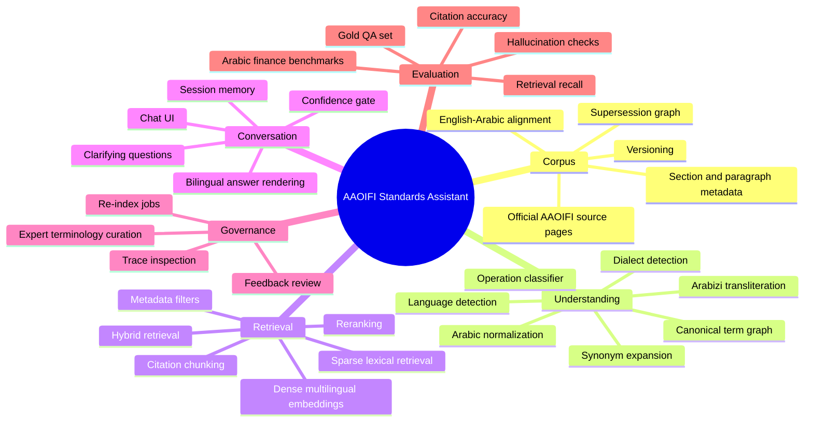
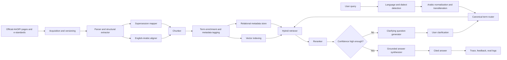
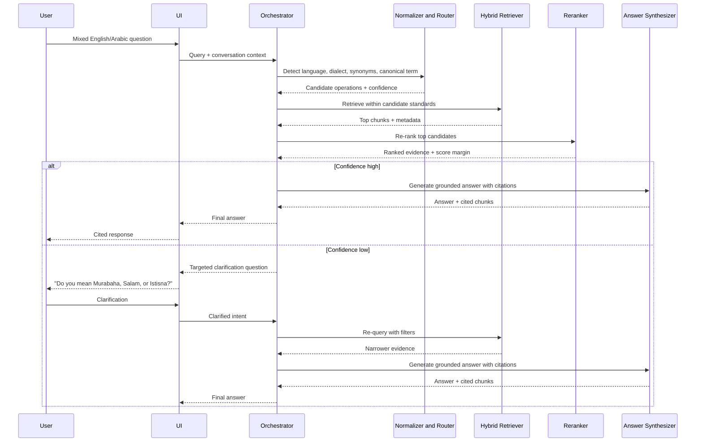
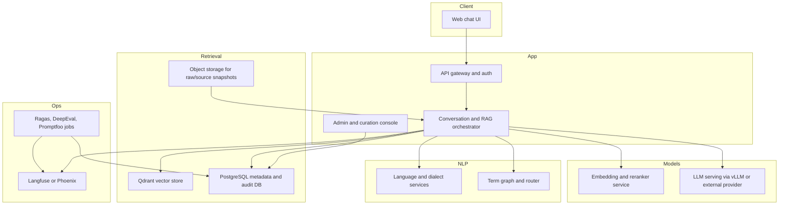
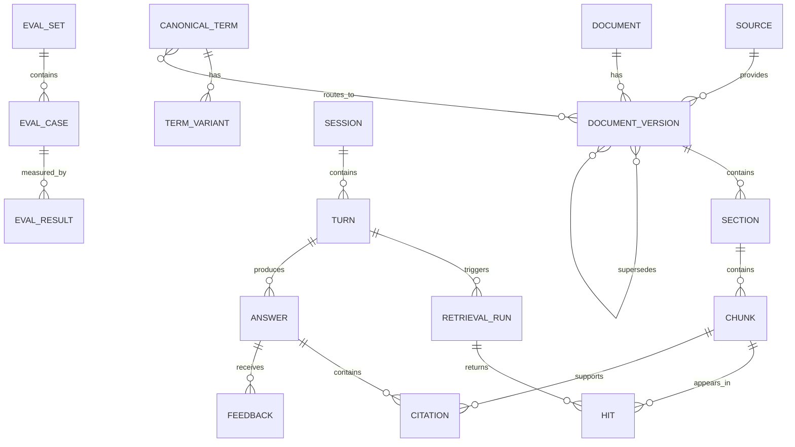

# PRD and Open-Source Research for an AAOIFI Multilingual Standards Chatbot

## Product definition

The source of truth for this app should be the official AAOIFI standards website, not unofficial PDFs or mirrored documents. AAOIFI states that its website is regularly updated and should be the reference version for standards, and it announced that all standards are accessible online on a complimentary basis in Arabic and English through its e-standards area. The e-standards page explicitly exposes separate access paths for Shari’ah standards, Accounting Standards, and Auditing/Governance standards, with English and Arabic access for accounting standards. citeturn0search0turn0search9turn1view1

The accounting standards page is also not a flat content dump. It lists the accounting corpus from conceptual-framework entries through FAS 52, and it includes official supersession notes such as FAS 2 and FAS 20 being replaced by FAS 28, FAS 11 being replaced by FAS 30 and FAS 35, and FAS 5 and FAS 6 being replaced by FAS 27. That means the app must model **document versions, legacy aliases, and superseded relationships**, not only raw text chunks. citeturn2view0

In practical terms, this is **not** just a generic finance chatbot. It is a bilingual, standards-grounded assistant for Islamic finance and accounting that must: ingest official AAOIFI accounting standards; preserve English-Arabic alignment; understand mixed English/Arabic phrasing, dialectal Arabic, and colloquial or vague financial wording; route the question to the right AAOIFI standard; respond with citations; and ask targeted follow-up questions when uncertainty is high enough that answering directly would risk retrieving from the wrong standard or the wrong clause. That product framing is consistent with AAOIFI’s role as the body that prepares accounting, auditing, governance, ethics, and Shari’ah standards for Islamic financial institutions and the broader industry. citeturn0search2turn2view0

### Example router map for the first release

| Canonical operation or topic | Likely primary target standard(s) | Why it matters for routing |
|---|---|---|
| Murabaha, cost-plus sale, installment/deferred payment sale, المرابحة, البيع الآجل | FAS 28 | Legacy names and common user phrasing can point to the same concept |
| Salam, parallel salam, السلم | FAS 7 and FAS 52 | Users may ask in transaction or deferred-delivery language |
| Istisna, parallel istisna, الاستصناع | FAS 10 and FAS 52 | Manufacturing/project finance vocabulary is often indirect |
| Ijarah, leasing, rent-to-own, الإجارة | FAS 32 | Users often describe operations without naming “Ijarah” |
| Mudaraba, profit-sharing investment, المضاربة | FAS 3 | Often confused with Musharaka in casual questions |
| Musharaka, partnership finance, المشاركة | FAS 4 and FAS 51 | The product must distinguish financing vs participatory ventures contexts |
| Wakala bi al-Istithmar, agency investment, الوكالة بالاستثمار | FAS 31 | English queries may omit the Arabic term entirely |
| Zakah, الزكاة | FAS 9 and FAS 39 | Users may ask from recognition, reporting, or disclosure angles |
| Takaful, التكافل | FAS 42 and FAS 43 | The question may be about presentation vs recognition and measurement |
| Sukuk, shares, similar instruments, الصكوك | FAS 33 and FAS 34 | Instrument questions can drift between investment accounting and holder reporting |

The mapping above is derived from the official AAOIFI accounting standards list and should become the seed for a canonical term graph. citeturn2view0

### Supersession rules that must be encoded

| Legacy reference | Current or newer anchor |
|---|---|
| FAS 2 “Murabaha and Murabaha to the Purchase Orderer” | FAS 28 “Murabaha and Other Deferred Payment Sales” |
| FAS 20 “Deferred Payment Sale” | FAS 28 “Murabaha and Other Deferred Payment Sales” |
| FAS 11 “Provisions and Reserves” | FAS 30 and FAS 35 |
| FAS 5 and FAS 6 | FAS 27 “Investment Accounts” |
| FAS 17 “Investments” | FAS 25 and FAS 26, and later FAS 33 for sukuk/shares/similar instruments |

Those supersession links should exist as explicit graph edges in the database and as retrieval filters in the runtime. citeturn2view0

## PRD scope and requirements

The product should serve users who need **standards-grounded answers**, not speculative general-finance chat. The highest-value first-release users are likely to be accountants, compliance teams, internal product specialists, auditors, Shari’ah reviewers, and trainees working with AAOIFI-aligned questions. Since AAOIFI’s standards target Islamic financial institutions and the industry, the conversational surface should be optimized for professional lookup, standards comparison, policy drafting support, and training use cases. citeturn0search2

The clearest PRD shape is a **governed assistant** with four operating principles. First, default to the authoritative AAOIFI corpus. Second, preserve bilingual traceability so the answer can cite the English or Arabic source appropriately. Third, treat finance-operation disambiguation as a first-class workflow, not a side effect of embeddings. Fourth, refuse to bluff: when the evidence or routing confidence is weak, ask the smallest useful follow-up question before answering.

### PRD backbone

| Area | Requirement | Release standard |
|---|---|---|
| Authoritative grounding | Answers should default to official AAOIFI accounting standards and their official bilingual counterparts | Every answer includes source citations and standard ID |
| Multilingual understanding | Handle English, Arabic, code-switching, MSA, classical phrasing, and colloquial variants | Query normalization layer produces canonical terms and candidate standards |
| Operation disambiguation | Map unclear phrasing to the correct Islamic finance/accounting operation | Router produces ranked candidate operations with confidence score |
| Uncertainty handling | Ask clarifying questions when operation confidence or retrieval confidence is low | At most two clarification turns before fallback |
| Transparency | Show why the answer was grounded where it was grounded | Inline citations, cited chunk preview, standard title, section path |
| Governance | Support expert curation of aliases, synonyms, and answer corrections | Admin UI for terminology and feedback review |
| Evaluation | Measure retrieval and answer quality continuously | Custom AAOIFI gold set plus Arabic finance benchmarks |

### Functional requirements

| Capability | What the system must do |
|---|---|
| Corpus ingestion | Crawl or import official AAOIFI standards, version them, align English-Arabic pairs, preserve metadata, and track supersession |
| Structural parsing | Convert each standard into sections, headings, paragraphs, chunk lineage, standard IDs, page ranges, and topic tags |
| Query normalization | Detect language and dialect, normalize Arabic text, transliterate Arabizi if present, expand synonyms, and produce canonical financial-operation candidates |
| Retrieval | Use hybrid retrieval with metadata filters, bilingual embeddings, sparse lexical matching, and reranking |
| Answer synthesis | Generate a concise answer in the user’s language with section-aware citations and minimal grounded quotes |
| Clarification | Ask targeted follow-up questions when more than one operation or standard plausibly matches |
| Feedback loop | Capture thumbs-up/down, expert correction, and missing-synonym reports |
| Administration | Re-index standards, review extraction errors, edit term graph, and inspect traces and failed runs |

### Non-functional requirements

| Dimension | Target |
|---|---|
| Accuracy | Prioritize evidence-grounded correctness over eloquence |
| Latency | Fast enough for interactive use, with separate budgets for baseline answers and clarification mode |
| Auditability | Persist every retrieval path, ranking score, citation, and final answer |
| Security | Self-hostable architecture, least-privilege admin controls, internal-only raw corpus access |
| Extensibility | Able to add Shari’ah, governance, ethics, or internal policy corpora later |
| Maintainability | Replaceable model providers and replaceable vector store without rewriting the product |

## Architecture and diagrams

A strong architecture for this project is a **governed RAG system with term-aware routing**. Haystack is well suited to this because it is an open-source framework for production-ready AI applications with reusable pipeline components, and its documentation includes hybrid retrieval and conditional-routing patterns. LlamaIndex is also relevant because it offers routers and a citation query engine. On the retrieval side, Qdrant supports named vectors and hybrid or multi-stage queries, which is particularly useful when the same chunk needs dense, sparse, and optional late-interaction representations. citeturn12search9turn12search12turn12search8turn12search2turn12search6turn12search3turn7search1turn7search12

### Mind map

### Data flow diagram

### Query clarification sequence

### Deployment view

For self-hosting, vLLM can serve an OpenAI-compatible API, Open WebUI supports OpenAI-compatible APIs and offline/self-hosted operation, and Langfuse and Phoenix both provide OpenTelemetry-based tracing or observability for LLM applications. That combination fits a controlled internal deployment very well. citeturn19search12turn21search6turn21search9turn22search5turn22search1turn22search3

## Data model and retrieval design

The database model should preserve **source lineage, bilingual alignment, standard lifecycle, and runtime evidence**. This is not optional. Because AAOIFI publishes standards in English and Arabic and explicitly indicates when standards have been replaced or superseded, the schema must allow one question to resolve through both language-alignment edges and supersession edges before retrieval begins. citeturn1view1turn2view0

### Database ERD

### Core dataframes and tables

| Dataframe or table | Core columns | Purpose |
|---|---|---|
| `source_registry` | `source_id`, `source_url`, `lang`, `retrieved_at`, `checksum`, `authoritative`, `copyright_notice` | Tracks official source provenance and re-crawl logic |
| `document_versions` | `doc_id`, `version_id`, `standard_no`, `title_en`, `title_ar`, `lang`, `effective_from`, `status`, `supersedes`, `superseded_by`, `aligned_doc_id` | Models life cycle, bilingual alignment, and legacy routing |
| `sections` | `section_id`, `version_id`, `heading_path`, `article_no`, `page_start`, `page_end`, `text` | Preserves structure needed for accurate citation |
| `chunks` | `chunk_id`, `section_id`, `chunk_text`, `chunk_type`, `token_count`, `canonical_terms[]`, `operation_tags[]` | Main unit for retrieval and answer citation |
| `term_variants` | `variant_id`, `canonical_term_id`, `surface_form`, `normalized_form`, `language`, `dialect`, `script`, `transliteration`, `status` | Bilingual/dialectal synonym graph |
| `retrieval_runs` | `run_id`, `turn_id`, `filters`, `candidate_docs`, `top_scores`, `margin`, `uncertainty` | Makes routing and retrieval auditable |
| `answers` | `answer_id`, `turn_id`, `language`, `answer_text`, `confidence`, `clarification_used` | Stores final answer artifact |
| `citations` | `citation_id`, `answer_id`, `chunk_id`, `quote_span`, `section_path`, `rank` | Supports inline citation rendering |
| `feedback` | `feedback_id`, `answer_id`, `rating`, `comment`, `expert_label`, `needs_alias_update` | Continuous improvement loop |
| `eval_goldset` | `eval_id`, `question`, `expected_standard`, `gold_chunks`, `gold_answer`, `language`, `difficulty` | Offline regression and benchmark dataset |

A strong retrieval baseline for this application is **multilingual dense retrieval + sparse lexical retrieval + reranking**. BGE-M3 is especially attractive because its model family is designed for multilinguality and unifies dense, sparse, and multi-vector retrieval; multilingual-e5-large is a strong simpler dense fallback with 100-language support and training on 1 billion multilingual text pairs. Sentence Transformers is relevant here because it supports embeddings, rerankers, and sparse encoders, and its documented retrieve-and-rerank pattern is a direct fit for question answering over standards. citeturn6search0turn6search19turn23search2turn23search4turn24search0turn24search2turn24search5turn24search13

For the vector layer, Qdrant is the best long-term fit because it supports named vectors, hybrid and multi-stage queries, and payload indexes for filtered search. That makes it natural to store, per chunk, a dense multilingual embedding, a sparse lexical representation, and optionally a late-interaction vector without forcing multiple stores. pgvector remains a valid fallback for a simpler-stack MVP because it stores vectors directly in Postgres and supports exact and approximate nearest-neighbor search. PostgreSQL full-text search is also useful here because it includes synonym and thesaurus dictionary support, which can power a lexical-expansion layer for curated AAOIFI aliases. citeturn7search1turn7search12turn7search5turn7search20turn7search23turn13search0turn13search1turn13search17

### Recommended vector payload design

| Field | Example | Why keep it in payload |
|---|---|---|
| `standard_no` | `FAS_28` | Fast metadata filtering |
| `version_status` | `current` / `superseded` | Legacy-query handling |
| `language` | `en` / `ar` | Answer-language control |
| `title_en`, `title_ar` | bilingual titles | Better citation labels |
| `heading_path` | `Recognition > Initial measurement` | Section-aware answer rendering |
| `canonical_terms[]` | `["murabaha","deferred_payment_sale"]` | Router-aligned retrieval |
| `finance_operation` | `murabaha` | Intent-specific filtering |
| `page_start`, `page_end` | numeric | Citation anchoring |
| `source_url` | official link | Traceability |
| `aligned_chunk_id` | bilingual partner chunk | Cross-language answer generation |

The chunking strategy should be **two-level**. Store a larger parent structural chunk for context and a smaller child citation chunk for answer support. This avoids the common problem of retrieving enough context to answer while losing precise citation spans. A practical starting point is heading-aware chunking with overlap only inside a section, not across sections.

Because AAOIFI makes the standards available online but the site is still copyright AAOIFI and the site warns users to rely on official website versions, the PRD should include source-governance rules: preserve canonical source URLs, store internal raw snapshots only for indexing and audit, and expose only minimal supporting excerpts in answers rather than large document dumps. citeturn0search9turn1view0turn1view1

## Multilingual intelligence and clarification strategy

The language layer needs to be more deliberate than “use one multilingual embedder and hope for the best.” A better design begins with short-text language detection and mixed-language tolerance. fastText distributes language-identification models for 176 languages, and Lingua is explicitly aimed at accurate detection on short and mixed-language text, which is close to the shape of real chatbot queries. citeturn10search0turn10search1

For Arabic normalization, the strongest open-source combination is **PyArabic + CAMeL Tools + Farasa**. PyArabic handles basic Arabic text normalization and diacritic removal. CAMeL Tools provides Arabic NLP utilities and a dialect-identification component that can identify 25 Arabic city dialects plus Modern Standard Arabic. Farasa adds production-useful Arabic NLP tasks such as segmentation, stemming, lemmatization, POS tagging, NER, and diacritization. For Arabizi input, CAMeL Lab’s seq2seq transliteration tool is a useful inspiration layer for converting Latin-script Arabic into Arabic-script text before retrieval. citeturn8search0turn8search4turn14view2turn14view1turn8search6turn8search16turn14view0

The most important design choice is to make **canonical term routing explicit**. Do not depend on embeddings alone to infer that “بيع بالتقسيط”, “murabaha sale”, “deferred payment sale”, and a legacy reference to old FAS 2 all belong in the same retrieval neighborhood. Build a curated term graph with nodes for canonical operations and edges for English variants, Arabic variants, dialectal forms, Arabizi spellings, and legacy AAOIFI aliases. FIBO is useful as a formal ontology for financial contracts and related concepts, arabterm provides multilingual dictionary content in database-friendly formats, and Arabic Ontology is a useful example of Arabic semantic-relation structure. citeturn18search13turn17search2turn18search2

Open data can bootstrap both routing and evaluation. ArBanking77 contains more than 31,000 MSA and dialectal Arabic banking queries across 77 intents; DarijaBanking contributes a multilingual set across English, French, MSA, and Darija; ArabicaQA is a broad Arabic QA dataset; and the new SAHM benchmark is particularly relevant because it is document-grounded, includes AAOIFI standards QA, and contains 14,380 expert-verified instances spanning Arabic financial and Shari’ah-compliant reasoning tasks. Those resources should not replace a custom AAOIFI gold set, but they are excellent for pretraining intent classifiers, testing dialect robustness, and stress-testing answer faithfulness. citeturn17search0turn17search8turn17search9turn17search12turn29search6turn29search0

### Uncertainty policy

| Signal | Suggested interpretation | Product response |
|---|---|---|
| Low term-routing confidence | Top canonical term score is weak or tied | Ask a short disambiguation question |
| Cross-standard tie | Two standards score similarly after reranking | Ask which operation or reporting context the user means |
| Weak evidence | Retrieved chunks do not cover the answer claim | Refuse to answer directly and ask for more context |
| Legacy reference ambiguity | Old FAS number may map to a newer standard | Explain the supersession and confirm whether the user wants current or legacy treatment |
| Language mismatch | Query is dialect-heavy but retrieved evidence is poor | Normalize again, suggest alternative phrasing, or ask for the financial operation name |

A good clarifying question is **small and anchored**. For example: “When you say بيع آجل, do you mean Murabaha and other deferred payment sales under FAS 28, or deferred-delivery sales such as Salam and Istisna under FAS 52?” That question narrows the search space without revealing any hidden internal reasoning.

## Open-source projects worth reusing

The GitHub and web search landscape is broad enough that this project does **not** need to be built from scratch. The right approach is to combine a few direct-use infrastructure components with selected ideas from full-stack RAG apps and then add a custom AAOIFI-specific normalization and routing layer.

### Direct-use building blocks

| Project | Why it matters to this app | Best use mode | Sources |
|---|---|---|---|
| Haystack | Modular Python framework for production-ready AI apps; strong fit for hybrid retrieval, routing, and answer-building pipelines | Direct backend orchestration | citeturn4search0turn12search9turn12search12turn12search1 |
| LlamaIndex | Flexible framework with routers, retrievers, query engines, and a citation query engine | Direct reuse for citation-heavy QA or as design inspiration beside Haystack | citeturn4search1turn12search2turn12search6turn12search3 |
| Qdrant | Named vectors, hybrid and multi-stage queries, payload filtering, and hybrid text/vector patterns | Primary vector database | citeturn6search7turn7search1turn7search12turn7search23 |
| pgvector + PostgreSQL FTS | Simpler-stack fallback with vectors in Postgres and built-in full-text search plus synonym/thesaurus support | MVP or metadata-centric alternative | citeturn13search0turn13search1turn13search17 |
| Sentence Transformers | Supports embeddings, rerankers, and sparse encoders; retrieve-and-rerank is documented for QA | Direct reuse for embedding/reranking pipeline | citeturn24search0turn24search2turn24search5turn24search11 |
| FlagEmbedding and BGE family | Practical route to BGE embedding and reranker models including multilingual options | Direct reuse for local retrieval and reranking | citeturn24search1turn24search3turn24search14 |
| Docling, Unstructured, Marker | Strong open-source document preprocessing options for PDF/HTML/Office docs; useful when source is not already clean text | Direct parser options, especially for future corpora | citeturn15search0turn15search16turn15search1turn15search3 |
| vLLM, TGI, LiteLLM | Self-hosted model serving, OpenAI-compatible APIs, and provider-agnostic routing/proxying | Direct model-serving and gateway layer | citeturn19search0turn19search12turn19search2turn19search6turn19search3turn19search11 |
| Langfuse, Phoenix, Ragas, DeepEval, Promptfoo | Observability, tracing, AI evals, and regression testing for RAG systems | Direct monitoring and quality layer | citeturn22search2turn22search5turn22search1turn22search3turn11search0turn11search1turn11search3 |

### Full-stack accelerators and strong inspiration projects

| Project | Relevance | Best use mode | Sources |
|---|---|---|---|
| Open WebUI | Self-hosted, offline-capable AI platform with OpenAI-compatible APIs and built-in knowledge-base workflows | Fast internal prototype UI or admin console inspiration | citeturn21search6turn21search9turn21search2 |
| AnythingLLM | Easy all-in-one RAG app with document chat, workspaces, and an embeddable chat widget | Rapid prototype or public-facing embedded UI inspiration | citeturn21search14turn21search4turn21search1turn5search17 |
| LibreChat | Mature chat UI with pluggable RAG API based on LangChain and FastAPI | Strong UI baseline if you want multi-provider chat plus files | citeturn21search3turn21search7turn21search10 |
| Onyx | Open-source enterprise search/chat platform connected to docs, apps, and people | Inspiration for admin UX, connectors, and organizational knowledge expansion | citeturn5search20turn5search8 |
| RAGFlow | Open-source RAG engine with agent capabilities and emphasis on deep document understanding | Inspiration or partial reuse for advanced ingestion flows | citeturn4search2turn4search6 |
| R2R | Production-ready REST-based retrieval system with hybrid search, knowledge graphs, and document management | Inspiration or partial reuse for API-first retrieval services | citeturn25search0 |
| Dify | Open-source LLM app development platform combining workflow, RAG, agents, and observability | Rapid experiment platform, not ideal as-is for standards-critical routing | citeturn26search0 |
| Flowise | Visual workflow builder for LLM apps and agentic systems | Good ideation/prototyping tool | citeturn26search3turn26search11 |
| Verba | Customizable RAG assistant with configurable frameworks, chunking, and data types | UX and ingestion inspiration | citeturn25search2turn25search10 |
| MaxKB | Enterprise-grade agent platform integrating RAG pipelines and workflows | Inspiration for multi-tenant admin patterns | citeturn25search7 |

### Arabic, banking, and Islamic-finance-specific assets

| Asset | Why it matters | Best use mode | Sources |
|---|---|---|---|
| CAMeL Tools | Arabic NLP toolkit with dialect ID | Direct runtime component | citeturn14view2turn14view1 |
| PyArabic | Arabic normalization and diacritic handling | Direct runtime preprocessing | citeturn8search0turn8search4 |
| Farasa | Segmentation, lemmatization, NER, POS, diacritization | Direct or optional NLP enrichment | citeturn8search6turn8search16 |
| ArBanking77 | Large MSA+dialectal banking intent corpus | Bootstrapping intent or router classifier behavior | citeturn17search0turn17search8 |
| DarijaBanking | Multilingual banking-intent data including Darija | Robustness testing for colloquial Arabic | citeturn17search9turn17search12 |
| SAHM | Arabic financial and Shari’ah reasoning benchmark, including AAOIFI standards QA | Domain-specific evaluation benchmark | citeturn29search0turn29search1 |
| arabterm | Arabic/English/French terminology dictionaries in DB-friendly format | Seed terminology graph | citeturn17search2 |
| FIBO | Formal ontology for financial contracts and related concepts | Seed financial concept graph | citeturn18search13 |
| fin-islam | Niche Islamic-finance assistant with RAG and multi-agent ideas | Inspiration only | citeturn27search0 |

A useful **optional later-stage** idea is GraphRAG. Microsoft’s GraphRAG documentation argues that graph-based retrieval can outperform baseline vector RAG for complex reasoning, and Neo4j now has an official GraphRAG package. But Microsoft also explicitly warns that GraphRAG indexing can be expensive, so it should be a phase-two or phase-three enhancement, not the first implementation milestone. citeturn20search3turn20search1turn20search4turn20search0

The strongest practical recommendation is therefore this: use **Haystack + Qdrant + Sentence Transformers/FlagEmbedding + CAMeL/PyArabic/Farasa + FastAPI**, then choose either **Open WebUI** or a custom web UI for the conversation layer, and wire in **Langfuse or Phoenix** plus **Ragas/DeepEval/Promptfoo** from day one. Borrow full-product ideas from **AnythingLLM, LibreChat, Onyx, RAGFlow, R2R, Verba, and Dify**, but keep the core QA engine custom because AAOIFI-specific supersession logic and bilingual term routing are the real differentiators here. citeturn12search9turn7search12turn24search5turn14view1turn21search6turn22search5turn11search0turn11search1

## Delivery roadmap and success metrics

Instrumentation and evaluation should be built in from the first sprint, not added at the end. Langfuse and Phoenix give trace visibility into retrieval and generation paths, while Ragas, DeepEval, and Promptfoo support model-based or automated evaluation workflows. For domain benchmarking, SAHM is the most directly relevant public benchmark because it includes AAOIFI standards QA as part of Arabic financial and Shari’ah-compliant reasoning. citeturn22search5turn22search1turn11search0turn11search1turn11search3turn29search0

### Delivery plan

| Phase | Main outputs | Exit criteria |
|---|---|---|
| Corpus foundation | Official AAOIFI acquisition job, version registry, bilingual alignment, supersession graph, structural parser | All current accounting standards imported with stable IDs and provenance |
| Baseline RAG | Hybrid retrieval, reranking, citation rendering, answer templates, admin re-indexing | Gold questions answered with correct standard-level routing and visible citations |
| Multilingual intelligence | Arabic normalization, dialect handling, term graph, operation router, clarification flow | Mixed-language and colloquial queries route to the same canonical operations consistently |
| Evaluation and observability | Trace dashboards, golden set runner, answer-faithfulness checks, retrieval diagnostics | Team can explain why a bad answer happened and reproduce it |
| Production hardening | Role-based admin tools, feedback loop, caching, performance tuning, policy controls | Stable internal beta with measurable quality and latency targets |

### Success metrics

| Metric | What to measure | Suggested launch threshold |
|---|---|---|
| Standard-routing accuracy | Correct AAOIFI standard selected before answer generation | Very high on curated gold set |
| Citation accuracy | Whether cited chunks actually support the answer | Near-perfect on audited samples |
| Clarification precision | Whether the assistant asks when it should, and only when it should | High on ambiguous-query test set |
| Arabic robustness | Equivalent routing for Arabic, English, and mixed-language paraphrases | Small variance across language forms |
| Hallucination rate | Unsupported claims in final answer | Minimal in strict-grounding mode |
| Latency | End-to-end response time for normal and clarification paths | Interactive, with separate p95 goals |
| Expert-correction rate | Number of answers requiring subject-matter correction | Downward trend release over release |

The most credible MVP is therefore a **strict-grounding bilingual assistant** that answers from official AAOIFI accounting standards, respects supersession relationships, resolves bilingual and dialectal terminology through a curated term graph, and escalates ambiguity into small clarifying questions rather than hoping dense embeddings will infer everything correctly. From an implementation standpoint, the best near-term stack is **Qdrant for retrieval, PostgreSQL for metadata and audit, Haystack for orchestration, Sentence Transformers/FlagEmbedding for embeddings and reranking, CAMeL/PyArabic/Farasa for Arabic preprocessing, vLLM or an equivalent provider-agnostic serving layer for LLM access, and Langfuse or Phoenix plus Ragas/DeepEval for quality control**. That combination is the least risky path to a production AAOIFI assistant that is both multilingual and standards-faithful. citeturn7search12turn13search0turn12search9turn24search2turn14view1turn19search12turn22search5turn11search0turn29search0