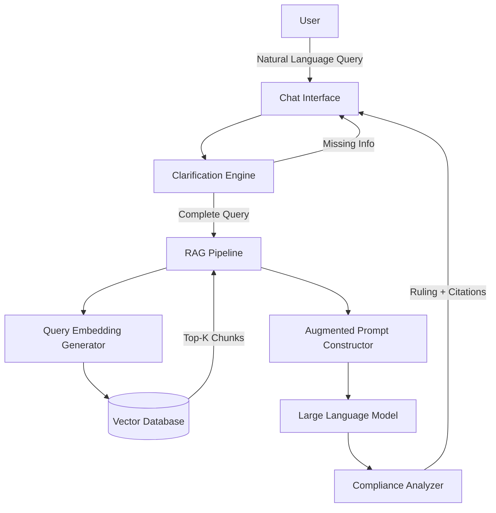
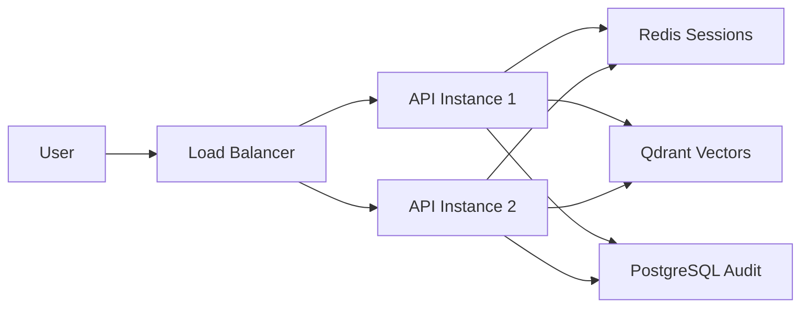

# Design Document: Sharia Compliance Chatbot

## Overview

### Purpose

The Sharia Compliance Chatbot is an AI-powered system that analyzes financial operations against AAOIFI (Accounting and Auditing Organization for Islamic Financial Institutions) Accounting Standards to determine Sharia compliance. The system employs a Retrieval-Augmented Generation (RAG) architecture to ensure all compliance rulings are strictly grounded in authoritative AAOIFI standards, combined with an interactive clarification loop to gather complete information before making determinations.

### L0 Implementation Status (COMPLETE ✅)

**What was built and validated:**
- ✅ **RAG Pipeline**: Query preprocessing → embedding → ChromaDB search → top-k retrieval → citation extraction
- ✅ **Query Preprocessor**: Arabic diacritic normalization, transliteration mapping, domain term expansion, language detection
- ✅ **OpenRouter Integration**: OpenAI-compatible API, supports multiple models (Gemini, GPT-4, Claude), temperature 0.1, cost-effective
- ✅ **Data Models**: AAOIFICitation, SemanticChunk, ComplianceRuling
- ✅ **CLI Chatbot**: Terminal interface with AAOIFI adherence system prompt
- ✅ **Ingestion**: Markdown corpus → 512-token chunks (50 overlap) → all-mpnet-base-v2 embeddings → ChromaDB
- ✅ **Tests**: Smoke tests for ingestion and retrieval
- ✅ **26 files created**: 10 source, 4 tools, 3 samples, 6 docs
- ✅ **~1,220 lines of code**: Clean, maintainable, well-structured
- ✅ **52 English AAOIFI standards** ready to ingest

**Key architectural decisions validated:**
1. **OpenRouter API**: Proven to follow AAOIFI adherence prompt, supports multiple LLM providers (Gemini, GPT-4, Claude), cost-effective → **KEEP**
2. **ChromaDB embedded**: Works well for L0-L2 (<100K vectors) → **Migrate to Qdrant at L3**
3. **all-mpnet-base-v2**: 768-dim, English-only, good retrieval quality, runs locally → **KEEP**
4. **512 token chunks, 50 overlap**: Standard for legal text, validated → **KEEP** unless retrieval quality tanks
5. **Temperature 0.1**: Consistent, deterministic outputs → **KEEP**
6. **Clean module separation**: models, rag, chatbot → **No refactoring needed for L1-L4**
7. **Dataclasses**: Type-safe, converts cleanly to Pydantic for FastAPI → **KEEP**

**What L0 lacks (by design, to be added in L1-L4):**
- ❌ No clarification loop (single-turn only) → **L1**
- ❌ No conversation history → **L1**
- ❌ No error handling/retry logic → **L1**
- ❌ No structured logging (only print statements) → **L1**
- ❌ No streaming → **L2**
- ❌ No API (terminal only) → **L2**
- ❌ No session management → **L1** (in-memory), **L3** (Redis)
- ❌ No monitoring/observability → **L3**
- ❌ No production infrastructure → **L3**

**Technical Debt from L0 (to address in L1+):**
1. **LLM call is brittle** - No error handling, no retries, assumes response.text always exists
2. **No structured logging** - Only print() statements, need logging framework
3. **Hardcoded prompt templates** - Should be in config file for A/B testing
4. **No session management** - Need Session dataclass with state tracking
5. **No observability** - Need metrics, tracing, monitoring

### Design Philosophy

The design prioritizes **accuracy and traceability** over speed, ensuring every compliance ruling is backed by specific AAOIFI standard citations. The system is built with a **progressive enhancement approach**, starting with L0 (minimal RAG loop) and evolving through L1-L4 to production-ready system.

Key design principles:
- **Strict grounding**: Never generate speculative compliance advice; all rulings must be supported by retrieved AAOIFI standards (✅ validated in L0)
- **LLM-driven clarification**: Use LLM to identify missing information, not hand-coded state machines (L1)
- **Auditability**: Maintain complete traceability from user queries through retrieval to final rulings (L3+)
- **Modularity**: Design components with clear boundaries to support independent testing and evolution
- **Progressive scaling**: L0 (proof of concept) → L1 (clarification) → L2 (API) → L3 (production infra) → L4 (advanced features)

### System Context

The system operates in the Islamic finance domain, where compliance determinations must be authoritative and traceable. Users range from financial professionals to individuals seeking guidance on transaction compliance. The system provides **guidance based on AAOIFI standards** but explicitly disclaims that it does not replace qualified Islamic finance scholars for critical decisions.

### Open-Source References and Reusable Patterns

**Key Finding:** No production-grade open-source AAOIFI/Sharia-finance RAG project exists. This is net-new domain and represents the moat. However, we can leverage patterns from legal RAG and production RAG systems.

#### A. Islamic Finance / Sharia / Quran-Hadith RAG Chatbots

**Verdict:** Small student/portfolio projects or Quran/Hadith Q&A — not financial-rulings against AAOIFI FAS. Study for patterns, but no direct code reuse.

1. **dannycahyo/fin-islam** (1⭐, MIT, TypeScript/Hono/React)
   - **Reusable Pattern**: Routing agent → knowledge (RAG) agent → calculation agent → Sharia-compliance agent
   - **Tech**: pgvector, Ollama Llama 3.1 8B, MCP
   - **Skip**: TypeScript, ~30 docs, no AAOIFI
   - **Takeaway**: Multi-agent architecture pattern for Islamic finance

2. **oshoura/IslamAI** (8⭐, Next.js + Pinecone + LangChain + GPT-3.5)
   - **Reusable Pattern**: Classic citation pattern
   - **Skip**: Stale, Quran/Hadith only
   - **Takeaway**: Citation formatting approach

3. **hammadali1805/Quran-Hadith-Chatbot** (6⭐, Streamlit + Chroma + MiniLM + OpenRouter)
   - **Reusable Pattern**: Chroma + sentence-transformers wiring on Islamic corpora — direct stack mirror
   - **Action**: Look at query-expansion code
   - **Skip**: Notebook-grade, no eval
   - **Takeaway**: OpenRouter + Chroma integration pattern

4. **Shaheer66/Islam-GPT** (2⭐, Apache-2.0, Python)
   - **Skip**: Tiny, no tests

5. **arxiv 2512.16644 + LangChain fiqh-muamalah paper** (88.8% accuracy)
   - **Reusable**: Citation/eval methodology
   - **Skip**: No public repos

#### B. Legal/Regulatory RAG (PRIMARY SOURCE FOR PATTERNS)

**Verdict:** Legal domain is closest analog to AAOIFI compliance. Steal architecture, retrieval patterns, and evaluation approaches.

1. **lawglance/lawglance** ⭐⭐⭐ (250⭐, Apache-2.0, active)
   - **Tech**: LangChain + ChromaDB + Django + OpenAI + Streamlit + Redis
   - **Reusable**: 
     - End-to-end production layout
     - Redis LLM cache pattern
     - Indian-legal-codes corpus pattern → directly maps to FAS-1..FAS-N
   - **Action**: Best legal reference for Mushir — lift L2 API + L3 ops layout
   - **Use in**: L2 (API structure), L3 (Redis caching)

2. **sougaaat/RAG-based-Legal-Assistant** ⭐⭐⭐ (8⭐)
   - **Reusable**: 
     - **Retrieval**: BM25 + FAISS dense + multi-query + multi-hop fused via Reciprocal Rank Fusion (RRF)
     - **Classifier**: Query-complexity classifier to route simple vs. complex queries
     - **Evaluation**: RAGAS evaluation framework integration
   - **Action**: Copy BM25+dense+RRF+multi-hop+multi-query verbatim into L1 retrieval
   - **Use in**: L1 (advanced retrieval)

3. **NirDiamant/Controllable-RAG-Agent** ⭐⭐⭐ (1.6k⭐, Apache-2.0)
   - **Verdict**: Closest end-to-end blueprint for grounded, hallucination-resistant RAG.
   - **Reusable**: 
     - Deterministic LangGraph routing
     - Self-RAG verification (checks if answer is supported by context)
     - Three-tier vector stores (chunks + summaries + quotes)
     - Built-in RAGAS faithfulness/context-recall metrics
   - **Action**: Adopt as the primary architectural blueprint for L1+
   - **Use in**: L1 (verification), L3 (evaluation)

4. **GiovanniPasq/agentic-rag-for-dummies** ⭐ (LangGraph)
   - **Reusable**: Explicit Query Clarification stage that resolves references and splits multi-part queries.
   - **Action**: Drop-in pattern for L1 clarification state machine.
   - **Use in**: L1 (clarification loop)

5. **onyx-dot-app/onyx** (formerly Danswer) (29.1k⭐, MIT)
   - **Reusable**: Hybrid search (BM25+embed+rerank), 50+ connectors, RBAC, agents framework.
   - **Action**: Study at L3+ for enterprise features like multi-tenancy and audit dashboards.

6. **FareedKhan-dev/agentic-rag**
   - **Reusable**: "Gatekeeper" pattern that refuses vague queries and demands clarification.
   - **Use in**: L1 (refusal logic)

7. **faerber-lab/RAGentA**
   - **Reusable**: SIGIR LiveRAG Multi-Agent attributed-QA with Claim Judge doing claim-by-claim grounding analysis.
   - **Use in**: L4 (citation validation)

#### C. Tooling — Evaluation and Validation

1. **explodinggradients/ragas** (13.8k⭐, v0.4.3)
   - **Role**: Primary evaluation harness for faithfulness, answer-relevance, and context-precision.
2. **confident-ai/deepeval**
   - **Role**: Pytest-style CI/CD gates to block grounding regressions.
3. **Stanford Legal RAG Hallucinations Paper**
   - **Role**: Required reading for setting the refusal thresholds and grounding prompts.

### High-Level Architecture



### Component Design

#### Document Acquisition Module
- **Role**: Acquire and parse AAOIFI standards
- **Implementation**: 
  - Manual acquisition (L0): Copy markdown files to `data/aaoifi_md/`
  - Automated acquisition (L3+): Scrape AAOIFI website and parse PDFs
- **Validation**: Ensure standards are authoritative and correctly parsed

#### RAG Pipeline
- **Role**: Retrieve relevant AAOIFI standards and augment LLM prompt
- **Implementation**: 
  - Query Preprocessor: Normalizes Arabic diacritics, transliteration variants, and expands domain terms (✅ L0 complete)
  - Embedding Generator: sentence-transformers (all-mpnet-base-v2) (✅ validated in L0)
  - Vector Database: ChromaDB (L0-L2) or Qdrant (L3+)
  - Prompt Constructor: strictly adhere to AAOIFI grounding prompt (✅ validated in L0)
- **Retrieval Pattern**: BM25 + Dense + RRF (L1+)

#### Clarification Engine
- **Role**: Identify missing information and prompt user for details
- **Implementation**: 
  - LLM-driven variable identification
  - State machine management (L1)
  - Interactive multi-turn loop
- **Pattern**: LangGraph clarification with human-in-loop (L1+)

#### Compliance Analyzer
- **Role**: Generate compliance rulings grounded in retrieved standards
- **Implementation**: 
  - OpenRouter API (supports Gemini, GPT-4, Claude, and other models) (✅ validated in L0)
  - Temperature 0.1 for consistent results
  - Strict adherence to citations and quotes (L4+)

### Data Strategy

#### Chunking Strategy
- **Format**: 512-token semantic chunks with 50-token overlap (✅ validated in L0)
- **Metadata**: document_id, section, page, version, provenance_id

#### Vector Database
- **L0-L2**: ChromaDB embedded for simplicity and local storage
- **L3+**: Qdrant server for distributed scale and high performance

#### Persistent Storage
- **L3+**: PostgreSQL for document storage, audit logs, and user data
- **L3+**: Redis for session storage and rate limit counters

### Deployment Architecture (L3+)



### Success Criteria & Roadmap

**Total Timeline: 9 weeks (2.25 months)**

| Layer | Focus | Duration | Key Deliverables |
|-------|-------|----------|------------------|
| L0 | Foundational RAG | ✅ COMPLETE | Terminal RAG loop, OpenRouter integration, ChromaDB, 52 standards |
| L1 | Clarification Loop | 2 weeks | LangGraph state machine, error handling, structured logging, session management |
| L2 | API + Streaming | 2 weeks | FastAPI REST API, SSE streaming, CORS, basic rate limiting |
| L3 | Production Ready | 3 weeks | Qdrant, Redis, PostgreSQL, Ragas eval, monitoring (Prometheus/Grafana) |
| L4 | Scale + Ops | 2 weeks | Authentication, tier-based rate limits, Docker, CI/CD, alerting |

**Agent Roundtable Consensus:**

**Winston (Architect):**
- Clarification loop must be LLM-driven (LangGraph), not hand-coded state machine
- Streaming is non-negotiable for L2 user experience
- Citation quality is the moat, not the RAG tech
- Rate limits must tie to actual costs ($0.011/query)

**Amelia (Dev):**
- L0 code is clean, no refactoring needed
- Adopt LangGraph (L1), FastAPI+SSE (L2), Ragas+DeepEval (L3)
- Add error handling, retry logic, structured logging in L1
- Test coverage: 60% (L1), 70% (L2), 80% (L3)

**John (PM):**
- Stick to MVP scope - no scope creep
- L1: 2-turn clarification max, 30min session expiry
- L2: SSE only (no WebSocket), in-memory rate limiting
- L3: Redis+Postgres+Qdrant, defer auth to L4
- Success metrics: 80% queries complete in 2 turns (L1), <5s API response (L2), >0.8 faithfulness (L3)

**Mary (Analyst):**
- Track clarification effectiveness, API latency, retrieval quality, faithfulness
- Cost model: $0.011/query → Free tier underwater, need lower limits or higher pricing
- L3: Grafana dashboard, nightly Ragas eval
- L4: Citation accuracy, cost tracking, user satisfaction

**Key Risks & Mitigations:**
- **L1 Risk**: Clarification loop is clunky → Test with 20 real users, add "skip clarification" button
- **L2 Risk**: Streaming breaks on slow connections → Test on 3G, add timeout handling
- **L3 Risk**: Qdrant migration breaks retrieval → Run ChromaDB and Qdrant in parallel for 1 week
- **L4 Risk**: Rate limiting too strict/loose → Start generous, monitor 2 weeks, adjust based on data

---

## L1 Design: Clarification Loop & Error Handling

### LangGraph State Machine

**Adopt Pattern:** GiovanniPasq/agentic-rag-for-dummies

```python
from langgraph.graph import StateGraph
from typing import TypedDict, Literal, List, Dict

class ClarificationState(TypedDict):
    query: str
    missing_vars: List[str]
    clarifications: Dict[str, str]
    status: Literal["incomplete", "clarifying", "complete"]
    turn_count: int
    max_turns: int

def build_clarification_graph():
    graph = StateGraph(ClarificationState)
    graph.add_node("analyze", analyze_query)
    graph.add_node("ask", generate_questions)
    graph.add_node("parse", parse_user_response)
    graph.add_conditional_edges("analyze", route_based_on_completeness)
    return graph.compile()
```

### Error Handling & Retry Logic

**Fix LLM Call Brittleness:**

```python
import logging
import time
from typing import Optional

logger = logging.getLogger(__name__)

def call_llm(
    system_prompt: str, 
    user_prompt: str, 
    max_retries: int = 3
) -> str:
    for attempt in range(max_retries):
        try:
            response = client.chat.completions.create(
                model=model_name,
                messages=[
                    {"role": "system", "content": system_prompt},
                    {"role": "user", "content": user_prompt}
                ],
                temperature=0.1,
                timeout=60
            )
            if not response.choices[0].message.content:
                raise ValueError("Empty response from LLM")
            return response.choices[0].message.content
        except Exception as e:
            logger.warning(
                f"LLM call failed (attempt {attempt + 1}/{max_retries})",
                exc_info=True
            )
            if attempt == max_retries - 1:
                raise
            time.sleep(2 ** attempt)  # Exponential backoff
```

### Structured Logging

```python
import logging

logging.basicConfig(
    level=logging.INFO,
    format='%(asctime)s - %(name)s - %(levelname)s - %(message)s',
    handlers=[
        logging.FileHandler('logs/mushir.log'),
        logging.StreamHandler()
    ]
)

logger = logging.getLogger(__name__)

# Usage
logger.info("Retrieved %d chunks", len(chunks))
logger.warning("Low similarity score: %.2f", chunk.score)
logger.error("LLM API error", exc_info=True)
```

### Session Management

```python
from dataclasses import dataclass
from datetime import datetime, timedelta
from typing import Optional, List, Dict

@dataclass
class Session:
    session_id: str
    user_id: Optional[str]
    created_at: datetime
    expires_at: datetime
    conversation_history: List[Message]
    clarification_state: Optional[ClarificationState]
    
    def is_expired(self) -> bool:
        return datetime.now() > self.expires_at
    
    def extend_expiry(self, minutes: int = 30):
        self.expires_at = datetime.now() + timedelta(minutes=minutes)

# In-memory session store (L1-L2)
sessions: Dict[str, Session] = {}
```

---

## L2 Design: FastAPI + SSE Streaming

### API Structure

**Adopt Pattern:** lawglance/lawglance

```
src/api/
├── __init__.py
├── main.py           # FastAPI app
├── routes/
│   ├── query.py      # POST /query
│   └── stream.py     # GET /stream (SSE)
├── middleware/
│   ├── auth.py
│   └── rate_limit.py
└── schemas/
    └── request.py    # Pydantic models
```

### SSE Streaming

```python
from fastapi import FastAPI
from fastapi.responses import StreamingResponse
from pydantic import BaseModel

app = FastAPI()

class QueryRequest(BaseModel):
    query: str
    session_id: Optional[str] = None

@app.post("/query/stream")
async def stream_query(request: QueryRequest):
    async def generate():
        # Yield SSE events
        yield f"data: {{\"type\": \"thinking\"}}\n\n"
        
        chunks = await rag.retrieve(request.query)
        yield f"data: {{\"type\": \"retrieved\", \"count\": {len(chunks)}}}\n\n"
        
        # Stream LLM response
        async for token in llm.stream(prompt):
            yield f"data: {{\"type\": \"token\", \"text\": \"{token}\"}}\n\n"
        
        yield f"data: {{\"type\": \"done\"}}\n\n"
    
    return StreamingResponse(generate(), media_type="text/event-stream")
```

---

## L3 Design: Production Infrastructure

### Architecture


### Ragas Evaluation

**Adopt Pattern:** sougaaat/RAG-based-Legal-Assistant

```python
from ragas import evaluate
from ragas.metrics import faithfulness, answer_relevancy

results = evaluate(
    dataset=gold_eval_set,
    metrics=[faithfulness, answer_relevancy],
    llm=openrouter_model,
    embeddings=sentence_transformer_model
)

print(f"Faithfulness: {results['faithfulness']}")
print(f"Answer Relevancy: {results['answer_relevancy']}")
```

### DeepEval CI Gates

```python
# tests/test_eval.py
from deepeval import assert_test
from deepeval.metrics import FaithfulnessMetric

def test_murabaha_ruling_faithfulness():
    metric = FaithfulnessMetric(threshold=0.8)
    assert_test({
        "input": "What does AAOIFI require for murabaha cost disclosure?",
        "actual_output": ruling.answer,
        "retrieval_context": [chunk.text for chunk in ruling.chunks]
    }, metric)
```

---

## L4 Design: Authentication & Tier-Based Rate Limiting

### API Key Authentication

```python
from fastapi import Security, HTTPException
from fastapi.security import APIKeyHeader

api_key_header = APIKeyHeader(name="X-API-Key")

async def verify_api_key(api_key: str = Security(api_key_header)):
    user = await get_user_by_api_key(api_key)
    if not user:
        raise HTTPException(status_code=401, detail="Invalid API key")
    return user
```

### Tier-Based Rate Limiting

```python
from fastapi import Request, HTTPException
from datetime import datetime, timedelta

RATE_LIMITS = {
    "free": 10,      # 10 queries/hour
    "standard": 100,  # 100 queries/hour
    "premium": 1000   # 1000 queries/hour
}

async def check_rate_limit(request: Request, user: User):
    key = f"rate_limit:{user.id}:{datetime.now().hour}"
    count = await redis.incr(key)
    
    if count == 1:
        await redis.expire(key, 3600)  # 1 hour
    
    limit = RATE_LIMITS[user.tier]
    
    if count > limit:
        raise HTTPException(
            status_code=429,
            detail="Rate limit exceeded",
            headers={"Retry-After": str(3600 - (datetime.now().minute * 60))}
        )
    
    # Add rate limit headers
    request.state.rate_limit_headers = {
        "X-RateLimit-Limit": str(limit),
        "X-RateLimit-Remaining": str(limit - count),
        "X-RateLimit-Reset": str(datetime.now().replace(minute=0, second=0) + timedelta(hours=1))
    }
```

---

*Note: This design document is a living document and will be updated as the system progresses through its implementation layers.*
