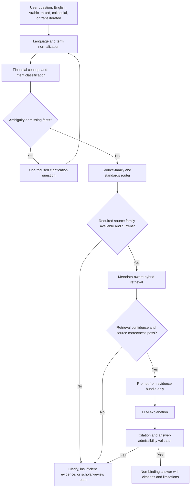
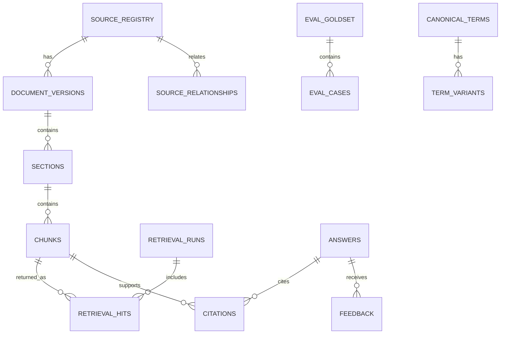
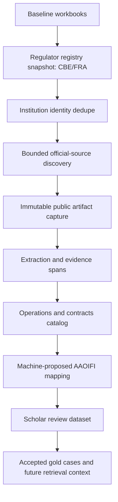

# Design Document: Mushir AAOIFI Standards Assistant

**Last reformulated:** 2026-05-19
**Status:** Maintained architecture plan
**Scope:** Planning only. Runtime code should be changed only after this design is converted into implementation tickets and tests.

## Overview

Mushir should be designed as a source-governed, bilingual AAOIFI standards assistant. The architecture must not be framed as "ask an LLM over nearby chunks." It must be framed as a controlled advisory workflow:

1. govern official sources;
2. ingest and chunk text with traceable metadata;
3. normalize user wording into financial concepts;
4. classify intent and source family;
5. clarify when facts or routing are uncertain;
6. retrieve current and relevant evidence;
7. generate only citation-supported answers;
8. validate answer admissibility before returning it.

The current implementation already contains a practical foundation: `ApplicationService`, multilingual retrieval, query preprocessing, deterministic clarification, citation validation, OpenRouter generation, REST/SSE/UI transports, and a first source-family gate. The next planning step is to make source governance, concept normalization, metadata-aware retrieval, and answer admissibility first-class architecture.

The 2026-05-19 deep research report adds concrete seed data and implementation contracts. This design promotes the first-release accounting router, supersession seed graph, parent/child chunking model, retrieval trace schema, and feedback loop into architecture. It treats specific model, vector database, Arabic NLP, and observability products as spike candidates until measured on Mushir's own AAOIFI gold set.

The 2026-05-22 research package adds an official-source crawler correction. L6 institution data must be built as an official-source-first evidence pipeline: CBE/FRA regulator registry completion, immutable artifact capture, institution identity dedupe, bounded product/contract discovery, evidence-rich operation extraction, then scholar-review handoff. Search and third-party pages are discovery aids only, not compliance evidence.

## Target Pipeline


```mermaid
flowchart TD
    U["User question: English, Arabic, mixed, colloquial, or transliterated"] --> N["Language and term normalization"]
    N --> C["Financial concept and intent classification"]
    C --> A{"Ambiguity or missing facts?"}
    A -- "Yes" --> Q["One focused clarification question"]
    Q --> N
    A -- "No" --> R["Source-family and standards router"]
    R --> F{"Required source family available and current?"}
    F -- "No" --> X["Clarify, insufficient evidence, or scholar-review path"]
    F -- "Yes" --> E["Metadata-aware hybrid retrieval"]
    E --> G{"Retrieval confidence and source correctness pass?"}
    G -- "No" --> X
    G -- "Yes" --> P["Prompt from evidence bundle only"]
    P --> L["LLM explanation"]
    L --> V["Citation and answer-admissibility validator"]
    V -- "Pass" --> O["Non-binding answer with citations and limitations"]
    V -- "Fail" --> X
```

## Current Runtime Component Map

| Responsibility | Current code path | Current status | Planning gap |
|---|---|---|---|
| Orchestration | `src/chatbot/application_service.py` | Implemented | Needs docs to treat it as the answer boundary |
| Clarification | `src/chatbot/clarification_engine.py` | Implemented deterministically | Needs formal uncertainty policy and eval gates |
| Scenario and source routing | `src/chatbot/commercial_assessment.py`, `src/models/commercial.py` | Scaffold implemented | Needs catalog-backed source-family routing and rules |
| Query normalization | `src/rag/query_preprocessor.py` | Implemented with handwritten maps | Needs governed concept map and tests |
| Retrieval | `src/rag/pipeline.py`, `src/rag/qdrant_store.py` | Chroma default, Qdrant optional | Needs metadata filtering, hybrid search, source correctness metrics |
| Ingestion | `scripts/ingest.py` | Markdown to Chroma with language metadata | Needs source catalog, section hierarchy, currentness, supersession metadata |
| Prompting | `src/chatbot/prompt_builder.py` | Evidence-grounded prompt | Needs architecture language that LLM explains, not decides alone |
| Citation validation | `src/chatbot/citation_validator.py` | Implemented | Needs answer-admissibility gate in planning |
| Transport | `src/api/*`, `src/static/*` | REST, SSE, UI | Needs docs to require identical answer behavior across transports |
| Provider | `src/chatbot/llm_client.py` | OpenRouter-compatible | Needs free-route throttling and eval separation |

## Source Governance Design

Downloaded text files must be treated as derived artifacts. The authoritative unit is a source catalog record.

### Source Catalog Schema

Minimum fields:

```json
{
  "source_id": "aaoifi-fas-28-en",
  "source_family": "fas",
  "standard_number": "FAS-28",
  "title_en": "Murabaha and Other Deferred Payment Sales",
  "title_ar": null,
  "language": "en",
  "official_url": "https://aaoifi.com/accounting-standards-2/?lang=en",
  "acquired_at": "2026-05-19",
  "extraction_method": "manual | scraper | pdf_conversion | e_standards_export",
  "is_current": true,
  "supersedes": [],
  "superseded_by": [],
  "review_status": "unreviewed | machine_checked | human_reviewed",
  "source_confidence": "official | derived_from_official | unverified"
}
```

### Source Governance Rules

- Chunks without catalog records are not admissible for final answers.
- Superseded sources can support historical answers only when the user asks historically.
- Official AAOIFI source pages or accepted source records must be checked before marking a source current.
- Source catalog versions must be tied to index versions and retrieval-evaluation results.
- Router and supersession seeds from research reports are reviewable source data, not final authority, until catalog verification passes.

### Relationship Edge Model

Source relationships should be explicit records instead of free-text notes. Minimum edge types:

- `supersedes`: later standard replaces earlier standard for current use.
- `amends`: later source updates part of an earlier source.
- `replaces`: broad replacement when the exact legal/accounting relationship needs reviewer confirmation.
- `clarifies`: later source explains or interprets an earlier source.
- `contextualizes`: related source that may help explain scope but does not replace authority.

Seed supersession graph from the deep research report, pending official catalog verification:

| Earlier standard | Candidate replacement or route |
|---|---|
| FAS 2 and FAS 20 | FAS 28 |
| FAS 11 | FAS 30 and FAS 35 |
| FAS 5 and FAS 6 | FAS 27 |
| FAS 17 | FAS 25, FAS 26, and later FAS 33 context |

### Planning Data Model

The durable planning contract should use relational records for governance and traceability, even if the first implementation stores part of the data in files.


```mermaid
erDiagram
    SOURCE_REGISTRY ||--o{ DOCUMENT_VERSIONS : has
    DOCUMENT_VERSIONS ||--o{ SECTIONS : contains
    SECTIONS ||--o{ CHUNKS : contains
    CHUNKS ||--o{ RETRIEVAL_HITS : returned_as
    RETRIEVAL_RUNS ||--o{ RETRIEVAL_HITS : includes
    ANSWERS ||--o{ CITATIONS : cites
    CHUNKS ||--o{ CITATIONS : supports
    ANSWERS ||--o{ FEEDBACK : receives
    EVAL_GOLDSET ||--o{ EVAL_CASES : contains
    SOURCE_REGISTRY ||--o{ SOURCE_RELATIONSHIPS : relates
    CANONICAL_TERMS ||--o{ TERM_VARIANTS : has
```

Minimum records:

- `source_registry`: official source identity, source family, URL, language, title, review status, confidence.
- `document_versions`: effective/version status, acquisition date, extraction method, corpus/index version.
- `sections`: heading path, clause/page anchors, parent lineage.
- `chunks`: retrieval text, embedding metadata, parent section, currentness, operation tags.
- `canonical_terms` and `term_variants`: governed bilingual concept map.
- `source_relationships`: supersession and related-source edges.
- `retrieval_runs` and `retrieval_hits`: query normalization, route, filters, scores, reranking rationale.
- `answers` and `citations`: answer status, material claims, evidence support.
- `feedback`: reviewer/user correction workflow.
- `eval_goldset` and `eval_cases`: expected route, source family, standard, behavior, and citation outcome.

## Ingestion And Chunking Design

The ingestion layer should preserve legal/accounting structure before it optimizes token count.

### Chunk Metadata

Every chunk should include:

- catalog `source_id`;
- source family;
- standard number;
- title;
- language;
- version or currentness status;
- section or clause path;
- source file;
- chunk index;
- parent chunk or section ID;
- total chunks;
- embedding model;
- embedding normalization flag;
- extraction date;
- currentness and supersession status.

Where available, include:

- page number;
- citation anchor;
- section heading;
- topic tags;
- operation tags;
- Arabic-English paired source ID;
- aligned chunk ID for bilingual counterparts;
- related standard references.

### Chunking Rule

Chunk by standards structure first:

1. standard;
2. part or chapter;
3. section;
4. numbered clause;
5. paragraph;
6. token-size fallback with overlap.

This design reduces the risk of a chunk losing the clause context needed for citation and answer admissibility.

The preferred retrieval unit is two-level:

- Parent structural unit: standard, chapter, section, or clause range used for lineage and citation context.
- Child retrieval unit: smaller text window optimized for dense/hybrid search.

Child hits should roll up to parent lineage before answer generation so the answer can cite the authoritative standard and section context, not just an isolated window.

## Query Understanding Design

User questions should pass through a semantic understanding layer before retrieval.

### Normalization Responsibilities

- Strip Arabic diacritics and normalize Arabic letter variants.
- Normalize common transliterations and misspellings.
- Expand bilingual synonyms and colloquial terms.
- Detect mixed Arabic-English phrasing.
- Detect Arabizi/transliterated Arabic as input text that must map to reviewed canonical terms.
- Preserve the original query for audit.
- Produce a normalized query and candidate concept set.

### Concept Map

The concept map should be a data artifact rather than hard-coded scattered lists. It should connect:

- canonical concept ID;
- English label;
- Arabic label;
- transliterations;
- colloquial variants;
- accounting synonyms;
- Shariah/permissibility synonyms;
- candidate source families;
- likely standards;
- required facts;
- ambiguity notes;
- test cases.

Example:

```yaml
concept_id: murabaha
labels:
  en: ["murabaha", "murabahah", "cost-plus sale", "deferred payment sale"]
  ar: ["مرابحة", "المرابحة"]
  colloquial_ar: ["بيع تقسيط", "بالتقسيط"]
candidate_source_families:
  accounting: ["fas"]
  permissibility: ["sharia_standard"]
required_facts:
  - asset
  - price_or_markup
  - ownership_sequence
  - possession_or_risk_bearing
ambiguity_warning: "Installment wording may describe a conventional loan, murabaha, or another deferred sale."
```

Candidate Arabic NLP helpers such as fastText, Lingua, PyArabic, CAMeL Tools, Farasa, and Arabizi transliteration libraries may be evaluated, but the architecture requirement is measured language robustness and governed term mapping rather than dependency adoption for its own sake.

## Intent And Routing Design

The router should classify both question type and source family.

### Question Types

- `accounting`: recognition, measurement, presentation, disclosure, reporting.
- `permissibility`: halal/haram, valid/invalid, allowed/disallowed, fatwa-adjacent wording.
- `governance`: board, policy, audit, institutional controls.
- `definition`: "what is" or "define" questions.
- `standards_routing`: "which standard covers" questions.
- `comparison`: AAOIFI versus IFRS, old versus new, Arabic versus English.
- `unknown`: unclear or unsupported.

### Routing Rules

- FAS is primary for accounting-treatment questions.
- Shariah Standards or approved Shariah sources are primary for permissibility and validity questions.
- Governance standards are primary for institutional-control questions.
- Mixed questions should be split into answerable subparts or clarified.
- If a required source family is unavailable, final answer generation is not admissible.

### First-Release Accounting Router Seed

The deep research report gives a useful accounting router seed. It should become catalog-backed routing data after official verification.

| Operation or product family | Candidate accounting route | Router note |
|---|---|---|
| Murabaha / deferred payment sale | FAS 28 | May still need Shariah-standard route for validity or permissibility wording |
| Salam | FAS 7, FAS 52 | Clarify if the question is contract validity, accounting treatment, or presentation |
| Istisna | FAS 10, FAS 52 | Clarify construction/manufacturing facts when needed |
| Ijarah / leasing | FAS 32 | Route validity or lease-to-own permissibility to Shariah standards when available |
| Mudaraba | FAS 3 | Separate investment account/accounting questions from permissibility |
| Musharaka | FAS 4, FAS 51 | Clarify diminishing partnership versus general participation when relevant |
| Wakala bi al-Istithmar / investment agency | FAS 31 | Capture agency role and investment mandate facts |
| Zakah | FAS 9, FAS 39 | Clarify whether the user asks accounting presentation, calculation, or obligation |
| Takaful | FAS 42, FAS 43 | Clarify operator versus participant fund context |
| Sukuk, shares, and similar instruments | FAS 33, FAS 34 | Clarify issuer, holder, classification, and screening/permissibility intent |

The router output should include:

- candidate standard IDs;
- primary and secondary source families;
- confidence and ambiguity flags;
- missing facts;
- whether the candidate map was catalog verified;
- whether permissibility wording requires Shariah-standard evidence.

## Clarification Design

Clarification is a safety feature, not a UX afterthought.

The clarification layer should trigger when:

- multiple operation concepts are plausible;
- accounting versus Shariah intent is unclear;
- required transaction facts are missing;
- candidate standards conflict;
- retrieval confidence is low;
- source-family evidence is missing;
- the user asks for a ruling but only accounting evidence is available;
- mixed or colloquial language creates material uncertainty.

The clarification question should:

- ask exactly one high-value question;
- match the user's likely language;
- avoid chain-of-thought;
- avoid a list of questions;
- record the missing fact or ambiguity class in metadata.

Clarification should be preferred over retrieval when uncertainty is material:

| Uncertainty class | Example handling |
|---|---|
| Low term-routing confidence | Ask which transaction/product the user means |
| Cross-standard tie | Ask the fact that separates the standards |
| Weak evidence | Return `INSUFFICIENT_DATA` or ask for the missing fact before answering |
| Legacy/superseded reference ambiguity | Ask whether the user wants historical or current treatment |
| Language mismatch | Ask or answer in the likely preferred language while preserving stable standard IDs |

## Retrieval Design

Retrieval should be evaluated in two layers:

1. Did the system retrieve relevant text?
2. Did the system retrieve the correct source family, standard, language, and version?

### Retrieval Strategy

- Dense multilingual retrieval remains the default semantic layer.
- Hybrid lexical retrieval should be added for standard numbers, Arabic terms, English terms, titles, and clause markers.
- Reranking should include semantic score, lexical hits, source-family match, currentness, language preference, and concept-tag match.
- Retrieval should support filters by source family, standard number, language, currentness, and concept tags when catalog metadata exists.
- Retrieval should return an evidence bundle, not raw chunks only.

The architecture should stay backend-flexible. Qdrant named vectors and hybrid search, pgvector plus PostgreSQL full-text search, BGE-M3, multilingual-e5, FlagEmbedding rerankers, and Sentence Transformers are candidate variants to test. The contract is correct-standard retrieval, citation support, Arabic robustness, latency, and operational simplicity, not preselecting a tool before measurement.

### Evidence Bundle

```json
{
  "query": "normalized user query",
  "intent": "accounting",
  "concepts": ["murabaha"],
  "source_route": {
    "primary": ["fas"],
    "secondary": ["governance"]
  },
  "chunks": [],
  "confidence": 0.0,
  "source_family_pass": true,
  "currentness_pass": true,
  "ambiguity_flags": [],
  "missing_facts": []
}
```

Every retrieval run should be traceable enough for debugging and evaluation:

- original query and normalized query;
- language detection result;
- candidate concepts and term variants;
- candidate source families and standards;
- metadata filters;
- dense, sparse, and reranked scores where available;
- parent/child chunk IDs;
- source currentness and supersession status;
- reason for clarification or insufficient evidence when retrieval fails gates.

## Answer Design

The answer layer explains evidence; it does not create authority.

### Admissibility Gate

Before returning a final answer, the system must pass:

- source-family eligibility;
- currentness and supersession check;
- retrieval confidence;
- citation support;
- ambiguity policy;
- language policy;
- safety/refusal policy.

If any gate fails, return clarification, insufficient evidence, or referral language.

### Output Contract

The response should include:

- status: `COMPLIANT`, `NON_COMPLIANT`, `PARTIALLY_COMPLIANT`, `INSUFFICIENT_DATA`, or `CLARIFICATION_NEEDED` for the current runtime;
- answer text;
- citations;
- limitations;
- clarification question when applicable;
- metadata with intent, source route, confidence, source families, missing facts, and safety flags.

For future L6, permissibility outputs should move toward safer non-fatwa statuses such as `likely_permissible`, `likely_impermissible`, `conditionally_permissible`, `requires_clarification`, `insufficient_evidence`, and `refer_to_scholar`.

## Safety Design

Mushir must fail closed under these conditions:

- no retrieved evidence;
- evidence from the wrong source family;
- only superseded evidence for a current question;
- citation validator cannot support material claims;
- user asks for a binding ruling;
- Shariah permissibility question lacks Shariah-standard evidence;
- prompt injection asks the model to ignore sources;
- provider failure or retrieval outage blocks evidence review.

## Evaluation Design

The evaluation suite should measure the actual product contract.

### Required Case Types

- English query to English standard.
- Arabic query to Arabic or English source.
- Mixed Arabic-English query.
- Colloquial Arabic query.
- Transliteration query.
- Synonym-heavy query.
- Ambiguous financial operation.
- Accounting versus Shariah boundary trap.
- Wrong-standard trap.
- Superseded-standard trap.
- Low-evidence refusal.
- Citation validation failure.
- Live query-path smoke after deployment.

### Required Metrics

- correct source-family rate;
- expected-standard hit rate;
- hit@k and recall@k for relevant chunks;
- citation support rate;
- clarification precision and recall;
- refusal correctness for unsupported cases;
- Arabic retrieval support;
- language-preserving response behavior.

Bulk evaluation should be retrieval-only or fixture-backed. Live OpenRouter calls should be small, throttled, and reserved for smoke tests.

The primary gold set must be project-specific AAOIFI cases. External datasets and tools mentioned by the deep research report, such as ArBanking77, DarijaBanking, ArabicaQA, SAHM, Ragas, DeepEval, Promptfoo, Langfuse, and Phoenix, are candidate support tools. They should be adopted only after license, relevance, Arabic coverage, citation-fidelity, and hosting-complexity review.

### Feedback And Admin Review

Reviewer feedback should become part of evaluation governance:

- capture answer ID, retrieval run ID, citation IDs, source IDs, language, and user-visible status;
- classify corrections as correct, partially correct, unsupported, wrong standard, stale source, translation issue, unsafe answer, or needs scholar review;
- require human review before corrections update source catalog, concept map, routing, rules, or prompt policy;
- turn accepted corrections into gold-set cases where possible;
- keep feedback audit trails separate from hidden reasoning.

## Egypt Institution Evidence Corpus Design

The Egypt financial institutions scrape is a public-source evidence-acquisition program for L6. It extends source governance; it does not replace AAOIFI authority and does not create binding Sharia rulings.

The corpus design now has seven layers:


```mermaid
flowchart TD
    B["Baseline workbooks"] --> R["Regulator registry snapshot: CBE/FRA"]
    R --> I["Institution identity dedupe"]
    I --> D["Bounded official-source discovery"]
    D --> C["Immutable public artifact capture"]
    C --> E["Extraction and evidence spans"]
    E --> O["Operations and contracts catalog"]
    O --> M["Machine-proposed AAOIFI mapping"]
    M --> S["Scholar review dataset"]
    S --> G["Accepted gold cases and future retrieval context"]
```

### Registry Layer

The registry normalizes the uploaded Egypt financial institutions workbook, refresh report, and presentation into stable institution records. The workbook sheets `01_CBE_Banks`, `02_Capital_Market`, `03_Insurance`, and `04_NonBank_Financial` are baseline seeds only; every production row requires regulator revalidation.

The first implementation slice should complete the institution denominator before product crawling:

- CBE bank PDF and licensing pages;
- FRA capital-market register pages;
- FRA insurance register pages and linked official PDFs;
- FRA `company_records` detail pages, parsed by Arabic labels rather than CSS classes;
- duplicate linkage between regulator rows and baseline workbook rows.

Minimum `regulator_registry_snapshot` fields:

- regulator;
- source URL;
- source type;
- source last-modified value when available;
- retrieved timestamp;
- row hash;
- raw artifact SHA-256;
- parse status.

Minimum `institution_identity` fields:

- institution ID;
- canonical name;
- English name;
- Arabic name when available;
- aliases;
- regulator;
- sector;
- license ID;
- license date;
- official website;
- confidence;
- review status.

Required registry statuses:

- `verified`
- `official_site_not_found`
- `site_unreachable`
- `blocked_by_security`
- `requires_login`
- `document_not_public`
- `insufficient_public_data`
- `manual_review_required`
- `inactive_or_superseded`

### Discovery Layer

Discovery must be bounded and auditable. A normal attempt budget is:

- up to three regulator-source checks;
- up to five web search queries across English, Arabic, legal-name, and sector variants;
- up to three official website candidates;
- up to two reachability retries;
- up to two alternate public-document source attempts.

When the budget is exhausted, the system records a gap. It does not infer a website, contract, product, or Sharia claim.

Discovery records should classify each lead as:

- official regulator page;
- official institution page;
- official PDF;
- reviewed primary document;
- sitemap lead;
- search lead;
- `DISCOVERY_ONLY`.

Third-party pages may seed new official-domain queries or manual review. They cannot become RAG evidence, operation evidence, or compliance evidence without a corresponding official artifact.

### Crawl And Capture Layer

The crawler captures only public material and records access barriers as data. It must respect robots.txt, site terms, rate limits, CAPTCHA, login walls, paywalls, and explicit access controls.

Public artifact metadata includes URL, institution ID, source rank, document type, language, retrieval timestamp, HTTP status, content type, content hash, raw path, text path, extraction status, and citation-anchor strategy.

Priority document types are tariffs, terms and conditions, contracts, model contracts, prospectuses, annual reports, fund documents, sukuk memoranda, policy wordings, rulebooks, product pages, and disclosures.

The artifact layer should store immutable capture metadata:

- raw HTTP response bytes and headers when available;
- original PDF bytes;
- extracted text path;
- rendered DOM and screenshot only when browser fallback is required;
- SHA-256 hash for raw artifacts;
- extraction method and version;
- OCR confidence where relevant;
- access-control decision.

Static fetch is the default. Browser automation is an explicit fallback for JavaScript-heavy official pages, official downloads that static fetch cannot reach, screenshots, and network capture. It must not bypass access controls.

PDF/table extraction should use pdfplumber as the first registry-PDF extractor. PyMuPDF/PyMuPDF4LLM, Docling, Unstructured, and Marker remain license- and quality-gated candidates. Arabic/English directionality and table order must be checked before extracted rows become registry evidence.

### Operations Catalog Layer

The operations catalog is structured evidence, not verdicts. It preserves the public text spans used to identify:

- operation and contract family;
- fees and charges;
- payment terms;
- late-payment clauses;
- penalty beneficiary;
- collateral and guarantees;
- insurance or takaful linkage;
- ownership, possession, or asset-flow terms;
- Sharia-compliant marketing claims.

Missing public details are first-class outcomes such as `not_publicly_available` or `insufficient_public_data`.

Title-only operations are not assessment-ready. They remain useful catalog entries only when marked `insufficient_contractual_evidence`.

### Tooling Decision Model

The crawler should keep extending the current bounded script path until it proves too large for maintainability. Candidate tools are scoped as follows:

| Tool | Use | Adoption rule |
|---|---|---|
| Existing L6 pilot script | Current bounded crawler entrypoint | Keep extending for the next registry-completion slice |
| Scrapy | Resumable multi-domain official crawls | Evaluate only when queues, throttling, and job resume are needed |
| Crawlee for Python | Unified HTTP/browser crawler | Spike only without anti-bot bypass behavior |
| Playwright | Browser fallback and screenshots | Use only after static fetch fails or misses official links |
| Trafilatura | Official HTML main-text extraction | Candidate adapter after artifact capture exists |
| pdfplumber | CBE/FRA born-digital PDF/table extraction | Preferred first registry PDF extractor |
| PyMuPDF/PyMuPDF4LLM | Fast PDF conversion and rendering | License-gated candidate |

### RAG And Model Intelligence Decision Model

RAG/model improvements are measured experiments, not architecture replacements:

- custom pytest/retrieval metrics are the first baseline;
- Ragas, DeepEval, RAGChecker, Phoenix, TruLens, and Langfuse remain candidates until the trace and metric schema is stable;
- `bm25s` is the first low-complexity hybrid retrieval spike;
- Qdrant hybrid search is a production-target comparison after a local hybrid baseline wins;
- BGE-M3 and BGE reranker experiments must use a separate temporary index;
- Instructor/Pydantic may help structured scenario extraction but cannot replace `CitationValidator`;
- OPA/Catala remain future L6 rules candidates after source coverage and reviewed rules exist.

### Scholar Review Layer

The engine may generate candidate AAOIFI references and initial risk labels, but those records are marked `machine_proposed`. The scholar-review dataset is the only supervised ground-truth path.

Reviewer outcomes are constrained to `compliant`, `non_compliant`, `conditional`, `insufficient_evidence`, `not_applicable`, and `needs_more_documents`. Accepted reviews may become gold-set cases for retrieval, routing, citation, and rule-evaluation tests.

## Roadmap Design

The roadmap should now be organized by product-risk reduction rather than old generic RAG phases.

### Track A: L5 Release Readiness

Purpose: prove the current runtime is trustworthy enough as a demo/beta assistant.

Deliverables:

- retrieval-quality gate;
- citation-validation gate;
- source-family fail-closed tests;
- REST/SSE/UI query-path smoke;
- deployment-readiness checks;
- documentation refresh;
- secret-safe operations.

### Track B: Source Governance And Catalog

Purpose: make official AAOIFI source identity and currentness enforceable.

Deliverables:

- source catalog schema;
- catalog population for active corpus;
- supersession model;
- seed verification for the first-release FAS router and supersession graph;
- ingestion metadata upgrade;
- source freshness check process;
- index versioning.

### Track C: Concept Normalization And Routing

Purpose: make bilingual financial-operation understanding durable and testable.

Deliverables:

- concept map data artifact;
- Arabic/English/transliteration/colloquial term coverage;
- intent classifier contract;
- source-family router tests;
- ambiguity and clarification policy tests.

### Track D: Metadata-Aware Retrieval

Purpose: retrieve the right authority, not just semantically nearby text.

Deliverables:

- hybrid search spike;
- metadata filters;
- parent/child chunk retrieval with citation roll-up;
- currentness and source-family reranking;
- evidence bundle contract;
- correct-standard retrieval evaluation.

### Track E: Feedback, Admin Review, And Evaluation Operations

Purpose: convert expert review into safer releases without silent policy drift.

Deliverables:

- feedback capture schema;
- admin correction statuses;
- retrieval and answer trace inspection;
- accepted-correction-to-gold-case workflow;
- evaluation dashboard or report format;
- release gate for unresolved high-risk feedback.

### Track F: L6 Rules-First Assessment

Purpose: support non-binding commercial-process assessment only after sources, routes, facts, and rules are explicit.

Deliverables:

- Shariah-standard acquisition and catalog verification;
- transaction scenario schema;
- first-wave domain rule tables;
- gold cases and red-line refusals;
- human-review criteria;
- structured verdict contract.

### Track G: Egypt Institution Evidence Corpus

Purpose: build the public-source institution operations corpus that can feed supervised L6 evaluation and future institution-aware retrieval.

Deliverables:

- canonical Egypt institution registry from the refresh report, workbook, and presentation;
- source-category and regulator-source configuration;
- bounded official-source discovery protocol;
- ethical crawler status taxonomy for blocked, gated, missing, stale, duplicate, and parser-failed sources;
- raw artifact capture and normalized evidence records;
- operations and contracts catalog with evidence spans;
- machine-proposed AAOIFI mapping queue;
- scholar-review export and accepted-gold-case workflow;
- pilot report before full-registry scale-up.

## Design Non-Goals

- Do not rebuild solved REST/SSE/UI foundations for the planning reset.
- Do not claim broad halal/haram coverage from FAS-only evidence.
- Do not expose chain-of-thought.
- Do not use provider fluency as a substitute for source correctness.
- Do not treat historical L0-L4 plans as the active implementation roadmap.
- Do not treat scraped institution data as authority without source provenance and scholar review.
