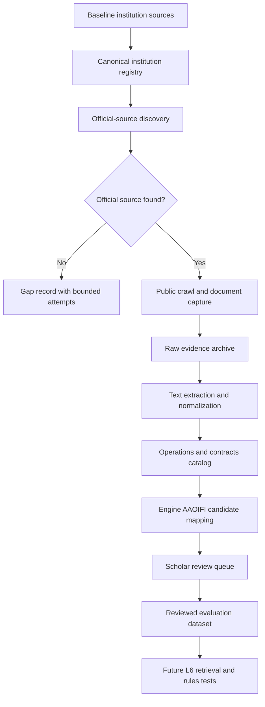

# L6 Egypt Financial Institutions Evidence Corpus Plan

**Status:** Planning and implementation-prep workstream
**Created:** 2026-05-20
**Scope:** Public-source discovery, scraping, extraction, and scholar-review dataset preparation for Egyptian financial institutions. This is not a live chatbot feature until the evidence, review, and answer-admissibility gates pass.

## Purpose

This workstream builds a public-source evidence corpus for Egyptian financial institutions and their financial operations.

It serves two controlled objectives:

1. Create supervised evaluation cases for Mushir, where the engine proposes AAOIFI mappings and initial compliance-risk labels, then a qualified Sharia scholar reviews the evidence, references, and decision.
2. Give the future L6 engine pre-knowledge about public institution operations, products, documents, and known contract terms, so user questions about a named bank, insurer, fund, finance company, or contract can start from documented evidence unless the user supplies newer or different details.

This corpus must remain evidence-first. Absence of public evidence is not compliance and is not non-compliance. It is `not_publicly_available`, `insufficient_public_evidence`, or another explicit gap state.

## Source Inputs

The initial baseline inputs are:

- `../Egypt Financial Institutions Refresh for Sharia Screening.md`
- `../Egypt_Financial_Institutions_COMPLETE.xlsx`
- `../Egyptian_Financial_Institutions_Complete_Presentation.pdf`

The workbook is a baseline, not final authority. Current observed workbook sheets:

| Sheet | Observed range | Planning use |
| --- | --- | --- |
| `Summary` | `A1:E100` | Baseline overview |
| `01_CBE_Banks` | `A1:E100` | Bank seed list to revalidate against CBE |
| `02_Capital_Market` | `A1:E798` | Capital-market seed list to revalidate and segment |
| `03_Insurance` | `A1:E997` | Insurance seed list to revalidate and split by entity type |
| `04_NonBank_Financial` | `A1:E326` | Non-bank finance seed list to revalidate against FRA |

Production use requires live regulator revalidation before broad crawling.

## Non-Fatwa Boundary

The scraper does not decide Sharia compliance.

The pipeline separates:

- public facts extracted from documents;
- engine-proposed operation classification and AAOIFI mapping;
- engine-proposed initial compliance-risk label;
- scholar-reviewed judgment and correction;
- final gold-case/evaluation status.

Only scholar-reviewed records can become supervised ground truth. Unreviewed records may support retrieval and analyst review, but must not be presented as authoritative compliance status.

## Institution Universe

The registry must cover at least:

| Sector | Initial authority path | High-value documents |
| --- | --- | --- |
| CBE banks | CBE registered/operating bank lists and CBE publications | tariffs, account terms, financing terms, credit/debit card terms, annual reports, Sharia board reports where available |
| Payment services | CBE rules, PSP/PSO pages, IPN/mobile wallet pages, entity approvals | payment limits, fees, terms, wallet agreements, merchant terms |
| Capital-market institutions | FRA registration portals, EGX/MCSD where relevant | brokerage terms, margin terms, custody terms, fund documents, prospectuses, sukuk memoranda |
| Insurance and reinsurance | FRA insurance registers | policy wording, takaful terms, surplus, qard, operator fee, investment policy |
| Non-bank finance | FRA financing registers and activity filters | consumer finance contracts, mortgage terms, leasing contracts, factoring contracts, microfinance agreements |
| Islamic funds and sukuk | FRA Islamic-funds/prospectus pages and issuer pages | prospectuses, information memoranda, Sharia supervision, purification, custody, subscription/redemption fees |
| Regulator model contracts | FRA model-contract decree pages and downloadable PDFs | model consumer-finance, financial-lease, factoring, and other mandatory templates |

## Target Architecture

## Evidence Authority Hierarchy

Use sources in this order:

1. Regulator register or official regulator publication.
2. Official institution website linked from, or strongly matched to, regulator evidence.
3. Official downloadable documents from the institution or regulator.
4. Official public disclosures, annual reports, prospectuses, rulebooks, or exchange/depository filings.
5. Search results and third-party pages only as discovery aids, not compliance evidence, until confirmed by official or regulator-hosted material.

No inferred domains, guessed subsidiaries, copied search snippets, or model-created facts may enter the evidence dataset.

## Bounded Discovery Protocol

For every institution, the discovery stage must record attempts and stop conditions.

Minimum attempt budget before marking a gap:

- up to 3 regulator-source checks;
- up to 5 web search queries using English name, Arabic name when available, legal suffix variants, and sector terms;
- up to 3 official website candidates evaluated for domain ownership, brand match, contact/address match, or regulator linkage;
- up to 2 reachability retries for transient failures;
- up to 2 alternate public-document source attempts, such as regulator PDFs, annual reports, prospectus pages, or exchange filings.

After the budget is exhausted, write a gap record. Do not keep searching until a model or scraper guesses an answer.

Allowed institution discovery statuses:

- `verified`
- `official_site_not_found`
- `site_unreachable`
- `blocked_by_security`
- `requires_login`
- `document_not_public`
- `insufficient_public_data`
- `manual_review_required`
- `inactive_or_superseded`

## Scraping Ethics And Anti-Bot Controls

The crawler must:

- respect robots.txt, published site terms, and rate limits;
- identify itself through a configured user agent where appropriate;
- use conservative per-domain concurrency and backoff;
- stop at login walls, CAPTCHA, paywalls, access-denied pages, or explicit security controls;
- classify blocked content as `blocked_by_security`, `requires_login`, or `document_not_public`;
- avoid CAPTCHA bypass, credential stuffing, hidden API abuse, session evasion, or security-control circumvention.

Security barriers are valid evidence about public availability. They should be logged and surfaced for manual review, not bypassed.

## Data Boundaries

Keep generated scrape output out of normal source control unless it is a tiny fixture.

Recommended boundaries:

| Area | Purpose | Git policy |
| --- | --- | --- |
| `data/source_registry/` | Small tracked registry seed metadata, categories, regulator-source config | tracked |
| `data/fixtures/l6_scrape/` | Tiny HTML/PDF/text fixtures for tests | tracked |
| `artifacts/l6_scrape/` | Runtime raw pages, PDFs, extracted text, crawl logs, errors | ignored except README |
| `src/acquisition/` | Existing acquisition primitives; future implementation can add `egypt_financial/` modules here | code tracked after tests |
| `src/governance/` | Existing source catalog, concept map, router seed, and chunk metadata primitives | code tracked |
| `tests/` | Unit, fixture, and integration tests for registry, discovery, crawl limits, extraction, and dataset building | tracked |

## Core Schemas

### Institution Registry

Each institution row should include:

- `institution_id`
- `name_en`
- `name_ar`
- `sector`
- `subsector`
- `regulator`
- `license_status`
- `registry_source_url`
- `registry_source_date`
- `official_website`
- `website_confidence`
- `discovery_status`
- `discovery_attempt_count`
- `last_checked_at`
- `gap_reason`
- `review_status`

### Document Artifact

Each public artifact should include:

- `artifact_id`
- `institution_id`
- `source_url`
- `source_rank`
- `document_type`
- `title`
- `language`
- `retrieved_at`
- `http_status`
- `content_type`
- `content_hash`
- `raw_path`
- `text_path`
- `extraction_status`
- `page_count`
- `citation_anchor_strategy`
- `access_status`

Document types should include `tariff_sheet`, `terms_and_conditions`, `contract`, `model_contract`, `prospectus`, `annual_report`, `fund_document`, `policy_wording`, `product_page`, `rulebook`, `disclosure`, and `unknown`.

### Operation Catalog

Each extracted operation should include:

- `operation_id`
- `institution_id`
- `artifact_id`
- `operation_name`
- `operation_family`
- `contract_family`
- `public_claims`
- `fees_and_charges`
- `payment_terms`
- `late_payment_terms`
- `penalty_beneficiary`
- `collateral_or_guarantee`
- `insurance_or_takaful_link`
- `ownership_or_asset_flow`
- `sharia_claim`
- `evidence_spans`
- `extraction_confidence`
- `needs_manual_review`

### Scholar Review Dataset

Each review item should include:

- `review_item_id`
- `operation_id`
- `engine_candidate_status`
- `engine_candidate_aaoifi_references`
- `engine_rationale_summary`
- `evidence_span_ids`
- `reviewer_status`
- `reviewer_decision`
- `reviewer_aaoifi_references`
- `reviewer_rationale`
- `correction_type`
- `accepted_as_gold_case`
- `reviewed_at`

Reviewer outcomes should be constrained to:

- `compliant`
- `non_compliant`
- `conditional`
- `insufficient_evidence`
- `not_applicable`
- `needs_more_documents`

## Data Quality Gates

Records cannot be promoted from raw capture to the operations catalog unless:

- the source URL or file provenance is retained;
- the content hash is stored;
- the document type is classified or explicitly `unknown`;
- the extraction status is recorded;
- language is detected;
- duplicates are collapsed or linked;
- evidence spans are preserved;
- missing contracts are represented as `not_publicly_available` rather than inferred;
- access blocks are explicit;
- every machine-proposed AAOIFI mapping cites source evidence and names uncertainty.

## Pre-Knowledge Runtime Rule

Institution operation knowledge can help Mushir answer future questions, but it is subordinate to the user question.

If the user provides details that conflict with stored institution data, the system must:

- treat user-supplied facts as the current scenario facts;
- disclose that stored public data may be outdated or incomplete;
- ask a clarification when the conflict affects compliance;
- avoid using stale institution metadata as final authority.

## Metrics

Track at minimum:

- institution coverage percentage by sector;
- official-site verification rate;
- artifact capture success rate;
- contract/model-contract availability rate;
- blocked/unavailable rate;
- parser failure and OCR-low-confidence rate;
- duplicate document rate;
- operation extraction coverage;
- citation-anchor completeness;
- engine-versus-scholar disagreement rate;
- scholar-review completion rate;
- accepted gold-case count.

## Implementation Slices

1. Normalize the institution universe from the refresh doc, workbook, and presentation into a canonical registry seed.
2. Implement registry validation and source-category config.
3. Implement official website discovery with bounded attempts, provenance, and stop reasons.
4. Pilot public crawling across 5-10 mixed institutions and one intentionally hard missing-source case.
5. Capture raw HTML/PDF/XLS/DOC artifacts with hashes, timestamps, access statuses, and conservative rate limits.
6. Extract text and classify documents into tariffs, contracts, prospectuses, model contracts, annual reports, policy wordings, and terms.
7. Build the operations catalog with evidence spans and explicit gap records.
8. Generate engine-proposed AAOIFI mappings and initial risk labels as review candidates only.
9. Build scholar-review exports and correction capture.
10. Convert accepted scholar corrections into evaluation gold cases.
11. Only after pilot gates pass, scale to the full registry.

## Pilot Gate

Before a full crawl, run a pilot that covers:

- one CBE bank;
- one Islamic bank;
- one payment-service or wallet-related source;
- one insurer or takaful provider;
- one leasing, mortgage, or consumer-finance company;
- one investment fund or sukuk/prospectus source;
- one regulator model-contract source;
- one institution where no official details are found.

The pilot passes only if the system proves discovery, crawl limits, blocked-site classification, raw capture, extraction, deduplication, gap marking, operations extraction, and scholar-review export.

## Non-Goals

- Do not bypass security controls or scrape private/gated material.
- Do not infer contracts from marketing pages.
- Do not treat machine-proposed Sharia status as ground truth.
- Do not load unreviewed institution labels into user-facing compliance conclusions.
- Do not run broad live generation batches against `openrouter/free`.
- Do not call this complete because entity names were collected; contract-level evidence and review gates are the value.
