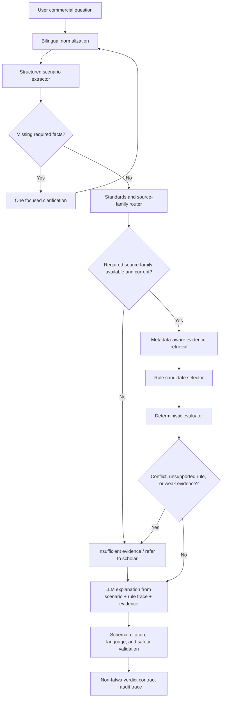

# L6 Rules-First Sharia Commercial Evaluator Plan

**Status:** Future post-L5 direction
**Originally created:** 2026-05-18
**Reformulated:** 2026-05-19 after BMAD project-logic rethink
**Scope:** Planning only. Do not implement until L5 trust gates, source catalog, and source acquisition decisions are complete.

## Purpose

L6 expands Mushir beyond the current AAOIFI evidence-backed assistant into a non-binding commercial-process assessment workflow.

It must not become an autonomous fatwa engine. Its purpose is to:

- extract structured transaction facts;
- classify question type and contract family;
- route to the right source family;
- retrieve current and citable evidence;
- run explicit rule checks where rules exist;
- ask clarifying questions when facts or source support are missing;
- explain the result with citations and limitations;
- escalate uncertain or high-risk scenarios to qualified human review.

## Planning Correction

The earlier "RAG over FAS" framing is too weak for L6. FAS is valuable for accounting treatment, recognition, measurement, presentation, disclosure, Islamic windows, investment agency, sukuk reporting, ijarah accounting, and similar topics. But permissibility, contract validity, prohibited elements, and halal/haram questions require Shariah-standard evidence and explicit rule checks.

Therefore L6 is:

> source catalog + concept map + scenario schema + source-family routing + evidence retrieval + executable rules + citation-gated explanation.

It is not:

> bigger prompts over more PDFs.

The 2026-05-19 deep research report adds useful accounting-standard router seeds and supersession seeds. L6 may use these for accounting support and standards routing, but it must not use FAS routes as permissibility authority. Any product-to-standard route or supersession edge remains candidate data until official catalog verification passes.

## Pre-Implementation Gates

L6 work must not start until these are true:

1. L5 release-readiness gates are green.
2. The active source catalog exists and covers all answer-supporting corpus files.
3. Shariah Standards acquisition and licensing/access decisions are verified.
4. Source currentness and supersession handling are defined.
5. First-release accounting router and supersession seed records are either catalog-verified or explicitly marked unavailable for authority.
6. Bilingual concept map exists for the first-wave domain.
7. Evaluation cases exist for answer, clarify, refuse, wrong-standard, superseded-source, and source-gap behavior.
8. A feedback/admin review workflow exists for reviewer corrections.
9. A human-review policy exists for high-impact or uncertain cases.
10. Any Egyptian institution operation pre-knowledge has source provenance, bounded discovery records, and scholar-review status before it can become supervised evaluation truth.

## Target Architecture



## Required Components

### 1. Source Catalog

The catalog must model authority before ingestion.

Minimum fields:

- `source_id`
- `source_family`
- `standard_number`
- `title_en`
- `title_ar`
- `official_url`
- `language`
- `publication_or_effective_date`
- `acquired_at`
- `extraction_method`
- `supersedes`
- `superseded_by`
- `is_current`
- `review_status`
- `source_confidence`

L6 cannot use unverified source records for permissibility answers.

Relationship edges should distinguish `supersedes`, `amends`, `replaces`, `clarifies`, and `contextualizes` when reviewers can verify the relationship. The deep research report's FAS supersession seed graph should be represented as candidate records first, not embedded in prompts.

### 2. Financial Concept Map

The concept map links messy user language to canonical finance concepts.

It should include:

- canonical concept IDs;
- English labels;
- Arabic labels;
- transliterations;
- colloquial variants;
- common misspellings;
- source-family routes;
- candidate standards;
- required facts;
- ambiguity warnings;
- expected clarification questions;
- eval cases.

This map should replace scattered hard-coded term logic over time.

### 3. Transaction Scenario Schema

The scenario object should include:

```json
{
  "question_type": "permissibility | accounting | governance | definition | standards_routing | comparison | unknown",
  "contract_family": "murabaha | ijarah | salam | istisna | tawarruq | qard | wakala | sukuk | musharaka | mudaraba | unknown",
  "parties": [],
  "asset": null,
  "cash_flows": [],
  "asset_flows": [],
  "ownership_sequence": null,
  "possession_sequence": null,
  "risk_bearing": null,
  "profit_basis": null,
  "payment_terms": null,
  "late_payment_terms": null,
  "penalty_beneficiary": null,
  "agency_roles": [],
  "guarantees": [],
  "collateral": [],
  "jurisdiction": null,
  "madhhab_or_board_context": null,
  "missing_facts": [],
  "uncertainties": []
}
```

The extractor may use deterministic logic, schema-constrained LLM extraction, or both. Live LLM extraction must be testable with fixtures and must not be required for every unit test.

### 4. Standards Router

The router decides source family before retrieval.

| Scenario | Primary route | Secondary route |
|---|---|---|
| Murabaha accounting | FAS after official standard verification | Shariah Standard for permissibility subquestions |
| Murabaha permissibility | Shariah Standard after official verification | FAS for accounting support only |
| Ijarah accounting | FAS after official standard verification | Shariah Standard for validity questions |
| Ijarah permissibility | Shariah Standard after official verification | FAS for accounting support only |
| Qard / interest / riba | Shariah Standard and approved reviewed sources | FAS only for accounting presentation where relevant |
| Wakala / investment agency | Shariah Standard for agency validity, FAS for accounting | Governance where institutional controls matter |
| Sukuk / shares | Shariah Standard plus screening rules | FAS for investment/reporting treatment |
| Islamic windows | Shariah Standard and governance where available | FAS for reporting and disclosure |

If the required source family is missing, the answer is not admissible.

Accounting support router seed, pending catalog verification:

| Operation or product family | Candidate FAS route | L6 boundary |
|---|---|---|
| Murabaha / deferred payment sale | FAS 28 | Accounting support only unless Shariah-standard evidence also exists |
| Salam | FAS 7, FAS 52 | Accounting support; clarify validity/permissibility intent |
| Istisna | FAS 10, FAS 52 | Accounting support; clarify construction/manufacturing facts |
| Ijarah / leasing | FAS 32 | Accounting support; Shariah route needed for validity |
| Mudaraba | FAS 3 | Accounting support; rules require Shariah source route |
| Musharaka | FAS 4, FAS 51 | Accounting support; clarify partnership structure |
| Wakala bi al-Istithmar | FAS 31 | Accounting support; clarify agency mandate |
| Zakah | FAS 9, FAS 39 | Accounting/calculation support; obligation questions need proper source route |
| Takaful | FAS 42, FAS 43 | Accounting support; distinguish operator and participant fund context |
| Sukuk, shares, and similar instruments | FAS 33, FAS 34 | Accounting/reporting support; screening/permissibility needs Shariah evidence |

### 5. Executable Rule Layer

L6 should not rely on free-form LLM reasoning for supported domains.

Candidate approaches:

- Python decision tables for MVP simplicity.
- DMN-style tables for reviewer-friendly rule maintenance.
- OPA/Rego for policy-oriented checks.
- Catala/OpenFisca-style formal rules for future high-assurance domains.

Rule evaluation must return:

- matched rules;
- source IDs;
- facts used;
- required facts;
- missing facts;
- pass/fail/unknown outcome;
- conflict flags;
- human-review flags.

### 6. Evidence Bundle

The evidence bundle should include:

- retrieved chunks;
- source catalog records;
- source-family route;
- currentness status;
- supersession status;
- section lineage;
- citation anchors;
- retrieval scores;
- reranking rationale;
- source gaps.

The LLM receives the evidence bundle and rule trace for explanation only.

For traceability, L6 evidence should retain parent/child chunk lineage, retrieval run ID, answer ID, citation IDs, and feedback links so later reviewer corrections can become gold cases.

### 7. Verdict Contract

L6 should move fatwa-adjacent outputs away from broad runtime statuses and into non-binding assessment statuses:

- `likely_permissible`
- `likely_impermissible`
- `conditionally_permissible`
- `requires_clarification`
- `insufficient_evidence`
- `refer_to_scholar`

Every verdict must include:

- confidence;
- citations;
- standards used;
- rule path;
- facts assumed;
- missing facts;
- limitations;
- human-review flag.

## First-Wave Domains

Do not attempt all commercial processes at once. Recommended order:

1. Murabaha / deferred sale / installment purchase.
2. Late-payment penalties and default clauses.
3. Ijarah / lease and lease-to-own structures.
4. Qard / loan / interest-bearing finance detection.
5. Wakala / investment agency.

Each domain requires:

- source mapping;
- concept-map entries;
- scenario schema fields;
- routing map;
- rule table;
- gold cases;
- red-line refusals;
- clarification questions;
- human-review triggers.

## Egypt Institution Operations Corpus

The Egyptian financial institutions scrape is a supporting data-acquisition workstream for L6, not the L6 evaluator itself. Its detailed plan is `L6-EGYPT-FINANCIAL-INSTITUTIONS-EVIDENCE-CORPUS-PLAN.md`.

The corpus should collect public evidence about institution products and operations from regulator records, official institution sites, tariffs, contracts, model contracts, prospectuses, annual reports, fund documents, sukuk documents, policy wordings, and rulebooks.

This data can support L6 in two ways:

- supervised evaluation: the engine proposes AAOIFI mappings and initial risk labels, then a Sharia scholar accepts, corrects, or rejects them;
- institution-aware retrieval: future answers about a named institution can retrieve documented public product details before asking for user-specific facts.

Hard boundary:

- machine-proposed labels are not ground truth;
- unreviewed institution data is not a compliance verdict;
- no-public-detail findings must be stored as explicit gaps;
- user-supplied details override stored institution assumptions when answering.

## Quality Gates

L6 cannot be marked ready without:

- source-family routing accuracy;
- expected-standard hit rate;
- bilingual and mixed-language recall;
- colloquial Arabic handling;
- superseded-source rejection;
- fact extraction accuracy;
- clarification precision and recall;
- rule trace correctness;
- citation support for every material claim;
- contradiction and source-gap handling;
- prompt-injection resistance;
- human-review escalation for high-impact cases.
- feedback capture and correction closure for disputed or unsafe outputs.

## Non-Goals

- Do not claim Mushir issues fatwas.
- Do not answer permissibility questions from FAS-only evidence.
- Do not claim all commercial operations are supported.
- Do not store or expose raw chain-of-thought.
- Do not let the LLM invent verdicts before source, scenario, rule, and evidence gates.
- Do not run bulk live generation against free OpenRouter routes.

## Implementation Entry Checklist

Before coding the first L6 domain, create:

1. Source catalog records for required standards.
2. Concept-map entries for the domain.
3. Scenario schema extension.
4. Source-family route.
5. Rule table.
6. Gold evaluation matrix.
7. Red-line refusal list.
8. Feedback/admin review workflow.
9. Human-review criteria.
10. Fixture-backed tests.
11. Small live smoke plan.
