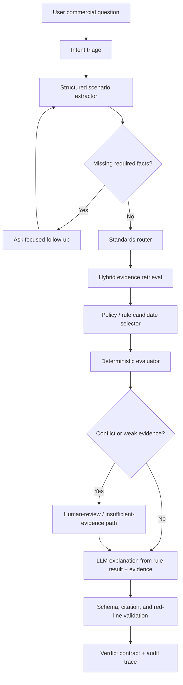

# L6 Rules-First Sharia Commercial Evaluator Plan

**Status:** Proposed post-L5 direction
**Created:** 2026-05-18
**Primary input:** `docs/deep-research-report.md`
**Scope:** Planning only; do not implement until L5 trust gates and source acquisition decisions are complete.

## Purpose

L6 moves Mushir from an AAOIFI-grounded RAG chatbot toward a structured Sharia commercial-process evaluator. The goal is not to create an autonomous fatwa engine. The goal is to produce auditable, non-binding assessments that extract transaction facts, route to the right standards, run explicit rule checks where available, retrieve supporting evidence, and explain the result with citations and uncertainty.

The report's strongest finding is that no mature open-source project currently combines authoritative AAOIFI retrieval, bilingual Arabic/English evidence handling, executable rule evaluation, and safe Sharia-style verdict generation. The planning implication is compositional: use proven building blocks by responsibility instead of looking for one monolithic Islamic-finance engine.

## Planning Critique From The Research

Current planning language is too FAS/RAG-centric for broad halal/haram commercial-process evaluation. FAS material is still useful, especially for accounting, reporting, disclosure, Islamic windows, investment agency, sukuk, and ijarah. But permissibility questions require a Shari'ah-standards-first route. The system must distinguish:

- **Permissibility / halal questions:** prioritize AAOIFI Shari'ah Standards and scholar-reviewed Sharia sources.
- **Accounting / recognition / disclosure questions:** prioritize FAS and related governance/accounting standards.
- **Institutional structure questions:** combine FAS, governance, Shari'ah standards, and local/jurisdiction overlays.

The report also criticizes pure "LLM over retrieved PDFs" as insufficient. L6 should make the LLM the final explainer, not the primary judge.

## Critique Of The Report Itself

Use the report as a planning input, not as runtime authority. Its research direction is strong, but several items must be verified before implementation:

- Some repository metadata, release dates, star counts, and license notes can drift quickly and must be refreshed before dependency decisions.
- The report's citation markers are not reusable project citations; official URLs, commit links, release pages, and package docs need to be captured directly in implementation tickets.
- AAOIFI source-family claims, standard numbers, supersession relationships, and official language availability must be verified from official AAOIFI publications before they become source-catalog facts.
- Libraries such as OpenFisca, Catala, Blawx, OPA/Rego, DMN engines, LlamaIndex, Haystack, RAGAS, TruLens, and Guardrails should be selected by a small spike and license/deployment review rather than adopted wholesale.
- The report supports widening the product goal, but it does not justify claiming broad "all commercial processes" coverage. Each domain still needs source mapping, rules, fixtures, and reviewer approval.

## Target Architecture



## Required New Components

### 1. Source Catalog And Versioning

The source catalog must model AAOIFI source families explicitly:

- `source_family`: `sharia_standard`, `fas`, `governance`, `ethics`, `auditing`, `fatwa`, `local_overlay`
- `standard_no`
- `title_ar`, `title_en`
- `official_url`
- `language`
- `effective_date`
- `supersedes`
- `superseded_by`
- `is_current`
- `source_confidence`
- `review_status`

The report notes that AAOIFI official pages expose separate Shari'ah standards and accounting/governance publications, and that some FAS items supersede earlier standards. Implementation must verify these claims from official AAOIFI sources before treating them as runtime facts.

### 2. Transaction Scenario Schema

Add a structured case object before retrieval:

```json
{
  "question_type": "permissibility | accounting | governance | explanation | unknown",
  "contract_family": "murabaha | ijarah | salam | istisna | tawarruq | qard | wakala | sukuk | musharaka | mudaraba | unknown",
  "parties": [],
  "asset": null,
  "cash_flows": [],
  "asset_flows": [],
  "ownership_sequence": null,
  "possession_sequence": null,
  "risk_bearing": null,
  "profit_basis": null,
  "payment_terms": null,
  "late_payment_terms": null,
  "penalty_beneficiary": null,
  "agency_roles": [],
  "guarantees": [],
  "collateral": [],
  "jurisdiction": null,
  "madhhab_or_board_context": null,
  "missing_facts": [],
  "uncertainties": []
}
```

The extractor may use a schema-first LLM library such as Instructor or Outlines, but its output must be validated and testable without live model calls.

### 3. Standards Router

The router decides which source families and standard IDs to search before generation. First-wave routing targets:

| Scenario | Primary route | Secondary route |
|---|---|---|
| Murabaha / deferred sale permissibility | Shari'ah Standards, especially the relevant Murabaha standard after official verification | FAS 28 for accounting/reporting only |
| Tawarruq / monetization | Shari'ah Standards for Tawarruq after official verification | Do not treat FAS 28 as the primary permissibility route |
| Ijarah | Shari'ah Standards for Ijarah | FAS 32 for accounting/reporting |
| Investment agency / wakala | Shari'ah Standards for agency | FAS 31 for accounting/reporting |
| Sukuk / shares | Shari'ah Standards plus screening rules | FAS 33 for accounting/reporting |
| Islamic windows / conventional bank products | Shari'ah Standards plus governance/accounting routes | FAS 18 and FAS 40 after official verification |

### 4. Executable Rule Layer

L6 should evaluate known patterns through explicit rules rather than free-form model reasoning.

Recommended first decision:

- **Default MVP rule engine:** OPA/Rego or a small Python decision-table layer.
- **Scholar/business-reviewable option:** GoRules/DMN-style decision tables.
- **High-assurance future option:** Catala or OpenFisca-style rules-as-code for a smaller set of formalized clauses.

The rule layer must return:

- matched rules
- required facts
- missing facts
- pass/fail/unknown outcomes
- source IDs that justify each rule
- conflict flags
- human-review flags

### 5. Evidence Bundle

RAG becomes an evidence provider. It should retrieve:

- clause-level evidence for final citations
- section-level context for interpretation
- source lineage and supersession metadata
- similar canonical Q&A cases when available
- source family and question-type filters

Hybrid retrieval is required for broad commercial questions: dense multilingual retrieval plus lexical search over standard numbers, Arabic terms, contract names, and clause identifiers.

### 6. Verdict Contract

Replace broad `COMPLIANT` / `NON_COMPLIANT` language for fatwa-adjacent use with safer statuses:

- `likely_permissible`
- `likely_impermissible`
- `conditionally_permissible`
- `requires_clarification`
- `insufficient_evidence`
- `refer_to_scholar`

Every answer must remain non-binding. User-facing language must say the result is based on provided facts and cited sources, not a formal fatwa.

## First-Wave Domains

Do not attempt "all commercial processes" in one release. Start with:

1. Murabaha / deferred sale / installment purchase
2. Late-payment penalties and default clauses
3. Ijarah / lease and lease-to-own structures
4. Qard / loan / interest-bearing finance detection
5. Wakala / investment agency

Each domain needs a schema extension, routing map, rule table, gold cases, evidence requirements, and red-line refusal behavior before it is exposed as supported.

## Evaluation Gates

L6 cannot be called ready without these gates:

- **Scope gate:** classify query as supported, partially supported, or unsupported.
- **Fact gate:** block or clarify when required scenario facts are missing.
- **Source gate:** require current, relevant, official or reviewed source evidence.
- **Rule trace gate:** show which rule checks fired and which facts triggered them.
- **Citation-support gate:** every decisive claim must be backed by retrieved evidence.
- **Contradiction gate:** escalate when sources, rules, or extracted facts disagree.
- **Language gate:** Arabic input must preserve Arabic output unless the user requests otherwise.
- **Adversarial gate:** resist prompt injection, forced halal labels, disguised riba, false source requests, and emotional pressure.
- **Human-review gate:** refer large, high-impact, disputed, jurisdiction-specific, or liability-heavy cases to a qualified scholar or compliance reviewer.

## Planning Deliverables Before Implementation

1. Official-source acquisition plan for Shari'ah Standards, FAS, governance, ethics, auditing, and any accepted fatwa sources.
2. Source catalog schema and versioning strategy.
3. Transaction scenario schema and field glossary.
4. Standards router design.
5. Rule-engine spike comparing OPA/Rego, Python decision tables, GoRules/DMN, and Catala/OpenFisca for one Murabaha route.
6. Gold evaluation matrix for the five first-wave domains.
7. Human-review and red-line output policy.

## Non-Goals

- Do not claim Mushir issues binding fatwas.
- Do not claim all commercial operations are supported before each domain has rules, sources, and evals.
- Do not use FAS-only retrieval to answer permissibility questions.
- Do not store or expose raw chain-of-thought as the decision artifact.
- Do not allow the LLM to invent the verdict before rules and evidence are evaluated.
