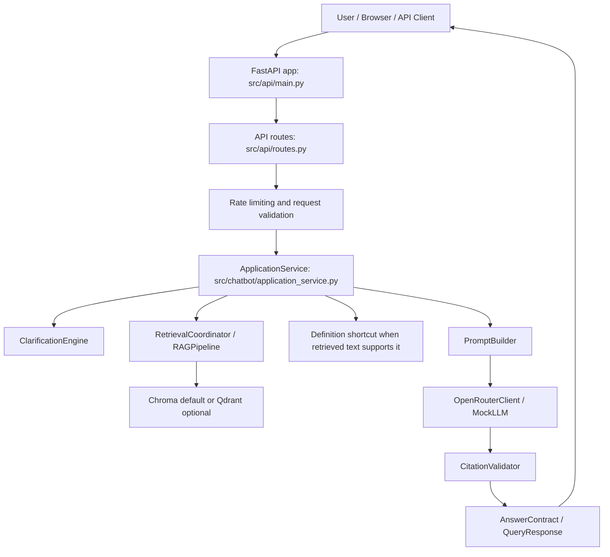

# Mushir AI Agent Project Handoff

Last updated: 2026-05-23  
Repository: `D:\AI Projects\Freelance\Sabry\Mushir-Sharia-Bot`  
Primary audience: AI coding agents, reviewers, and implementation planners  
Status: current-state consolidation of plan, implementation, safety rules, and next work

## 1. One-Screen Truth

Mushir is a source-governed AAOIFI standards assistant for Islamic finance research. It is not a fatwa engine and must not issue binding Sharia rulings, legal advice, accounting advice, or financial advice.

Current runtime:

- FastAPI application with browser chat at `/chat`.
- REST API at `/api/v1/query`.
- SSE API at `/api/v1/query/stream`.
- Health/readiness endpoints at `/health` and `/ready`.
- Multilingual AAOIFI retrieval using Chroma by default.
- OpenRouter generation through an OpenAI-compatible client.
- Citation validation against retrieved chunks.
- One-question clarification behavior for under-specified user questions.
- Fail-closed insufficient-data and refusal behavior.
- Foundational post-L5/L6 commercial-assessment scaffold, not a complete evaluator.

Current planning split:

- L0-L4: historical implementation baseline and earlier hardening tracks.
- L5: active quality, operations, release readiness, retrieval quality, live smoke, documentation, and deployment hygiene gate.
- L6: proposed rules-first Sharia commercial-process evaluator and Egypt institution evidence-corpus workstream. Some scaffolding exists, but full L6 is not done.

Main agent rule:

> Ground every answer, edit, and plan in the current codebase and current docs. Do not use stale roadmap language as authority when `project-context.md`, this handoff, or current code says otherwise.

## 2. Product Boundary

Mushir may:

- answer English, Arabic, and mixed-language questions from retrieved AAOIFI excerpts;
- ask exactly one focused follow-up question when essential facts are missing;
- answer simple definitions when retrieved excerpts directly support the definition;
- summarize source-backed accounting or standards information with citations;
- refuse binding or out-of-scope requests;
- return `INSUFFICIENT_DATA` when evidence is weak.

Mushir must not:

- answer from general model knowledge when sources are missing;
- invent standards, sections, page numbers, citations, or scholarly conclusions;
- expose hidden reasoning, chain-of-thought, stack traces, provider internals, keys, or credentials;
- claim to decide halal/haram status without admissible Sharia-standard evidence;
- market itself as a scholar, mufti, legal adviser, accountant, or financial adviser;
- use research-derived seeds as authority before review and catalog verification.

## 3. Repository Reality On 2026-05-23

Important current worktree condition:

- Many former root `docs/` and `.kiro/specs/sharia-compliance-chatbot/*.md` files are deleted in the git worktree.
- The equivalent working documentation set currently exists under `.planning/sharia-compliance-chatbot/docs/`.
- Do not revert those deletions unless the user explicitly asks. Treat them as user/workspace state.
- This file intentionally lives under `.planning/sharia-compliance-chatbot/docs/` to align with the current consolidated planning tree.

High-value current docs:

- `project-context.md`: most compact current truth for agents.
- `README.md`: public setup and status overview.
- `.planning/sharia-compliance-chatbot/docs/ai-project-brief.md`: detailed AI-agent brief before this consolidation.
- `.planning/sharia-compliance-chatbot/docs/project-documentation.md`: fuller technical docs.
- `.planning/sharia-compliance-chatbot/docs/client-plain-language-logic.md`: stakeholder explanation.
- `.planning/sharia-compliance-chatbot/docs/chatbot-architecture.md`: answer-generation architecture.
- `.planning/sharia-compliance-chatbot/docs/l5-production-readiness.md`: release/readiness runbook.
- `.planning/sharia-compliance-chatbot/next-level-plans/README.md`: historical and current roadmap index.
- `.planning/sharia-compliance-chatbot/next-level-plans/L5-QUALITY-OPS-RELEASE-READINESS-PLAN.md`: active L5 gate.
- `.planning/sharia-compliance-chatbot/next-level-plans/L6-RULES-FIRST-SHARIA-COMMERCIAL-EVALUATOR-PLAN.md`: L6 evaluator direction.
- `.planning/sharia-compliance-chatbot/next-level-plans/L6-EGYPT-FINANCIAL-INSTITUTIONS-EVIDENCE-CORPUS-PLAN.md`: L6 institution evidence corpus.

## 4. Runtime Architecture

Request flow:



Main components:

- `src/api/main.py`: FastAPI factory, middleware, CORS, static UI, health/readiness, metrics, dependency wiring.
- `src/api/routes.py`: sessions, query, streaming, response mapping, validation, safe error mapping, rate-limit headers.
- `src/api/schemas.py`: Pydantic request/response/event schemas.
- `src/chatbot/application_service.py`: central orchestration, clarification, retrieval, definition shortcut, LLM call, citation validation, cache, audit, safe fallback.
- `src/chatbot/clarification_engine.py`: one focused follow-up question when query facts are insufficient.
- `src/chatbot/retrieval_coordinator.py`: retrieval cache and skip logic.
- `src/rag/pipeline.py`: embedding and vector retrieval pipeline.
- `src/rag/query_preprocessor.py`: Arabic and multilingual query preprocessing.
- `src/rag/vector_store.py`: Chroma vector store.
- `src/rag/qdrant_store.py`: optional Qdrant vector store.
- `src/chatbot/prompt_builder.py`: AAOIFI-grounded system/user messages and citation requirements.
- `src/chatbot/llm_client.py`: OpenRouter and mock LLM clients with secret-safe error handling.
- `src/chatbot/citation_validator.py`: validates generated citations against retrieved chunks.
- `src/models/ruling.py`: answer/citation/compliance contract.
- `src/models/session.py`: session and message state.
- `src/storage/cache.py`: in-memory and optional Redis cache.
- `src/storage/audit_store.py`: null and Postgres audit stores.
- `src/observability/metrics.py`: lightweight metrics.

## 5. Safety And Answer Contract

Normal answer statuses include:

- `complete`: answer is supported by retrieved source excerpts and validated citations.
- `needs_clarification`: exactly one focused follow-up question is needed.
- `insufficient_data`: retrieved source material is not enough.
- safe refusal: request is outside scope, asks for binding fatwa/legal/financial advice, or cannot be answered safely.

Citation rules:

- Every substantive answer must have validated source-backed citations.
- Citations must be backed by retrieved chunks.
- Arabic citation patterns must remain tested.
- Citation format may include `[FAS-X]`, `[FAS-X Section Y]`, and Arabic variants.
- Never invent page/section/standard references.

Definition shortcut:

- Simple questions like "What is Murabaha?" may be answered directly from retrieved excerpts before LLM generation.
- The shortcut still requires citable retrieved evidence.
- The shortcut does not convert the answer into a transaction-level compliance ruling.

Clarification rule:

- Ask one focused question only when missing facts prevent safe routing or answer generation.
- Do not ask multi-question forms.
- Arabic definition questions should not be incorrectly forced into transaction clarification.

Fail-closed rule:

- When retrieval, citations, source family, or source currentness is weak, return insufficient data or a source-gap response.
- Do not fill gaps using general LLM knowledge.

## 6. Source Governance Direction

The 2026-05-19 planning rethink changed Mushir from a generic RAG bot into a controlled standards workflow:


Governance modules:

- `src/governance/source_catalog.py`: source records, currentness, review status, confidence, relationships, admissibility.
- `src/governance/chunk_metadata.py`: parent/child chunk metadata.
- `src/governance/concept_map.py`: bilingual concepts and terminology seed review states.
- `src/governance/router_seed.py`: source-family and route seed records.
- `src/governance/release_controls.py`: readiness gates, corpus/eval/release controls, L6 entry policy.
- `src/governance/institution_registry.py`: Egypt institution registry schemas and validation.
- `src/governance/institution_pipeline.py`: institution evidence pipeline contracts and quality checks.

Authority ladder:

1. Current, cataloged, reviewable primary standards and regulator/public official sources.
2. Structured metadata derived from those sources with traceability.
3. Machine-proposed labels or mappings, only as candidates.
4. Scholar-reviewed ground truth, when available.
5. General model knowledge: never admissible as answer authority.

## 7. Levels And Implementation History

### L0 Baseline

Goal:

- Build the original RAG proof of concept.

Implemented:

- Document models.
- Semantic chunking.
- Embeddings.
- Chroma vector storage.
- Basic retrieval and answer generation.
- CLI and setup scripts.
- Early architecture docs.

Historical files now archived under `_legacy/root-outline-docs/`:

- `_legacy/root-outline-docs/IMPLEMENTATION_SUMMARY.md`
- `_legacy/root-outline-docs/L0_ARCHITECTURE.md`
- `_legacy/root-outline-docs/L0_CHECKLIST.md`
- `_legacy/root-outline-docs/L0_COMPLETE.md`
- `_legacy/root-outline-docs/L0_README.md`
- `_legacy/root-outline-docs/L0_SETUP_GUIDE.md`
- `.planning/sharia-compliance-chatbot/next-level-plans/00-L0-IMPLEMENTATION-REVIEW.md`

Current interpretation:

- Useful history, not the current product contract.
- Gemini/OpenAI-era setup language may be stale; use OpenRouter and current env docs instead.

### L1 Core Answer Contract And Stabilization

Goal:

- Stabilize the core answer contract and clarify behavior.

Implemented themes:

- Application service orchestration.
- Injectable retrieval and LLM components.
- Focused clarification service.
- Prompt builder extraction.
- Contract-based answer handling.
- Tests around definition, clarification, and safe answer behavior.

Representative files:

- `src/chatbot/application_service.py`
- `src/chatbot/clarification_engine.py`
- `src/chatbot/prompt_builder.py`
- `src/chatbot/contracts.py`
- `tests/test_l1_contracts.py`
- `tests/test_clarification_engine.py`

### L2 API And Streaming

Goal:

- Expose the assistant through stable HTTP and browser surfaces.

Implemented:

- FastAPI app.
- `/api/v1/query`.
- `/api/v1/query/stream`.
- `/api/v1/sessions`.
- Browser chat UI.
- SSE event schema tests.
- Basic API and static UI tests.

Representative files:

- `src/api/main.py`
- `src/api/routes.py`
- `src/api/schemas.py`
- `src/static/index.html`
- `src/static/js/app.js`
- `src/static/js/sse-client.js`
- `src/static/js/renderer.js`
- `tests/test_api_l2.py`
- `tests/test_api_streaming.py`
- `tests/test_sse_schema.py`
- `tests/test_static_extraction.py`

### L3 Production Infrastructure

Goal:

- Add production-shaped persistence, sessions, deployment, and observability.

Implemented:

- Redis-compatible session manager.
- Redis-compatible rate limiter.
- Postgres audit store with null fallback.
- Docker and Docker Compose support.
- Readiness checks for runtime dependencies.
- Structured logging and metrics.
- Qdrant optional adapter.

Representative files:

- `src/chatbot/redis_session_manager.py`
- `src/api/redis_rate_limit.py`
- `src/storage/audit_store.py`
- `src/observability/metrics.py`
- `src/rag/qdrant_store.py`
- `Dockerfile`
- `docker-compose.yml`
- `tests/test_l3_infrastructure.py`
- `tests/test_l5_integration_adapters.py`

### L4 Compliance, Trust, Cache, And Ops

Goal:

- Harden compliance, release, caching, authentication, and operations.

Implemented:

- Citation quality improvements.
- Disclaimer policy hook.
- Auth token support.
- Safe cache behavior.
- CORS validation.
- Rate limiting.
- Secret-safe error handling.
- Input/prompt-injection validation.

Representative files:

- `src/security/cors_validator.py`
- `src/security/input_validator.py`
- `src/api/security.py`
- `src/api/error_handling.py`
- `src/api/rate_limit.py`
- `src/storage/cache.py`
- `tests/test_l4_features.py`
- `tests/test_security.py`
- `tests/test_rag_hardening.py`

### L5 Active Readiness Gate

Goal:

- Prove the runtime is ready for demo/release use through quality, operations, deployment hygiene, and live smoke evidence.

L5 tracks:

- Plan reconciliation.
- RAG quality gate.
- Arabic support gate.
- Citation trust gate.
- Runtime integration gate.
- End-to-end demo gate.
- Production readiness.
- Research-to-plan hygiene.

Representative files:

- `.planning/sharia-compliance-chatbot/next-level-plans/L5-QUALITY-OPS-RELEASE-READINESS-PLAN.md`
- `.planning/sharia-compliance-chatbot/docs/l5-production-readiness.md`
- `tests/test_l5_readiness.py`
- `tests/test_l5_integration_adapters.py`
- `scripts/test_space_query.py`
- `scripts/check_hf_space.py`
- `scripts/verify_deployment.py`

Current L5 rule:

- Local tests are not enough for public demo confidence.
- `/health` and `/ready` are necessary but not sufficient.
- A small live query smoke is required after deploy or retrieval-index changes.

### L6 Proposed Rules-First Evaluator

Goal:

- Move beyond generic answer generation into a source-family-aware, rules-first commercial-process assessment assistant.

Implemented scaffold:

- `src/models/commercial.py`
- `src/chatbot/commercial_assessment.py`
- scenario extraction;
- question type classification;
- contract family detection;
- route metadata;
- source family detection;
- placeholder rule traces;
- fail-closed source-gap behavior for late-payment/default permissibility questions when Sharia-standard evidence is absent.

Not implemented yet:

- full Sharia-standard acquisition;
- executable rules for all contract families;
- human-review workflow;
- structured verdict exposure as a stable public API;
- scholar-reviewed evaluation set;
- production-grade L6 quality gates.

L6 must remain described as proposed/foundational until those gates are complete.

## 8. L6 Egypt Institution Evidence Corpus

Purpose:

- Build a public-source evidence corpus for Egyptian financial institutions, products, operations, contracts, and review/evaluation rows.
- Support later L6 supervised evaluation and institution-aware retrieval.
- Keep machine labels separate from scholar-reviewed truth.

Institution universe:

- CBE banks.
- Payment service providers.
- Capital-market institutions.
- Insurance and takaful entities.
- Mortgage finance.
- Leasing.
- Consumer finance.
- Microfinance and SME finance.
- Fintech licensees.
- Islamic funds.
- Sukuk sources.
- FRA model contracts.

Evidence boundaries:

- Use official regulator and institution sources first.
- Respect robots.txt, rate limits, CAPTCHA, paywalls, login walls, and access controls.
- Do not bypass anti-bot controls.
- Do not infer websites, contracts, product details, or Sharia status when public evidence is missing.
- Record missing details explicitly.
- Candidate AAOIFI labels are machine proposals only until scholar review.

Implemented/supporting code:

- `src/acquisition/parsers.py`
- `src/acquisition/scraper.py`
- `src/acquisition/storage.py`
- `src/acquisition/validation.py`
- `src/governance/institution_registry.py`
- `src/governance/institution_pipeline.py`
- `scripts/run_l6_institution_pilot.py`
- `tests/test_institution_pipeline.py`
- `tests/test_l6_institution_pilot_script.py`

Current script capabilities:

- fixture pilot;
- full scrape gate;
- official registry completion;
- live regulator revalidation;
- live bank scrape;
- legacy sector scrape;
- gap-row and review-output generation;
- robots/access-block checks;
- scholar-review CSV guidance;
- CBE PDF registry parsing;
- FRA register parsing and pagination;
- artifact metadata and hash recording.

Current caveat:

- L6 scraping runtime artifacts belong under `data/runtime/artifacts/l6_scrape/`; curated research/review notes belong under `.planning/sharia-compliance-chatbot/docs/research/l6-egypt-institution-scrape/`. Treat them as evidence/review artifacts, not runtime answer authority.

## 9. Data And Indexing

Default corpus:

- `CORPUS_DIR=./data/aaoifi_md`
- Contains converted AAOIFI markdown files in English and Arabic.

Default vector index:

- `CHROMA_DIR=./chroma_db_multilingual`
- `VECTOR_DB_TYPE=chroma`
- `EMBED_MODEL=sentence-transformers/paraphrase-multilingual-mpnet-base-v2`

Arabic support:

- `REQUIRE_ARABIC_RETRIEVAL=true` by default.
- Do not silently serve Arabic queries with an English-only index.

Ingestion:

```powershell
.\.venv\Scripts\python.exe scripts\ingest.py --reset --languages en,ar
```

Corpus checks:

```powershell
.\.venv\Scripts\python.exe scripts\check_corpus.py
```

Qdrant optional path:

```powershell
.\.venv\Scripts\python.exe scripts\ingest_qdrant.py
```

Deployment index rule:

- Do not re-upload `chroma_db_multilingual` for UI-only changes.
- Use `scripts/deploy_huggingface_space.py --ui-only` for UI-only changes.
- Use `--skip-index` for app/runtime changes that do not alter retrieval data.
- Use the full deploy path only after rebuilding/changing the retrieval index.

## 10. Configuration And Secrets

Important environment variables:

- `OPENROUTER_API_KEY`: required for live answer generation.
- `OPENROUTER_MODEL`: model routed through OpenRouter; demo default is `openrouter/free`.
- `OPENROUTER_MAX_TOKENS`: output token cap.
- `CORPUS_DIR`: markdown corpus path.
- `EMBED_MODEL`: embedding model.
- `CHROMA_DIR`: local Chroma index path.
- `VECTOR_DB_TYPE`: `chroma` or `qdrant`.
- `REQUIRE_ARABIC_RETRIEVAL`: fail closed when Arabic retrieval support is absent.
- `REQUIRE_DISCLAIMER_ACK`: require `context.disclaimer_acknowledged=true` for API callers.
- `RAG_EVAL_MODE`: bypass response cache for retrieval evaluation.
- `CORS_ORIGINS`: must be explicit in production.
- `AUTH_TOKEN`: optional API protection.
- `AUDIT_DATABASE_URL` or `DATABASE_URL`: optional durable audit DB.
- `REDIS_URL`: optional Redis sessions/rate limits/cache.
- `QDRANT_URL`: optional Qdrant vector database.

Secret rules:

- Never paste real keys into prompts, logs, docs, commits, screenshots, or summaries.
- Use placeholders only.
- Existing `.env` may contain local secrets; do not print it.
- Keep stack traces and provider errors out of user-facing responses.

OpenRouter/free guardrail:

- `openrouter/free` is acceptable for demos, small live smoke tests, and controlled experiments.
- Do not run bulk generation matrices against it.
- For evaluation loops, use fake LLM fixtures, retrieval-only probes, and `RAG_EVAL_MODE=true`.
- Keep live query smoke checks small and spaced out.

## 11. API Surface

Primary endpoints:

- `GET /health`: process liveness.
- `GET /ready`: dependency and retrieval readiness.
- `GET /metrics`: lightweight metrics.
- `GET /chat`: browser chat UI.
- `POST /api/v1/query`: main query endpoint.
- `POST /api/v1/query/stream`: SSE query endpoint.
- `POST /api/v1/sessions`: create session.
- `GET /api/v1/sessions/{session_id}/history`: session history.
- `POST /api/v1/sessions/{session_id}/query`: session-scoped query.
- `GET /api/v1/compliance/disclaimer`: disclaimer text.

High-level `POST /api/v1/query` contract:

```json
{
  "query": "What is Murabaha?",
  "session_id": "optional-session-id",
  "context": {
    "disclaimer_acknowledged": true
  }
}
```

Expected response shape:

```json
{
  "answer": "source-grounded answer or clarification/refusal",
  "citations": [],
  "compliance_status": "complete | needs_clarification | insufficient_data",
  "confidence": 0.0,
  "reasoning_summary": "brief visible summary only",
  "request_id": "..."
}
```

SSE event families:

- started;
- retrieval;
- token;
- citation;
- done;
- error.

## 12. Browser UI

Static UI files:

- `src/static/index.html`
- `src/static/css/base.css`
- `src/static/css/chat.css`
- `src/static/css/components.css`
- `src/static/css/dark.css`
- `src/static/js/app.js`
- `src/static/js/renderer.js`
- `src/static/js/sse-client.js`
- `src/static/js/flyout.js`
- `src/static/js/storage.js`
- `src/static/js/shortcuts.js`

UI features:

- chat composer;
- REST/SSE interaction path;
- citations rendering;
- citation flyout;
- local message persistence;
- keyboard shortcuts;
- loading/error states;
- dark-mode styling;
- disclaimer presentation.

Browser-visible verification matters for UI changes. Use the in-app Browser or Playwright workflows when a UI change is made.

## 13. Testing Map

Core test groups:

- `tests/test_l1_contracts.py`: answer contract and core behavior.
- `tests/test_clarification_engine.py`: clarification logic.
- `tests/test_api_*.py`: API, query, schema, sessions, readiness, streaming, rate limits.
- `tests/test_sse_schema.py`: streaming schema.
- `tests/test_static_extraction.py`: static UI extraction.
- `tests/test_rag_pipeline.py`: retrieval pipeline.
- `tests/test_rag_hardening.py`: fail-closed retrieval and safety gates.
- `tests/test_ingest_bilingual.py`: bilingual ingestion.
- `tests/test_source_governance.py`: catalog and governance rules.
- `tests/test_release_controls.py`: L5/L6 release gates.
- `tests/test_commercial_assessment.py`: L6 commercial scaffold.
- `tests/test_institution_pipeline.py`: institution evidence pipeline.
- `tests/test_l6_institution_pilot_script.py`: L6 pilot script behavior.
- `tests/test_security.py`: input and safety controls.

Fast targeted gate:

```powershell
.\.venv\Scripts\python.exe -m pytest -m "unit or service or api" -q --timeout=60
```

Full local gate:

```powershell
.\.venv\Scripts\python.exe -m pytest -q --timeout=90
```

Bilingual answer smoke:

```powershell
.\.venv\Scripts\python.exe -m pytest tests\test_l1_contracts.py::test_application_service_answers_arabic_definition_with_validator_backed_citation tests\test_l1_contracts.py::test_application_service_expands_definition_retrieval_before_llm tests\test_clarification_engine.py::test_arabic_definition_question_skips_transaction_clarification -q
```

L6 institution pilot focused gate:

```powershell
.\.venv\Scripts\python.exe -m pytest tests\test_l6_institution_pilot_script.py -q
```

Playwright E2E:

```powershell
npm.cmd run test:e2e
```

Final docs hygiene:

```powershell
git diff --check
git status --short --branch
```

## 14. Local Run And Smoke

Run API locally:

```powershell
.\.venv\Scripts\python.exe -m uvicorn src.api.main:app --host 127.0.0.1 --port 8000
```

Smoke health/readiness:

```powershell
curl.exe http://127.0.0.1:8000/health
curl.exe http://127.0.0.1:8000/ready
```

Open browser chat:

```text
http://127.0.0.1:8000/chat
```

Smoke API:

```powershell
curl.exe -X POST http://127.0.0.1:8000/api/v1/query -H "Content-Type: application/json" -d "{\"query\":\"What is Murabaha?\",\"context\":{\"disclaimer_acknowledged\":true}}"
```

Live Space smoke:

```powershell
.\.venv\Scripts\python.exe scripts\test_space_query.py
```

HF readiness check:

```powershell
.\.venv\Scripts\python.exe scripts\check_hf_space.py
```

## 15. Deployment

Current public demo target:

- Hugging Face Spaces.
- Docker SDK.
- App port `7860` per README front matter.

Deployment scripts:

- `scripts/deploy_huggingface_space.py`: preferred current deploy helper with UI/index skip modes.
- `scripts/deploy_to_hf_space.py`: older deploy helper.
- `scripts/deploy_to_hf.py`: older/general deploy helper.
- `scripts/legacy/deploy_to_huggingface.bat`: archived Windows wrapper.

Deployment rules:

- Separate UI/app changes from retrieval-index changes.
- Do not upload a large Chroma index when it has not changed.
- Verify `/health`.
- Verify `/ready`.
- Verify at least one live `/api/v1/query` path.
- Verify Arabic behavior when Arabic retrieval or Arabic UI text changed.
- Keep secrets in Space secrets, never in repository files.

Important caution:

- A green `/health` only proves process liveness.
- A green `/ready` improves confidence but does not prove generation, routing, citation validation, or user-facing behavior.
- Query-path smoke is required for done.

## 16. Known Risk Areas

High-risk areas for edits:

- `src/chatbot/application_service.py`: central orchestration and fail-closed behavior.
- `src/chatbot/citation_validator.py`: citation admissibility.
- `src/chatbot/clarification_engine.py`: one-question clarification contract.
- `src/chatbot/commercial_assessment.py`: L6 source-family and source-gap logic.
- `src/rag/query_preprocessor.py`: Arabic retrieval behavior.
- `src/api/routes.py`: public error mapping and response contract.
- `src/config/settings.py`: production config and secret validation.
- `scripts/run_l6_institution_pilot.py`: large script with ethical scraping gates and many test-backed branches.
- `data/runtime/artifacts/l6_scrape/`: generated evidence artifacts; do not treat as stable code.
- `.planning/sharia-compliance-chatbot/docs/research/l6-egypt-institution-scrape/`: curated L6 scrape research and review notes.

Common failure modes:

- returning an answer without validated citations;
- asking clarification for a definition question;
- using FAS evidence for Sharia permissibility;
- silently serving Arabic queries with English-only retrieval;
- leaking provider error text or secrets;
- overloading OpenRouter free routes during evaluation;
- marking L6 as implemented when only scaffolding exists;
- treating scraped machine labels as scholar-reviewed labels.

## 17. Implementation Rules For Future Agents

Default workflow:

1. Read `project-context.md`.
2. Check `git status --short`.
3. Inspect the files directly related to the task.
4. Preserve unrelated user changes.
5. Make the smallest behavior-preserving edit that satisfies the request.
6. Add or update tests when behavior changes.
7. Run targeted tests first.
8. Run broader tests when risk is high.
9. For UI, verify in browser.
10. For deploy, verify live endpoints and query path.

Coding rules:

- Keep fail-closed behavior.
- Prefer explicit contracts over implicit string parsing.
- Do not introduce broad abstractions unless existing code demands them.
- Keep hidden reasoning out of outputs.
- Keep docs secret-safe.
- Use Windows-safe commands from this handoff.
- Use `apply_patch` for manual file edits.
- Avoid destructive git commands.

Sensitive-domain rule:

> In a Sharia, legal, accounting, or financial context, uncertainty must reduce capability, not expand it. If evidence is not admissible, Mushir should clarify, refuse, or return insufficient data.

## 18. Current Backlog Priority

Recommended next slices:

1. Keep `.planning/sharia-compliance-chatbot/` as the canonical documentation and planning tree.
2. Re-run L5 targeted gates after current L6 script/test changes are complete.
3. Refresh any docs that still point to deleted root `docs/` or `.kiro/specs/sharia-compliance-chatbot/` paths as active locations.
4. Finish review of `scripts/run_l6_institution_pilot.py` changes and its tests.
5. Keep L6 institution work bounded to official-source acquisition, gap marking, and scholar-review dataset preparation.
6. Do not expose full L6 evaluator claims until source acquisition, executable rule coverage, and QA gates exist.

## 19. Agent Start Prompt

Use this when starting a fresh AI-agent session:

```text
You are working in D:\AI Projects\Freelance\Sabry\Mushir-Sharia-Bot.

First read project-context.md and .planning/sharia-compliance-chatbot/docs/AI_AGENT_PROJECT_HANDOFF.md.

Treat Mushir as a source-governed AAOIFI standards assistant, not a fatwa engine. Preserve fail-closed behavior, citation validation, one-question clarification, Arabic retrieval support, secret-safe errors, and OpenRouter/free throttling guidance.

Current docs are under .planning/sharia-compliance-chatbot/docs/. Many root docs are deleted in the worktree; do not restore or revert them unless explicitly asked.

Before edits, run git status --short. For behavior changes, add or update tests and run targeted pytest with .\.venv\Scripts\python.exe. For UI changes, verify in browser. For deployment changes, verify /health, /ready, and a live query path.
```

## 20. Short Glossary

- AAOIFI: Accounting and Auditing Organization for Islamic Financial Institutions.
- FAS: Financial Accounting Standard. Useful for accounting/reporting, not enough by itself for all permissibility questions.
- Source family: category of evidence such as Sharia standards, FAS, governance, regulator, institution website, or derived artifact.
- Admissible source: a source that is current/reviewed enough for answer use under catalog rules.
- Machine-proposed label: a non-authoritative candidate classification needing review.
- Scholar-reviewed truth: human-reviewed label or evaluation row suitable for gold-set use.
- L5: current release-readiness and operations gate.
- L6: proposed rules-first commercial evaluator and Egypt institution evidence workstream.

