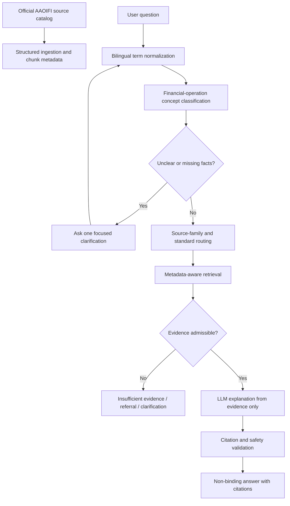

# Project Logic Rethink: Source-Governed AAOIFI Assistant

**Date:** 2026-05-19
**Mode:** BMAD party-mode planning review
**Scope:** Planning-only reformulation after comparing the desired product logic with current implementation.

## User Goal Restated

The desired app is a chatbot that can:

- understand AAOIFI standards acquired as text files;
- chunk them into a vector database;
- use a RAG pipeline for evidence retrieval;
- handle English, Arabic, and mixed-language questions;
- understand formal Arabic, colloquial Arabic, English synonyms, transliterations, and misspellings;
- identify the underlying financial operation even when the user's words are unclear;
- map unclear wording to the correct financial concept and standard candidate;
- retrieve the right AAOIFI file and section;
- ask clarifying questions when uncertainty is high;
- answer only when the retrieved evidence supports the answer.

## Reformulated Product Logic

Mushir should be planned as:

> A bilingual AAOIFI standards reasoning assistant with controlled retrieval, concept normalization, citation discipline, and clarification-first behavior.

This is stricter than a generic document chatbot. Mushir must not simply retrieve semantically similar chunks and let the LLM decide. It must control the full answer path:

## Official Source Finding

The official AAOIFI accounting standards page reviewed on 2026-05-19 shows that the standards list is bilingual and includes supersession notes. The page also warns that standards are regularly updated on the official website and that AAOIFI does not take responsibility for other copies circulated in industry.

Planning implication: local markdown files and vector chunks are not enough. Every answer-supporting chunk must trace back to a cataloged source with official URL, language, source family, currentness, and supersession metadata.

Reference: https://aaoifi.com/accounting-standards-2/?lang=en

## What The Current Implementation Already Has

The current implementation is not a blank slate.

Implemented or scaffolded:

- `ApplicationService` central answer orchestration.
- FastAPI REST query endpoint, SSE streaming, readiness endpoints, and browser chat.
- Multilingual Chroma index with optional Qdrant vector store.
- `paraphrase-multilingual-mpnet-base-v2` as the active multilingual embedding model.
- Query preprocessing with Arabic normalization, transliteration mapping, and domain expansions.
- Reranking with lexical/domain bonuses and language preference.
- Deterministic clarification engine with English and Arabic operation keywords.
- Source-family routing scaffold for accounting versus permissibility.
- Fail-closed guard when permissibility questions lack Shariah-standard evidence.
- Prompt builder that constrains the LLM to retrieved AAOIFI excerpts.
- Citation validator that rejects unsupported FAS references.
- Cache and audit hooks.
- Tests covering the answer contract, API behavior, retrieval, clarification, citations, and readiness.

## Main Gaps

### 1. Source Catalog Missing

Current ingestion stores markdown chunks with useful metadata, but there is no authoritative catalog that tracks:

- source family;
- standard number;
- Arabic and English titles;
- official URL;
- language;
- effective or publication date;
- supersession status;
- extraction date;
- review status;
- source confidence.

Without this, Mushir can retrieve plausible text but cannot prove that the source is current, official, or the right authority family.

### 2. Concept Model Is Too Informal

The code has handwritten query expansions and clarification keywords. That is a good start, but the product needs a governed concept map.

The concept map should cover:

- formal Arabic terms;
- colloquial Arabic terms;
- English terms;
- transliterations;
- misspellings;
- synonym clusters;
- related source families;
- required transaction facts;
- ambiguity warnings;
- expected standards.

This prevents the product logic from living only in scattered Python dictionaries.

### 3. Correct File Retrieval Is Not Fully Defined

The user specifically wants the bot to look in the right file. Planning must define "right" as:

- right source family;
- right standard number;
- right language where relevant;
- right section or clause;
- current, not superseded;
- directly tied to the user's operation and question type.

Semantic similarity alone is not enough.

### 4. Clarification Needs Product-Level Policy

Clarification exists in code, but the docs need to define when Mushir must ask.

Clarify when:

- multiple financial operations are plausible;
- accounting versus Shariah intent is unclear;
- the contract structure is missing;
- parties, asset, payment terms, ownership, possession, or risk sequence are missing;
- retrieval is split across several standards;
- the required source family is unavailable;
- confidence is below threshold;
- the user asks for a ruling but evidence is not enough.

### 5. Accounting Versus Shariah Boundary Must Be Core

FAS supports accounting treatment, recognition, measurement, presentation, reporting, disclosure, and some definitions. It does not by itself justify broad halal/haram or contract-validity conclusions.

The existing source-family gate is directionally right. Planning must make it a non-negotiable product rule.

### 6. Evaluation Needs Source-Correctness Metrics

The evaluation plan must test:

- bilingual recall;
- mixed-language recall;
- colloquial Arabic handling;
- transliteration handling;
- synonym expansion;
- operation classification;
- correct standard retrieval;
- correct source-family routing;
- superseded-source rejection;
- clarification behavior;
- citation support;
- insufficient-evidence refusal.

## Deep Research Report Addendum

The later `research/l6-rules-first-evaluator-research.md` review sharpened the planning rewrite. It did not change the core product direction; it made several parts more concrete.

Promote into active planning now:

- A first-release accounting router seed for Murabaha, Salam, Istisna, Ijarah, Mudaraba, Musharaka, Wakala bi al-Istithmar, Zakah, Takaful, Sukuk, shares, and similar instruments.
- A supersession seed graph for standards such as FAS 2, FAS 20, FAS 11, FAS 5, FAS 6, and FAS 17, pending official source catalog verification.
- A parent/child chunking design where parent units preserve standards structure and child units optimize retrieval.
- A relational trace model for `source_registry`, `document_versions`, `sections`, `chunks`, `term_variants`, `retrieval_runs`, `answers`, `citations`, `feedback`, and `eval_goldset`.
- A feedback/admin loop that can classify reviewer corrections and turn accepted corrections into future evaluation cases.
- An uncertainty policy that explicitly covers low term-routing confidence, cross-standard ties, weak evidence, legacy/superseded references, and language mismatch.

Keep as measured spikes, not commitments:

- Qdrant named vectors, pgvector, PostgreSQL full-text search, BGE-M3, multilingual-e5, FlagEmbedding, and other retrieval stack choices.
- fastText, Lingua, PyArabic, CAMeL Tools, Farasa, and Arabizi libraries for Arabic processing.
- ArBanking77, DarijaBanking, ArabicaQA, SAHM, Ragas, DeepEval, Promptfoo, Langfuse, Phoenix, and similar evaluation/observability assets.
- Any automatic supersession detection or feedback-driven model/rule update before governance and audit gates exist.

Planning implication: Mushir should separate three layers in every future implementation ticket:

1. Source authority: official/cataloged source, version, currentness, supersession, citation lineage.
2. Product routing: operation, intent, source family, candidate standards, ambiguity, missing facts.
3. Retrieval and evaluation infrastructure: interchangeable tools proven by measured source-correctness quality.

## BMAD Roundtable Consensus

### Winston: Architecture

Mushir should be treated as a controlled standards assistant, not a chatbot over documents. The architecture should be:

source catalog -> ingestion -> concept normalization -> clarification -> metadata-aware retrieval -> citation-gated answer -> evaluation.

The source catalog and concept map are the important missing architecture pieces. LLMs should explain evidence, not create authority.

### Amelia: Engineering

The runtime is already ahead of the old docs. The planning reset should not rebuild REST, SSE, chat UI, or basic RAG. The gap is that key product behavior lives in code-level heuristics rather than durable data and test contracts.

Engineering next steps should be source catalog, concept map, metadata-aware retrieval tests, and clarification policy tests.

### Mary: Product And Analysis

The planning must distinguish accounting standards, Shariah standards, governance, auditing, superseded sources, and unofficial extracted text. A correct answer from an outdated or wrong-family source is still a product failure.

The product should be explicit about who it serves and what it refuses.

### Murat: Quality

The project should be replanned around answer admissibility. The riskiest failure is authoritative mismatch: a plausible answer from the wrong, stale, or weakly related source. The second risk is ambiguity collapse: answering as if the transaction structure is known when it is not.

## Planning Decisions Made In This Rewrite

- Treat `requirements.md` and `design.md` as maintained current planning docs.
- Treat older L0-L4 phase plans as historical references.
- Keep L5 release readiness as the active near-term gate.
- Treat L6 as future scope that depends on source catalog, Shariah-standard acquisition, concept map, executable rules, and QA gates.
- Promote clarification and refusal from implementation details to product safety requirements.
- Promote source family and supersession from metadata niceties to answer-admissibility gates.

## Open Decisions For Stakeholder Confirmation

1. Should the first production-grade corpus include only AAOIFI accounting standards, or both accounting and Shariah standards?
2. When Shariah-standard evidence exists, may Mushir provide a non-binding standards-based permissibility assessment, or should it always refer permissibility questions to a qualified scholar?
3. Should future versions allow non-AAOIFI sources, such as regulator guidance, Shariah-board policy, or scholar-reviewed fatwa material?
4. How often must the system check the official AAOIFI site for source changes?
5. Which user persona should drive default language, answer detail, and risk posture?

## Detailed Gap Plan

| Gap | Why it matters | Planning response |
|---|---|---|
| No official source catalog | Cannot prove currentness or authority | Add source-governance requirement and catalog schema |
| Chunk metadata too thin for final authority | Correct passage may lack source lineage | Require section, source family, currentness, and citation metadata |
| Hard-coded synonym maps | Hard to govern Arabic/English financial terms | Add governed concept map and eval cases |
| Clarification under-specified | Bot may answer vague operations | Add clarification triggers and precision/recall gates |
| Retrieval judged mostly by similarity | Wrong standard can still look plausible | Add correct-standard and source-family metrics |
| FAS over-scoped for permissibility | Accounting evidence can be misused | Add FAS-vs-Shariah boundary requirement |
| Historical docs stale | Future work may rebuild solved layers | Update maintained docs and mark old phase plans historical |

## Next Planning-To-Implementation Sequence

1. Complete L5 trust and release-readiness gates for the current runtime.
2. Define and populate the first source catalog for the active corpus.
3. Upgrade ingestion metadata and tie chunks to catalog records.
4. Extract current handwritten query expansions into a governed concept map.
5. Add evaluation cases for bilingual/mixed/colloquial/ambiguous/wrong-standard scenarios.
6. Add metadata-aware retrieval filters and reranking.
7. Only after those gates are green, implement L6 rules-first commercial-process domains.
