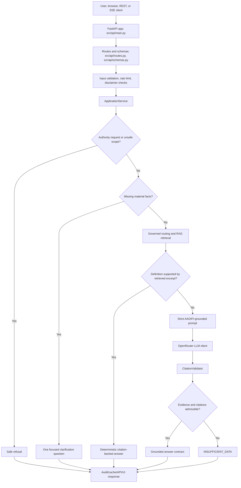
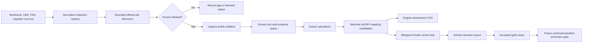

# Mushir AI Project Brief

Last refreshed: 2026-05-22

This document is written for AI agents, maintainers, and reviewers who need to understand the Mushir codebase quickly and safely. It favors explicit system contracts over marketing language.

## One-Screen Summary

Mushir is a source-governed Islamic finance research assistant. The current runtime is a FastAPI application that answers English, Arabic, and mixed-language questions from retrieved AAOIFI corpus excerpts, validates citations, asks one focused clarification question when facts are missing, and fails closed when evidence is weak.

Mushir is not a fatwa engine. It must not provide binding Sharia rulings, legal advice, or financial advice. It is an informational assistant that works only inside its retrieved, cataloged evidence boundary.

The active delivery gate is L5 quality and release readiness. The future L6 direction is a rules-first Sharia commercial-process assessment assistant backed by governed sources, structured transaction facts, executable rules, public institution evidence, and scholar-reviewed gold cases. L6 scaffolding exists, but the full evaluator is not complete.

## Current Truth Table

| Area | Current truth |
| --- | --- |
| Product category | Source-governed AAOIFI RAG assistant with non-binding answers |
| Runtime | FastAPI app with `/chat`, REST API, SSE API, health, readiness, and metrics |
| UI | Static browser chat under `src/static/` |
| Retrieval | Multilingual dense retrieval over AAOIFI chunks, defaulting to Chroma |
| Optional vector store | Qdrant path exists as an optional production mode |
| LLM | OpenRouter through an OpenAI-compatible client |
| Default demo model | `openrouter/free`, treated as constrained and rate-limited |
| Language support | English, Arabic, and mixed-language questions |
| Safety posture | Citation-gated, fail-closed, no binding rulings |
| Current roadmap | L5 readiness now, L6 source-governed rules-first evaluator later |
| Institution corpus | L6 evidence workstream with registry, crawler, machine mapping, and scholar-review exports |
| Broad live scraping | Not approved until crawl-first pilot gates pass |
| Documentation entrypoints | `README.md`, `project-context.md`, `.planning/sharia-compliance-chatbot/docs/index.md`, this file |

## Product Boundary

Mushir can:

- answer from retrieved AAOIFI excerpts;
- cite retrieved chunks that support its statements;
- define terms when a retrieved excerpt directly supports the definition;
- ask exactly one focused follow-up question when the user has not supplied enough facts;
- refuse binding authority requests;
- return `INSUFFICIENT_DATA` when evidence, source family, citation support, or retrieval quality is insufficient;
- expose the same answer contract through browser, JSON, and SSE surfaces.

Mushir must not:

- invent AAOIFI standard numbers, pages, sections, source titles, or citations;
- rely on general model knowledge for compliance conclusions;
- issue a binding fatwa, halal/haram ruling, legal opinion, or financial advice;
- bypass login walls, CAPTCHA, paywalls, access controls, or robots restrictions during evidence acquisition;
- treat third-party pages as compliance evidence;
- treat machine-proposed labels as scholar-reviewed truth;
- expose secrets, raw keys, provider stack traces, hidden reasoning, or chain-of-thought.

## Repository Map

| Path | Meaning |
| --- | --- |
| `src/api/` | FastAPI app, request routing, schemas, readiness, metrics, rate limiting, safe errors |
| `src/chatbot/` | Application orchestration, clarification, prompt building, LLM client, citation validation, commercial-assessment scaffold |
| `src/rag/` | Chunking, embeddings, query preprocessing, Chroma/Qdrant retrieval |
| `src/models/` | Shared domain and API-facing data contracts |
| `src/governance/` | Source catalog, concept map, router seeds, chunk metadata, institution registry, institution pipeline, release controls |
| `src/acquisition/` | Source acquisition primitives and future live crawl adapters |
| `src/storage/` | Cache and audit-store implementations |
| `src/security/` | Input and CORS validation |
| `src/observability/` | Lightweight metrics |
| `src/static/` | Browser chat UI assets |
| `scripts/` | Ingestion, deployment, verification, RAG evaluation, and L6 institution pilot entrypoints |
| `tests/` | Unit, service, API, integration, readiness, governance, and pilot tests |
| `.planning/sharia-compliance-chatbot/docs/` | Maintained technical, operations, stakeholder, research, and AI handoff documentation |
| `.planning/sharia-compliance-chatbot/next-level-plans/` | Maintained planning specs and historical implementation plans |
| `_bmad-output/` | BMAD planning and implementation artifacts |
| `data/source_registry/` | Tracked source-category and regulator-source planning seeds |
| `data/fixtures/l6_scrape/` | Small fixture inputs for L6 scrape tests |
| `artifacts/l6_scrape/` | Runtime scrape artifacts; do not treat as normal source-control content |
| `chroma_db_multilingual/` | Local multilingual Chroma index used by the demo runtime |

## Runtime Architecture



## Main Answer Contract

The answer contract is defined primarily in `src/models/ruling.py` and enforced at the API boundary by `src/api/schemas.py`.

Core fields:

- `answer`: user-facing answer text;
- `status`: compliance or safety status;
- `citations`: validated citation list;
- `reasoning_summary`: concise explanation, never hidden chain-of-thought;
- `limitations`: scope and evidence limits;
- `clarification_question`: present only when the response asks for one more fact;
- `metadata`: route, retrieval, language, confidence, and supporting operational metadata.

Important invariants:

- Grounded answers require citations.
- Clarification responses require one concise question.
- Unsupported answers return `INSUFFICIENT_DATA` rather than guessing.
- Definition answers can be successful informational responses even when they are not transaction-level compliance rulings.
- Cache only validated non-clarification answers.

## Key Runtime Components

### API Layer

`src/api/main.py` builds the FastAPI application, middleware, shared runtime dependencies, health/readiness checks, static chat UI, and metrics. It exposes:

- `GET /`
- `GET /chat`
- `GET /api`
- `GET /health`
- `GET /ready`
- `GET /metrics`
- `POST /api/v1/query`
- `POST /api/v1/query/stream`
- `POST /api/v1/sessions`
- `GET /api/v1/sessions/{session_id}/history`
- `GET /api/v1/compliance/disclaimer`

`src/api/routes.py` maps API requests to `ApplicationService`, handles rate limits, controls SSE envelopes, and converts errors into safe user-facing messages.

### Application Service

`src/chatbot/application_service.py` is the main answer orchestrator. It performs query normalization, language detection, disclaimer enforcement, authority-request refusal, cache lookup, clarification, retrieval, deterministic definition answering, prompt construction, LLM generation, citation validation, compliance-status derivation, auditing, and safe caching.

This file is a high-risk edit surface. Preserve its fail-closed behavior.

### Clarification Engine

`src/chatbot/clarification_engine.py` detects when the user has not provided enough transaction facts. It asks one high-value question at a time. It should not over-clarify simple definition or informational questions.

### Retrieval

`src/rag/pipeline.py` is the retrieval boundary. The default path uses multilingual embeddings and a Chroma collection. Retrieval must preserve chunk identity, citation metadata, language, score, and enough context for citation validation.

Default local settings:

- `VECTOR_DB_TYPE=chroma`
- `CHROMA_DIR=./chroma_db_multilingual`
- `EMBED_MODEL=sentence-transformers/paraphrase-multilingual-mpnet-base-v2`
- `REQUIRE_ARABIC_RETRIEVAL=true`

### Prompting And LLM

`src/chatbot/prompt_builder.py` creates a strict prompt that tells the model to use only retrieved excerpts, cite claims, ask one follow-up question when needed, and return `INSUFFICIENT_DATA` when evidence is weak.

`src/chatbot/llm_client.py` calls OpenRouter. Free routing is acceptable for constrained demo smoke checks, not for bulk evaluation.

### Citation Validation

`src/chatbot/citation_validator.py` is an authority boundary. It accepts only citations backed by retrieved chunks. Do not loosen this to make generated answers pass.

### Commercial Assessment Scaffold

`src/chatbot/commercial_assessment.py` and `src/models/commercial.py` contain early L6 scaffolding: transaction scenario extraction, source-family routing, rule-trace shapes, verdict statuses, and source-gap behavior. This is not a complete rules-first evaluator yet.

## Governance Layer

The governance layer turns Mushir from generic RAG into a controlled standards workflow.

Important files:

- `src/governance/source_catalog.py`: source record, document version, and relationship contracts;
- `src/governance/router_seed.py`: reviewable source-family and standards routing seeds;
- `src/governance/concept_map.py`: governed terms, synonyms, Arabic labels, transliterations, ambiguity, and route metadata;
- `src/governance/chunk_metadata.py`: source-aware parent/child chunk metadata builder;
- `src/governance/release_controls.py`: executable planning and release gates;
- `src/governance/institution_registry.py`: L6 institution registry, artifacts, operations, machine mappings, scholar review, user-fact override contracts;
- `src/governance/institution_pipeline.py`: fixture-safe helpers for workbook loading, discovery, artifact capture, extraction, mapping, exports, scholar review, gold-case projection, and pilot gates.

Critical governance rules:

- Chunks without catalog provenance are quarantined, not authoritative.
- Router seeds permit retrieval; they do not prove an answer.
- FAS evidence supports accounting, reporting, recognition, measurement, presentation, disclosure, and definitions.
- Permissibility and contract-validity questions require Shari'ah-standard or approved Sharia-source evidence.
- External datasets are supplemental only after license and relevance review.

## L6 Institution Evidence Workstream

The L6 Egypt institution workstream prepares public-source evidence and evaluation data. It must not be confused with live answer authority.

Primary entrypoint:

```powershell
python scripts\run_l6_institution_pilot.py --mode fixture-pilot --today 2026-05-20
```

Important modes:

- `fixture-pilot`: fixture-backed readiness run;
- `live-regulator-revalidation`: conservative regulator/source reachability probe;
- `official-registry-completion`: CBE/FRA registry normalization and readiness ledger;
- `full-scrape`: gated bank-slice/product-page crawl;
- `legacy-sector-scrape`: old workbook sector coverage and gap preservation;
- `full-scrape --rerun-status failed,insufficient_text`: targeted rerun for failed or low-quality bank targets.

Current L6 institution capabilities:

- workbook and CSV registry loading;
- stable institution IDs;
- regulator/source provenance validation;
- bounded official-site discovery;
- access-control-first artifact fetching;
- raw artifact storage with hashes;
- deterministic text extraction;
- operation/evidence-span extraction;
- machine-proposed AAOIFI mapping candidates;
- database-ready engine assessment rows;
- bilingual scholar-review exports with stable linkage keys;
- scholar-review import/export;
- accepted gold-case projection;
- user-fact override contracts;
- fail-closed pilot gates.

Recent local changes add scrape-result review columns and guidance exports:

- `mushir_engine_sharia_aaoifi_review`;
- `aaoifi_standard_reference_file_and_title`;
- `human_scholar_supervision_review`;
- `SCHOLAR_REVIEW_GUIDANCE.md`.

These fields are review aids. They do not make machine output authoritative.

## L6 Evidence Pipeline



## Data Authority Ladder

Use this authority order when deciding whether information can affect answers or planning:

1. Cataloged, current, retrieved AAOIFI or approved Sharia-source excerpts with validated citations.
2. Reviewed source catalog and router/concept-map records.
3. Scholar-reviewed L6 gold cases and accepted review imports.
4. Official regulator or institution artifacts captured with provenance.
5. Machine-proposed mappings and extraction rows.
6. Third-party discovery snippets.
7. General model knowledge.

Only the top levels can support final answer claims. Levels 5 through 7 are planning, discovery, or review inputs, not authority.

## Runtime Modes

Local/demo mode:

- Chroma vector store;
- multilingual sentence-transformer embeddings;
- in-memory sessions;
- in-memory rate limiting;
- in-memory cache;
- null audit store unless configured;
- OpenRouter model from environment;
- static chat UI served by FastAPI.

Production target mode:

- explicit CORS origins;
- `APP_ENV=production`;
- durable audit store through `AUDIT_DATABASE_URL` or `DATABASE_URL`;
- optional Redis for sessions, rate limiting, and cache;
- optional Qdrant vector store;
- configured `AUTH_TOKEN`;
- configured OpenRouter credentials;
- `/ready` and live query smoke checks before release claims.

## Important Environment Variables

| Variable | Purpose |
| --- | --- |
| `OPENROUTER_API_KEY` | Live LLM generation credential |
| `OPENROUTER_MODEL` | OpenRouter model selector |
| `OPENROUTER_MAX_TOKENS` | Output token limit |
| `CORPUS_DIR` | AAOIFI markdown corpus path |
| `EMBED_MODEL` | Embedding model |
| `CHROMA_DIR` | Chroma index path |
| `VECTOR_DB_TYPE` | `chroma` or `qdrant` |
| `REQUIRE_ARABIC_RETRIEVAL` | Prevents silently serving Arabic from English-only retrieval |
| `REQUIRE_DISCLAIMER_ACK` | Requires API disclaimer acknowledgement when enabled |
| `RAG_EVAL_MODE` | Bypasses response cache for evaluation |
| `CORS_ORIGINS` | Allowed origins; wildcard is local-only |
| `REDIS_URL` | Optional Redis sessions/cache/rate limiting |
| `AUDIT_DATABASE_URL` or `DATABASE_URL` | Optional PostgreSQL audit store |
| `AUTH_TOKEN` | Optional API auth token |

Never put real secret values in docs, commits, prompts, or summaries.

## Commands For AI Agents

Use the repo virtual environment on Windows:

```powershell
.\.venv\Scripts\python.exe -m pytest -q --timeout=90
```

Fast targeted gate:

```powershell
.\.venv\Scripts\python.exe -m pytest -m "unit or service or api" -q --timeout=60
```

Run the API locally:

```powershell
.\.venv\Scripts\python.exe -m uvicorn src.api.main:app --host 127.0.0.1 --port 8000
```

Smoke the local API:

```powershell
curl.exe http://127.0.0.1:8000/health
curl.exe http://127.0.0.1:8000/ready
```

Run bilingual answer behavior tests:

```powershell
.\.venv\Scripts\python.exe -m pytest tests\test_l1_contracts.py::test_application_service_answers_arabic_definition_with_validator_backed_citation tests\test_l1_contracts.py::test_application_service_expands_definition_retrieval_before_llm tests\test_clarification_engine.py::test_arabic_definition_question_skips_transaction_clarification -q
```

Rebuild multilingual Chroma:

```powershell
.\.venv\Scripts\python.exe scripts\ingest.py --reset --languages en,ar
```

Run L6 fixture pilot:

```powershell
.\.venv\Scripts\python.exe scripts\run_l6_institution_pilot.py --mode fixture-pilot --today 2026-05-20
```

Check docs whitespace:

```powershell
git diff --check
```

## Deployment Rules

Hugging Face Spaces is the current demo host.

Use the lightest deployment path that matches the change:

- UI-only changes: `scripts/deploy_huggingface_space.py --ui-only`
- runtime changes without retrieval-index changes: `--skip-index`
- retrieval-index changes: full deploy after rebuilding and verifying the index

Do not re-upload `chroma_db_multilingual` unless retrieval data actually changed.

Green `/health` is not enough. Release confidence needs `/ready` plus a real query smoke path. For Arabic behavior, include Arabic or mixed-language smoke checks when the change can affect language handling.

## Documentation Map

| Need | Start here |
| --- | --- |
| Full technical overview | `.planning/sharia-compliance-chatbot/docs/project-documentation.md` |
| AI-agent handoff | `.planning/sharia-compliance-chatbot/docs/ai-project-brief.md` |
| Maintainer rules | `project-context.md` |
| Documentation index | `.planning/sharia-compliance-chatbot/docs/index.md` |
| Answer architecture | `.planning/sharia-compliance-chatbot/docs/chatbot-architecture.md` |
| Production readiness | `.planning/sharia-compliance-chatbot/docs/l5-production-readiness.md` |
| Deployment operations | `.planning/sharia-compliance-chatbot/docs/ops/deployment.md` and `.planning/sharia-compliance-chatbot/docs/ops/huggingface-spaces.md` |
| Client explanation | `.planning/sharia-compliance-chatbot/docs/client-plain-language-logic.md` |
| Source-governed roadmap | `.planning/sharia-compliance-chatbot/docs/client-source-governed-aaoifi-roadmap.md` |
| L6 institution scrape | `.planning/sharia-compliance-chatbot/docs/l6-egypt-institution-scrape/README.md` |
| Research evidence | `.planning/sharia-compliance-chatbot/docs/research/README.md` |
| Maintained implementation tasks | `.planning/sharia-compliance-chatbot/docs/tasks.md` |

## Safe Edit Heuristics

When changing runtime code:

- preserve fail-closed behavior first;
- update focused tests with behavior changes;
- never weaken `CitationValidator` to satisfy model output;
- treat source-family gates as authority boundaries;
- use fixtures for evaluation loops instead of live OpenRouter loops;
- keep Arabic and English behavior covered when touching retrieval, prompts, citations, or schemas;
- keep user-facing errors useful but secret-safe.

When changing L6 institution code:

- keep official/regulator source evidence separate from machine labels;
- preserve gaps instead of filling them with guesses;
- make every artifact traceable by URL, timestamp, content hash, raw path, extraction status, and access decision;
- do not let failed or insufficient-text artifacts become scholar-review truth;
- keep human-scholar-review fields blank until real review is imported;
- block broad crawling unless the pilot gate proves readiness.

When changing docs:

- prefer additive current-state docs over rewriting historical plans;
- name what is implemented, planned, experimental, or blocked;
- keep client-facing wording non-fatwa and non-binding;
- avoid key-shaped examples;
- update `.planning/sharia-compliance-chatbot/docs/index.md` when adding a durable document.

## Known Risk Areas

| Risk | Why it matters | Guardrail |
| --- | --- | --- |
| Weak retrieval evidence | Could produce unsupported religious/compliance claims | Return `INSUFFICIENT_DATA` |
| Citation formatting drift | LLM may cite unavailable chunks | Validate citations against retrieved chunks |
| FAS-only permissibility answers | FAS is not enough for halal/haram or contract validity | Require Shari'ah-standard or approved Sharia-source evidence |
| Over-clarification | Definition questions should not become transaction interviews | Keep definition shortcut and clarification tests |
| Arabic support regression | Arabic users need reliable retrieval and citations | Keep multilingual index and Arabic tests |
| OpenRouter free limits | Bulk live eval can overload or block the demo path | Use fixtures and retrieval-only eval |
| Institution evidence overclaiming | Machine labels are not scholar truth | Export for review, do not promote automatically |
| Scraper ethics | Bypassing controls creates legal and trust risk | Respect access controls and record gaps |
| Secret leakage | Prior incidents make this high risk | Placeholder-only docs and safe logs |

## Current Implementation Status By Level

| Level | Status | Notes |
| --- | --- | --- |
| L0 | Historical baseline | Basic RAG foundations are superseded by current app service and API |
| L1 | Implemented | Clarification, answer contracts, safe errors, citation validation |
| L2 | Implemented | Browser UI, REST, SSE, sessions, validation, rate limiting |
| L3 | Implemented options | Chroma/Qdrant, Redis, PostgreSQL audit, readiness, metrics |
| L4 | Implemented hardening | Citation gates, disclaimers, safe caching, deployment docs |
| L5 | Active gate | Quality, release readiness, live verification, operational discipline |
| L6 | Partial scaffold | Source-governed rules-first direction, institution evidence workstream, not complete |

## Future Work Priority

1. Keep L5 release readiness green through tests, retrieval evaluation, readiness checks, and live smoke checks.
2. Finish L6 crawl-first pilot evidence across mixed institution types and one hard no-details case.
3. Promote only scholar-reviewed or accepted gold-case evidence into evaluation and later runtime use.
4. Measure RAG/model upgrades against Mushir-specific metrics before adoption.
5. Add rules-first L6 support one domain at a time after source, route, rule, evidence, citation, and human-review gates are ready.
