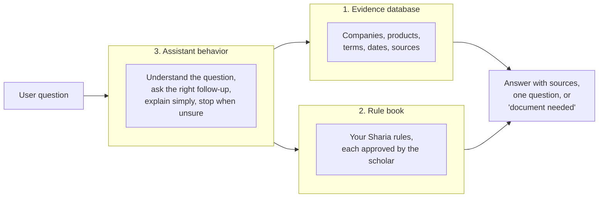
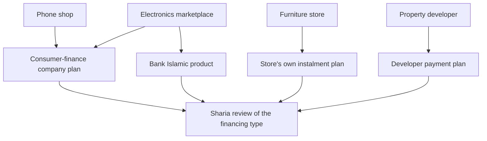
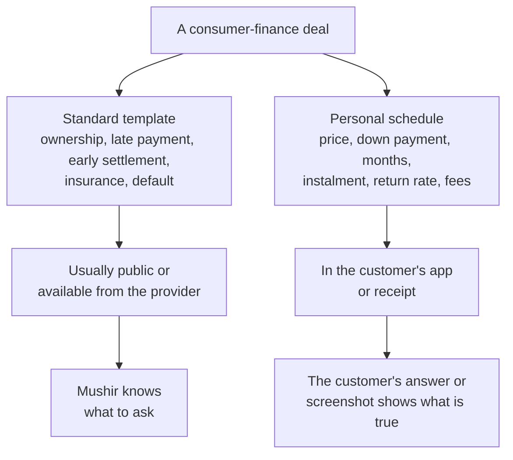
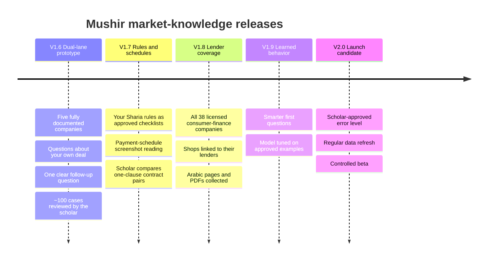

# Mushir Client Strategy: Egyptian Instalment Market Knowledge and Release Plan

Last refreshed: 2026-09-29
Current app version: V1.5 (`1.5.0`)
Technical plan: [L6 Market Knowledge Strategy and POC Release Ladder](../next-level-plans/L6-MARKET-KNOWLEDGE-AND-POC-RELEASE-STRATEGY.md)

## Who This Is For

This document is for the client, the reviewing scholar, and other non-technical
stakeholders. After reading it you should be able to answer:

- what we are building and how "training the AI" will actually work;
- what the data collected so far shows;
- how we deal with financing contracts that are not public;
- how the scholar's review time will be used;
- what each prototype release will contain;
- which decisions and inputs we need from you.

## One-Page Summary

The goal is an assistant that can answer two kinds of question about Egyptian
instalment and financing offers:

1. **"Here is my deal. Is it acceptable?"** For example: *"I paid EGP 5,000 down and owe EGP 3,000 a month for 12 months for an iPhone."*
2. **"What does this company offer?"** For example: *"What are Contact's instalment terms, and do they raise a Sharia issue?"*

Three ideas shape the strategy:

- **The AI is not the database.** Company terms change often. We keep them in a dated, source-linked database, not inside the AI model, so every fact can be shown, checked and updated.
- **Most of the "missing contract" is not really missing.** A consumer-finance agreement is a standard template plus a personal payment schedule. The template is usually public or can be requested. The schedule is in the customer's hands, so Mushir asks for it.
- **Reliability comes from knowing when to stop.** Mushir gives a Sharia conclusion only when the facts, the approved rule and the evidence are all present. Otherwise it asks one question or says what document is needed.

> Mushir helps users understand financing terms against scholar-approved rules. It is not a final Sharia authority and does not issue fatwas.

## What We Have Found So Far

| Area | Result so far | What it means |
| --- | --- | --- |
| Official registers | 2,154 Egyptian financial institutions; FRA list of 328 financing companies, 38 licensed for consumer finance | We can cover **all regulated lenders** |
| Bank products | 69 product/operation records collected from 14 bank websites | Starting material for scholar review |
| Instalment market | 85 checks across stores, marketplaces, lenders, services and property; 52 confirmed on a page; 86 named companies | A useful sample, not yet the whole market |
| Sharia sources | Most AAOIFI Shari'ah Standards extracted; a few still missing | Enough to design with; not yet enough to launch hard Sharia answers |

Two recent findings matter most:

- **Contact's published agreement** says the price, number of instalments, period and return rate for each customer are in a *separate statement*. The public document is therefore the template, and the numbers are personal.
- **Egypt's regulator (FRA)** requires a standard consumer-finance contract form under Law 18 of 2020. On 6 September 2026 it published a full consumer-finance rulebook. Among other things, the rulebook requires **life and disability insurance** for customers up to age 65. That means every consumer-finance deal includes an insurance element, which needs its own Sharia question.

## How "Training the AI" Actually Works

Training does not mean putting everything inside one AI model. Mushir has three
parts, and each one improves in a different way.

| Part | What it holds | How it improves |
| --- | --- | --- |
| **Evidence database** | What each company publishes, with the date and link | New collection and document checks |
| **Rule book** | Your uploaded Sharia rules (for example, on riba), turned into clear checklists | Scholar approval of each rule |
| **Assistant behavior** | Reading Arabic and English questions, choosing the best follow-up question, declining safely | Scholar-reviewed examples; later, targeted model training |

**Why company facts are not trained into the AI:** if the AI "memorises" that a
company charges a certain rate, it cannot show where that came from. It also
cannot be corrected when the company changes its terms, and it may repeat an old
figure confidently. Keeping facts in the database means every answer can cite a
dated source.

## The Unit We Analyse: How the Deal Is Financed

Thousands of shops offer instalments. For the Sharia question, the shop usually
matters less than **who finances the purchase and under which kind of contract**.

So we build the database in layers:

1. **All regulated lenders**, taken from official registers.
2. **Their financing products**, each with its own terms.
3. **Shops and marketplaces**, linked to the lenders they use. This layer does not need to be a full census.
4. **Sellers that run their own plans**, such as developers, furniture and jewellery stores and schools. These are checked one by one.

## How We Handle Contracts That Are Not Public

We plan five ways to get contract information, from most to least preferred:

| # | Source | Condition |
| --- | --- | --- |
| 1 | Public provider terms and the FRA standard form | Only where public access is allowed |
| 2 | Asking providers directly for their standard contracts | With written permission |
| 3 | The user shares a screenshot of their own payment schedule | Personal details hidden on the phone; deleted after reading unless the user chooses to donate it |
| 4 | Your team donates their own agreements from small real purchases | **Only if the scholar approves** entering such contracts for study |
| 5 | Practice contracts made by changing one clause of a real template | Clearly marked as practice material; used only for testing and scholar review, never shown as a company's real terms |

## Can the AI "Expect" a Company's Contract?

Yes, in a limited and safe form. From what we collect about a company (its
licence type, whether it is an Islamic window, the words its pages use such as
"return", "interest", "profit" or "Murabaha", and who it names as the lender),
the AI can learn to estimate **what kind of financing** a product probably is.

That estimate is used for two things only:

- to decide **which question to ask first**, and
- to decide **which document to request**.

It is **never** used to give a Sharia conclusion about a company. If the
estimate is wrong, the cost is one less useful question. If it were used for a
verdict, Mushir could publish a wrong judgment about a named Egyptian company.
Whenever it appears, it is labelled: *"typical for this kind of provider, not
verified for your contract."*

## Example Conversation

> **User:** Contact, 12 months, for an iPhone. Is it halal?
>
> **Mushir:** Is Contact financing the purchase itself, or is the store running its own plan and only processing through Contact?
>
> **User:** Contact finances it.
>
> **Mushir:** Contact's published agreement (dated …) says your price, number of instalments, period and return rate are in a separate statement given to you. Could you share that statement or a screenshot of the plan screen showing the total amount, any fees and any late-payment charge? Personal details are hidden before reading.

Mushir gives a conclusion only after the material facts are known and the
matching rule has been approved by the scholar.

## How the Scholar's Time Is Used

The scholar's time is the most valuable input in this project, so we spend it
where one decision covers many cases:

1. **Approve each rule**, written as a clear checklist. One approval covers every question that uses that rule.
2. **Compare pairs of contracts that differ by one clause**, for example a late fee paid to the lender versus to charity. This shows exactly where each rule draws the line.
3. **Review a balanced sample of answers**, plus every answer where Mushir gave a conclusion.
4. **Set the acceptable error level** for launch.

## What "High Certainty" Means

We measure certainty as: **"When Mushir gives a conclusion, how often does the
scholar agree?"** The scholar sets the target, for example fewer than 1 wrong
conclusion in 100. Mushir may ask for documents or decline as often as needed to
meet that target.

We will **not** display a confidence percentage until it has been checked
against scholar-reviewed results. A number that only sounds precise would
mislead users.

## Release Plan

Each version is released on Hugging Face for review before the next one starts.

| Version | You will be able to see | It is ready to move on when |
| --- | --- | --- |
| V1.6 | Company lookups for five pilot companies, deal questions, one-question follow-ups | The scholar reviews about 100 cases with no wrong conclusions |
| V1.7 | Answers checked against your approved rules; schedule screenshots | Every rule in use is approved |
| V1.8 | All licensed consumer-finance lenders; shop-to-lender links | Old or conflicting information is flagged correctly |
| V1.9 | Better first questions; tuned assistant behavior | Tests prove estimates never change a conclusion |
| V2.0 | Launch-ready assistant for a controlled beta | Scholar sign-off on the error level |

## What We Need From You

| # | Decision or input | Why it matters |
| --- | --- | --- |
| 1 | **Your Sharia rule files** (riba and other financing rules) | They become the approved rule book |
| 2 | **Which source wins when your rules and AAOIFI differ**, or whether every difference goes to the scholar | Mushir must never blend two positions into one |
| 3 | **The scholar's view on staff donating their own agreements** | Decides whether we obtain real, complete contracts early |
| 4 | **Confirmation of the five pilot companies** (proposed: Contact, Souhoola, RUSHBRUSH, IKEA Egypt or Smart Furniture, plus one bank Islamic product) | Defines the first prototype |
| 5 | **Who the first user is**: a retail buyer, or your internal compliance team | Changes the wording, depth and risk of answers |
| 6 | **The acceptable error level for launch** (from the scholar) | Defines "ready" |

## What Mushir Will and Will Not Say

Use this:

> Based on [company]'s published terms dated [date], and on rule [name] approved by our reviewing scholar, this clause raises the following issue. Please confirm against your own agreement.

Avoid this:

> [Company] is haram.

Avoid this:

> This AI guarantees the Sharia ruling on your contract.

## Simple Glossary

| Term | Simple meaning |
| --- | --- |
| Evidence database | A dated, source-linked record of what each company publishes |
| Rule card | One Sharia rule written as a checklist: which facts matter, what each combination means, and the scholar's approval |
| Template | The standard part of a financing contract that is the same for all customers |
| Schedule | The personal part: amounts, months and fees for one customer |
| Financing type | How the deal is structured, for example a lender's loan, a bank Murabaha, or a store's own plan |
| Estimate (archetype guess) | The AI's educated guess of the financing type, used only to ask better questions |
| Practice contract | A made-up variation of a real template, used only for testing |
| Frozen test set | A fixed group of reviewed questions used to measure every new version fairly |
| Fine-tuning | Extra training that teaches the AI a behavior, such as reading Arabic payment details; never used to store company facts |
| Hugging Face Space | The public website where each prototype version is shared for review |

## Sources

- [FRA consumer-finance rulebook coverage, Amwal Al Ghad, 6 September 2026](https://en.amwalalghad.com/egypts-regulator-issues-first-comprehensive-consumer-finance-rulebook/)
- [Law No. 18 of 2020 on Consumer Finance, Andersen translation](https://eg.andersen.com/translation-of-law-18-of-2020/)
- [Contact consumer-finance terms appendix](https://contact.eg/terms-and-conditions-en.pdf)
