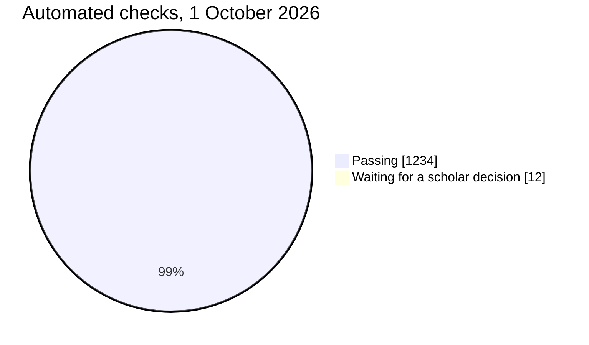
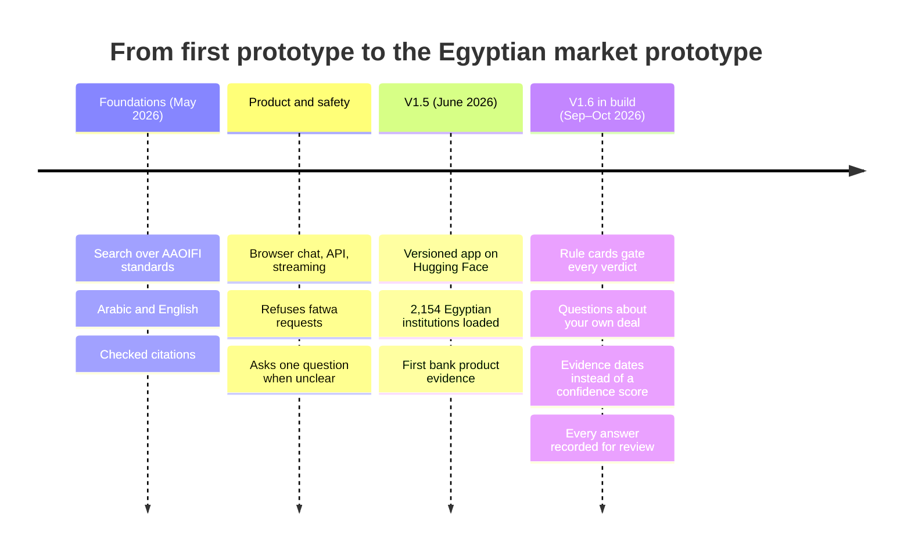
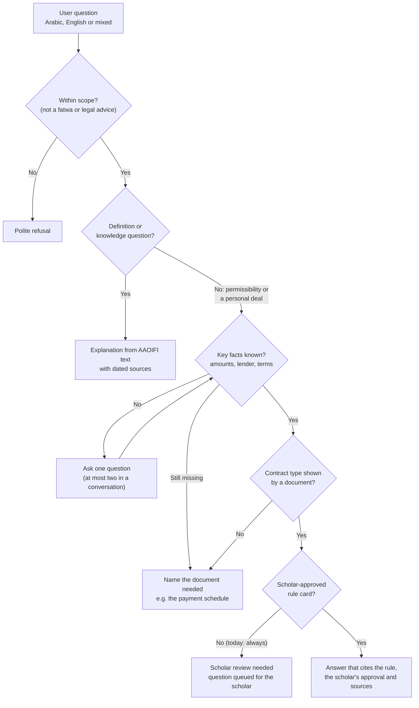
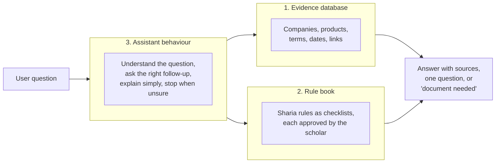
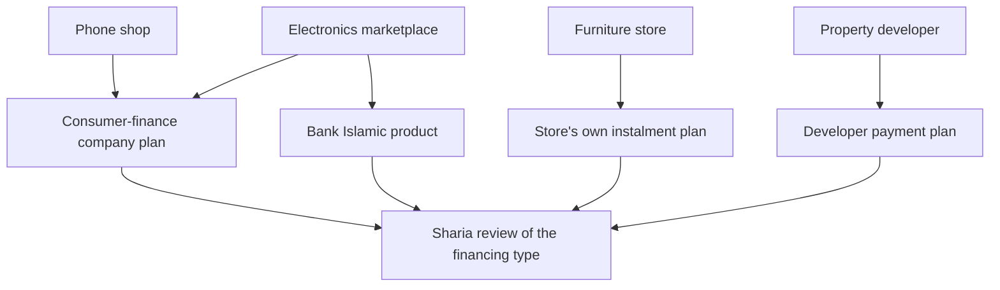
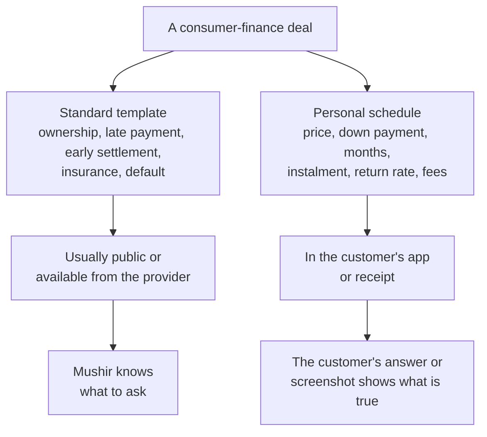
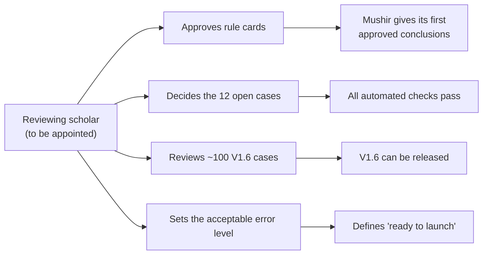
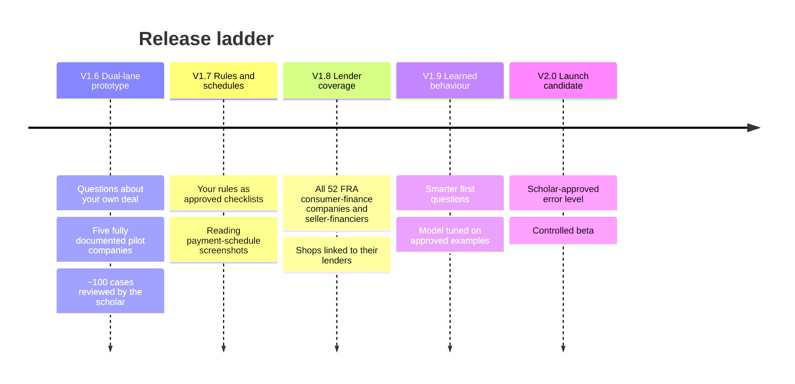
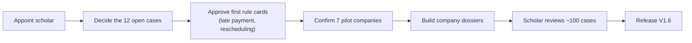

# Mushir Client Guide

Last refreshed: 2026-10-01
Live app: V1.5 (`1.5.0`) · In build: V1.6 dual-lane prototype
Decision document: [Scholar Review Pack](https://claude.ai/artifact/4CE8SuwyTbb4vCQK56asMQ) (also in the repo: [client-pages/scholar-review-pack.html](client-pages/scholar-review-pack.html)), the 12 questions waiting for a scholar
Shareable page of this guide: [Mushir Client Guide](https://claude.ai/artifact/N5sTGi4S15Kj3A1KdADGtP) (also in the repo: [client-pages/client-guide.html](client-pages/client-guide.html))

This guide replaces three earlier client documents, which are kept for the record:
[plain-language report](client-plain-language-logic-legacy.md),
[source-governed roadmap](client-source-governed-aaoifi-roadmap-legacy.md) and
[Egypt market strategy](client-egypt-market-ai-strategy-legacy.md).

## How To Read This Guide

| If you want to know… | Read |
| --- | --- |
| What Mushir is and where it stands, in five minutes | [Mushir On One Page](#mushir-on-one-page) |
| How Mushir decides what to say | [How Mushir Answers Today](#how-mushir-answers-today) |
| How the Egyptian market work fits in | [Egyptian Market Knowledge](#egyptian-market-knowledge) |
| Why the scholar is now the critical path | [The Scholar's Role](#the-scholars-role) |
| What comes next and what we need from you | [Release Plan](#release-plan) and [Decisions](#decisions) |

## Mushir On One Page

Mushir helps people understand Islamic-finance terms and offers against Sharia rules that a scholar has approved. It answers in Arabic and English, shows its sources and their dates, and stops when it is not sure. **It is not a Sharia authority and does not issue fatwas.**

It is being built to handle two kinds of question about Egyptian instalment and financing offers:

1. **"Here is my deal. Is it acceptable?"** For example: *"I paid EGP 5,000 down and owe EGP 3,000 a month for 12 months for an iPhone."*
2. **"What does this company offer?"** For example: *"What are Contact's instalment terms, and do they raise a Sharia issue?"*

The first user is a **retail buyer** (decided 30 September 2026).

### Status At A Glance

| Area | Where it stands |
| --- | --- |
| Chat, API and Arabic/English search | Working in V1.5 |
| Questions about your own deal | Built: reads the user's own figures, asks up to two follow-up questions |
| Sharia conclusions | Only through scholar-approved rule cards. **None exist yet**, so Mushir defers every permissibility question to review |
| Company lookups for pilot companies | Planned; waits for the pilot list and legal review |
| Scholar | **Not yet appointed.** This is the main blocker |
| Automated checks | 1,234 passing; 12 waiting for a scholar decision |

The 12 open checks are not faults. They are questions where the old test expects a verdict, and Mushir now correctly withholds it until a scholar approves a rule. They are listed one by one in the [Scholar Review Pack](../../../outputs/client-review-pack/index.html).

## Where The Project Stands

### What Was Built For V1.6 So Far

| Workstream | Status | What it gives you |
| --- | --- | --- |
| Evidence-safe answers | Mostly built | No verdict without an approved rule; source dates on every answer; every answer saved for review before it is shown |
| Questions about your own deal | Mostly built | Reads amounts, down payment, months and lender from the user's words; never assumes the contract type from words like "instalment" |
| Company dossiers for seven pilot companies | Started | valU, Contact, Souhoola, Aman, Halan, B.TECH (Mylo) and Drive Finance (Forsa): legal names from FRA's registers and their own pages, recorded in English and Arabic; B.TECH and Drive added on 2 October 2026, each confirmed against FRA's register and the company's own pages; dated public pages captured; request letters drafted for the first five, waiting for your approval |
| Company lookups ("what does X offer?") | Not started | Waits for the dossiers and a legal review |
| Scholar-verified V1.6 release | Not started | Waits for a scholar |

Each built part was checked by three rounds of independent review, and all fixes are covered by automated tests.

## How Mushir Answers Today

Every question passes the same checks in order. Mushir only moves on when a check is satisfied.

### What A User Sees

| Situation | What Mushir does |
| --- | --- |
| "What is Murabaha?" | Short explanation from the AAOIFI text, with the source and its capture date |
| A deal with missing facts | One clear question, for example who provides the instalment plan |
| Still missing after two questions | Says which document would settle it, such as the agreement or payment schedule |
| "Is this halal?" with no approved rule | Says scholar review is needed and queues the question |
| "Give me a binding fatwa" | Refuses politely; Mushir is informational only |
| A question with no supporting source | Says the evidence is insufficient instead of guessing |

### Example Conversation

> **User:** I bought an iPhone with a deposit of EGP 5,000 and 12 instalments of EGP 3,000. Is it halal?
>
> **Mushir:** Who provides the instalment plan—the store itself, or a bank or finance company?
>
> **User:** I don't know.
>
> **Mushir:** The available facts are insufficient to assess this transaction. I need the agreement or repayment disclosure identifying the financier and complete payment terms, followed by a scholar-approved rule mapping for the verified contract mechanism.

Mushir recorded only what the user actually said. It did not guess the financier or the contract type, and it gave no verdict.

### Safety Rules

| Risk | How Mushir handles it |
| --- | --- |
| The AI states a ruling from its own memory | Verdicts require a scholar-approved rule card; judgment questions never reach the AI writer without one |
| The AI invents a citation | Citations are accepted only when they match retrieved source text |
| A word like "instalment" is taken as a contract type | Generic words never set the contract type; a document must show it |
| A precise-looking but untested number misleads users | The confidence percentage was removed; each answer shows its sources and their age |
| An answer cannot be traced later | Every answer is saved for review before the user sees it; if saving fails, the answer is not shown |
| Personal details are kept forever | Review records are deleted automatically after 365 days (a setting you can change) |
| A practice contract is mistaken for real company terms | Practice material is labelled and kept out of company answers |

## How "Training The AI" Works

Mushir is three parts, and each improves in a different way. Company facts are **not** put inside the AI model, because a model cannot show where a fact came from or be corrected when a company changes its terms.

| Part | What it holds | How it improves |
| --- | --- | --- |
| Evidence database | What each company publishes, with date and link | New collection and document checks |
| Rule book | Your Sharia rules turned into checklists (rule cards) | Scholar approval of each rule |
| Assistant behaviour | Reading Arabic and English, choosing the follow-up question, declining safely | Scholar-reviewed examples; later, targeted model training |

## Egyptian Market Knowledge

### What The Data Shows So Far

| Area | Result | Date |
| --- | --- | --- |
| Official registers | 2,154 Egyptian financial institutions: 36 banks, 797 capital-market, 996 insurance and 325 non-bank finance entities | June 2026 |
| Consumer-finance lenders | 39 licensed consumer-finance companies, plus 13 sellers registered to finance their own goods | 2 Oct 2026 |
| Bank products | 32 bank sites found, 14 collected, 73 public pages, 69 product records for review | June 2026 |
| Instalment market map | 85 checks across stores, marketplaces, lenders and property; 52 confirmed on a page; 86 named companies | 27 Sep 2026 |
| Sharia sources | Most AAOIFI Shari'ah Standards extracted; a few still missing | Ongoing |

Some sources were blocked by security checks (for example CBE, and one long-named FRA file). Mushir records these as gaps and never works around them. FRA's public registers and publications were collected with your authorization, at a slow rate and under an identified research name.

Three findings shape the plan:

- **Contact's published agreement** puts each customer's price, number of instalments, period and return rate in a *separate statement*. The public document is the template; the numbers are personal.
- **Egypt's regulator (FRA)** requires a standard consumer-finance contract under Law 18 of 2020. Its rulebook of 6 September 2026 requires **life and disability insurance** for customers up to age 65, so every consumer-finance deal includes an insurance element that needs its own Sharia question.
- **Marketplaces** such as noon state that interest and fees depend on the bank, so the store is rarely the party that matters.

### What The Regulator Itself Publishes (October 2026)

FRA's own documents answer part of the scholar's questions before any company is contacted:

- **Two registers, two kinds of company.** FRA licenses *consumer-finance companies*, and separately registers *consumer-finance providers*, defined as "producers or distributors of goods who practise consumer finance" (sellers that finance their own goods). Examples: B.TECH runs its in-house plan "minicash" under provider licence 7/2020, and separately runs Mylo through its finance company. The register shows which kind a company is; the customer contract still decides who sells and who lends in a given deal.
- **A legal minimum for every contract.** FRA's model contracts (Decree 869/2021, republished in the 6 September 2026 rulebook) are the minimum every licensed company's contract must follow. An earlier decree (457/2020) also applied a minimum list to sellers that finance their own goods; the 2026 rulebook no longer lists it, so whether it still applies is being checked. This gives the scholar the baseline of what every customer signs.
- **Sharia model contracts.** FRA publishes guiding Islamic contracts: Murabaha for consumer finance, lease-to-own (Ijarah), diminishing partnership (Musharaka), investment agency (Wakala) and micro-Murabaha. The Murabaha template contains points the scholar should look at, such as the supplier invoicing the customer directly. Mushir flags these points; the scholar decides. FRA lists only three consumer-finance companies as licensed for an Islamic (Murabaha) product: B.TECH (Mylo), Aman, and Abu Dhabi Islamic, whose contract is still under FRA Sharia committee review.
- **Sharia oversight.** Any company that sells products as Sharia-compliant must have its contracts reviewed by a Sharia committee whose members are registered with FRA. FRA's central Sharia committee has published rulings, for example that sukuk must be redeemed at market value rather than a guaranteed face value.

**2021 vs 2026 model contracts (compared 3 October 2026).** The models did not change in substance: same 15 clauses, same obligations. The one change is wording: the promissory notes and cheques a lender may ask for are now called "guarantees" instead of "commercial papers". What matters more for the scholar is what the models leave out: late payment and default, who sells and delivers the goods, and insurance, which has its own 2026 model. Those terms appear only in each company's own contract, which is why the pilot companies' contracts are still needed. Many older FRA documents are scanned images; their text was recovered by OCR and checked against the page before anything was quoted.

### The Unit We Analyse: How The Deal Is Financed

For a Sharia question, the shop usually matters less than **who finances the purchase and under which contract**.

The evidence database is built in layers: all regulated lenders first, then their products, then shops linked to the lenders they use, then sellers that run their own plans (developers, furniture stores, schools), checked one by one.

### Contracts That Are Not Public

| # | Source, most preferred first | Condition |
| --- | --- | --- |
| 1 | Public provider terms and the FRA standard form | Only where public access is allowed |
| 2 | Asking providers for their standard contracts | With written permission |
| 3 | The user shares a screenshot of their own schedule | Personal details hidden on the phone; deleted after reading unless donated |
| 4 | Your team donates agreements from small real purchases | **Only if the scholar approves** |
| 5 | Practice contracts made by changing one clause of a real template | Labelled as practice; used only for testing and scholar review |

### Can Mushir "Expect" A Company's Contract?

In a limited, safe form. From what we collect about a company (licence type, Islamic window or not, the words its pages use, the lender it names), Mushir can estimate **what kind of financing** a product probably is. The estimate decides only **which question to ask first** and **which document to request**. It never decides a Sharia conclusion, and it is always labelled *"typical for this kind of provider, not verified for your contract."*

## Sharia Sources

Mushir separates sources by what they can decide:

| Source family | Used for | Not used for |
| --- | --- | --- |
| AAOIFI Shari'ah Standards | Explaining Sharia rules and contract conditions; the basis for rule cards | A verdict on its own, without an approved card |
| AAOIFI Financial Accounting Standards (FAS) | Accounting, recognition, measurement and disclosure | Permissibility questions |
| Your own rule files | Rule cards, once the scholar approves them | Anything before approval |
| Company and regulator documents | Facts about offers and terms, with dates | Sharia conclusions |

Older standards that a newer one replaces are tracked so that Mushir does not quote an outdated standard as current.

## The Scholar's Role

The scholar is the only source of Sharia authority in Mushir. **No scholar has been engaged so far**, and nothing in Mushir has been scholar-reviewed yet. Mushir is safe without one, because it defers, but it cannot give any conclusion until rules are approved.

### How The Scholar's Time Is Used

The scholar's time is the most valuable input, so it goes where one decision covers many cases:

1. **Approve each rule** as a short checklist. One approval covers every question that uses that rule.
2. **Compare contract pairs that differ by one clause**, for example a late fee paid to the lender versus to charity. This shows where each rule draws the line.
3. **Review a balanced sample of answers**, plus every answer where Mushir gave a conclusion.
4. **Set the acceptable error level** for launch, for example fewer than 1 wrong conclusion in 100.

### Choosing A Scholar

It helps if the scholar can review Arabic and English, knows the AAOIFI Shari'ah Standards, and is familiar with Egyptian consumer finance. We prepare every item in advance, so the scholar reads, decides and signs.

## Release Plan

Each version is published on Hugging Face for review before the next one starts.

| Version | Ready to move on when |
| --- | --- |
| V1.6 | The scholar reviews about 100 cases with no wrong conclusions, and the live checks pass |
| V1.7 | Every rule in use is approved; schedule reading accuracy is reported |
| V1.8 | All 52 FRA consumer-finance entities (39 licensed companies + 13 sellers registered to finance their own goods) are covered at template level; old or conflicting information is flagged |
| V1.9 | Tests prove that estimates never change a conclusion |
| V2.0 | The scholar-set error level is met on reviewed cases, with scholar sign-off |

## Decisions

### Already Decided

| Decision | Date |
| --- | --- |
| The first user is a retail buyer | 30 Sep 2026 |
| Scholar decisions during V1.6 can approve rule cards directly | 30 Sep 2026 |
| Public answers about named companies need a legal review first | 30 Sep 2026 |
| Lender coverage (V1.8) is all 52 FRA consumer-finance entities: 39 licensed companies and 13 sellers registered to finance their own goods | 3 Oct 2026 |

### Needed From You

| # | Decision or input | Why it matters |
| --- | --- | --- |
| 1 | **Appoint a reviewing scholar** | Every conclusion, the 12 open cases and the V1.6 release depend on it |
| 2 | **Your Sharia rule files** (riba and other financing rules) | They become the rule book |
| 3 | **Which source wins** when your rules and AAOIFI differ, or whether every difference goes to the scholar | Mushir must never blend two positions |
| 4 | **The five pilot companies** (proposed: Contact, Souhoola, RUSHBRUSH, IKEA Egypt or Smart Furniture, plus one bank Islamic product or one retailer with a named financier) | Defines the first company lookups |
| 5 | **The scholar's view on staff donating their own agreements** | Decides whether real, complete contracts can be studied early |
| 6 | **The acceptable error level** (from the scholar) | Defines "ready" |
| 7 | **Four default settings**: record retention (365 days), approved-reviewer list, removal of the confidence %, storage location | Listed in the [Scholar Review Pack](../../../outputs/client-review-pack/index.html) |

## What Mushir Will And Will Not Say

Use this:

> Based on [company]'s published terms dated [date], and on rule [name] approved by our reviewing scholar, this clause raises the following issue. Please confirm against your own agreement.

Avoid this:

> [Company] is haram.

> Mushir issues fatwas.

> Accounting standards alone are enough to judge permissibility.

## Acceptance Checklist For Each Release

- The chat page opens; `/health` and `/ready` are green.
- English and Arabic definition questions return sourced answers with dates.
- A deal with missing facts gets one question, and at most two in total.
- A permissibility question without an approved rule says scholar review is needed.
- A fatwa request is refused politely.
- No answer shows a confidence percentage.
- Every answer has a review record.
- No keys or personal details appear in screenshots, logs or documents.

## Common Questions

**Is Mushir useful before the scholar is appointed?** Yes, for explanations of standards and for walking a user through their own deal to the right document. It will not give conclusions until rules are approved.

**Why not let the AI answer well-known rulings?** Because "well known" rulings often carry conditions, follow one school over another, or differ from your own rules. A rule card makes those choices visible and approved once.

**Why was the confidence percentage removed?** It had never been checked against scholar decisions, so it could mislead. A certainty measure returns only after it is tested against scholar-reviewed answers.

**What is stored about users?** Each answer is saved with the question, the facts the user stated and the checks applied, under a random session code. Records are deleted after 365 days unless you choose another period.

More questions about the 12 open cases are answered in the [Scholar Review Pack](../../../outputs/client-review-pack/index.html).

## Glossary

| Term | Simple meaning |
| --- | --- |
| AAOIFI | The standards body for Islamic financial institutions whose standards Mushir uses |
| Shari'ah Standards | AAOIFI standards on Sharia rules and contract validity |
| FAS | AAOIFI Financial Accounting Standards, for accounting questions only |
| Rule card | One Sharia rule as a checklist: the facts that matter, what each combination means, the follow-up question, and the scholar's signed approval |
| Evidence database | A dated, source-linked record of what each company publishes |
| Template / schedule | The standard part of a financing contract / the personal amounts, months and fees |
| Financing type | How a deal is structured, for example a lender's loan, a bank Murabaha or a store's own plan |
| Estimate | Mushir's guess of the financing type, used only to choose questions |
| Defer | Mushir withholds a conclusion and queues the question for the scholar |
| Evidence status | The note under each answer showing its sources and how old they are |
| Review record | The saved copy of each answer, kept for scholar review and audit |
| Test question | A fixed question with an expected result, run on every change |
| Practice contract | A made-up variation of a real template, used only for testing |
| Hugging Face Space | The website where each prototype version is published for review |

## Sources

- [FRA consumer-finance rulebook coverage, Amwal Al Ghad, 6 September 2026](https://en.amwalalghad.com/egypts-regulator-issues-first-comprehensive-consumer-finance-rulebook/)
- [Law No. 18 of 2020 on Consumer Finance, Andersen translation](https://eg.andersen.com/translation-of-law-18-of-2020/)
- [Contact consumer-finance terms appendix](https://contact.eg/terms-and-conditions-en.pdf)
- Market map and registry figures: [L6 Egypt Institution Scrape Workstream](l6-egypt-institution-scrape/README.md) and [Instalment Market Expansion](l6-egypt-institution-scrape/installment-market-expansion.md)
