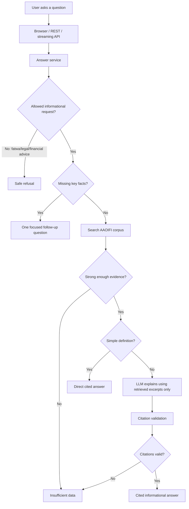
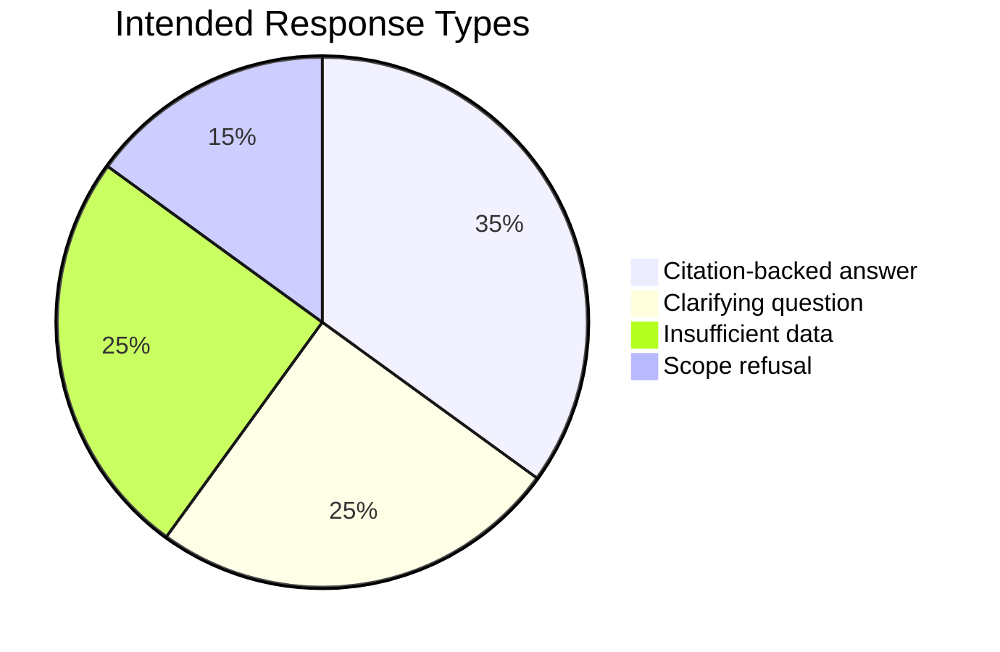
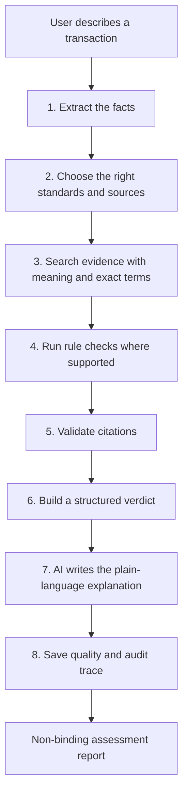
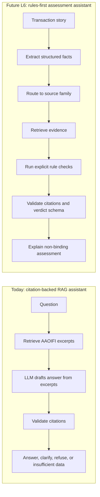

# Mushir Client Report: Planning, Implementation, And How The Chatbot Works

Last refreshed: 2026-06-01
Current app version: V1.5 (`1.5.0`)

This report explains Mushir in plain language for a non-technical client. It covers the project goal, what has already been implemented, how the current chatbot answers safely, what remains before a stronger release, and how the future product direction expands from a citation-backed chatbot into a structured Sharia commercial-process assessment assistant.

## Executive Summary

Mushir is a Sharia compliance research assistant for Islamic finance questions. Today, it searches the provided AAOIFI Financial Accounting Standards corpus, answers in English or Arabic, cites the source excerpts it used, and avoids guessing when the evidence is weak.

Mushir is not a scholar, lawyer, financial advisor, or Sharia board. It does not issue binding fatwas. It is best understood as a careful preparation and research assistant: it helps users find relevant standards, understand what evidence is available, identify missing facts, and prepare better questions for a qualified Sharia scholar or compliance team.

The implementation is already more than a prototype chatbot. V1.5 has a browser chat page, API endpoints, streaming support, multilingual retrieval, citation validation, safe refusal behavior, readiness checks, deployment documentation, visible app versioning, and the first guarded Egypt financial-institution evidence-corpus exports. The current runtime remains a careful AAOIFI evidence assistant. The proposed future phase is L6: a rules-first commercial-process evaluator.

The V1.5 data milestone on 2026-06-01 loaded 2,154 Egyptian financial-institution baseline records: 36 banks, 797 capital-market entities, 996 insurance entities, and 325 non-bank finance entities. CBE and FRA live registry pages were checked but blocked by security/CAPTCHA controls, so the system recorded those gaps instead of bypassing them. A bounded bank evidence scrape found 32 bank website candidates, scraped 14, failed or blocked 18, fetched 73 public pages, and exported 69 machine-proposed AAOIFI mapping rows for scholar review. These rows are review inputs only, not final Sharia rulings.

## The Product In One Sentence

Mushir helps users ask Islamic finance questions and receive careful, citation-backed guidance from approved standards, while refusing to act as the final religious or legal authority.

## What Mushir Does Today

| Client need | Current Mushir behavior |
| --- | --- |
| Ask in English, Arabic, or mixed language | Detects language and responds in the same language where possible |
| Ask a simple definition question | Searches the corpus and returns a short cited explanation if evidence exists |
| Ask an unclear transaction question | Asks one focused follow-up question instead of asking a long checklist |
| Ask a transaction compliance question | Retrieves AAOIFI excerpts, asks the model to answer only from those excerpts, then validates citations |
| Ask a construction delay-penalty question where the delaying party is unclear | Asks whether the delay is by the contractor or by the customer before giving any verdict |
| Ask for a binding fatwa | Refuses and explains that the system is informational only |
| Ask something not supported by the indexed documents | Returns insufficient data instead of guessing |
| Use the chatbot in a browser | Provides `/chat` as the demo user interface |
| Integrate from another app | Provides REST and Server-Sent Events API endpoints |
| Check deployment health | Provides `/health`, `/ready`, and `/metrics` endpoints |
| Check app version | Reports V1.5 / `1.5.0` through API metadata, health/readiness responses, package metadata, and the chat header |
| Prepare institution evidence for review | Exports bank operation evidence, Mushir engine AAOIFI candidates, and bilingual scholar-review lists |

## What Mushir Does Not Do

Mushir does not:

- issue binding fatwas;
- replace qualified Islamic finance scholars;
- replace legal, accounting, or investment advice;
- guarantee that a real-world transaction is halal or haram;
- answer from the model's general internet knowledge;
- invent citations, standard numbers, or source references;
- support all AAOIFI standard families unless those documents have been acquired, reviewed, and indexed;
- support every possible commercial transaction structure.

## Planning Roadmap In Plain Language

The project has been planned in levels. Some older planning files still exist for history, but the current roadmap is:

| Level | Plain-language meaning | Current state |
| --- | --- | --- |
| L0 | Build the first retrieval chatbot over standards | Completed historically |
| L1 | Add clarification, safer answer contracts, and better service structure | Implemented in the current code path |
| L2 | Add API, browser chat, streaming, validation, and rate limiting | Implemented in the current code path |
| L3 | Add production-style infrastructure options such as Qdrant, Redis, PostgreSQL, metrics, and readiness checks | Implemented as configurable options and readiness gates |
| L4 | Add trust, citation quality, disclaimers, caching controls, and operational hardening | Implemented as part of the current safety layer |
| L5 | Prove quality and release readiness through tests, retrieval evaluation, deployment checks, and runbooks | Active gate |
| V1.5 | Versioned app and guarded Egypt institution evidence exports | Implemented as review-only evidence corpus outputs, not runtime Sharia authority |
| L6 | Future direction: rules-first Sharia commercial-process evaluator | Proposed; first runtime scaffold and V1.5 evidence exports exist, full evaluator is not active scope |

The most important planning correction is that the current system should not be described as "complete Sharia verdict automation." Today it is a citation-grounded assistant over the available corpus. The future L6 direction adds transaction modeling and rule checks so that broader commercial-process assessment can become safer and more structured. A first runtime scaffold now records transaction-scenario metadata, source routing, rule-trace placeholders, and a fail-closed guard for late-payment/default permissibility questions when Shari'ah-standard evidence is missing.

The newest hard-case update is deliberately conservative: if a construction contract includes a delay penalty, Mushir should not assume the case is a debt penalty, a Salam case, or a charity clause. It first asks who delayed. If the context is construction / Istisna, the relevant routing is SS-05 plus SS-11; SS-10 is Salam and is not used for that case unless the question actually involves Salam.

## Current Implementation Overview

## How The Answer Pipeline Works

1. **The user asks a question.** The question can come from the browser chat page, the REST API, or the streaming API.
2. **The API validates the request.** It checks request shape, rate limits, session context, and disclaimer requirements where configured.
3. **The service checks scope.** Binding fatwas, legal advice, and financial advice are refused.
4. **The clarification engine checks whether key facts are missing.** If a transaction is too vague, Mushir asks one focused follow-up question.
5. **The retriever searches the indexed standards.** The current demo uses a multilingual Chroma index built from English and Arabic corpus material.
6. **Definition questions can be answered directly.** If the retrieved excerpt clearly defines the term, Mushir can answer without calling the model.
7. **The model receives only retrieved evidence.** The prompt tells it not to use outside knowledge and to stay within the excerpts.
8. **Citations are validated.** Mushir accepts citations only when they match retrieved chunks.
9. **The final response is returned.** It can be a cited answer, a follow-up question, an insufficient-data response, or a safe refusal.

## Why The System Is Cautious

Islamic finance answers depend on details. For example, a car purchase through a bank may depend on whether the bank owns the car before sale, whether the price is fixed, whether the markup is disclosed, whether late-payment penalties exist, who receives those penalties, and what the signed contract actually says.

If those facts are missing, a confident answer is risky. Mushir is intentionally designed to ask, refuse, or say "insufficient data" instead of pretending to know what the transaction contract contains.

These percentages are illustrative, not production analytics. They show the intended trust posture: not every question should receive a confident answer.

## Example User Journeys

### 1. Definition Question

User asks:

> What is Murabaha?

Expected behavior:

1. Mushir recognizes this as a definition-style question.
2. It searches the AAOIFI corpus.
3. It returns a short explanation with a citation if a relevant excerpt is available.
4. It avoids turning a definition into a full transaction ruling.

### 2. Arabic Definition Question

User asks:

> ما هي المرابحة؟

Expected behavior:

1. Mushir detects Arabic.
2. It searches the multilingual index.
3. It answers in Arabic where possible.
4. It includes a validator-backed citation.

### 3. Unclear Car-Purchase Question

User asks:

> أريد شراء سيارة بالمرابحة

Expected behavior:

Mushir should not immediately issue a ruling. It should ask one focused question, such as asking for the asset, contract structure, ownership, payment terms, or another missing fact needed for a grounded assessment.

### 4. Bank Installment Question With Late Penalty

User asks about buying a car through a bank with installments and a late-payment penalty.

Expected behavior today:

1. Mushir should identify that this is a transaction assessment question.
2. If the current corpus does not contain enough Sharia permissibility evidence, it should not force a halal/haram answer.
3. It should ask for missing facts or return insufficient data with citations.
4. It should explain that a qualified scholar or Sharia compliance reviewer must review the contract.

Expected behavior in future L6:

1. Mushir extracts structured transaction facts.
2. It routes permissibility questions to Shari'ah Standards first.
3. It applies explicit rules for supported structures such as Murabaha and late-payment clauses.
4. It returns a non-binding assessment with evidence, missing facts, risk flags, and scholar-review guidance.

### 5. Binding Fatwa Request

User asks:

> Give me a binding fatwa.

Expected behavior:

Mushir refuses politely and explains that it provides informational, evidence-backed guidance only.

### 6. Construction Delay-Penalty Question

User asks:

> Is a delay penalty clause in a construction contract riba?

Expected behavior:

1. Mushir recognizes this as a high-risk construction / Istisna hard case.
2. If the question does not say who delayed, Mushir asks one focused question: was the penalty because the contractor was late delivering, or because the customer was late paying?
3. It routes the construction case toward SS-05 and SS-11, not SS-10 or generic debt/riba standards.
4. It still refuses to issue a binding fatwa and requires governed evidence plus scholar review for final authority.

## Safety Controls

| Risk | Current control |
| --- | --- |
| The model guesses from general knowledge | Prompt restricts answers to retrieved excerpts |
| The model invents a citation | Citation validator accepts only citations backed by retrieved chunks |
| Arabic retrieval silently fails | Readiness checks require the configured multilingual index when Arabic retrieval is enabled |
| User asks an unclear question | Clarification engine asks one focused follow-up question |
| Construction penalty is confused with loan/debt penalty | Hard-case routing matrix and goldset tests require clarification and block the wrong standards |
| User asks for a fatwa or legal advice | Authority guard refuses within informational scope |
| Provider or model fails | API maps failures to safe messages |
| Secrets appear in docs or errors | Docs use placeholders and errors are sanitized |
| Free model route is overloaded | Project guidance limits live matrix testing against `openrouter/free` |

## Current Implementation Components

| Component | What it means for the client |
| --- | --- |
| FastAPI application | The backend that serves chat, API, health, readiness, and metrics |
| Browser chat UI | The visible demo interface users can try |
| Application service | The main decision coordinator for refusal, clarification, retrieval, generation, validation, cache, and audit |
| Clarification engine | The part that decides when one follow-up question is safer than an answer |
| RAG pipeline | The search layer that finds relevant AAOIFI excerpts |
| Hard-case routing matrix | The regression guard for launch-blocking questions such as construction delay penalties |
| Multilingual embeddings | The retrieval model that supports English and Arabic corpus search |
| OpenRouter LLM client | The model provider interface used to draft answers from retrieved evidence |
| Citation validator | The trust layer that checks whether answer citations match retrieved evidence |
| Session and rate-limit layers | The controls that support multi-turn use and protect the service |
| Readiness and metrics | Operational signals showing whether the app is ready and healthy |

## Source Coverage Today

The current system is grounded in the acquired and indexed AAOIFI corpus configured for the demo, with emphasis on FAS material. This is useful for accounting and citation-backed informational guidance, but it is not enough for every permissibility question.

The planning docs now explicitly separate:

- **Shari'ah Standards:** the future primary source family for permissibility and contract-validity questions.
- **FAS Standards:** the source family for accounting, recognition, measurement, presentation, and disclosure.
- **Governance, ethics, auditing, fatwa, and local overlays:** future or conditional sources that require acquisition, versioning, and review before runtime use.

## L5: What Remains Before Stronger Release Confidence

L5 is the active readiness gate. It focuses on proving that the current implementation is reliable enough for demo or controlled beta use.

Important L5 gates:

- automated tests pass for core answer behavior;
- Arabic and English retrieval work against the correct multilingual index;
- citations are validated and cannot be invented;
- unclear questions ask one focused follow-up;
- out-of-scope or weak-evidence questions fail closed;
- `/health`, `/ready`, `/chat`, REST, and streaming endpoints work;
- deployment docs and runbooks are current;
- secrets are not exposed in docs, logs, or UI;
- OpenRouter free-model usage stays small and throttled.

Current automated proof point:

- Critical goldset: `19 passed, 19 skipped`.
- Evaluation framework: `96 passed, 44 skipped`.
- Full local suite: `619 passed, 48 skipped, 2 warnings`.

## L6: Future Product Direction

L6 is the proposed future stage. It widens Mushir from a citation-backed chatbot into a structured commercial-process assessment assistant.

In the simplest words, the future L6 engine should work like a careful review desk:

1. It reads the user's transaction story.
2. It turns the story into clear facts.
3. It chooses the right source family.
4. It searches for the best evidence.
5. It applies explicit checks where the rules are known.
6. It verifies citations.
7. It produces a structured non-binding assessment.
8. It lets the AI write a clear explanation from that checked assessment.
9. It records what happened so quality can be tested later.

The future L6 flow would look like this:

### What Each Step Means For The Client

| Step | Simple explanation | Why it matters |
| --- | --- | --- |
| Scenario extraction | Mushir identifies the parties, asset, contract type, payment terms, ownership, risk, and missing facts | The system cannot assess a transaction safely if the facts are vague |
| Standards/source router | Mushir decides whether the question needs Shari'ah Standards, FAS, governance sources, or another reviewed source family | Halal/haram questions should not be answered from accounting standards alone |
| Hybrid retrieval | Mushir searches by meaning and by exact words such as Arabic terms, English terms, contract names, and standard numbers | This improves evidence quality compared with simple keyword search or simple vector search alone |
| Deterministic rule checks | Mushir applies explicit checks for supported cases, such as whether required ownership or late-payment facts are present | The model should not silently invent the decision logic |
| Citation validation | Mushir checks that the cited sources actually came from retrieved evidence | This prevents invented citations and weak source references |
| Structured verdict | Mushir produces a controlled result such as `requires clarification`, `insufficient evidence`, `refer to scholar`, or a limited supported assessment | The result can be tested and reviewed instead of being only free-form text |
| LLM explanation | The AI turns the checked result into readable English or Arabic | The AI explains; it does not become the final authority |
| Evaluation and tracing | The system records routing, evidence, rule outcomes, citation checks, and quality metrics | The team can test regressions and prove why an answer was allowed or blocked |

### Current RAG Vs Future Rules-First Assessment

The difference is control. Today, Mushir is already cautious because it retrieves evidence and validates citations. In L6, Mushir becomes more structured: it first builds a testable assessment record, then generates the explanation from that record.

L6 should start with limited domains instead of "all commercial processes" at once:

- Murabaha, deferred sale, and installment purchase;
- late-payment penalties and default clauses;
- Ijarah and lease-to-own structures;
- Qard, loan, and interest detection;
- Wakala and investment agency.

Each domain needs source mapping, transaction fields, rules, gold test cases, and human-review criteria before it can be called supported.

### Egypt Institution Operations Corpus

A new planned L6 data workstream prepares Mushir to understand public Egyptian financial-institution operations more concretely. The team will build a public-source corpus covering CBE banks, payment services, capital-market firms, insurers and takaful providers, non-bank finance companies, Islamic funds, sukuk sources, and FRA model contracts.

The goal is not to scrape names only. The useful evidence is in tariffs, fees, product terms, contracts, model contracts, prospectuses, annual reports, fund documents, policy wordings, and regulator rulebooks.

This corpus supports two client goals:

- test Mushir against real public operations, then let a Sharia scholar review whether the engine selected the right AAOIFI references and initial risk label;
- help future answers start from documented public product details when a user asks about a named institution or contract.

The safety rule remains strict: if a contract or official source is not publicly found after bounded research, Mushir records the gap instead of guessing. Machine labels are provisional until scholar-reviewed, and user-supplied facts override stored institution assumptions.

## Recommended Client Positioning

Use this wording:

> Mushir is an evidence-backed Islamic finance research and assessment assistant. It helps users understand relevant standards and missing facts, but final Sharia decisions remain with qualified scholars and compliance reviewers.

Avoid this wording:

> Mushir issues fatwas.

Avoid this wording:

> Mushir can decide whether any commercial transaction is halal.

Avoid this wording:

> FAS standards alone are enough to determine permissibility.

## Client Acceptance Checklist

Before a demo or handoff, verify:

- the chat page opens;
- `/health` returns healthy;
- `/ready` reports the retriever is ready;
- English definition query returns a citation-backed informational answer;
- Arabic definition query returns a citation-backed informational answer;
- unclear Arabic transaction query asks one follow-up question;
- binding fatwa request is refused safely;
- unsupported or weak-evidence question does not produce a confident verdict;
- no API keys or credentials appear in screenshots, logs, docs, or responses;
- OpenRouter/free smoke checks are small and spaced out.

## Plain-Language Bottom Line

Mushir is built to be careful. If it has reliable evidence, it answers with citations. If the question is unclear, it asks for one missing detail. If the evidence is not strong enough, it says so. The next planning stage keeps that same safety promise while adding structured transaction analysis and rule checks for a limited set of commercial processes.
