# Mushir Client Roadmap: Source-Governed AAOIFI Assistant

Last refreshed: 2026-06-01
Current app version: V1.5 (`1.5.0`)

## Who This Is For

This document is written for clients, project owners, Islamic finance stakeholders, and non-technical reviewers.

After reading it, the client should be able to answer:

- what Mushir is trying to become;
- what the current chatbot can already do;
- why the project must be more than a normal chatbot;
- what the next planning steps mean in simple language;
- what terms like RAG, vector database, source catalog, routing, and citation validation mean;
- what must be verified before Mushir can safely expand into stronger commercial-process assessment.

## One-Page Summary

Mushir is being shaped into a careful AAOIFI standards assistant for Islamic finance questions.

V1.5 marks the first version where the app exposes version metadata and where the Egypt financial-institution evidence workstream has produced guarded, review-only bank operation exports. It does not turn Mushir into a final Sharia authority.

The goal is not to build a chatbot that guesses answers from documents. The goal is to build a controlled assistant that:

1. understands English, Arabic, and mixed-language questions;
2. recognizes the financial operation behind the user's wording;
3. searches the right AAOIFI standard or source family;
4. checks whether the source is current and relevant;
5. asks a clarifying question when the question is unclear;
6. answers only when the evidence is strong enough;
7. shows citations;
8. refuses or says "insufficient data" when the evidence is not enough.

The simple idea:

> Mushir should behave like a careful research assistant, not like a final Sharia authority.

Mushir can help users understand standards and prepare better questions. It must not issue binding fatwas, legal advice, or investment advice.

## The Product In One Picture

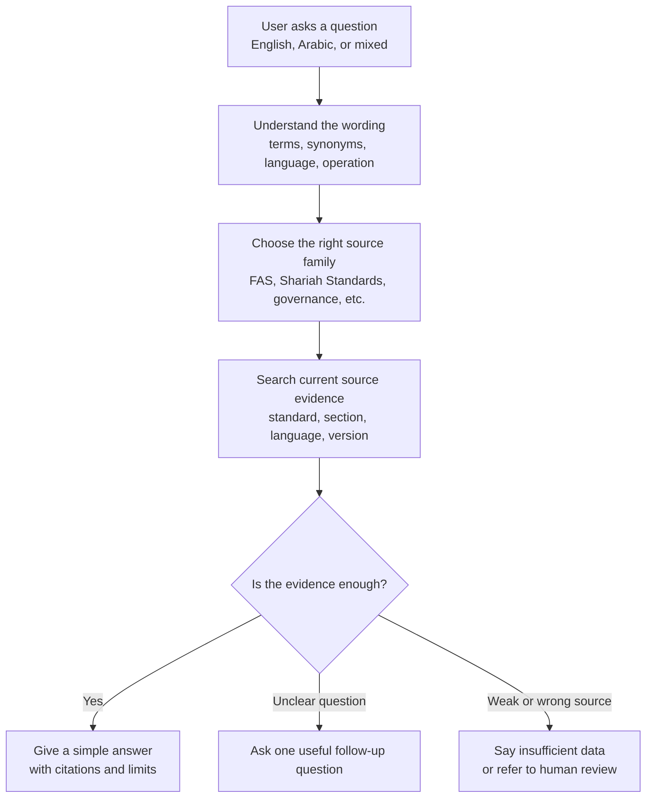

## Why This Is More Than A Normal Chatbot

A normal chatbot can sound confident even when it is wrong.

Mushir needs a different design because Islamic finance answers depend on:

- the exact contract type;
- the source family being used;
- whether the user is asking about accounting or permissibility;
- whether the standard is current or superseded;
- whether the cited text actually supports the answer;
- whether key facts are missing.

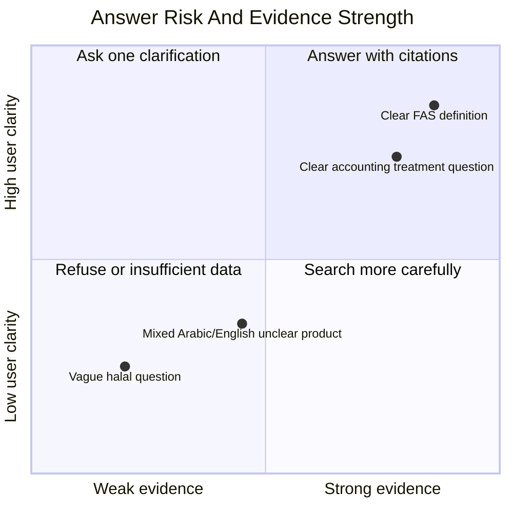

## Current State Versus Target State

| Area | Current capability | Target direction |
|---|---|---|
| Chat interface | Browser chat, REST API, and streaming API exist | Keep the same surfaces, but strengthen the answer logic behind them |
| Corpus search | Searches the indexed AAOIFI text corpus | Search with source catalog, version, language, standard, and section awareness |
| Arabic support | Arabic and English retrieval are supported through multilingual embeddings | Add stronger Arabic normalization, dialect/synonym handling, and Arabic test cases |
| Clarification | Can ask follow-up questions when a transaction is unclear | Make clarification policy measurable and tied to missing facts |
| Citations | Validates that citations come from retrieved evidence | Add stronger source lineage from official source to answer citation |
| Permissibility questions | Fails closed when Shariah evidence is missing | Add Shariah-standard routing only after the required sources are acquired and governed |
| Future assessment | First scaffold exists for commercial assessment | Build rules-first assessment one supported domain at a time |
| App versioning | V1.5 / `1.5.0` is exposed in API metadata, health/readiness responses, package metadata, and the chat UI | Keep future releases explicit and auditable |
| Egypt institution evidence | V1.5 exported 69 machine-proposed bank operation mapping rows from bounded public crawling | Add official-site discovery for non-bank sectors, then scholar review and promotion gates |

## Simple Glossary

| Term | Simple meaning | Why it matters |
|---|---|---|
| AAOIFI | A standards-setting body for Islamic finance institutions | Mushir is meant to answer from AAOIFI standards, not from random internet text |
| FAS | Financial Accounting Standards | These support accounting, reporting, recognition, measurement, and disclosure questions |
| Shariah Standards | Standards focused on Shariah rules and contract validity | These are needed for permissibility questions, not FAS alone |
| RAG | Retrieval-Augmented Generation; the system searches documents before the AI writes | It helps the AI answer from evidence instead of memory |
| Vector database | A search database that finds text by meaning, not only exact words | Useful when users ask with synonyms, Arabic wording, or mixed language |
| Embeddings | Number representations of text meaning | They let the system compare a question with relevant standard passages |
| Chunk | A smaller piece of a long standard document | The system retrieves chunks so it can cite relevant sections |
| Parent/child chunking | A large parent section keeps context; smaller child chunks improve search | This helps Mushir find exact evidence without losing the standard section context |
| Source catalog | A register of every official or derived source used by Mushir | It proves where each answer-supporting chunk came from |
| Supersession | When an older standard is replaced or updated by a newer one | Mushir must not use outdated standards for current answers unless the user asks historically |
| Concept map | A governed list of terms, synonyms, Arabic variants, and finance concepts | It helps Mushir connect words like Murabaha, deferred sale, and Arabic equivalents |
| Router | The part that decides which source family or standard to search | It prevents using accounting evidence for Shariah permissibility conclusions |
| Clarification | A follow-up question asked when the user's request is unclear | It is safer to ask one missing detail than to guess |
| Citation validation | A check that the answer's citations really came from retrieved evidence | It blocks invented references |
| Answer admissibility | The final safety gate before returning an answer | The answer must pass source, evidence, citation, and scope checks |
| Gold set | A trusted set of test questions with expected answers or expected refusals | It measures whether Mushir is improving safely |
| Feedback loop | A review process where experts can mark answers as correct, weak, stale, or unsafe | It turns expert review into future tests without silently changing the system |
| L5 | The current release-readiness phase | It proves the existing assistant is safe enough for demo or controlled beta use |
| L6 | The future rules-first assessment phase | It adds structured transaction facts and explicit rule checks for limited domains |

## The New Planning Direction

The strongest planning correction is this:

> RAG is not the brain. RAG is the evidence search layer.

The real product brain is the controlled workflow around the evidence:

```mermaid
flowchart LR
    Source["Source governance"] --> Terms["Term and concept understanding"]
    Terms --> Intent["Intent classification"]
    Intent --> Clarify["Clarification if needed"]
    Clarify --> Route["Source and standard routing"]
    Route --> Retrieve["Evidence retrieval"]
    Retrieve --> Validate["Citation and admissibility validation"]
    Validate --> Response["Answer, clarify, insufficient data, or refusal"]
```

In simple words, Mushir should first decide what kind of question it is dealing with, then search the right authority, then answer only if the evidence passes checks.

## Source Governance: The Foundation

The downloaded text files are useful, but they are not enough by themselves. Each file must be connected to an official source record.

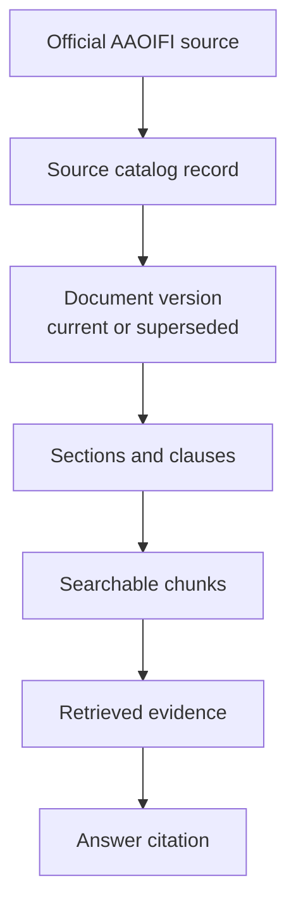

### Why The Source Catalog Matters

The source catalog answers questions like:

- Which standard is this text from?
- Is it an accounting, Shariah, governance, ethics, auditing, or other source?
- Is it current?
- Was it replaced by a newer standard?
- Is the Arabic and English version connected?
- When was it acquired?
- Is it official, derived from official material, or unverified?

Without this catalog, the system may retrieve a useful-looking passage but still fail the client requirement: proving that the answer came from the right, current source.

## The First Router Map

The research report added a useful starting map for accounting questions. This map is a seed, not final authority. It must be verified through the source catalog before production use.

| User topic | Candidate accounting standards |
|---|---|
| Murabaha / deferred payment sale | FAS 28 |
| Salam | FAS 7, FAS 52 |
| Istisna | FAS 10, FAS 52 |
| Ijarah / leasing | FAS 32 |
| Mudaraba | FAS 3 |
| Musharaka | FAS 4, FAS 51 |
| Wakala bi al-Istithmar / investment agency | FAS 31 |
| Zakah | FAS 9, FAS 39 |
| Takaful | FAS 42, FAS 43 |
| Sukuk, shares, and similar instruments | FAS 33, FAS 34 |

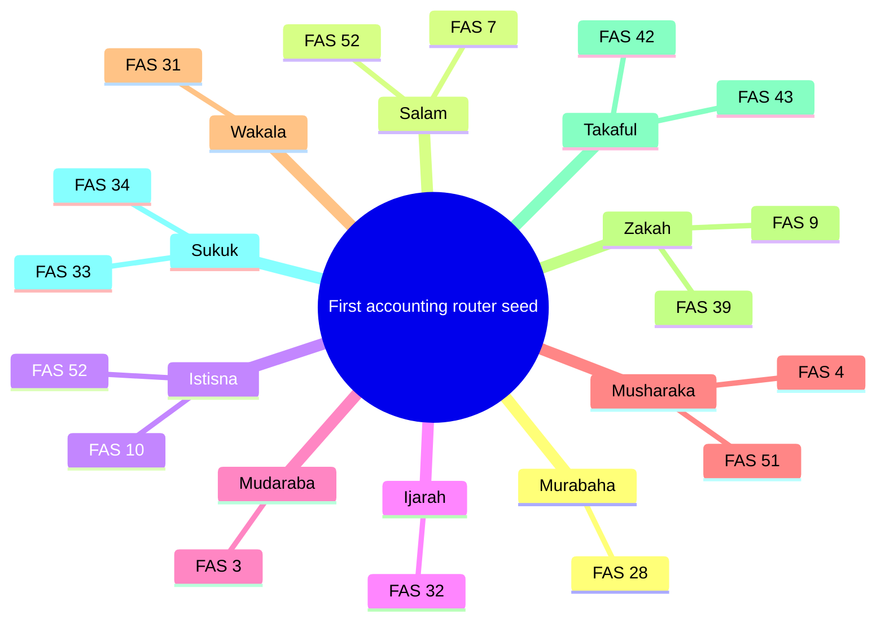

### What This Means For The Client

This map helps Mushir search the right file faster.

For example:

- if the user says "Murabaha," "cost-plus sale," "installment sale," or an Arabic equivalent, Mushir should know that FAS 28 is a candidate accounting route;
- if the user says "lease," "ijarah," or an Arabic lease phrase, Mushir should know that FAS 32 is a candidate accounting route;
- if the user asks about whether the transaction is halal, Mushir must not stop at FAS. It needs Shariah-standard evidence or must fail closed.

## Supersession: Avoiding Outdated Standards

Some older standards may be replaced by newer standards. This is called supersession.

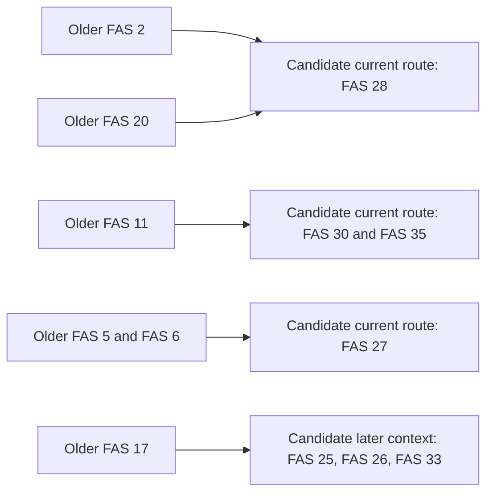

This matters because an answer can be wrong even if it quotes a real standard, if the quoted standard is no longer the right current standard.

## Understanding User Language

Users will not always use standard titles.

They may write:

- English terms;
- Arabic terms;
- mixed Arabic and English;
- transliterated terms like "murabaha";
- colloquial Arabic;
- misspellings;
- legacy names;
- product names used inside banks.

Mushir needs to translate this messy wording into governed financial concepts.

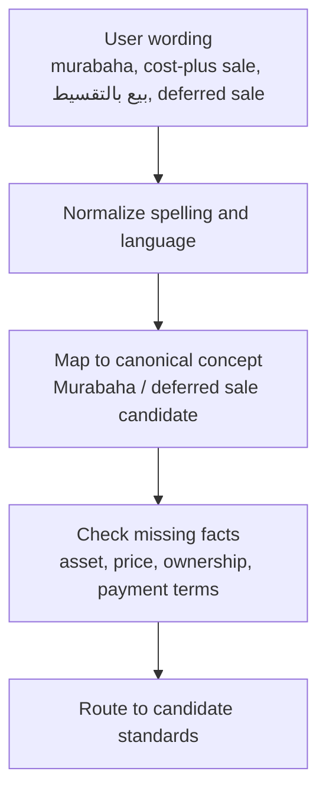

## Clarification: Asking One Useful Question

Clarification means Mushir asks a follow-up question before answering.

It should happen when:

- the product type is unclear;
- the user mixes accounting and permissibility;
- several standards could apply;
- the user mentions a legacy standard;
- the transaction facts are missing;
- the evidence is weak;
- the language is mixed in a way that changes meaning.

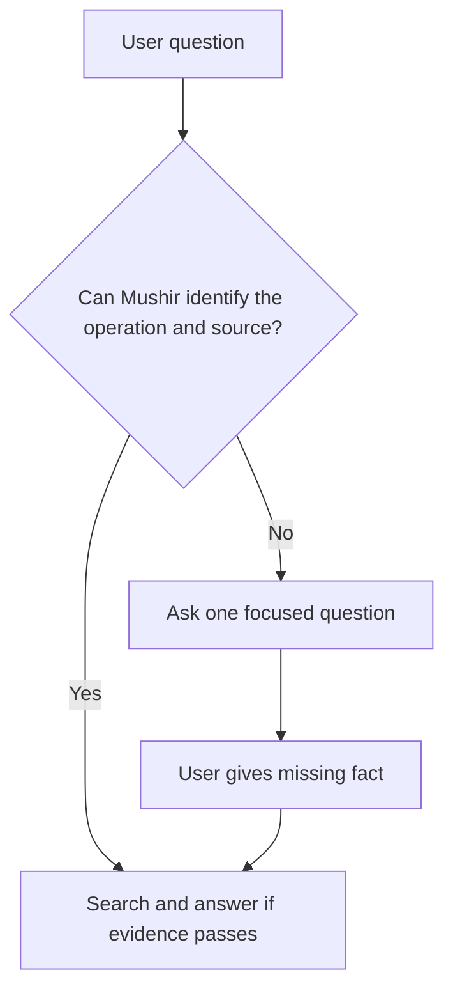

Example:

> When you say deferred sale, do you mean Murabaha/deferred payment sale, or a deferred-delivery contract such as Salam or Istisna?

This is not hidden reasoning. It is a visible user question that helps narrow the answer.

## The Safe Answer Gate

Before Mushir gives an answer, it should pass this gate:

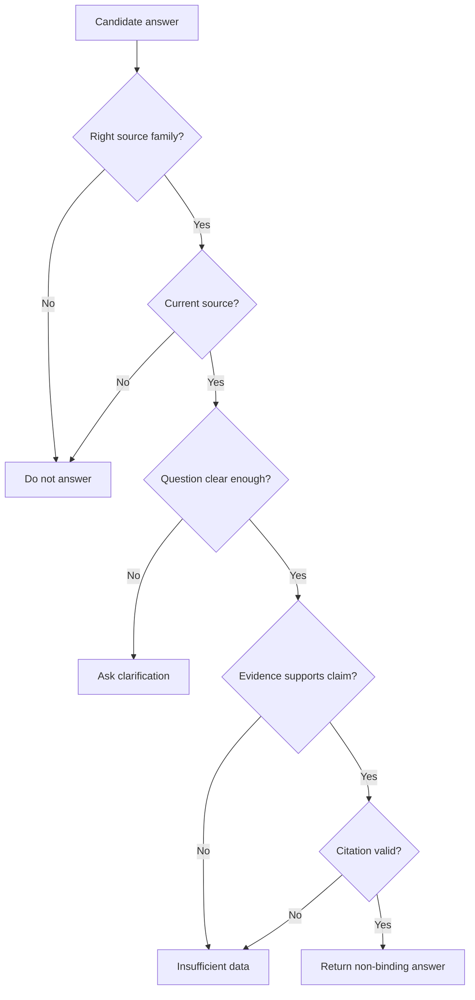

## Current RAG Versus Future Rules-First Assessment

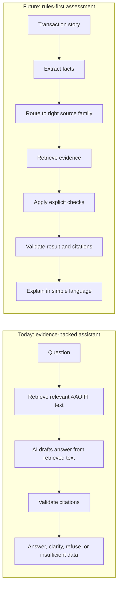

The future L6 stage should not try to support every Islamic finance scenario at once. It should start with limited, high-value domains.

## Recommended L6 Starting Domains

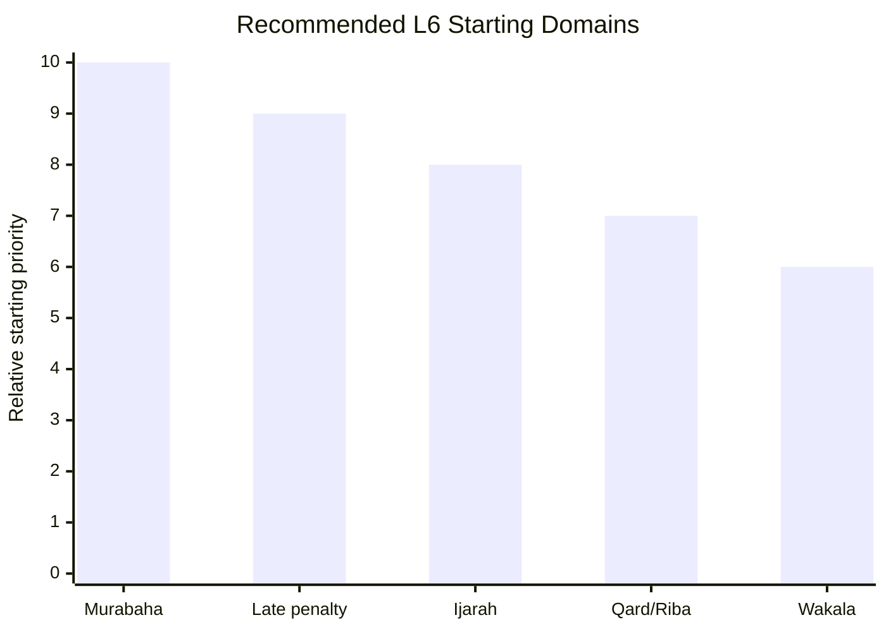

| Domain | Why it is useful | Why it still needs caution |
|---|---|---|
| Murabaha / deferred sale | Common Islamic finance product | Needs facts about ownership, price, asset, and payment terms |
| Late-payment penalties | High-risk and frequently asked | Needs Shariah-standard evidence and exact penalty handling |
| Ijarah / lease | Common product and familiar to users | Lease-to-own structures can be complex |
| Qard / riba / loan | Important boundary area | Must avoid issuing broad fatwa-style answers |
| Wakala / investment agency | Useful for investment and agency structures | Needs mandate, roles, and risk allocation facts |

## Roadmap In Simple Words

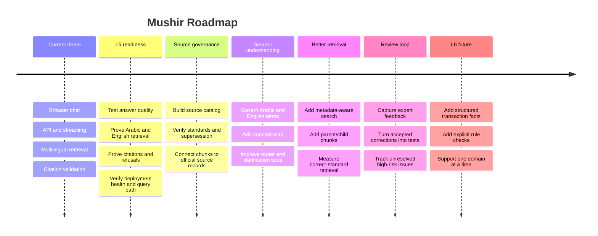

## What Should Be Built Next

The next work should reduce risk in this order:

1. **Finish L5 release readiness.** Prove the current assistant works reliably before expanding scope.
2. **Build the source catalog.** Every answer-supporting chunk should trace back to a known source.
3. **Verify the first router and supersession maps.** The research seeds are useful, but they must be confirmed.
4. **Improve ingestion metadata.** Chunks need source, standard, section, language, currentness, and parent context.
5. **Create the governed concept map.** Arabic and English terms should move out of scattered code and into reviewable data.
6. **Improve retrieval evaluation.** Measure whether Mushir finds the right standard, not only similar text.
7. **Add feedback/admin review.** Expert corrections should become future test cases.
8. **Start L6 carefully.** Add rules-first assessment for one supported domain at a time.

## Project Health Dashboard

This chart is illustrative. It shows the planning view after the latest review, not a production analytics report.

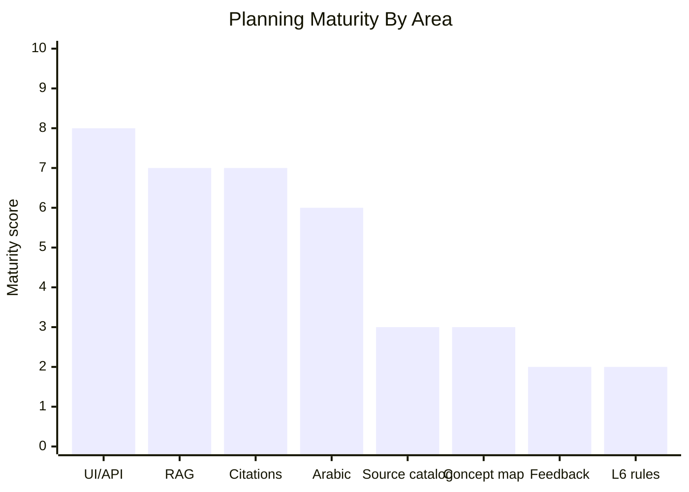

## Where The Main Risks Are

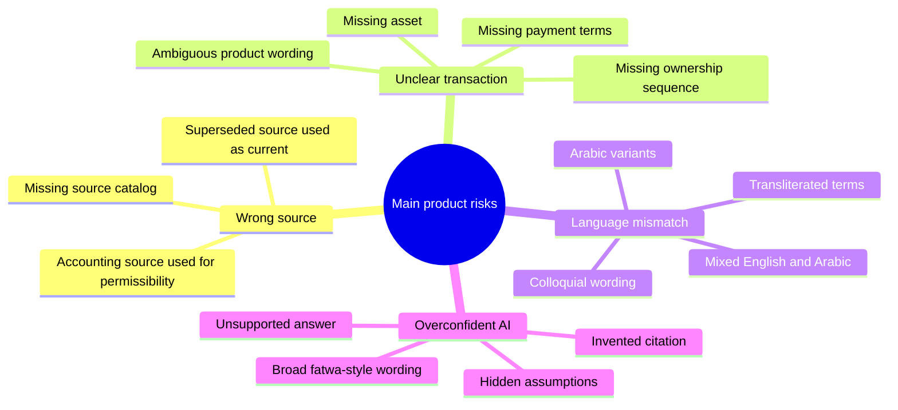

## How Client Review Should Work

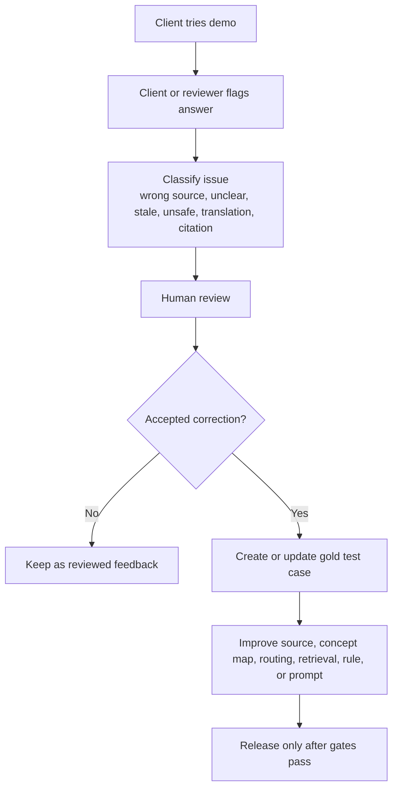

Feedback should not silently change how Mushir answers. A human reviewer should decide whether the feedback changes the source catalog, concept map, router, rules, prompts, or tests.

## Client-Friendly Acceptance Checklist

Before calling the next release ready, the client should see proof that:

- English and Arabic questions both work;
- simple definitions return cited answers;
- unclear transaction questions ask one focused clarification;
- weak-evidence questions return insufficient data instead of guessing;
- fatwa or binding-ruling requests are refused;
- citations point to retrieved source evidence;
- the system can explain which source family it used;
- superseded-source handling is tested;
- the live chat and API paths both work;
- no secrets or API keys appear in logs, docs, screenshots, or responses;
- bulk tests do not overload constrained free model routes.

## Suggested Client Wording

Use this:

> Mushir is a standards-grounded Islamic finance assistant. It helps users find relevant AAOIFI evidence, understand missing facts, and prepare better compliance questions. It is not a final Sharia authority.

Avoid this:

> Mushir issues fatwas.

Avoid this:

> Mushir can determine whether any transaction is halal or haram.

Avoid this:

> Accounting standards alone are enough for Shariah permissibility.

## Final Plain-Language Message

Mushir is becoming a careful, source-governed assistant.

The important shift is that the system should not simply search documents and let AI answer. It should first understand the question, route it to the right authority, check that the source is current, retrieve evidence, validate citations, and only then answer.

If the question is unclear, it should ask one useful follow-up. If the evidence is weak, it should say so. If the user asks for a binding ruling, it should refuse.

That is the trust posture clients should expect: careful help, clear evidence, visible limits, and controlled expansion.
