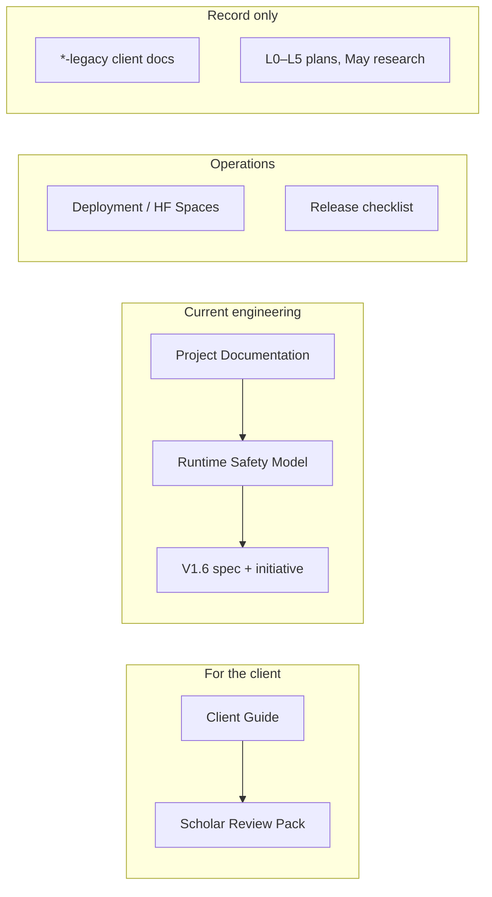

# Mushir Documentation Index

Last refreshed: 2026-10-01 · Live app V1.5 (`1.5.0`) · V1.6 dual-lane prototype in build

## Status Right Now

| | |
| --- | --- |
| Active work | V1.6 dual-lane prototype for Egyptian instalment finance: [initiative](../../../_bmad-output/initiative-egypt-market-knowledge/initiative-egypt-market-knowledge.md) and [spec](../../../_bmad-output/initiative-egypt-market-knowledge/spec-egypt-market-poc/spec-egypt-market-poc.md) |
| Runtime rule | No Sharia verdict without a scholar-approved rule card; see [Runtime Safety Model](runtime-safety-model.md) |
| Tests | 1,234 passed, 12 waiting for a scholar decision, 47 skipped; Playwright 30/30 |
| Main blocker | **No scholar appointed.** Rule cards, the 12 open cases and the V1.6 exit gate all depend on one |

## For The Client

- [Mushir Client Guide](client-guide.md): the single client-facing guide: status, how Mushir answers, Egyptian market findings, the scholar's role, release plan and decisions needed. Page version: [client-pages/client-guide.html](client-pages/client-guide.html), shared at https://claude.ai/artifact/N5sTGi4S15Kj3A1KdADGtP.
- [Scholar Review Pack](client-pages/scholar-review-pack.html) (shared at https://claude.ai/artifact/4CE8SuwyTbb4vCQK56asMQ): the decision document for the 12 questions waiting for a scholar, with options, a reply template and anticipated questions.

## Start Here (Developers And Agents)

- [Runtime Safety Model](runtime-safety-model.md): how V1.6 decides what Mushir may say: rule-card gate, described-operation lane, evidence status, decision-review store, test status and configuration. **Read this before the older pipeline docs.**
- [Project Context](../../../project-context.md): concise implementation rules for AI agents and developers.
- [Egypt Market POC Spec](../../../_bmad-output/initiative-egypt-market-knowledge/spec-egypt-market-poc/spec-egypt-market-poc.md): the canonical product contract (CAP-1..15), with companions for architecture, fact model, archetypes, rule cards and the [release ladder](../../../_bmad-output/initiative-egypt-market-knowledge/spec-egypt-market-poc/release-ladder.md).
- [Roadmap And Planning Index](../next-level-plans/README.md): L0–L5 history, the V1.6–V2.0 ladder mapped to epics, and current epic status.
- [Deferred Work](../../../_bmad-output/initiative-egypt-market-knowledge/deferred-work.md): open known limits and items awaiting decisions.

## Technical Reference

These remain accurate for retrieval, ingestion, API surfaces and infrastructure. Their descriptions of how a **verdict** is produced predate the rule-card gate; where they differ, the Runtime Safety Model wins.

- [Project Documentation](project-documentation.md): full technical documentation.
- [Project Clarifications And Developer Walkthrough](project-clarifications-and-developer-walkthrough.md): code-path walkthrough with diagrams.
- [Architecture](chatbot-architecture.md): component-level architecture of the answer path.
- [Pipeline Architecture (V2)](pipeline-architecture-v2.md): routing, resolver and quality-gate diagrams.
- [AI Project Brief](ai-project-brief.md): compact handoff for AI agents.
- [Maintained Requirements](requirements.md), [Design](design.md), [Tasks](tasks.md): source-governed requirements and design from May–June 2026.
- [Version History](version-history.md) and [CHANGELOG](../../../CHANGELOG.md).

## Egyptian Market Workstream

- [L6 Egypt Institution Scrape Workstream](l6-egypt-institution-scrape/README.md): registries, bank and FRA scrapes, outputs.
- [FRA-first review, 2026-10-02](../../../_bmad-output/initiative-egypt-market-knowledge/fra-first-review-2026-10-02.md): FRA registers (licence-level), the providers register, the company table, pilot seven, FRA publications, OCR.
- [FRA model contracts, 2021 vs 2026](../../../_bmad-output/initiative-egypt-market-knowledge/fra-model-contract-comparison-2021-2026.md) and [FRA Sharia Murabaha model vs Model (1)](../../../_bmad-output/initiative-egypt-market-knowledge/fra-murabaha-vs-model1-comparison.md): clause-level comparisons with questions for the scholar.
- Data: `data/source_registry/` holds the FRA entity table, brand links, Islamic-product licences and the FRA documents catalogue (see its README).
- [Instalment Market Expansion](l6-egypt-institution-scrape/installment-market-expansion.md): the instalment market map (checked 2026-09-27).
- [Progressive Buyer-Journey Crawl Plan](l6-egypt-institution-scrape/progressive-buyer-journey-crawl-plan.md) and [Dual-Query POC Answer Gates](l6-egypt-institution-scrape/dual-query-poc-answer-gates.md): adopted spec companions.
- [L6 Market Knowledge Strategy](../next-level-plans/L6-MARKET-KNOWLEDGE-AND-POC-RELEASE-STRATEGY.md): decision rationale behind the spec (rationale only; the spec is canonical).

## Operations

- [Deployment](ops/deployment.md): local and deployment operations.
- [Hugging Face Spaces](ops/huggingface-spaces.md): Docker Space deployment and verification.
- [Release Checklist](ops/release-checklist.md): go/no-go checklist.
- [Production Readiness](l5-production-readiness.md): runtime modes and release gates (V1.5 era; add the decision-store checks from the Runtime Safety Model).
- [Scripts Guide](scripts-guide.md): ingestion, verification, evaluation and deployment scripts.

## Research

- [Research Evidence Index](research/README.md): research syntheses and raw evidence (May 2026).
- [Hard-Case Gold Tests](research/hard-case-gold-tests-2026-05-25.md): HC-001..010, pending a scholar.

## Record Only

Kept for history; do not use them for current behaviour or figures.

- Client documents superseded by the Client Guide: [plain-language report](client-plain-language-logic-legacy.md), [source-governed roadmap](client-source-governed-aaoifi-roadmap-legacy.md), [Egypt market strategy](client-egypt-market-ai-strategy-legacy.md), and the June `.docx` reports in `client-reports/` (`*-legacy.docx`).
- May 2026 replanning: [Project Logic Rethink](PROJECT-LOGIC-RETHINK-2026-05-19.md), [Planning Update Summary](PLANNING_UPDATE_SUMMARY.md), [Agent Roundtable Summary](AGENT_ROUNDTABLE_SUMMARY.md), [L0 Review And L1–L4 Planning](L0-REVIEW-AND-L1-L4-PLANNING.md).
- [AI Agent Project Handoff](AI_AGENT_PROJECT_HANDOFF.md): superseded by the AI Project Brief and Project Context.
- [Implementation Plan](../implementation_plan.md): May 2026 plan.
- [Legacy Gemini Architecture Research](research/legacy/gemini-architecture-research.md).
- [L0 Architecture](../../../_legacy/root-outline-docs/L0_ARCHITECTURE.md) and [Implementation Summary](../../../_legacy/root-outline-docs/IMPLEMENTATION_SUMMARY.md).

## Most Common Tasks

| Task | Best doc |
| --- | --- |
| Explain Mushir to the client | [Client Guide](client-guide.md) |
| Get scholar decisions on the 12 open cases | [Scholar Review Pack](../../../outputs/client-review-pack/index.html) |
| Understand why Mushir deferred an answer | [Runtime Safety Model](runtime-safety-model.md) |
| Know what V1.6 must deliver | [Spec](../../../_bmad-output/initiative-egypt-market-knowledge/spec-egypt-market-poc/spec-egypt-market-poc.md) and [release ladder](../../../_bmad-output/initiative-egypt-market-knowledge/spec-egypt-market-poc/release-ladder.md) |
| See epic progress | [Roadmap And Planning Index](../next-level-plans/README.md) |
| Brief an AI agent | [Project Context](../../../project-context.md) and [AI Project Brief](ai-project-brief.md) |
| Debug retrieval or ingestion | [Project Documentation](project-documentation.md) and [Scripts Guide](scripts-guide.md) |
| Deploy | [Hugging Face Spaces](ops/huggingface-spaces.md) |
