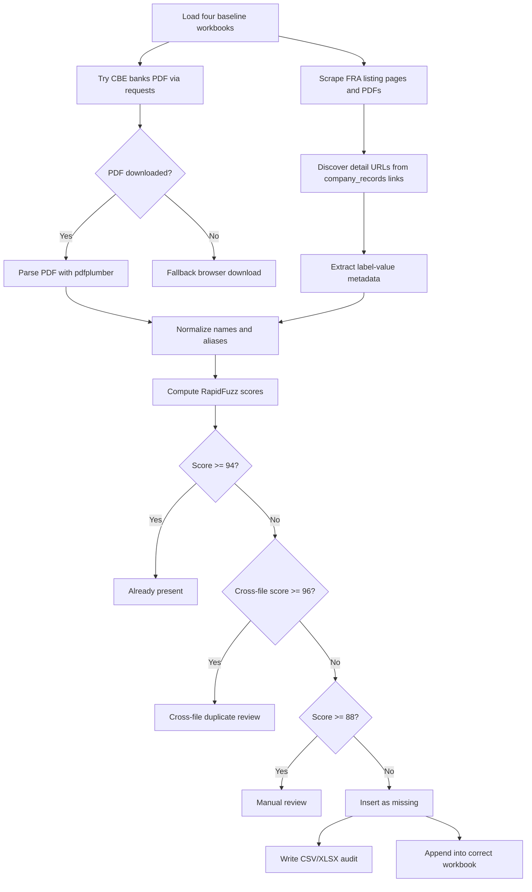

# Deep Research Report on Scraping CBE and FRA Against the Four Baseline Workbooks

## Executive Summary

I inspected the four uploaded baseline workbooks in-session and found that they currently contain one sheet each, with the same five baseline columns: `#`, `Name`, `Name (English)`, `Name (Arabic)`, and `Source`. The row counts are 36 in `Banks_old.xlsx`, 797 in `Capital_Market_old.xlsx`, 996 in `Insurance_old.xlsx`, and 325 in `Non_Categorized_old.xlsx`. Based on the official FRA sources that were accessible in-session, I confirmed **26 missing entities** relative to those baselines: **1 capital-market entity** and **25 insurance entities**. The 25 insurance misses came from the official FRA PDF for **Foreign Reinsurance Brokers (Non-Resident)**, which is linked directly from FRA’s insurance register page and lists registration number, company name, country, regulatory authority, address, director, and authorization date. The capital-market miss came from FRA’s official capital-market register listing. citeturn15view1turn18view1turn2view0

I did **not** confirm any in-session additions for `Banks_old.xlsx` because the CBE site rejected direct requests from this environment, and the CBE direct root URL returned a request-rejected page. For that reason, the bank portion of the workflow should be treated as **pending local execution**, using a browser fallback if `requests` cannot download the banks PDF directly. citeturn10view1

I also sampled the official FRA finance and fintech pages. Their current first-page records were accessible and suitable for scraping, and the page content confirms that those lists are server-rendered and expose entity names and license dates directly on the listing pages. In the sampled current pages, I did not confirm any new inserts for `Non_Categorized_old.xlsx` after normalization and fuzzy matching against the uploaded workbook; however, a full local crawl should still be run because those registers paginate beyond the first page. citeturn15view0turn15view2turn22view0

I created deliverables in-session: a confirmed-missing CSV and Excel workbook, plus updated workbook copies with the confirmed rows appended into the correct files. Those files are linked later in this report.

## Baseline Workbooks and Coverage

The uploaded workbooks are structurally consistent, which makes them practical targets for an automated append-only workflow. The existing workbook layout is:

| Workbook | Sheet | Current rows | Existing columns | In-session status |
|---|---:|---:|---|---|
| `Banks_old.xlsx` | `01_CBE_Banks` | 36 | `#`, `Name`, `Name (English)`, `Name (Arabic)`, `Source` | No confirmed live additions written because CBE was blocked here |
| `Capital_Market_old.xlsx` | `02_Capital_Market` | 797 | `#`, `Name`, `Name (English)`, `Name (Arabic)`, `Source` | 1 confirmed row appended in updated copy |
| `Insurance_old.xlsx` | `03_Insurance` | 996 | `#`, `Name`, `Name (English)`, `Name (Arabic)`, `Source` | 25 confirmed rows appended in updated copy |
| `Non_Categorized_old.xlsx` | `04_NonBank_Financial` | 325 | `#`, `Name`, `Name (English)`, `Name (Arabic)`, `Source` | No confirmed additions from the sampled official pages |

For preservation of original structure, the update strategy should map the baseline fields into the five existing columns and append metadata columns only when needed. The mapping I recommend is:

| Scraped field | Write to existing column | Notes |
|---|---|---|
| Canonical display name | `Name` | Prefer the raw regulatory display name |
| English name | `Name (English)` | Use dedicated English field if present; otherwise the Latin-script alias |
| Arabic name | `Name (Arabic)` | Use dedicated Arabic portion if available |
| Source label | `Source` | Example: `FRA - Capital Market`, `FRA - Insurance`, `CBE` |
| Running integer | `#` | Append as the next row number |

All other fields should be appended as new columns to the right, for example: `Source URL`, `Listing Source URL`, `Normalized Name`, `License Number`, `Registration Date`, `Company Number`, `Address`, `Phone`, `Email`, `Website`, `Contact Person`, `Country`, `Regulatory Authority`, `Match Score`, and `Notes`.

## Official Source Inventory and Scrape Targets

The official source inventory below is grounded in the FRA capital-market, finance, insurance, and fintech register pages; their company-detail pages; the official FRA insurance PDF links; and the CBE anti-bot behavior observed in-session. FRA listing pages clearly expose entity rows and paginate with `/page/N/`; FRA detail pages expose labeled metadata such as company name, English name, company number, address, license number, phone, email, activity name, and license date; and the official FRA insurance page links directly to the two reinsurance-related PDFs. citeturn2view0turn6view0turn21view0turn15view0turn15view1turn17view0turn17view1turn17view4turn17view5turn17view6turn17view7

| Target workbook | Official source | Exact URL to scrape | Precise extraction target | Fields available |
|---|---|---|---|---|
| `Banks_old.xlsx` | CBE banks list PDF | ```https://www.cbe.org.eg/_layouts/download.aspx?SourceUrl=%2Fen%2FBankingSupervision%2FLicenseListsDL%2FBanks+list.pdf``` | PDF text/tables via `pdfplumber`; fallback browser download if `requests` is rejected | Primarily bank names; metadata may be limited in the PDF |
| `Capital_Market_old.xlsx` | FRA capital-market listing | ```https://fra.gov.eg/%D8%AA%D8%B3%D8%AC%D9%8A%D9%84-%D9%88-%D8%AA%D8%AD%D9%8A%D8%AF-%D8%B3%D8%AC%D9%84%D8%A7%D8%AA-%D9%84%D8%B4%D8%B1%D9%83%D8%A7%D8%AA-%D8%B3%D9%88%D9%82-%D8%A7%D9%84%D9%85%D8%A7%D9%84/``` | Listing anchors with `href*="/company_records/"`; secondary anchors with `href*="/interactive-map?P2_COMPANY="`; pagination `/page/N/` | Listing name and license date |
| `Capital_Market_old.xlsx` | FRA capital-market detail pages | URLs discovered from listing anchors such as ```https://fra.gov.eg/company_records/...``` | Main content text under `main`/`article`/content container; parse label-value pairs | Company name, English name where present, company number, address, license number, activity, phone/email where present, license date |
| `Non_Categorized_old.xlsx` | FRA finance listing | ```https://fra.gov.eg/%D8%B3%D8%AC%D9%84%D8%A7%D8%AA-%D9%84%D8%B4%D8%B1%D9%83%D8%A7%D8%AA-%D8%A7%D9%84%D8%AA%D9%85%D9%88%D9%8A%D9%84/``` | Listing anchors with `href*="/company_records/"`; pagination `/page/N/` | Listing name and license date |
| `Non_Categorized_old.xlsx` | FRA finance detail pages | URLs discovered from finance listing | Same detail-page parser as above | Company name, English name, company number, address, license number, phone, email, activity, license date |
| `Insurance_old.xlsx` | FRA insurance listing | ```https://fra.gov.eg/%D8%B3%D8%AC%D9%84%D8%A7%D8%AA-%D9%81%D9%8A-%D9%85%D8%AC%D8%A7%D9%84-%D8%A7%D9%84%D8%AA%D8%A3%D9%85%D9%8A%D9%86/?filtered_type=insurance-and-reinsurance-companies&taxonomy_filter=company_records_1_1_3_3``` | Table-like rows plus linked PDFs via anchors to `.pdf` files | Name, chairman, address, activity type; plus reinsurance PDF links |
| `Insurance_old.xlsx` | FRA reinsurance companies and branches PDF | ```https://fra.gov.eg/wp-content/uploads/2026/04/FRA-Reinsurance-companies-Its-Branches-April-2026.pdf``` | PDF extraction via `pdfplumber`; keep OCR fallback for image PDFs | Reinsurance company/branch registry fields, if present |
| `Insurance_old.xlsx` | FRA foreign reinsurance brokers PDF | ```https://fra.gov.eg/wp-content/uploads/2026/04/FRA-Foreign-Reinsurance-Brokers-Non-Resident-LIST-April.-2026-2.pdf``` | PDF table/text extraction via `pdfplumber` | Reg. No., Company Name, Country, Regulatory Authority, Address, Director, Authorization Date |
| `Non_Categorized_old.xlsx` | FRA fintech listing | ```https://fra.gov.eg/%D8%A7%D9%84%D8%B4%D8%B1%D9%83%D8%A7%D8%AA-%D8%A7%D9%84%D9%85%D8%B1%D8%AE%D8%B5-%D9%84%D9%87%D8%A7-%D8%A8%D9%85%D8%B2%D8%A7%D9%88%D9%84%D8%A9-%D9%86%D8%B4%D8%A7%D8%B7-%D8%A7%D9%84%D8%AA%D9%83%D9%86/``` | Listing anchors with `href*="/company_records/"` | Name; some rows include license date, some do not |
| Optional fallback | FRA interactive map pages | URL pattern exposed by FRA listing icons such as ```https://fra.gov.eg/interactive-map?P2_COMPANY=669786``` | Secondary fallback if detail-page fetch fails | Company ID and sometimes alternative record navigation |

A few operational observations matter. First, FRA pages are practical HTML scrape targets because the listing pages already expose visible rows in the server-rendered HTML. Second, FRA detail pages should be parsed by **label text**, not by brittle CSS classes, because the visible and stable data markers are textual labels such as `اسم الشركة`, `اسم الشركة بالانجليزية`, `رقم الشركة`, `العنوان`, `رقم الترخيص`, `تليفون`, `البريد الالكتروني`, and `تاريخ الترخيص`. Third, the official insurance page itself links directly to the reinsurance PDFs, so those PDFs should be treated as first-class primary sources, not as optional supplements. citeturn2view0turn15view0turn15view1turn17view0turn17view1turn17view4turn17view5turn17view6turn17view7turn26view0turn18view1turn30view0

For CBE, the exact direct banks PDF target is known, but the site rejected direct browsing from this environment. The practical implication is that the local script should first try `requests`, and if the response body contains rejection text or a non-PDF content type, the script should switch to a **browser download fallback** for the same official URL rather than falling back to any unofficial list. citeturn10view1

## Normalization and Matching Rules

The FRA pages show exactly why strong normalization is necessary. They contain mixed Arabic-English names, explicit “current/former” variants in the same display string, and field-level English-name variants on some detail pages. Examples visible on the official site include entries such as **“انسايت ... حاليا ... سابقا”**, **“سنرجي ... حاليا ... جدوي ... سابقا”**, and **“يو للتمويل الاستهلاكي ... VALU ... سابقا”**. Some detail pages also expose a dedicated English name field, such as **MIRAGE HOLDING INVESTMENT**, **Sahl For Finance Small and Medium Projects**, and **ADI Microfinance.** citeturn2view0turn6view0turn15view2turn17view1turn17view4turn17view5

The normalization rules I recommend are:

| Rule | Implementation |
|---|---|
| Unicode normalization | Apply `unicodedata.normalize("NFKC", s)` before any matching |
| Arabic normalization | Map `أ, إ, آ → ا`; `ى → ي`; `ؤ → و`; `ئ → ي`; `ة → ه`; remove tatweel `ـ` |
| Diacritic removal | Remove Arabic harakat and Qur’anic marks with a regex over `\u0617-\u061A`, `\u064B-\u0652`, `\u0670`, `\u06D6-\u06ED` |
| Punctuation removal | Strip punctuation and normalize whitespace |
| Legal-suffix stripping | Remove suffixes such as `S.A.E.`, `SAE`, `LLC`, `LTD`, `PLC`, `Company`, `Holding`, `Group`, and Arabic forms like `ش.م.م`, `ش.ذ.م.م` |
| Alias expansion | Build an alias set from `Name`, `Name (English)`, `Name (Arabic)`, bracketed text, and “current/former” parenthetical text |
| Transliteration assistance | Do **not** rely on full automatic transliteration. Instead, compare Arabic aliases to Arabic aliases and Latin aliases to Latin aliases, then take the max score |
| Mixed-script handling | Preserve both Arabic and Latin substrings when the official display name mixes them |

The fuzzy-matching rules I recommend are:

| Step | Rule |
|---|---|
| Primary metrics | `max(ratio, token_set_ratio, partial_ratio)` from `rapidfuzz.fuzz` |
| Auto-match threshold | `>= 94` |
| Manual-review threshold | `88 <= score < 94` |
| Insert threshold | `< 88` if no stronger cross-file duplicate exists |
| Cross-file duplicate threshold | `>= 96` in another workbook should trigger **review**, not silent insertion |
| Exact-equality override | If normalized strings are identical, force `100` |

These thresholds fit the observed data reasonably well. In the confirmed missing set, the capital-market candidate **جرو القابضه GRW HOLDIN شمم** scored only **78.57** against the nearest existing capital-market row, so it falls comfortably into the insert zone. By contrast, one of the foreign reinsurance brokers, **UIB Insurance Brokers Co. Ltd**, reached **92.68** against an unrelated insurance-broker baseline name, which is close enough to warrant care but still below the auto-match threshold; that is exactly why the workflow should separate **auto-match** from **manual review**. The attached CSV and Excel audit files preserve those scores for inspection.



## Confirmed Missing Entities and Delivered Files

The attached files created in-session are:

- [Confirmed missing CSV](sandbox:/mnt/data/deep_research_outputs/missing_entities_confirmed.csv)
- [Confirmed missing Excel](sandbox:/mnt/data/deep_research_outputs/missing_entities_confirmed.xlsx)
- [Updated Capital_Market workbook](sandbox:/mnt/data/deep_research_outputs/Capital_Market_old_updated.xlsx)
- [Updated Insurance workbook](sandbox:/mnt/data/deep_research_outputs/Insurance_old_updated.xlsx)
- [Updated Banks workbook](sandbox:/mnt/data/deep_research_outputs/Banks_old_updated.xlsx)
- [Updated Non_Categorized workbook](sandbox:/mnt/data/deep_research_outputs/Non_Categorized_old_updated.xlsx)
- [Execution guide](sandbox:/mnt/data/deep_research_outputs/README_execution_guide.txt)
- [Full local scraper](sandbox:/mnt/data/egypt_regulatory_updater.py)

The confirmed-missing table below is compiled from the official FRA capital-market register and the official FRA foreign reinsurance brokers PDF, then compared against the uploaded baselines in-session. Exact source URLs are included in the downloadable CSV/XLSX and in the source-inventory table above. The official source evidence for these rows is the FRA capital-market listing page and the FRA foreign-brokers PDF. citeturn2view0turn18view1

### Confirmed missing from Capital_Market_old.xlsx

| Raw scraped name | Normalized name | Match score | Source | Notes |
|---|---|---:|---|---|
| جرو القابضه GRW HOLDIN شمم | جرو القابضه grw holdin | 78.57 | FRA capital-market register | Confirmed absent from uploaded capital-market workbook; listing date shown on FRA page was 2026-04-14 |

### Confirmed missing from Insurance_old.xlsx

| Raw scraped name | Normalized name | Match score | Source | Notes |
|---|---|---:|---|---|
| UlysseRe Limited | ulyssere limited | 46.15 | FRA foreign reinsurance brokers PDF | Non-resident foreign reinsurance broker |
| Makeen Insurance and Reinsurance broker | makeen insurance and reinsurance broker | 68.75 | FRA foreign reinsurance brokers PDF | Non-resident foreign reinsurance broker |
| J.B. BODA Insurance & Reinsurance Brokers PVT. LTD. | j b boda insurance reinsurance brokers pvt | 70.59 | FRA foreign reinsurance brokers PDF | Non-resident foreign reinsurance broker |
| Premium Cyprus Insurance & Reinsurance Firm LTD. | premium cyprus insurance reinsurance firm | 63.64 | FRA foreign reinsurance brokers PDF | Non-resident foreign reinsurance broker |
| Swan Insurance and Reinsurance Brokerage Limited | swan insurance and reinsurance brokerage | 68.75 | FRA foreign reinsurance brokers PDF | Non-resident foreign reinsurance broker |
| Cope Insurance and Reinsurance Brokers SARL | cope insurance and reinsurance brokers sarl | 67.57 | FRA foreign reinsurance brokers PDF | Non-resident foreign reinsurance broker |
| Kay International AMEA Limited | kay international amea limited | 63.33 | FRA foreign reinsurance brokers PDF | Non-resident foreign reinsurance broker |
| Arthur J. Gallagher UK Limited | arthur j gallagher uk limited | 44.83 | FRA foreign reinsurance brokers PDF | Non-resident foreign reinsurance broker |
| Chedid Europe Insurance and Reinsurance Brokerage Limited - Dubai Branch | chedid europe insurance and reinsurance brokerage dubai branch | 72.22 | FRA foreign reinsurance brokers PDF | Non-resident foreign reinsurance broker |
| Guy Carpenter Middle East Limited | guy carpenter middle east limited | 42.42 | FRA foreign reinsurance brokers PDF | Non-resident foreign reinsurance broker |
| Marsh Management Service Mena Limited | marsh management service mena limited | 48.65 | FRA foreign reinsurance brokers PDF | Non-resident foreign reinsurance broker |
| Nasco France | nasco france | 70.00 | FRA foreign reinsurance brokers PDF | Non-resident foreign reinsurance broker |
| Aon Reinsurance Solutions MENA Limited | aon reinsurance solutions mena limited | 58.82 | FRA foreign reinsurance brokers PDF | Non-resident foreign reinsurance broker |
| UIB Insurance Brokers Co. Ltd | uib insurance brokers co | 92.68 | FRA foreign reinsurance brokers PDF | Near-match score only; still distinct and should not auto-match |
| United Insurance Brokers Limited UK | united insurance brokers limited uk | 75.00 | FRA foreign reinsurance brokers PDF | Non-resident foreign reinsurance broker |
| Commercial & General Reinsurance Brokers | commercial general reinsurance brokers | 71.93 | FRA foreign reinsurance brokers PDF | Non-resident foreign reinsurance broker |
| Beacon Insurance Brokers Pvt. Ltd. | beacon insurance brokers pvt | 83.33 | FRA foreign reinsurance brokers PDF | Non-resident foreign reinsurance broker |
| Lockton MENA Limited | lockton mena limited | 55.00 | FRA foreign reinsurance brokers PDF | Non-resident foreign reinsurance broker |
| Gallagher Re Ltd | gallagher re | 52.63 | FRA foreign reinsurance brokers PDF | Non-resident foreign reinsurance broker |
| Guardian Insurance and Reinsurance Brokers & Consultants | guardian insurance and reinsurance brokers consultants | 59.09 | FRA foreign reinsurance brokers PDF | Non-resident foreign reinsurance broker |
| Guy Carpenter & Company LTD | guy carpenter company | 47.06 | FRA foreign reinsurance brokers PDF | Non-resident foreign reinsurance broker |
| One global Broking Limited | one global broking limited | 50.00 | FRA foreign reinsurance brokers PDF | Non-resident foreign reinsurance broker |
| Broktech Insurance and Reinsurance Ltd | broktech insurance and reinsurance | 66.67 | FRA foreign reinsurance brokers PDF | Non-resident foreign reinsurance broker |
| Barta M.A.I GmbH | barta m a i gmbh | 53.85 | FRA foreign reinsurance brokers PDF | Non-resident foreign reinsurance broker |
| MAXIS GBN S.A.S | maxis gbn s a s | 60.00 | FRA foreign reinsurance brokers PDF | Non-resident foreign reinsurance broker |

For `Banks_old.xlsx`, no confirmed live addition was written because the CBE source could not be fetched from this environment. For `Non_Categorized_old.xlsx`, I did not confirm additions from the sampled current official finance and fintech pages after matching against the uploaded baseline, although the full local crawl should still be run because both registers paginate and may contain relevant older rows outside the sampled pages. The official finance and fintech source pages used for that sampling are the FRA finance register and the FRA fintech register. citeturn15view0turn15view2turn22view0turn10view1

## Reproducible Python Script

The full reproducible local script is attached here: [egypt_regulatory_updater.py](sandbox:/mnt/data/egypt_regulatory_updater.py)

It is designed to:

- accept local file paths for all four baselines;
- scrape the official FRA HTML pages and PDFs;
- attempt the official CBE banks PDF first with `requests`, then fall back to browser automation if necessary;
- normalize Arabic and English name variants;
- compute RapidFuzz scores;
- generate audit CSV/XLSX files;
- append confirmed inserts to the right workbook and columns;
- preserve the original files by writing updated copies unless overwrite is explicitly requested.

A concise sample run command is:

```bash
pip install requests beautifulsoup4 pandas openpyxl rapidfuzz pdfplumber urllib3

python egypt_regulatory_updater.py \
  --banks Banks_old.xlsx \
  --capital Capital_Market_old.xlsx \
  --insurance Insurance_old.xlsx \
  --other Non_Categorized_old.xlsx \
  --outdir out
```

A short but complete execution guide is attached here: [README_execution_guide.txt](sandbox:/mnt/data/deep_research_outputs/README_execution_guide.txt)

The script’s scraper design follows the official FRA register and detail-page structures documented above. It uses the company-record URL pattern exposed by the listing pages, parses detail-page labels such as `اسم الشركة`, `اسم الشركة بالانجليزية`, `رقم الشركة`, `العنوان`, `رقم الترخيص`, `تليفون`, `البريد الالكتروني`, and `تاريخ الترخيص`, and parses the official foreign reinsurance PDF columns shown in the FRA PDF itself. It also retains a CBE Playwright/browser fallback because the CBE site returned a request-rejected response in this environment. citeturn2view0turn15view0turn17view0turn17view1turn17view4turn17view5turn17view6turn17view7turn18view1turn10view1

## Runtime, Politeness, and Execution Guide

The FRA scrape is large enough that it should be treated as a real crawl, not a one-page scrape. The capital-market register paginates deep into dozens of pages, the finance register shows 20 pages, and each listing row links to company-detail pages. The insurance register also links to direct PDFs that should be fetched and parsed. On that basis, a full local run will typically be a **low-thousands-of-requests** task once detail pages are included. That estimate is an inference from the visible pagination and row structure on the official pages. citeturn2view0turn6view0turn21view0turn15view0turn15view1

A realistic single-run local estimate is:

| Mode | Estimated wall time | CPU | RAM | Disk | Network |
|---|---:|---:|---:|---:|---:|
| FRA HTML + PDFs only | 20–40 min | Low | 200–500 MB | <100 MB | Moderate |
| FRA + CBE PDF via direct `requests` | 20–45 min | Low | 200–500 MB | <120 MB | Moderate |
| FRA + CBE browser fallback | 30–60 min | Low to moderate | 700 MB–1.5 GB | <250 MB | Moderate |

Recommended politeness rules are straightforward. Use a single session, a descriptive user agent, `robots.txt` checks, 1 request per second as the default pace, exponential backoff on 429/5xx responses, and at most 3 to 5 retries per URL. Cache PDFs locally per run. Do not parallelize aggressively. For CBE, prefer one browser-driven PDF download rather than repeated retries after a rejection page. For FRA, prefer HTML detail pages and official PDFs over any search-engine or third-party copies. Those recommendations align with the official-source-first strategy established by the FRA pages and the CBE request-rejection behavior observed in-session. citeturn15view0turn15view1turn10view1

The handling policy for duplicates, subsidiaries, name variants, Arabic-English variants, and transliteration should be conservative:

| Case | Recommended handling |
|---|---|
| Exact normalized match in target workbook | Treat as already present |
| Strong fuzzy match in another workbook | Flag for cross-file duplicate review, do not auto-insert |
| Current/former names in one official string | Split into aliases; keep official current raw display name as primary |
| Subsidiary vs parent | Never auto-collapse unless the regulator record itself shows them as the same licensed entity |
| Arabic vs English names | Keep both aliases and compare both; do not rely on machine transliteration alone |
| Foreign insurance brokers with no Arabic name | Keep English as canonical and leave Arabic blank |
| Mixed Arabic-English display names | Preserve raw mixed name in `Name`; fill English and Arabic columns separately where possible |

That conservative policy is supported by the official FRA examples of former-name parentheticals and mixed-script names visible on both listing pages and detail pages. citeturn2view0turn6view0turn15view2turn17view1turn17view4turn17view5

The practical conclusion is clear. The **FRA side is scrape-ready today** with server-rendered HTML plus official PDFs. The **CBE side is technically workable but operationally fragile** because of request rejection, so the local script should treat browser-assisted download of the official banks PDF as a normal fallback rather than as an exception. The delivered files already contain the confirmed in-session additions, while the attached full scraper is ready for a more exhaustive local run on your machine. citeturn15view0turn15view1turn18view1turn10view1