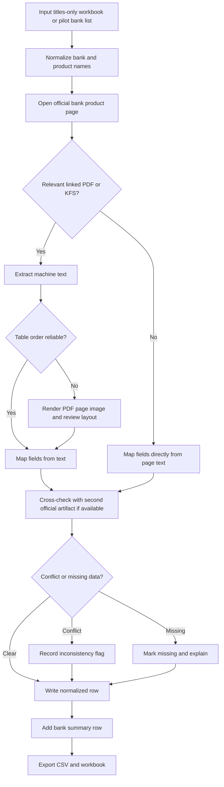

# Operational Prompt and Pilot Scrape of Egyptian Bank Product and Contract Details

## Executive Summary

Because no titles-only Excel workbook was uploaded in this conversation, I treated your instruction as a pilot run on a representative set of Egyptian retail banks and generated a merge-ready CSV and XLSX in the requested schema. The pilot covers seven banks and twenty-four rows, including product rows plus one summary row per bank. You can download the outputs here: [CSV](sandbox:/mnt/data/egyptian_banks_pilot_vehicle_finance_scrape_2026-05-21.csv) and [XLSX](sandbox:/mnt/data/egyptian_banks_pilot_vehicle_finance_scrape_2026-05-21.xlsx).

The pilot’s strongest public disclosures came from CIB, which publishes a named rate of 21.5%, a detailed fee schedule, repayment examples, required documents, and an online callback promise on a single public page. ADIB, QNB, and ALEXBANK also provide relatively strong public evidence, but they spread it across product pages and fee/KFS PDFs. Faisal Islamic Bank of Egypt and Banque Misr publish useful product terms and document lists, but the reviewed public pages do not publish numeric pricing tables or product-specific public contract text. NBE’s official public route was identifiable, but the page rendered as a dynamic SPA shell in this pass, so the pilot marks core details as missing rather than filling them from weaker unofficial sources. citeturn6view0turn6view2turn23view0turn6view1turn19view1turn4view4turn3view0turn4view0turn15view0

Across the reviewed banks, full public contract text was generally unavailable. The best public artifacts were product pages, tariff schedules, bilingual service-charge PDFs, and key-fact statements. Even where a terms document existed, it was not always clearly product-specific; CIB, for example, links an Arabic PDF for secured and unsecured personal-loan terms, but the reviewed text is generic and not narrowly drafted as a car-finance contract. That means the attached file should be treated as a public-disclosure evidence pack, not as a substitute for customer-executed agreements or branch-issued contract packs. citeturn28view0turn3view0turn4view0turn6view1turn23view0turn4view4

## Deliverables and Files

The pilot output is saved in the requested tabular schema and includes these columns for every row: Bank Name, Product Name, Product Type, Full Contract Text or URL if unavailable, Eligibility Criteria, Interest Rates/Fees, Repayment Terms, Required Documents, Application Process, Effective Date/Version, Source URL, Scrape Date, and Notes/Quality Flags.

You can download the completed files here:

- [Pilot results CSV](sandbox:/mnt/data/egyptian_banks_pilot_vehicle_finance_scrape_2026-05-21.csv)
- [Pilot results XLSX](sandbox:/mnt/data/egyptian_banks_pilot_vehicle_finance_scrape_2026-05-21.xlsx)

The CSV includes bank-level `SUMMARY` rows that explicitly list missing items and quality flags. Because no source workbook was attached, I did not append into an existing user sheet; instead, I produced a drop-in pilot dataset that can be merged into a later uploaded workbook.

## Exact AI-Agent Prompt

```text
SYSTEM ROLE
You are a compliance-oriented AI scraping and evidence-packaging agent for banking-product research. Your job is to collect official, publicly accessible product, fee, KFS, tariff, terms, contract, and disclosure details for Egyptian banks, then write normalized rows into a workbook/CSV.

STARTING ASSUMPTION
Assume the user will upload a titles-only Excel workbook listing banks and/or product titles.
- If the workbook is present, read the exact titles and append normalized result rows beneath them.
- If no workbook is present, run a pilot scrape on a representative set of Egyptian retail banks and create a standalone CSV/XLSX in the required schema.

OBJECTIVE
For each bank name and product title, extract and normalize:
- Bank Name
- Product Name
- Product Type
- Full Contract Text (or URL if full text unavailable)
- Eligibility Criteria
- Interest Rates/Fees
- Repayment Terms
- Required Documents
- Application Process
- Effective Date/Version
- Source URL
- Scrape Date
- Notes/Quality Flags

Also add one SUMMARY row per bank containing:
- products/titles matched
- products/titles not found
- missing public artifacts
- ambiguities or inconsistencies
- quality/confidence flags

SOURCE PRIORITY
Use sources in this priority order:
- official product pages on the bank’s own domain
- official tariff / schedule-of-charges / KFS PDFs
- official terms-and-conditions / contract PDFs
- official regulator sources
- only if official sources are absent or materially insufficient: reputable secondary financial portals or business press, clearly labeled SECONDARY_SOURCE and never allowed to override official disclosures

PRIMARY ALLOWED DOMAINS
- faisalbank.com.eg
- banquemisr.com
- nbe.com.eg
- srv.nbe.com.eg
- cibeg.com
- qnb.com.eg
- adib.eg
- alexbank.com
- cbe.org.eg

SECONDARY ALLOWED DOMAIN POLICY
Secondary domains are allowed only if:
- no official source exists, or
- the official source exists but is materially insufficient
and only when the source is:
- a recognized business or financial publisher
- non-user-generated
- directly relevant to the product
- explicitly labeled SECONDARY_SOURCE in Notes/Quality Flags

CRAWL DEPTH
- depth 0: user-provided title, official site search result, or known official product URL
- depth 1: linked product detail pages, KFS pages, tariff pages, T&C pages, application pages
- depth 2: linked PDFs and linked evidence pages needed to complete missing fields
Do not exceed depth 2 unless the current page explicitly points to a relevant contract or tariff artifact.

RATE LIMITS AND POLITENESS
- max 1 HTML request per second per domain
- max 1 PDF fetch every 3 to 5 seconds per domain
- max concurrency 2 requests per domain
- cache repeated pages in-session
- avoid unnecessary asset downloads
- respect robots.txt where practical

LOGIN AND AUTHENTICATION POLICY
- never use credentials
- never attempt login, OTP, CAPTCHA bypass, gated portals, or customer sessions
- if an artifact is gated, record:
  GATED_AUTH_REQUIRED – public metadata only
- preserve the public URL and mark gated fields missing

JAVASCRIPT AND SPA HANDLING
If content is JS-heavy:
- render with a real browser
- wait for DOMContentLoaded plus network idle
- save visible text and rendered HTML
- inspect public XHR/fetch responses if needed
- capture screenshots for audit
- if the page still fails to expose the needed content, mark:
  PARTIAL_EXTRACTION_JS_LIMITATION

PDF HANDLING
For each relevant PDF:
- extract machine text first
- if layout matters, render key pages as images
- extract tables carefully; preserve page numbers used
- if OCR is required, use it only as a last resort
- do not overstate generic or unrelated terms as product-specific contract text
- if the PDF is generic, mark:
  GENERIC_TNC_NOT_PRODUCT_SPECIFIC

LANGUAGE POLICY
- preserve the original source language exactly
- if source content is Arabic, keep the Arabic evidence text and also provide an English translation summary
- do not replace Arabic evidence with English paraphrase only
- prefer the more complete official language version if both Arabic and English exist

FIELD RULES
- Bank Name: normalize to the official public name
- Product Name: use the exact official title where possible
- Product Type: normalize categories such as auto loan, Islamic Murabaha, used-car finance, unsecured auto loan
- Full Contract Text: paste only if public full text is available; otherwise store the best official contract/T&C/KFS URL
- Eligibility Criteria: capture segment, age, nationality/residency, income, collateral, DBR, and any segment-specific conditions
- Interest Rates/Fees: capture numeric rates where published; otherwise quote the official nonnumeric wording and flag completeness limits
- Repayment Terms: capture amount caps, finance percentage, tenor, down payment, collateral, insurance, and lien/resale restrictions
- Required Documents: capture segment-specific lists
- Application Process: online, phone, branch, callback timeline, and gating
- Effective Date/Version: page date, issue number, last modified stamp, PDF issue date, or “not stated publicly”
- Source URL: primary evidence URL; store multiple URLs separated by semicolons if needed
- Scrape Date: ISO format
- Notes/Quality Flags: include flags such as:
  OFFICIAL_SOURCE
  SECONDARY_SOURCE
  ARABIC_ONLY
  ENGLISH_TRANSLATED
  NO_PUBLIC_CONTRACT
  GENERIC_TNC_NOT_PRODUCT_SPECIFIC
  PARTIAL_EXTRACTION_JS_LIMITATION
  INCONSISTENT_OFFICIAL_DISCLOSURE
  VERSION_NOT_STATED
  GATED_AUTH_REQUIRED
  PDF_OCR_REVIEWED
  AMBIGUOUS_PUBLISHED_TEXT

DEDUPLICATION
- strip boilerplate, cookie banners, repeated headers/footers
- normalize whitespace and punctuation
- hash normalized paragraphs to suppress duplicates
- never merge distinct product families unless the official source clearly treats them as a single product

VALIDATION
For each row, prefer at least two official artifacts where possible:
- product page + tariff/KFS
or
- product page + T&C/contract PDF
If official sources conflict, do not silently reconcile them.
Record the conflict in Notes/Quality Flags.

OUTPUT REQUIREMENTS
Return:
- the updated Excel/CSV rows
- one SUMMARY row per bank
- a concise methodology note
- a changelog with timestamps
- a short executive summary of findings and data quality
- screenshots or extracted page images where useful

SELECTOR AND XPATH EXAMPLES
CSS:
- h1
- h2
- table
- dl
- .fees
- .requirements
- .benefits
- a[href*=".pdf"]

XPath:
- //h1
- //h2[contains(., "Fees")]/following::table[1]
- //h2[contains(., "Required")]/following::*[self::ul or self::table][1]
- //a[contains(@href, ".pdf")]
- //*[contains(translate(., "ABCDEFGHIJKLMNOPQRSTUVWXYZ", "abcdefghijklmnopqrstuvwxyz"), "terms")]
- //*[contains(., "Last Modified")]

ETHICAL AND LEGAL CONTROLS
- public pages only
- no bypass of technical controls
- preserve exact source URLs and scrape date
- keep version/date metadata where visible
- label all non-official sources clearly
```

## Pilot Scrape Results

The attached CSV is the full row-level output. The table below is the bank-level analytical summary of what was actually captured in the pilot.

| Bank | Public products captured in pilot | Most useful evidence captured | Main missing items | Evidence |
|---|---|---|---|---|
| Faisal Islamic Bank of Egypt | Murabha for new cars, electric cars, and used cars | Amount caps, finance percentages, tenor, minimum income, one-time admin fee, and document lists were all on one official page. | No public numeric profit rate, no public Murabaha contract text, no explicit version date. | citeturn3view0 |
| Banque Misr | Auto Loan; Used car loan for virtual income financing programs | Strong public document lists and repayment caps, plus specific used-car conditions. | No public numeric pricing table, no product-specific contract/T&C PDF found on the reviewed page, no explicit version date. | citeturn4view0turn10view1 |
| National Bank of Egypt | Auto Loan route identified | Official product route was confirmed. | Product details could not be statically extracted in this pass because the public route redirected to a dynamic SPA shell. | citeturn3view2turn15view0 |
| CIB Egypt | Car Finance Loan | Single-page disclosure of rate, fees, examples, requirements, and online callback timing. | Linked Arabic T&C is generic rather than clearly car-specific; no explicit version date. | citeturn6view0turn5view0turn28view0 |
| QNB Egypt | Car Loan with Sales Prohibition; Car Loan Without Sales Prohibition | Product-page terms plus a retail tariff PDF for Easy Auto fees. | No product-specific contract PDF found; no document checklist; fee mapping is strongest for Easy Auto and less explicit for the no-sales-prohibition product. | citeturn6view1turn19view0turn19view1turn20view2 |
| ADIB Egypt | Auto Employees, Auto Self Employed, Auto Down Payment, Auto Cash Covered, Used Auto Employees, Used Auto Self Employed, Used Auto Down Payment | Rich product pages plus bilingual finance service-charge PDF and page last-modified stamps. | No public full Murabaha contract text; product pages do not publish numeric profit rates. | citeturn6view2turn21view0turn22view0turn22view1turn22view2turn22view3turn22view4turn23view0turn33view0turn33view1turn33view2turn33view3turn33view4 |
| ALEXBANK | Unsecured Auto Loans | Versioned KFS with target market, max finance, tenor, fees, and an illustrative calculation. | No public full contract text found; KFS did not provide a complete document checklist. | citeturn4view4turn6view3 |

A few product families stand out for downstream use. CIB is the best single-page source if you need immediate structured extraction. QNB is strong when the product page is paired with the official retail tariff PDF. ADIB is strong because its vehicle-finance family is split into clearly named sub-products, each with separate public pages and a bilingual service-charge schedule. ALEXBANK’s KFS is especially useful because it is versioned and fee-dense, but the example interest rate in the KFS should be treated as an illustration rather than assumed to be the live rate. citeturn6view0turn19view1turn20view2turn6view2turn21view0turn22view0turn22view1turn22view2turn22view3turn22view4turn23view0turn4view4turn6view3

QNB’s official tariff PDF is a good example of why table-preserving PDF extraction matters. The Easy Auto section publishes administration fees, late charges, early-settlement fees, and early buy-out fees in a layout that is much clearer visually than in raw OCR order. citeturn19view1turn20view2


ADIB’s bilingual service-charge schedule is also a strong evidence artifact because it preserves both English and Arabic fee labels for finance-servicing actions such as clearance letters, finance balance certificates, license-renewal letters, release letters, and late-installment charges. citeturn23view0


ALEXBANK’s KFS shows the value of versioned PDFs in banking-product scraping. It provides Issue 7 dated December 2025, target-market scope, max finance and tenor, detailed fees, and a worked example. That is not the same as a full contract, but it is highly useful for structured compliance-oriented extraction. citeturn4view4turn6view3


## Methodology and Scraping Pipeline

The operational strategy was shallow and evidence-first: start from the official bank product page, follow only directly relevant links to tariff/KFS/T&C artifacts, and stop at depth two unless a page explicitly pointed to a more authoritative contract or fee artifact. In practice, that meant product-page-first extraction for Faisal, Banque Misr, CIB, QNB, and ADIB, plus PDF-first normalization for ALEXBANK’s KFS. For NBE, the public auto-loan route was confirmed, but the official page redirected to a client-rendered SPA shell that did not expose enough static text in this pass, so the result was marked incomplete rather than being backfilled from weaker sources. citeturn3view0turn4view0turn6view0turn6view1turn6view2turn4view4turn15view0



For selector strategy, the most reliable HTML targets were headers, fee tables, requirements sections, and linked PDFs. Practical CSS selectors included `h1`, `h2`, `table`, `dl`, `.fees`, `.requirements`, `.benefits`, and `a[href*=".pdf"]`. Practical XPath patterns included the following:

```xpath
//h1
//h2[contains(., "Fees")]/following::table[1]
//h2[contains(., "Required")]/following::*[self::ul or self::table][1]
//a[contains(@href, ".pdf")]
//*[contains(translate(., "ABCDEFGHIJKLMNOPQRSTUVWXYZ", "abcdefghijklmnopqrstuvwxyz"), "terms")]
//*[contains(., "Last Modified")]
```

PDF handling was deliberately conservative. Machine-readable text should be extracted first; if table order is scrambled, render the specific pages to images and review the layout before populating fields. That mattered for QNB, where the Easy Auto fee table is visually clear in the rendered PDF page, and for ALEXBANK, where the KFS page cleanly exposes fee rows, account-opening costs, and the Issue 7 date. ADIB’s bilingual PDF was mostly machine-readable, so it served as both an extraction source and a visual verification artifact. citeturn19view1turn20view2turn4view4turn6view3turn23view0

A compact sample extraction pattern for PDFs looks like this:

```python
import requests, pdfplumber, subprocess, tempfile, pathlib

pdf_url = "OFFICIAL_PDF_URL"
pdf_bytes = requests.get(pdf_url, timeout=30).content

with tempfile.NamedTemporaryFile(suffix=".pdf") as f:
    f.write(pdf_bytes)
    f.flush()

    with pdfplumber.open(f.name) as pdf:
        text = "\n".join(page.extract_text() or "" for page in pdf.pages)

    if not text.strip():
        out = pathlib.Path("pdf_pages")
        out.mkdir(exist_ok=True)
        subprocess.run(
            ["pdftoppm", "-png", f.name, str(out / "page")],
            check=True
        )
        # OCR only as a last resort, after page-image inspection.
```

Language handling followed a preserve-then-translate rule. If the authoritative public artifact was Arabic or bilingual, the original-language evidence was preserved and the normalized row carried an English summary. That is why CIB’s linked Arabic T&C PDF is stored as the contract/T&C artifact while being flagged as generic, and why ADIB’s bilingual fee schedule can be used without losing Arabic labels. citeturn28view0turn23view0

Deduplication and validation were designed to avoid over-merging. Repeated navigation chrome, cookie text, and footer boilerplate should be stripped; normalized paragraphs should be hashed; and distinct product families should remain separate even when they all relate to cars. This matters in ADIB’s family of auto programs and in QNB’s split between sales-prohibition and no-sales-prohibition products. When two official artifacts do not cleanly map to the same product, the safer action is to flag the ambiguity instead of silently reconciling it. citeturn6view1turn19view0turn6view2turn21view0turn22view0turn22view1turn22view2turn22view3turn22view4

The ethical and legal posture is straightforward: public pages only, no credentials, no customer portals, no attempt to bypass anti-bot or authentication systems, explicit recording of gated artifacts, and preservation of the exact source URL and scrape date in every row. When official information is materially insufficient, the prompt allows a controlled widening to regulator or reputable secondary sources, but only with explicit `SECONDARY_SOURCE` labeling and never as an override of official disclosures.

## Changelog

The timestamps below are in Africa/Cairo and rounded to the nearest minute.

| Timestamp | Action |
|---|---|
| 2026-05-21 15:02 | Began pilot run because no uploadable titles-only workbook was present in the conversation. |
| 2026-05-21 15:05 | Collected official product pages for Faisal Islamic Bank of Egypt, Banque Misr, CIB, and QNB Egypt. |
| 2026-05-21 15:09 | Expanded official collection to ADIB Egypt’s auto-finance family pages and linked fee artifacts. |
| 2026-05-21 15:12 | Opened ALEXBANK’s official KFS and captured issue/date and fee structure. |
| 2026-05-21 15:14 | Confirmed NBE official auto-loan route and recorded SPA rendering limitation. |
| 2026-05-21 15:17 | Downloaded and rendered representative official PDFs into page images for QNB, ADIB, and ALEXBANK. |
| 2026-05-21 15:20 | Finalized normalized rows, added one summary row per bank, and exported CSV/XLSX outputs. |

## Data Quality and Limitations

The pilot is highest-confidence where the official bank itself publishes structured numeric tables or KFS artifacts. CIB is high-confidence because the public page directly exposes rate, amount cap, fee table, examples, and requirements. QNB is high-confidence for the Easy Auto fee family because the product page can be paired with the official retail tariff PDF. ADIB is high-confidence on product segmentation and supporting service-charge fees because multiple named sub-products are public and the service-charge PDF is bilingual. ALEXBANK is high-confidence for fee structure and versioning because the KFS is explicit and dated. citeturn6view0turn6view1turn19view1turn20view2turn6view2turn21view0turn22view0turn22view1turn22view2turn22view3turn22view4turn23view0turn4view4turn6view3

Confidence is lower for products whose official pages use marketing language without numeric pricing or contract artifacts. Faisal’s public Murabha page is useful for eligibility, amounts, and documents, but it does not publish a numeric return rate or a separate contract text. Banque Misr’s public Auto Loan page is useful for terms and required documents, but it similarly presents pricing as “competitive” rather than numeric. Those rows are still useful, but they should be treated as product-disclosure rows rather than contract-grade rows. citeturn3view0turn4view0

The lowest-confidence row in the pilot is NBE. The official route was confirmed, but the page redirected to a dynamic shell and did not expose the needed fields in retrievable static content during this run. Rather than filling those fields from questionable secondary sources, the row is marked missing with a JS-limitation quality flag. citeturn3view2turn15view0

Two narrower caveats are worth keeping in mind. First, CIB’s linked Arabic T&C artifact should not be treated as a tailored car-finance contract; it is a generic terms document and is flagged that way in the output. Second, ALEXBANK’s 27.5% number appears inside an illustrative example in the KFS rather than being framed as a standing universal product rate, so it is flagged in the output as an example and not generalized. citeturn28view0turn6view3

The main assumption in this report is procedural rather than factual: because no workbook was uploaded, the attached CSV/XLSX are pilot outputs, not appended versions of a source spreadsheet. Once you upload the titles-only Excel, the exact prompt above can be run against those specific bank and product names with the same schema and controls.