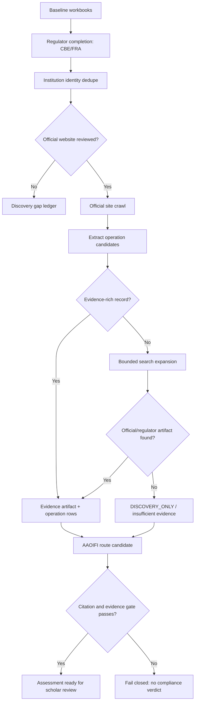

# Official-Source Crawler and Product-Evidence Deep Research

Generated: 2026-05-22 Africa/Cairo

## Tool Run Status

- `tavily-research`: rerun through `tvly research run` succeeded after the CLI change. Raw Tavily output is saved at `artifacts/l6_scrape/research/2026-05-22/tavily_official_source_crawler_research.md`.
- `deep-research`: the named skill exists at `C:\Users\Admin\.agents\skills\deep-research\SKILL.md`. It requires Firecrawl or Exa. Firecrawl tools were not exposed in this session; Exa search and full-page fetch were available and used.
- Scope: research focused on official-source crawling patterns for CBE/FRA completion and open-source tooling for wide product-detail discovery without promoting third-party snippets into Sharia/compliance evidence.

## Executive Summary

The next L6 data layer should be an official-source-first evidence pipeline, not a single broad scrape. The crawler should first complete the institution denominator from CBE/FRA, then attach product/service/contract evidence under reviewed institutions.

CBE provides a licensing page that describes the directory of licensed units and includes a banks-list route. A currently reachable CBE media PDF lists banks registered with the Central Bank of Egypt, registration dates, and head-office addresses. FRA provides server-rendered register pages for capital-market and insurance records, with visible company rows and licensing dates. FRA also exposes `company_records` detail pages with company name, English name, company number, address, license number, phone, email, licensed activities, and license date.

For product/contract discovery, Faisal Islamic Bank's Murabaha page proves the useful extraction pattern: one official page can contain many operation records, including new cars, electric cars, used cars, durable goods, solar stations, real-estate purchases, clinic equipment, scooters, and automotive maintenance. When an official page is title-only, wide search should generate official-domain and phrase queries, but search results remain `DISCOVERY_ONLY` until an official page, official PDF, regulator page, or reviewed primary document is captured.

## Source Findings

| Area | Evidence | Implementation Meaning |
|---|---|---|
| CBE licensing | CBE says its Banking Department grants licenses and maintains a directory of licensed units including a banks-list entry. | Treat the CBE licensing page as a stable seed page and the CBE PDF as primary bank-registry evidence. |
| CBE bank PDF | The fetched CBE PDF is titled "Banks Registered with the Central Bank of Egypt" and includes 36 banks, registration dates, and head-office addresses. | Parse with PDF-aware extraction, normalize bank aliases, compare against `Banks_old.xlsx`, and record the PDF hash/path. |
| FRA capital market | FRA's capital-market register page exposes visible company rows, category/type filters, licensing dates, and a last-modified date of 2026-01-08 in fetched content. | Crawl first page plus deterministic pagination/detail links; dedupe against `Capital_Market_old.xlsx`. |
| FRA insurance | FRA's insurance register page exposes visible company rows, licensing dates, links to reinsurers and foreign reinsurance broker PDFs, and a last-modified date of 2026-04-23 in fetched content. | Treat linked PDFs as first-class official artifacts and compare against `Insurance_old.xlsx`. |
| FRA details | `company_records` detail pages expose Arabic company name, English company name, company number, address, license number, phone, email, licensed activity, and license date. | Add a detail-page parser keyed on Arabic labels, not CSS class names. |
| Faisal product evidence | Faisal's official Murabaha pages expose product families plus caps, finance percentages, repayment terms, fees, required documents, and Sharia financing labels. | Use as a fixture for product/operation extraction and for title-only vs evidence-rich classification. |

## Recommended Data Layers

1. `regulator_registry_snapshot`
   - Raw row-level records from CBE/FRA sources.
   - Fields: regulator, source_url, source_type, source_last_modified, retrieved_at, row_hash, raw_artifact_sha256, parse_status.

2. `institution_identity`
   - Canonical institution row after workbook/regulator dedupe.
   - Fields: institution_id, canonical_name, name_en, name_ar, aliases, regulator, sector, license_id, license_date, official_website, confidence, review_status.

3. `source_discovery`
   - Candidate pages/PDFs/sitemaps/search leads before extraction.
   - Fields: institution_id, query, url, domain, source_class, discovery_method, priority, status, rejection_reason.

4. `evidence_artifact`
   - Immutable source capture.
   - Fields: artifact_id, url, fetched_at, content_type, raw_path, text_path, screenshot_path, sha256, language, extraction_method, extraction_status, evidence_quality.

5. `financial_operation`
   - Structured product/service/contract records.
   - Fields: operation_id, institution_id, operation_name, operation_type, product_family, source_artifact_id, terms_url, fee_terms, repayment_terms, required_documents, application_process, evidence_grade.

6. `contract_clause`
   - Extracted clauses and page/paragraph references.
   - Fields: operation_id, clause_type, original_text, normalized_text, page_number, source_artifact_id, confidence, needs_review.

7. `sharia_evaluation`
   - Mushir/AAOIFI assessment output.
   - Fields: operation_id, route_id, candidate_standards, cited_clauses, assessment_status, unresolved_questions, scholar_review_status.

Critical gate: no `sharia_evaluation` verdict should be produced from a title-only operation. The allowed status is `insufficient_contractual_evidence`.

## Crawl Pattern

## Search Expansion Rules

Use search to discover candidate URLs, not to create compliance facts.

Official-domain templates:

- `site:{official_domain} "{operation_title}"`
- `site:{official_domain} "{operation_title}" filetype:pdf`
- `site:{official_domain} "{arabic_operation_term}"`
- `site:{official_domain} "{english_operation_term}" "fees" OR "terms"`

Regulator/public-document templates:

- `site:cbe.org.eg "{institution_name}" "{operation_title}"`
- `site:fra.gov.eg "{institution_name}" "{activity_or_license_term}"`
- `"{institution_name}" "{operation_title}" filetype:pdf`

Arabic/English expansion examples:

- `Faisal Islamic Bank Egypt New Car Murabaha`
- `site:faisalbank.com.eg "New Cars" "Murabha"`
- `site:faisalbank.com.eg "تمويل السيارات الجديدة"`
- `site:faisalbank.com.eg "مرابحة" "السيارات"`
- `"بنك فيصل الإسلامي" "تمويل السيارات الجديدة" filetype:pdf`

Third-party result policy:

- Store as `DISCOVERY_ONLY`.
- Do not pass to RAG as compliance evidence.
- Use only to suggest new official-domain queries or manual review.
- If no official support is found, keep the operation as `insufficient_contractual_evidence`.

## Tooling Recommendations

| Tool | Use | Decision |
|---|---|---|
| Existing `scripts/run_l6_institution_pilot.py` | Current repo entrypoint for bounded L6 scrape modes. | Keep extending this for the next slice; it already has workbook loading, official-site discovery, artifacts, review exports, and tests. |
| Scrapy | Larger repeatable official-source crawls with queues, throttling, item pipelines, `ROBOTSTXT_OBEY`, `DEPTH_LIMIT`, `DOWNLOAD_DELAY`, `JOBDIR`, and AutoThrottle. | Evaluate only when the current script becomes too large or needs resumable multi-domain crawling. |
| Crawlee for Python | Unified HTTP/browser crawling, retries, persistent queue, Playwright integration, and storage. | Useful spike candidate, but avoid anti-bot bypass features for this compliance corpus. |
| Playwright | Browser fallback for CBE PDF downloads, JS-heavy bank pages, screenshots, and network capture. | Use as explicit fallback after static fetch fails. |
| Trafilatura | Main-text extraction, sitemap/feed discovery, metadata extraction, dedupe-friendly text cleanup. | Good adapter for official HTML pages before RAG ingestion. |
| pdfplumber | Born-digital PDF text/table extraction with visual debugging and layout tuning. | Best default for CBE/FRA registry PDFs and KFS/tariff PDFs. |
| PyMuPDF / PyMuPDF4LLM | Fast PDF extraction, table detection, rendering, OCR fallback, Markdown/JSON outputs. | Useful for speed and RAG-friendly conversion; check AGPL/commercial licensing before production use. |

## Acceptance Gates

Institution completion:

- Every old workbook row is preserved in the ledger.
- Every regulator-discovered row has a source URL and raw artifact hash.
- CBE direct PDF rejection or security pages are recorded as blocked, not treated as success.
- FRA pagination stops deterministically on empty/repeated pages or configured page limit.
- No institution becomes `ready_for_product_crawl` without an official website or reviewed official-source candidate.

Product/contract discovery:

- Each extracted operation links to at least one official artifact.
- Title-only products are retained but marked `insufficient_contractual_evidence`.
- Official PDFs and KFS/tariff pages outrank HTML marketing pages.
- Third-party pages never override official evidence.
- Search expansion has max query, max result, max depth, and source-class budgets.

Sharia/AAOIFI evaluation:

- Assessment requires contract-grade or disclosure-grade evidence.
- The route must point to candidate AAOIFI standards/clauses.
- The answer layer fails closed when evidence is only a name/title.
- Scholar review export stays blank for human columns until reviewed.

## Recommended Next Implementation Slice

Finish `regulator-complete institution registry` before expanding product crawling.

1. Add FRA paginated register/detail parsers for capital market, insurance, finance, fintech, and linked insurance PDFs.
2. Refresh CBE bank PDF handling using the currently reachable media PDF path plus browser fallback for rejected URLs.
3. Export a normalized institution table with source metadata, duplicate scores, and `ready_for_product_crawl`.
4. Add tests for CBE rejection pages, FRA pagination, detail-page label parsing, workbook dedupe, and no fail-open crawl readiness.

Then add product discovery:

1. Use Faisal Murabaha as the first fixture.
2. Split one long product page into multiple `financial_operation` rows.
3. Mark each operation as evidence-rich or title-only.
4. Generate bounded official-domain search queries for title-only rows.

## Sources

1. [CBE Licensing](https://www.cbe.org.eg/en/BankingSupervision/Pages/LicenseLists.aspx)
2. [CBE registered banks PDF](https://www.cbe.org.eg/-/media/project/cbe/page-content/rich-text/financial-stability/english/headoffices-eng(2)-(2).pdf)
3. [FRA capital-market register](https://fra.gov.eg/en/%d8%aa%d8%b3%d8%ac%d9%8a%d9%84-%d9%88-%d8%aa%d8%ad%d8%af%d9%8a%d8%ab-%d8%b3%d8%ac%d9%84%d8%a7%d8%aa-%d9%84%d8%b4%d8%b1%d9%83%d8%a7%d8%aa-%d8%b3%d9%88%d9%82-%d8%a7%d9%84%d9%85%d8%a7%d9%84/)
4. [FRA insurance register](https://fra.gov.eg/en/%D8%B3%D8%AC%D9%84%D8%A7%D8%AA-%D9%81%D9%8A-%D9%85%D8%AC%D8%A7%D9%84-%D8%A7%D9%84%D8%AA%D8%A3%D9%85%D9%8A%D9%86/)
5. [FRA company_records detail example](https://fra.gov.eg/en/company_records/%D8%A7%D9%84%D8%A7%D9%87%D9%84%D9%8A-%D9%83%D8%A7%D8%A8%D9%8A%D8%AA%D8%A7%D9%84-%D9%84%D9%84%D8%AA%D9%85%D9%88%D9%8A%D9%84-%D9%85%D8%AA%D9%86%D8%A7%D9%87%D9%8A-%D8%A7%D9%84%D8%B5%D8%BA%D8%B1-%D8%AA/)
6. [Faisal Bank Murabaha Arabic](https://www.faisalbank.com.eg/Retail/Retail-Funds-Murabha)
7. [Faisal Bank Murabha English](https://www.faisalbank.com.eg/en/Retail/Retail-Funds-Murabha)
8. [Scrapy architecture](https://docs.scrapy.org/en/stable/topics/architecture.html)
9. [Scrapy AutoThrottle](https://docs.scrapy.org/en/latest/topics/autothrottle.html)
10. [Scrapy settings](https://doc.scrapy.org/en/stable/topics/settings.html)
11. [Crawlee for Python introduction](https://apify.github.io/crawlee-python/docs/introduction)
12. [Trafilatura documentation](https://trafilatura.readthedocs.io/en/latest/index.html)
13. [Playwright Python downloads](https://playwright.dev/python/docs/api/class-download)
14. [pdfplumber PyPI/README](https://pypi.org/project/pdfplumber/)
15. [PyMuPDF text recipes](https://pymupdf.readthedocs.io/en/latest/recipes-text.html)
16. [PyMuPDF GitHub](https://github.com/pymupdf/PyMuPDF/tree/main/)
