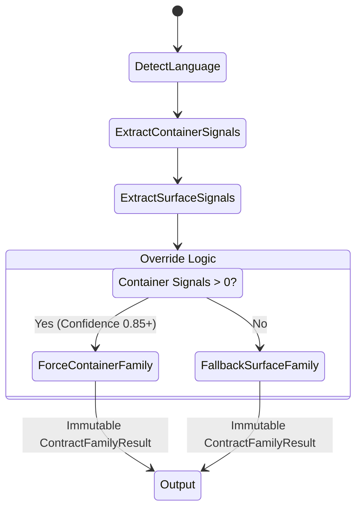
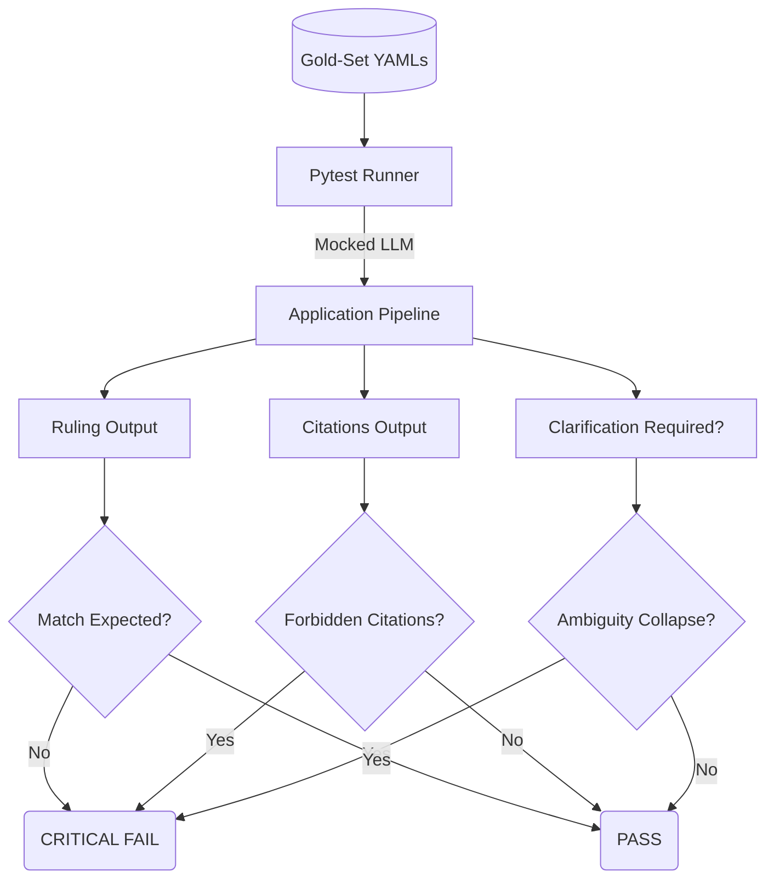

# Mushir Sharia-Bot Pipeline Architecture (V2)

*Updated: 2026-06-01*

Current app version: V1.5 (`1.5.0`)

This document describes the upgraded logic pipeline built during the "Week 1 Sprint" to resolve edge-cases around conditional rulings (e.g., Delay Penalties in Istisna vs. Murabaha). The 2026-05-31 update records the GC-001 correction: ambiguous construction penalties clarify the delaying party first, Istisna / Muqawala penalty routing targets `SS-05` plus `SS-11`, and `SS-10` is reserved for Salam.

V1.5 adds visible/API app versioning and guarded institution-evidence exports. Those exports remain outside the runtime answer pipeline until scholar-reviewed and promoted.

## High-Level Execution Pipeline

```mermaid
flowchart TD
    Q[User Query] --> PP[Query Preprocessor]
    PP --> CE[Clarification Engine]
    
    subgraph "Stage 1: Intent & Contract Family Routing"
        CE --> CFR[Contract Family Router]
        CFR --> |Container Signals > Surface Signals| Result[ContractFamilyResult]
    end
    
    subgraph "Stage 2: Standard Resolution"
        Result --> SR[Standard Resolver]
        SR --> |(Concept + Family) Map| StandardsList[Target AAOIFI Standards]
    end
    
    subgraph "Stage 3: Directed Retrieval"
        StandardsList --> |Metadata Filter| VectorDB[(ChromaDB)]
        VectorDB --> Chunks[Retrieved Chunks]
    end
    
    subgraph "Stage 4: Validation & Generation"
        Chunks --> Prompt[Prompt Builder]
        Prompt --> LLM[OpenRouter / LLM]
        LLM --> CV[Citation Validator]
        CV --> |Accept/Reject| Output[Final Ruling]
    end
```

## Stage 1: Contract Family Router

The `ContractFamilyRouter` prevents "semantic bleed" (where a search for "penalty" retrieves rules for debt instead of rules for construction). It prioritizes structural *Container Signals* over *Surface Signals*.



### Signal Types
- **Container Signals (Structural):** Terms that define the fundamental legal nature of the relationship (e.g., "عقود المقاولات" / Construction Contract).
- **Surface Signals (Concepts):** Terms that appear in many contexts (e.g., "غرامة" / Penalty, "تأخير" / Delay).

## Stage 2: Standard Resolver & Ontology

The `StandardResolver` sits between intent classification and retrieval. It acts as a Sharia-compliant pre-filter.

```mermaid
flowchart LR
    subgraph Ontology[Concept Ontology (YAML)]
        LP[Late Payment Penalty]
        LP --> |Murabaha| SS19[SS-19, SS-28]
        LP --> |Istisna/Muqawala| SS11[SS-11, SS-05]
    end
    
    Query(Query: Penalty + Construction) --> Router
    Router --> |Family: MUQAWALA| Resolver
    Resolver --> |Query + MUQAWALA| SS11
    
    SS11 --> Retriever(Retrieve only from SS-11 and SS-05)
```

### Conditional Rulings (ConceptOntologyEntry)
Each concept in the ontology contains a `conditional_rulings` list (represented via `ConditionalRuling` objects). This ensures that the system knows:
1. Delay Penalty in Debt = Riba (Prohibited)
2. Ambiguous construction delay penalty = clarify who delayed before verdict
3. Contractor delay in construction / Istisna = route to SS-11 and SS-05, not SS-10

## Testing and Quality Gates (Gold-Set Harness)

All Sharia logic is enforced via the `TestCriticalGoldSet` zero-tolerance harness.


