# Mushir Project Clarifications And Developer Walkthrough

Last refreshed: 2026-05-30

This document consolidates the project-review clarifications into one connected technical walkthrough. It is written for a developer, product owner, technical stakeholder, or future AI coding agent who needs to understand how Mushir works without assuming deep prior knowledge of FastAPI, RAG, embeddings, vector databases, or Sharia-compliance software design.

It separates:

- **confirmed current implementation**;
- **current scaffold or partial implementation**;
- **recommended enhancements**.

---

## 1. Executive Mental Model

Mushir is not a free-form chatbot. It is a controlled evidence-backed answer pipeline.

The system receives a user question, validates it, checks product boundaries, determines whether clarification is needed, retrieves relevant AAOIFI passages, optionally calls an LLM to explain the evidence, validates citations, and returns a structured answer.

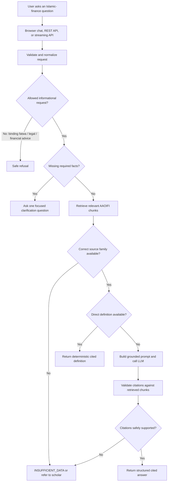

### Core product principle

> The model is an explanation layer. It is not the final authority.

---

## 2. Codebase Layers

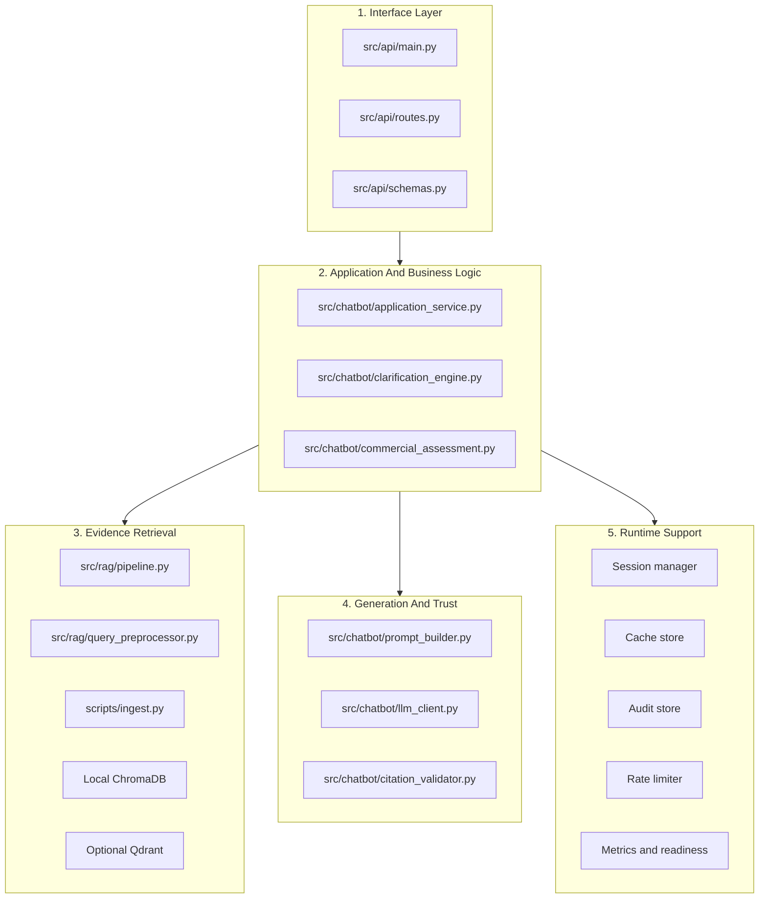

### Plain-language interpretation

| Layer | What it does |
| --- | --- |
| Interface | Receives browser/API requests and returns responses |
| Business logic | Decides whether to answer, clarify, refuse, or say insufficient data |
| Evidence retrieval | Searches the AAOIFI standards corpus |
| Generation and trust | Builds prompts, calls the LLM, validates citations |
| Runtime support | Manages sessions, cache, audit, rate limits, and operational health |

---

## 3. Application Startup

When FastAPI starts, `src/api/main.py` builds the shared runtime dependencies once.

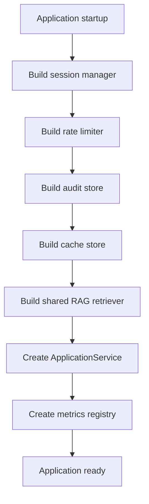

The retriever is built eagerly so requests share one pre-warmed embedding model instead of loading a large model repeatedly.

### Important runtime endpoints

| Endpoint | Purpose |
| --- | --- |
| `/chat` | Browser chat page |
| `/api/v1/query` | Normal JSON question-answer endpoint |
| `/api/v1/query/stream` | SSE-shaped streaming endpoint |
| `/health` | Basic liveness check |
| `/ready` | Dependency and deployment readiness check |
| `/metrics` | Operational metrics |

---

## 4. Request And Response Contracts

The API uses typed Pydantic schemas in `src/api/schemas.py`.

### Request: `QueryRequest`

| Field | Meaning |
| --- | --- |
| `query` | Main user question |
| `content` | Compatibility fallback for older browser prototype |
| `session_id` | Optional session ID |
| `context` | Additional request context |
| `conversation_history` | Previous conversation messages |

### Response: `QueryResponse`

| Field | Meaning |
| --- | --- |
| `answer` | User-facing answer |
| `status` | Result status |
| `citations` | Validator-approved citations |
| `reasoning_summary` | Short visible explanation summary |
| `limitations` | Safety limitation notice |
| `clarification_question` | One required follow-up question when needed |
| `metadata` | Retrieval, scenario, routing, and audit context |

The internal equivalent is `AnswerContract` in `src/models/ruling.py`.

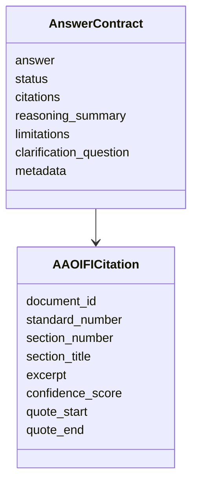

### Supported answer statuses

```text
COMPLIANT
NON_COMPLIANT
PARTIALLY_COMPLIANT
INSUFFICIENT_DATA
CLARIFICATION_NEEDED
```

Grounded answers require citations. Clarification answers must contain exactly one concise clarification question.

---

## 5. Full Runtime Request Flow

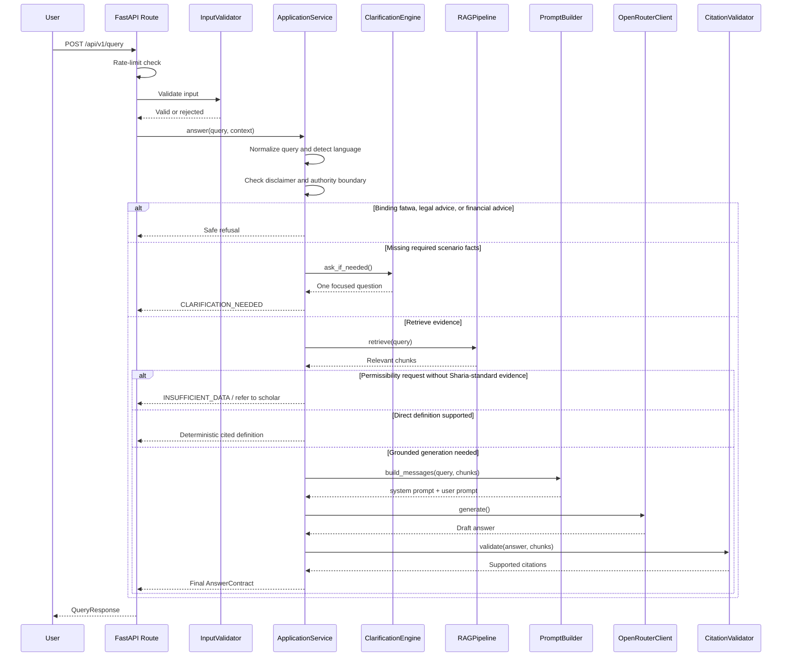

---

## 6. Input Validation And Maximum Query Length

Input validation is handled in `src/security/input_validator.py`.

The default maximum user-query length is:

```python
max_length = 2000
```

A user query longer than 2,000 characters is rejected.

### Why limit the length?

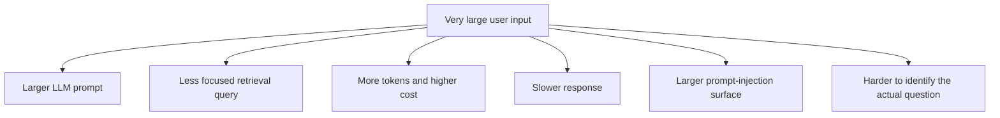

The normal question field is meant for questions, not full contracts or multi-page documents.

### Appropriate current use

```text
What is the AAOIFI accounting treatment for Murabaha receivables?
```

### Future document-analysis workflow

A long contract should use a separate upload-and-analysis pipeline:

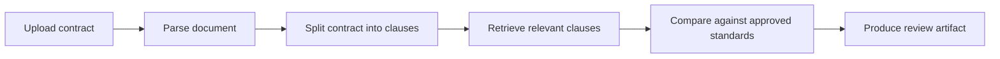

### Other request-size controls

| Data | Current behavior |
| --- | --- |
| Current `query` | Maximum 2,000 characters |
| Conversation-history list | Maximum 20 API entries |
| History passed into prompt workflow | Most recent 10 entries |
| Individual history content | Truncated to 2,000 characters |

---

## 7. AAOIFI Chunking And Ingestion

Only the source corpus is chunked in the current runtime.

The user question is **not** split into chunks.

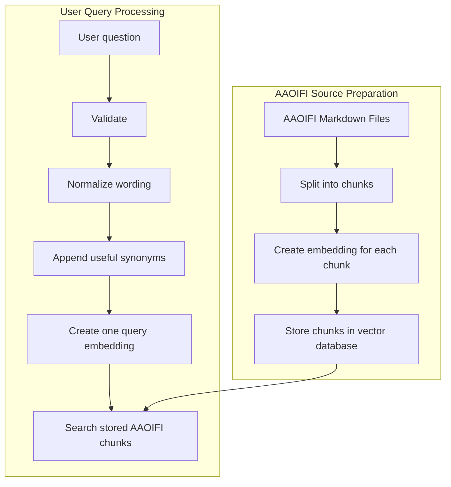

### Chroma ingestion script

The AAOIFI ingestion process is implemented in:

```text
scripts/ingest.py
```

The splitter is configured as:

```python
RecursiveCharacterTextSplitter(
    chunk_size=512,
    chunk_overlap=50,
    separators=["\n\n", "\n", ". ", " ", ""],
)
```

### Meaning of settings

| Setting | Meaning |
| --- | --- |
| `chunk_size=512` | Approximate passage size |
| `chunk_overlap=50` | Repeats a small amount of text between adjacent chunks |
| separators | Prefers splitting by paragraph, line, sentence, then word |

The overlap helps preserve meaning when a relevant sentence crosses a chunk boundary.

### Ingestion flow

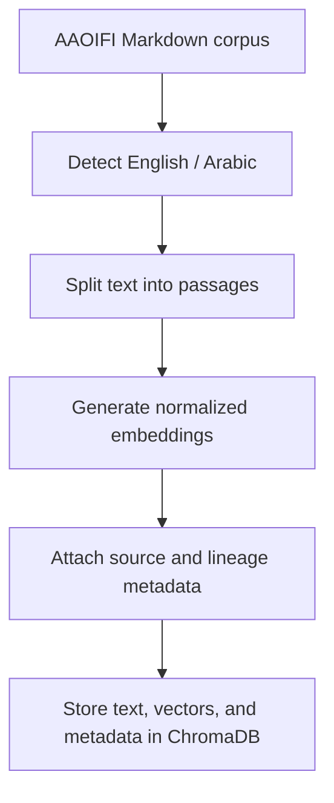

Each chunk receives metadata such as:

- source filename;
- source path;
- standard number;
- language;
- chunk index;
- total chunk count;
- embedding model;
- structural section path.

---

## 8. User Query Normalization And Expansion

The user input is processed as one search query.

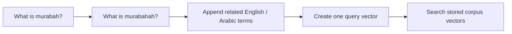

The query preprocessor supports Arabic normalization, transliteration cleanup, and domain expansions.

For example, a Murabaha query may be expanded with:

```text
murabaha
murabahah
مرابحة
المرابحة
deferred payment sale
installment sale
resale
sale
```

### Why expansion matters

Users may use:

- English;
- Arabic;
- mixed Arabic and English;
- transliteration;
- common misspellings;
- colloquial wording;
- product wording rather than standard wording.

The expansion improves retrieval recall while keeping the user query as one embedding-oriented search string.

---

## 9. What “Retrieving Chunks” Means

Retrieval means finding the most relevant stored AAOIFI passages for the user's question.

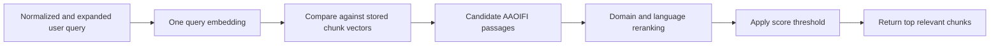

Current defaults:

```python
k = 5
threshold = 0.3
```

This means the service normally retrieves up to five relevant passages whose score passes the threshold.

### Each retrieved chunk contains

| Data | Purpose |
| --- | --- |
| chunk text | Evidence excerpt |
| chunk ID | Traceability |
| score | Retrieval relevance |
| standard number | Citation support |
| source file | Provenance |
| section metadata | More precise citation |
| language | Arabic / English retrieval awareness |

---

## 10. What “Checking Source-Family Gaps” Means

Not every source can support every type of conclusion.

A relevant-looking accounting passage is not automatically enough to answer a halal/haram question.

### Source families

| Source family | Appropriate use |
| --- | --- |
| `fas` | Accounting, recognition, measurement, presentation, disclosure |
| `sharia_standard` | Permissibility and contract validity |
| `governance` | Board oversight and governance controls |
| `ethics` | Ethical guidance |
| `auditing` | Auditing requirements |
| `fatwa` | Approved reviewed fatwa source if introduced later |
| `local_overlay` | Approved local regulator or internal context |

### Source-family gap flow

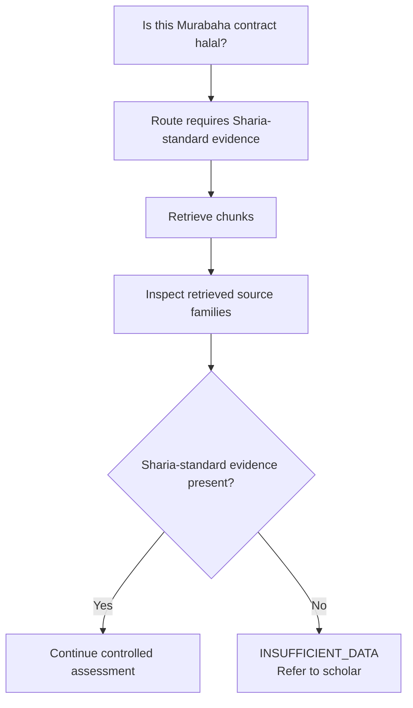

The system currently fails closed when:

1. the question is classified as permissibility or contract validity;
2. the route requires Sharia-standard evidence;
3. retrieved evidence does not include a Sharia-standard source family.

### Why this matters

A Financial Accounting Standard may describe how Murabaha receivables are recognized in accounts. It does not automatically prove that a real contract is Sharia-compliant.

---

## 11. Deterministic Definitions

A deterministic definition is a direct cited explanation built from a retrieved chunk without asking the LLM to compose a new answer.

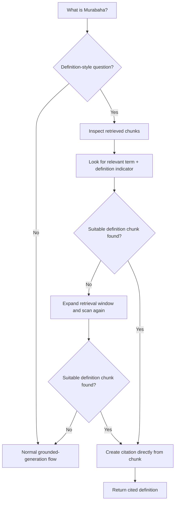

### Definition-style query starters

Examples include:

```text
what is
what are
define
explain
tell me about
ما هي
ما هو
ما معنى
عرف
اشرح
```

### Blocked judgment-style terms

The shortcut is not used for questions containing terms such as:

```text
compliant
allowed
permissible
requirements
conditions
halal
يجوز
حلال
شروط
متطلبات
```

### Chunk-level definition detection

The chunk must contain:

1. a relevant expanded term;
2. a definition-style phrase.

Examples of definition indicators:

```text
is a sale
refers to
means
defined as
definition
هي
يقصد
تعني
تعريف
```

### Important status detail

The current direct definition response uses `INSUFFICIENT_DATA` as its status because a definition is not a transaction-level compliance ruling.

This is safe but semantically awkward. A future enhancement should consider a dedicated status such as:

```text
INFORMATIONAL_ANSWER
DEFINITION_ONLY
```

---

## 12. Commercial Scenario Metadata

Commercial scenario metadata is a structured representation of the question or transaction the user describes.

The schema is `TransactionScenario` in:

```text
src/models/commercial.py
```

```mermaid
flowchart TD
    Scenario["TransactionScenario"] --> Type["Question type"]
    Scenario --> Family["Contract family"]
    Scenario --> Parties["Parties and roles"]
    Scenario --> Asset["Asset"]
    Scenario --> Cash["Cash flows"]
    Scenario --> AssetFlow["Asset flows"]
    Scenario --> Ownership["Ownership sequence"]
    Scenario --> Possession["Possession sequence"]
    Scenario --> Risk["Risk bearing"]
    Scenario --> Profit["Profit basis"]
    Scenario --> Payment["Payment terms"]
    Scenario --> Late["Late-payment terms"]
    Scenario --> Beneficiary["Penalty beneficiary"]
    Scenario --> Security["Guarantees and collateral"]
    Scenario --> Context["Jurisdiction and board context"]
    Scenario --> Missing["Missing facts and uncertainties"]
```

### Current schema fields

| Group | Fields |
| --- | --- |
| Question classification | `question_type` |
| Contract classification | `contract_family` |
| Parties | `parties` |
| Asset | `asset` |
| Financial movement | `cash_flows`, `asset_flows` |
| Sequence facts | `ownership_sequence`, `possession_sequence`, `risk_bearing` |
| Pricing | `profit_basis`, `payment_terms` |
| Default handling | `late_payment_terms`, `penalty_beneficiary` |
| Agency and security | `agency_roles`, `guarantees`, `collateral` |
| Context | `jurisdiction`, `madhhab_or_board_context` |
| Safety | `missing_facts`, `uncertainties` |

### Current practical extractor coverage

The deterministic extractor currently fills only a subset:

- question type;
- contract family;
- asset;
- payment terms;
- late-payment terms;
- profit basis;
- ownership wording;
- possession wording;
- risk wording;
- penalty beneficiary;
- missing facts;
- uncertainties.

Other fields exist for future expansion but are not yet deeply extracted.

---

## 13. Example Scenario Extraction

User asks:

> Can I buy a car through Murabaha installments if the bank charges a late fee?

Possible current extraction shape:

```json
{
  "question_type": "permissibility",
  "contract_family": "murabaha",
  "asset": "car",
  "payment_terms": "Can I buy a car through Murabaha installments...",
  "late_payment_terms": "Can I buy a car through Murabaha installments...",
  "ownership_sequence": null,
  "possession_sequence": null,
  "risk_bearing": null,
  "penalty_beneficiary": null,
  "missing_facts": [
    "ownership_sequence",
    "possession_or_risk_bearing",
    "penalty_beneficiary"
  ],
  "uncertainties": [
    "permissibility_requires_sharia_standards",
    "late_payment_penalty_requires_dedicated_rule_check"
  ]
}
```

### Why missing facts matter

For Murabaha permissibility assessment, questions may depend on:

- whether the bank owned the asset before resale;
- whether the bank took possession or bore risk;
- whether price and profit were known;
- whether late-payment penalties exist;
- who receives those penalties;
- whether the signed documents match the described process.

---

## 14. Recommended Metadata Enhancements

The current scenario scaffold should be enhanced to distinguish educational questions from specific transaction assessments.

### Recommended request scope

```python
class RequestScope(str, Enum):
    GENERAL_EXPLANATION = "general_explanation"
    GENERAL_RULES = "general_rules"
    CASE_ASSESSMENT = "case_assessment"
    ACCOUNTING_TREATMENT = "accounting_treatment"
    STANDARDS_LOOKUP = "standards_lookup"
    COMPARISON = "comparison"
    UNKNOWN = "unknown"
```

### Recommended enhanced metadata

```json
{
  "request_scope": "general_rules",
  "answer_mode": "educational",
  "subject_concept": "murabaha",
  "product_context": "car_financing",
  "is_user_specific_case": false,
  "requires_case_facts": false,
  "optional_next_action": "offer_case_assessment",
  "field_confidence": {},
  "field_provenance": {}
}
```

### Why add these fields?

| Enhancement | Benefit |
| --- | --- |
| `request_scope` | Prevents case-specific clarification for educational questions |
| `answer_mode` | Separates educational answer, source summary, and case assessment |
| `is_user_specific_case` | Records whether the user is discussing their own contract |
| `requires_case_facts` | Determines whether missing facts should block an answer |
| field confidence | Marks explicit, inferred, or unknown facts |
| field provenance | Records whether a fact came from user input, official source, or clarification |
| structured timelines | Makes ownership, possession, and resale sequence testable |

---

## 15. General Murabaha Rules Versus A Specific Murabaha Case

This distinction is important.

### Desired intent flow

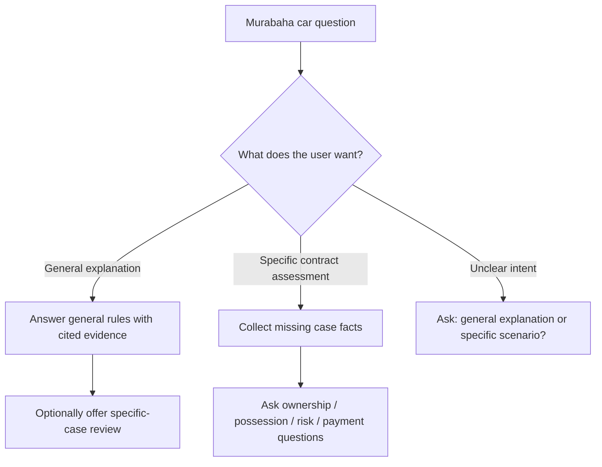

### Example A: general educational question

User:

> Explain the general Sharia rules of Murabaha when purchasing cars.

Expected behavior:

1. recognize general-rules intent;
2. avoid asking for personal transaction details;
3. retrieve approved Sharia-standard evidence;
4. explain general conditions and limitations;
5. optionally ask whether the user wants to review a specific scenario.

### Example B: specific case

User:

> My bank will pay the dealership directly and I will repay the bank over five years. Is this halal?

Expected behavior:

1. recognize case-assessment intent;
2. detect missing ownership and possession facts;
3. ask one focused clarification question;
4. continue controlled fact collection.

### Example C: ambiguous request

User:

> What about Murabaha cars?

Recommended response:

> Would you like a general explanation of Murabaha car-financing rules, or do you want to review a specific financing offer?

### Current implementation behavior

The clarification engine already bypasses clarification for informational starters such as:

```text
what is
what are
what does
what happens
explain
define
summarize
tell me about
ما هي
ما هو
ما معنى
عرف
اشرح
```

However, the current implementation is heuristic. General requests containing words such as `requirements`, `conditions`, `halal`, or `permissible` may still be treated too much like case assessment. The richer `RequestScope` model would reduce over-eager clarification.

---

## 16. Clarification Engine

The clarification engine lives in:

```text
src/chatbot/clarification_engine.py
```

It currently recognizes broad transaction categories:

| Operation type | Required variables |
| --- | --- |
| loan | principal amount, interest/profit rate, duration, purpose |
| investment | company activity, non-compliant revenue percentage |
| purchase | item type, price, payment terms, delivery terms |
| contract | contract type, parties, obligations, duration |

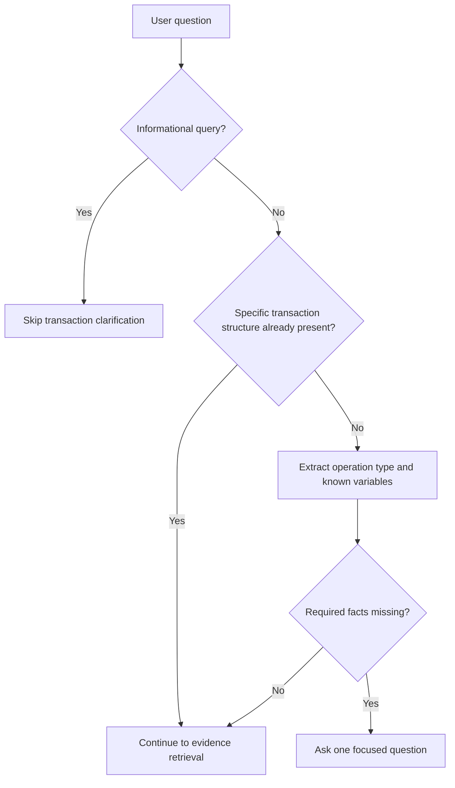

### Current limitation

The clarification engine contains some duplicated Arabic template and keyword assignments. Python keeps the later assignment, so the code works, but the duplicates should be cleaned up for maintainability.

---

## 17. ChromaDB Creation And Population

ChromaDB is the default local vector store.

Configuration:

```text
VECTOR_DB_TYPE=chroma
CHROMA_DIR=./chroma_db_multilingual
```

### Chroma creation flow

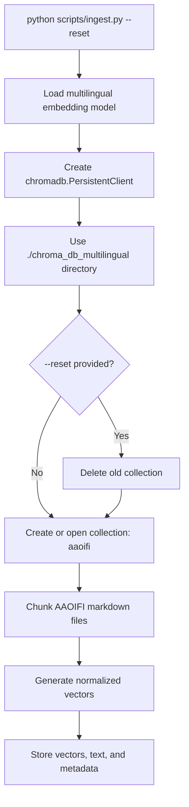

Core code shape:

```python
client = chromadb.PersistentClient(path=args.chroma_dir)

if args.reset:
    reset_collection(client, args.collection)

collection = client.get_or_create_collection(
    args.collection,
    metadata={"hnsw:space": "cosine"},
)
```

### Runtime usage

At runtime, the RAG pipeline opens the already-populated Chroma directory and searches the `aaoifi` collection.

### Important distinction

| Action | What happens |
| --- | --- |
| Ingestion | Creates and populates the vector database |
| Runtime retrieval | Opens and searches the existing populated database |

---

## 18. Optional Qdrant Creation And Population

Qdrant is the optional production-style vector-store adapter.

Configuration:

```text
VECTOR_DB_TYPE=qdrant
QDRANT_URL=http://localhost:6333
QDRANT_COLLECTION=aaoifi_standards
QDRANT_VECTOR_SIZE=768
QDRANT_TIMEOUT_SECONDS=10
```

The adapter lives in:

```text
src/rag/qdrant_store.py
```

### Qdrant collection initialization

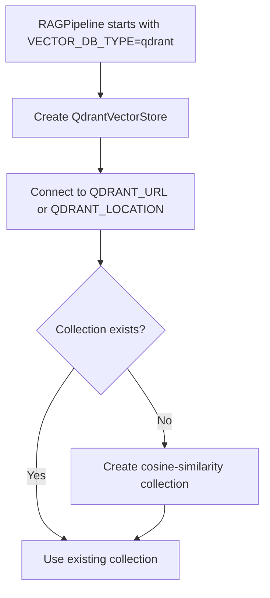

Default collection:

```text
aaoifi_standards
```

Default vector dimension:

```text
768
```

### Qdrant chunk storage

The adapter exposes:

```python
store_chunks(chunks)
```

This method upserts:

- chunk ID;
- embedding vector;
- text content;
- document ID;
- chunk index;
- token count;
- metadata payload.

### Important current gap

The reviewed `scripts/ingest.py` explicitly populates ChromaDB.

The Qdrant adapter can create a collection and store chunks, but the reviewed ingestion script does not call `QdrantVectorStore.store_chunks()`.

Therefore, a real Qdrant deployment still needs an explicit population step.

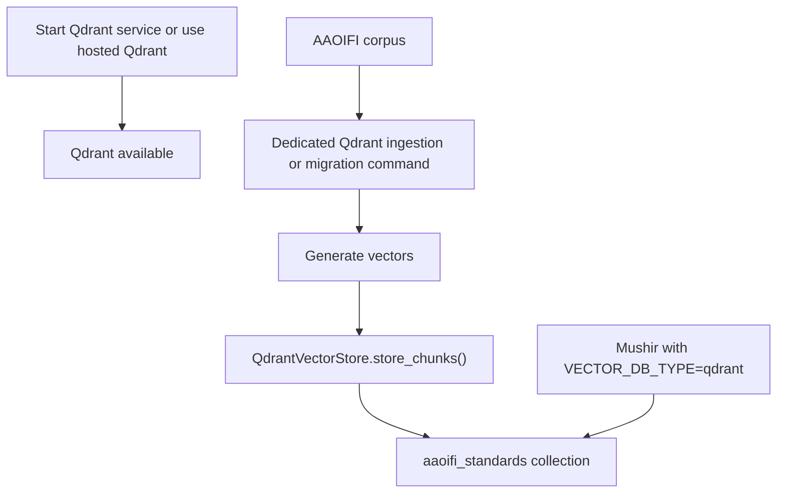

### Chroma versus Qdrant

| Area | ChromaDB | Qdrant |
| --- | --- | --- |
| Typical use | Local development, demo, simple beta | Shared or production-style deployment |
| Storage | Local filesystem directory | Running service or hosted instance |
| Default | Yes | Optional |
| Collection creation | `scripts/ingest.py` | Adapter creates collection if absent |
| Population path | Explicit and implemented | Needs an explicit ingestion/migration command |
| Multi-instance suitability | Limited | Better suited for shared deployments |
| Operational complexity | Lower | Higher |

---

## 19. LLM Generation

The LLM client lives in:

```text
src/chatbot/llm_client.py
```

The main provider adapter is `OpenRouterClient`.

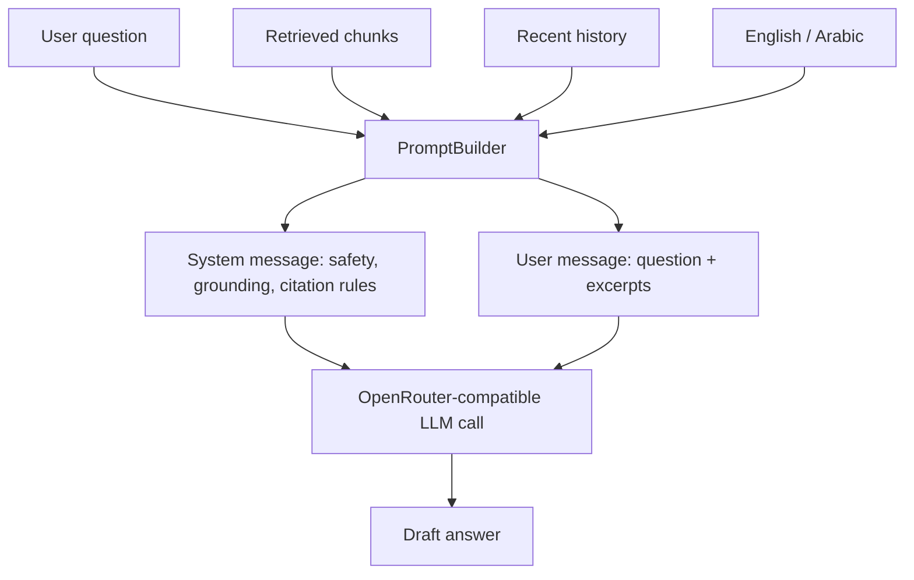

### Provider safeguards

The adapter:

- uses separate system and user messages;
- retries failed requests;
- rejects empty responses;
- detects rate-limit and quota failures;
- raises typed errors;
- exposes a mock LLM for deterministic testing.

---

## 20. Citation Validation

Citation validation lives in:

```text
src/chatbot/citation_validator.py
```

The LLM may write citation text, but the validator decides whether the citation is supported.

```mermaid
flowchart TD
    Draft["LLM draft"] --> Extract["Extract citation patterns"]
    Extract --> Normalize["Normalize standard and section"]
    Normalize --> Compare["Compare against retrieved chunks"]
    Compare --> Match{"Supported by retrieved evidence?"}
    Match -- "Yes" --> Accept["Accept citation"]
    Match -- "No" --> Reject["Reject citation"]
    Accept --> Answer["Attach to AnswerContract"]
    Reject --> Gap["May downgrade to INSUFFICIENT_DATA"]
```

Supported citation shapes include examples such as:

```text
[FAS-28]
[FAS-28 §8]
[AAOIFI FAS-28, Section 8, page 8]
[معيار أيوفي FAS-28، القسم 8، صفحة 8]
```

---

## 21. Caching

Caching lives in:

```text
src/storage/cache.py
```

Supported implementations:

| Cache | Typical use |
| --- | --- |
| `InMemoryCacheStore` | Local development and demo |
| `RedisCacheStore` | Shared production-style deployment |

```mermaid
flowchart TD
    Query["Normalized query"] --> Key["Build cache key"]
    Key --> Payload["Include query, prompt version, model, corpus version, retriever, k, threshold"]
    Payload --> Hash["Create stable SHA-256 key"]
    Hash --> Cache{"Cache hit?"}
    Cache -- "Yes" --> Return["Return cached AnswerContract"]
    Cache -- "No" --> Compute["Run retrieval and answer workflow"]
    Compute --> Save["Cache safe non-clarification answer"]
```

Clarification responses are not cached. Evaluation mode disables cache.

---

## 22. Streaming Endpoint

The API exposes an SSE-shaped endpoint:

```text
POST /api/v1/query/stream
```

Current events include:

```text
started
retrieval
token
citation
done
error
```

```mermaid
flowchart TD
    Request["POST /query/stream"] --> Started["event: started"]
    Started --> Service["Run ApplicationService.answer()"]
    Service --> Retrieval["event: retrieval"]
    Retrieval --> Token["event: token"]
    Token --> Citation["event: citation for each citation"]
    Citation --> Done["event: done"]
```

### Important implementation note

This is structured SSE output, but it is not yet true provider-level incremental token streaming. The answer is generated first and then emitted through SSE events.

---

## 23. Current L6 Commercial-Assessment Scaffold

The early L6 scaffold is in:

```text
src/chatbot/commercial_assessment.py
```

It currently:

- extracts a conservative transaction scenario;
- classifies question type;
- identifies contract family;
- chooses source-family routing;
- marks missing facts;
- detects source-family gaps;
- fails closed for permissibility questions without Sharia-standard evidence.

It does **not** yet encode a full rules-first evaluator.

```mermaid
flowchart TD
    Query["Commercial-process question"] --> Extract["ScenarioExtractor"]
    Extract --> Route["StandardsRouter"]
    Route --> Rules["CommercialRuleEvaluator"]
    Rules --> Current["Current behavior: rules_not_encoded flag"]
    Current --> Human["Human review / future rule implementation"]
```

### Current placeholder behavior

When rules are required, the scaffold adds flags such as:

```text
rules_not_encoded
late_payment_penalty_review_required
```

This is intentional fail-closed behavior.

---

## 24. Recommended Rules-First Future Direction

```mermaid
flowchart TD
    Story["Transaction story"] --> Scope["Classify request scope"]
    Scope --> Extract["Extract structured facts"]
    Extract --> Missing{"Required facts missing?"}
    Missing -- "Yes" --> Ask["Ask one focused clarification"]
    Missing -- "No" --> Route["Route to approved source families"]
    Route --> Evidence["Retrieve current source evidence"]
    Evidence --> Rules["Apply explicit deterministic rules"]
    Rules --> Conflict{"Weak, conflicting, or unsupported?"}
    Conflict -- "Yes" --> Scholar["Refer to scholar / insufficient evidence"]
    Conflict -- "No" --> Verdict["Build structured non-fatwa verdict"]
    Verdict --> Cite["Validate citations"]
    Cite --> Explain["LLM explains checked result"]
    Explain --> Trace["Store audit and evaluation trace"]
```

The key principle remains:

> The AI writes the explanation after the controlled checks. It should not secretly act as the judge.

---

## 25. Known Implementation Notes And Cleanup Opportunities

### 1. Add explicit request scope

The current intent logic should distinguish:

- general explanation;
- general rules;
- case assessment;
- accounting treatment;
- standards lookup;
- comparison;
- unknown intent.

### 2. Improve direct-definition status

Use `INFORMATIONAL_ANSWER` or `DEFINITION_ONLY` instead of overloading `INSUFFICIENT_DATA`.

### 3. Clean duplicated clarification mappings

The Arabic templates and keyword assignments contain duplicates. Keep one reviewed canonical mapping.

### 4. Add a Qdrant population command

Provide one of:

- `scripts/ingest_qdrant.py`;
- `scripts/ingest.py --vector-db qdrant`;
- a Chroma-to-Qdrant migration utility.

### 5. Add first-class document upload workflow

A long contract-analysis flow should be separate from the short-question endpoint.

### 6. Add structured flow extraction

Populate:

- parties;
- asset flows;
- cash flows;
- agency roles;
- guarantees;
- collateral;
- field-level confidence;
- field provenance.

### 7. Add true provider streaming if required

The current SSE shape is useful, but true incremental LLM token streaming is a future enhancement.

---

## 26. Developer Reading Order

A developer joining the project should read files in this order:

1. `docs/project-clarifications-and-developer-walkthrough.md`
2. `docs/client-plain-language-logic.md`
3. `src/api/main.py`
4. `src/api/routes.py`
5. `src/api/schemas.py`
6. `src/chatbot/application_service.py`
7. `src/chatbot/clarification_engine.py`
8. `src/rag/query_preprocessor.py`
9. `src/rag/pipeline.py`
10. `scripts/ingest.py`
11. `src/chatbot/prompt_builder.py`
12. `src/chatbot/llm_client.py`
13. `src/chatbot/citation_validator.py`
14. `src/models/commercial.py`
15. `src/chatbot/commercial_assessment.py`
16. `src/rag/qdrant_store.py`

---

## 27. Glossary

| Term | Simple meaning |
| --- | --- |
| API | A structured way for another app to call Mushir |
| FastAPI | Python web framework used by Mushir |
| RAG | Search evidence first, then generate an answer |
| Corpus | Collection of source documents |
| Chunk | Small searchable passage from a document |
| Embedding | Numerical representation of text meaning |
| Vector database | Database that retrieves text based on meaning similarity |
| ChromaDB | Default local vector database |
| Qdrant | Optional production-style vector database |
| Source family | Category of authority, such as FAS or Sharia Standard |
| Deterministic | Fixed code-driven behavior rather than free-form LLM reasoning |
| Scenario metadata | Structured facts extracted from the user's question |
| Citation validation | Checking that citations match retrieved evidence |
| Fail closed | Refuse or say insufficient data when evidence is not safe enough |
| LLM | Large language model used to draft explanations |
| SSE | Server-Sent Events, an HTTP streaming format |
| AnswerContract | Structured internal answer package |

---

## 28. Final Summary

The current Mushir system is a FastAPI-based, multilingual, evidence-backed RAG assistant.

Its runtime flow is:

```mermaid
flowchart LR
    Validate["Validate"] --> Normalize["Normalize"]
    Normalize --> Scope["Check scope"]
    Scope --> Clarify["Clarify if needed"]
    Clarify --> Retrieve["Retrieve chunks"]
    Retrieve --> Family["Check source family"]
    Family --> Define["Use direct definition if possible"]
    Define --> Generate["Otherwise generate from evidence"]
    Generate --> Cite["Validate citations"]
    Cite --> Return["Return structured answer"]
```

The most important enhancements are:

1. explicit general-question versus case-assessment intent;
2. stronger scenario extraction;
3. explicit Qdrant ingestion;
4. source-governed Sharia-standard retrieval;
5. rules-first L6 evaluation for limited supported domains;
6. document-upload workflow for long contracts;
7. continued human review and evaluation gates.
