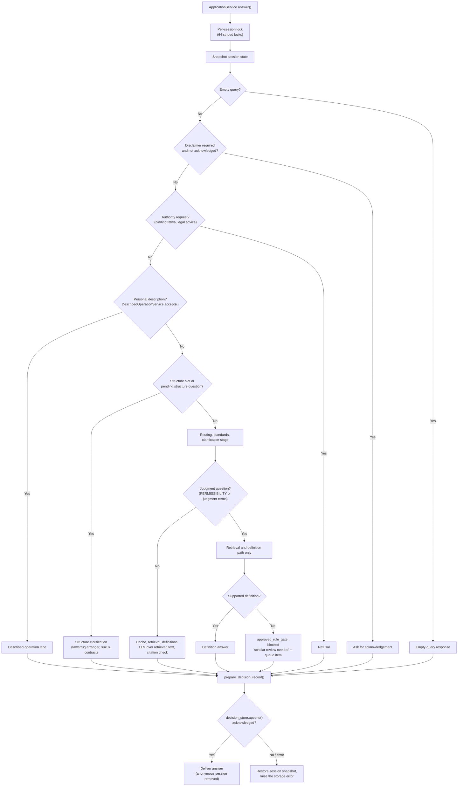
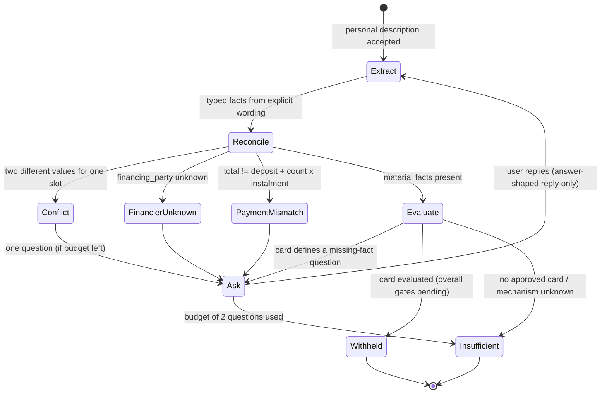

# Runtime Safety Model (V1.6)

Last refreshed: 2026-10-01 · Code baseline: commit `79e9aa6` and later on `feat/egypt-instalment-market-strategy`

This is the developer reference for how the V1.6 answer path decides what Mushir may say. It supersedes the verdict-pipeline descriptions in older docs (`project-documentation.md`, `design.md`, `chatbot-architecture.md`, `project-clarifications-and-developer-walkthrough.md`), which still describe retrieved evidence plus valid citations as enough for a verdict. That is no longer true.

The canonical product contract is the [Egypt market POC spec](../../../_bmad-output/initiative-egypt-market-knowledge/spec-egypt-market-poc/spec-egypt-market-poc.md). This page explains how the code implements it today.

## The Five Rules

1. **No verdict without an approved rule card.** A permissibility result comes only from `ApprovedCardEvaluator` with a card whose status and scholar sign-off are both `approved`. No such card exists yet, so every judgment question defers.
2. **The contract mechanism must be documented.** `mechanism_archetype` is accepted only as an `observed` fact from a provider-terms, transaction-disclosure or donated-agreement source. Generic words ("instalment", "financing", "تقسيط") never set it.
3. **Only what the user said becomes a fact.** The described-operation lane records explicit user assertions; unknown stays unknown and conflicts stay conflicting until the user resolves them.
4. **No numeric confidence on any answer surface.** Answers carry an evidence summary (sources, capture date, age) instead.
5. **No answer is delivered unless its review record is committed.** If the decision-review write fails, the user gets an error and the session is restored to its prior state.

## Answer Path

Judgment questions never reach the response cache or the LLM writer. Knowledge and definition questions keep the grounded retrieval path.

## Described-Operation Lane

Files: `src/chatbot/described_operation.py`, `src/chatbot/described_operation_facts.py`, `src/models/evidence.py`.

| Behaviour | Where |
| --- | --- |
| At most `MAX_CLARIFICATIONS = 2` questions per transaction | `DescribedOperationService` |
| A reply continues the transaction only if it looks like an answer to the open slot (`_answers_pending`); otherwise it is routed as a new question | `accepts()` |
| Bare numbers answer a money question only when the transaction already uses exactly one currency | `known_currency()`, `parse_schedule_reply()` |
| A foreign currency token blocks only the amount it touches | `extract_operation_facts()` |
| Negation is scoped to its clause; Arabic negation and connectors match whole words | `matches()`, `mechanism_terms._topic_matches()` |
| When nothing is asked, `pending_slot` is cleared | `answer()` |
| An evaluated card still withholds the overall answer, and its `outcome` and `supporting_facts` are stripped from client metadata | `answer()` |

## Rule Cards

Files: `src/governance/rule_cards.py`, `src/ontology/approved_card_evaluator.py`. Schema: [rule-card-schema.md](../../../_bmad-output/initiative-egypt-market-knowledge/spec-egypt-market-poc/rule-card-schema.md).

- Cards load from `APPROVED_RULE_CARDS_PATH` (YAML) or the `approved_rule_cards` constructor argument; an explicit argument wins. A missing, malformed or oversized file stops startup with a `RuntimeError` naming the variable.
- YAML aliases, merge keys, duplicate keys and files over 1 MB are refused.
- `runtime_eligible` requires `status: approved` and an approved scholar sign-off with a human reviewer id and a date that is not in the future.
- Reviewer identity: an automatic-identity denylist always applies. Setting `REVIEWER_REGISTRY_PATH` (one id per line) restricts approvals to listed reviewers; an unreadable registry fails closed.

## Evidence Status

File: `src/models/evidence_display.py`.

- `AnswerContract` strips every numeric score key (confidence, score, similarity, relevance, distance, rerank, and numeric lists under those names) from metadata.
- `metadata.evidence` holds `status`, `source_age_status` and per-source `captured_at` and `age_days`. Naive, malformed or future timestamps become `unknown`.
- The API `Citation` exposes `captured_at`; `confidence_score` is gone (see `CHANGELOG.md`).
- Scholar-queue items store `system_confidence: null` when the answer carried no score.

## Decision-Review Store

**Early POC review hold, updated 2026-10-01:** Age purges now return without deleting records in local SQLite, the archive and the Postgres mirror, including direct calls and scheduled startup/periodic paths. The 365-day and seven-day settings below describe a later policy and are inactive during this hold. A later implementation must require a recorded operator activation before any deletion. On a Space, `SPACE_ID`/`SPACE_HOST` or explicit strict mirroring requires a valid Postgres URL at startup; mirror-write failure withholds the answer and keeps the attempted record pending locally. These controls have local test coverage only; deployed configuration and persistence still need verification.

Files: `src/storage/decision_review_store.py`, `src/models/decision_audit.py`.

| Item | Value |
| --- | --- |
| Storage | SQLite, WAL mode, `synchronous=FULL` |
| Location | `DECISION_REVIEW_DB_PATH`, default `data/runtime/decision_reviews.sqlite3`; docker-compose mounts `./data/runtime` |
| Record | Query, response (without the duplicate `decision_review`), typed review row, all eight gate decisions, request and session ids |
| Client sees | `metadata.review_receipt` only; `metadata.decision_review` is removed at the API boundary |
| Retention | Early POC hold preserves all review rows. `DECISION_REVIEW_RETENTION_DAYS` defaults to 365 for a later explicitly activated policy and cannot lift the hold. |
| Purge | Startup and 24-hour tasks call hold-protected methods and delete no rows during the hold. |
| Not committed to git | `*.sqlite3` and the `-wal`/`-shm` side files are ignored |

On Hugging Face Spaces the disk is not persistent unless persistent storage is enabled for the Space, so records do not survive a rebuild there. Plan this before any review-dependent use of the Space.

## Test Status

Full suite on 2026-10-01 (evening): **1,661 passed, 2 strict xfail (TC-F1, TC-G1), 48 skipped**; Playwright: **42/42** (last browser run). Critical gold cases without an approved card pass only by abstaining at the approved-rule gate with sources, in the user's language, queued for the scholar.

The 12 failures are expected under the gate and must not be "fixed" by editing expected answers:

| Group | Cases | Why they fail |
| --- | --- | --- |
| Critical gold set | GC-003, 005, 007, 008, 009, 010, 012, 016, 017, 019 | They expect a verdict; no approved rule card exists, so Mushir defers |
| Routing accuracy | TC-F1, TC-G1 | They expect a contract family from generic wording, which the mechanism gate refuses |

No scholar has reviewed these labels; the `authority: Sharia Scholar` field names the authority each needs. Resolution is a scholar decision per case, prepared in the [Scholar Review Pack](../../../outputs/client-review-pack/index.html).

Regression suites for this model: `tests/test_review_blockers.py`, `tests/test_review_hardening.py`, `tests/test_review_followups.py`, `tests/test_answer_surface_continuation.py`, `tests/test_decision_review_store.py`, `e2e/evidence-status.spec.ts`.

## Known Limits

Tracked in [deferred-work.md](../../../_bmad-output/initiative-egypt-market-knowledge/deferred-work.md):

- DNS names that resolve to private addresses pass the public-URL check; enforce at fetch time in the acquisition code.
- Negation masks a contract name only within the three preceding words.
- SQLite writes and LLM calls are synchronous inside async routes.
- `AAOIFICitation.confidence_score` remains internally for scholar-review code and scrub tests.

## Configuration Summary

| Variable | Purpose | Default |
| --- | --- | --- |
| `APPROVED_RULE_CARDS_PATH` | YAML file of rule cards | unset (no cards) |
| `REVIEWER_REGISTRY_PATH` | Allowed reviewer ids | unset (denylist only) |
| `DECISION_REVIEW_DB_PATH` | Review store file | `data/runtime/decision_reviews.sqlite3` |
| `DECISION_REVIEW_RETENTION_DAYS` | Retention window | `365` |
| `REQUIRE_DISCLAIMER_ACK` | Ask users to acknowledge scope first | `false` |
| `VECTOR_DB_TYPE` | `chroma` (baked into the image) or `qdrant` | `chroma` |
