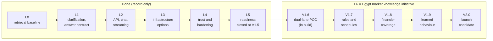
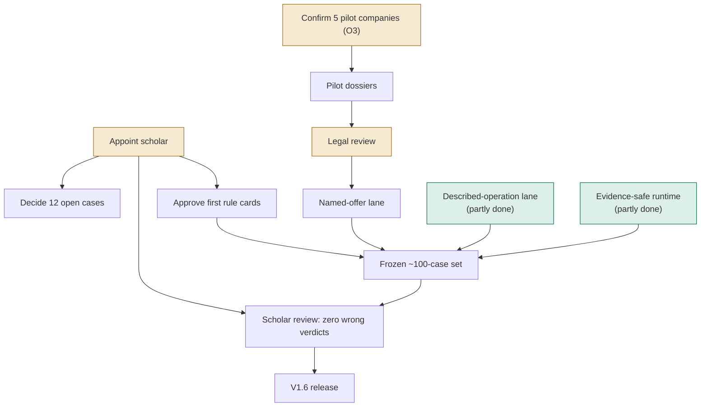

# Mushir Roadmap And Planning Index

Last refreshed: 2026-10-01

This is the single roadmap view. Versions are defined only in the [release ladder](../../../_bmad-output/initiative-egypt-market-knowledge/spec-egypt-market-poc/release-ladder.md); this page maps them to the work and links the history.

> **Critical path:** no scholar has been appointed. The V1.6 exit gate (about 100 scholar-reviewed cases), every rule card, and the 12 open test cases depend on one.

## From L0 To V2.0

## Release Ladder And Epics

| Version | Epics | State on 2026-10-01 |
| --- | --- | --- |
| V1.6 | [evidence-safe-runtime](../../../_bmad-output/initiative-egypt-market-knowledge/epic-evidence-safe-runtime/epic-evidence-safe-runtime.md) | Partly done: contracts, approved-card evaluator, mechanism gate, evidence status and review store built; claim-support gate, deploy and pilot cards not started |
| V1.6 | [described-operation-lane](../../../_bmad-output/initiative-egypt-market-knowledge/epic-described-operation-lane/epic-described-operation-lane.md) | Partly done: typed slots, reconciliation, question budget built; frozen EN/AR cases and deploy not started |
| V1.6 | [pilot-dossiers](../../../_bmad-output/initiative-egypt-market-knowledge/epic-pilot-dossiers/epic-pilot-dossiers.md) | Not started: waits for the pilot list (O3) |
| V1.6 | [named-offer-lane](../../../_bmad-output/initiative-egypt-market-knowledge/epic-named-offer-lane/epic-named-offer-lane.md) | Not started: waits for dossiers and legal review |
| V1.6 | [scholar-verified-v1-6-release](../../../_bmad-output/initiative-egypt-market-knowledge/epic-scholar-verified-v1-6-release/epic-scholar-verified-v1-6-release.md) | Not started: waits for a scholar |
| V1.7 | [scholar-rule-cards](../../../_bmad-output/initiative-egypt-market-knowledge/epic-scholar-rule-cards/epic-scholar-rule-cards.md), [schedule-screenshots](../../../_bmad-output/initiative-egypt-market-knowledge/epic-schedule-screenshots/epic-schedule-screenshots.md) | Not started |
| V1.8 | [financier-coverage](../../../_bmad-output/initiative-egypt-market-knowledge/epic-financier-coverage/epic-financier-coverage.md) | Not started |
| V1.9 | [learned-behavior](../../../_bmad-output/initiative-egypt-market-knowledge/epic-learned-behavior/epic-learned-behavior.md) | Not started |
| V2.0 | [launch-candidate](../../../_bmad-output/initiative-egypt-market-knowledge/epic-launch-candidate/epic-launch-candidate.md) | Not started |

Shaded tan boxes are external decisions; green boxes are partly built.

## Which Plan Is Canonical

| Document | Status |
| --- | --- |
| [Egypt market POC spec](../../../_bmad-output/initiative-egypt-market-knowledge/spec-egypt-market-poc/spec-egypt-market-poc.md) and companions | **Canonical** contract for L6 |
| [L6 Market Knowledge Strategy](L6-MARKET-KNOWLEDGE-AND-POC-RELEASE-STRATEGY.md) | Rationale only; distilled into the spec |
| [L6 Rules-First Evaluator Plan](L6-RULES-FIRST-SHARIA-COMMERCIAL-EVALUATOR-PLAN.md) | Superseded by the spec's architecture and rule-card schema; its FAS-is-accounting-only boundary still holds |
| [L6 Egypt Financial Institutions Evidence Corpus Plan](L6-EGYPT-FINANCIAL-INSTITUTIONS-EVIDENCE-CORPUS-PLAN.md) | Partly superseded by the pilot-dossier and financier-coverage epics; its crawl ethics and bounded-discovery rules remain the reference |
| [L5 Quality, Ops and Release Readiness](L5-QUALITY-OPS-RELEASE-READINESS-PLAN.md) | Closed at V1.5 |

## History (Record Only)

| Document | What it records |
| --- | --- |
| [00-L0 Implementation Review](00-L0-IMPLEMENTATION-REVIEW.md) | May 9 reconciliation of the Gemini CLI baseline |
| [L1 Clarification And Stabilization](L1-CLARIFICATION-AND-STABILIZATION-PLAN.md) | Clarification engine and answer contract |
| [L2 API And Streaming](L2-API-AND-STREAMING-PLAN.md) | REST, SSE and browser chat |
| [L3 Production Infrastructure](L3-PRODUCTION-INFRASTRUCTURE-PLAN.md) | Qdrant, Redis, PostgreSQL options and readiness |
| [L4 Compliance Quality And Ops](L4-COMPLIANCE-QUALITY-AND-OPS-PLAN.md) | Citation quality, disclaimers, caching, hardening |
| [Party-Mode Review Summary](PARTY-MODE-REVIEW-SUMMARY.md) | May 9 refinement of L1–L4 |
| `../phases/` and `../../../_bmad-output/planning-artifacts/` | May 2026 UX track (P1/P2 stories and summaries) |

Unchecked boxes in the history files are not open work. Current open work lives in the epics above and in [deferred-work.md](../../../_bmad-output/initiative-egypt-market-knowledge/deferred-work.md).
