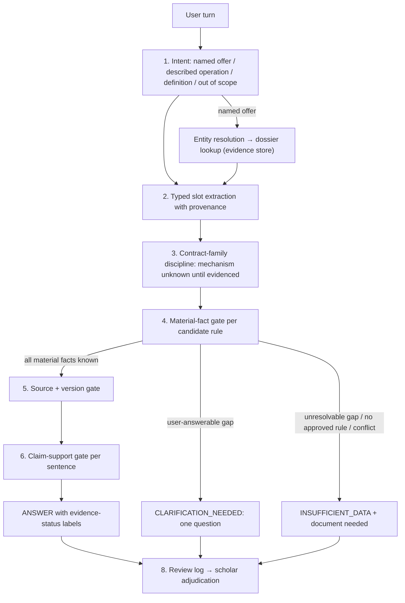
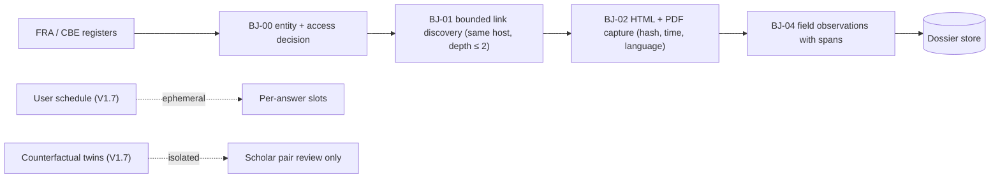

# Architecture

Serves CAP-1..CAP-8 now, with extension points for CAP-9..CAP-15.

## Three layers

| Layer | Holds | Changes through | Never |
| --- | --- | --- | --- |
| Evidence store | Entities, products, mechanisms, dated per-field observations, source spans, access decisions | Crawls, document intake, analyst verification | Stored in model weights |
| Rule cards | Client rules + AAOIFI/IIFA references compiled to material facts and outcomes (`rule-card-schema.md`) | Scholar sign-off | Blended or averaged by the model |
| Model behavior | Slot extraction, next question, abstention, plain explanation | Prompts (V1.6–V1.8); SFT/DPO on accepted transcripts (V1.9+) | Source of a company fact or verdict |

## Answer path

Gate 7 (selective-answer risk threshold) stays deterministic abstention until CAP-15 calibration. The order and semantics follow the adopted `dual-query-poc-answer-gates.md`. A failed gate blocks the requested conclusion only; independently supported facts may still be returned.

## Evidence acquisition

The existing one-page claim checker (`scripts/scrape_egypt_installment_market.py`) and its immutable runs stay as they are. `journey_discovery` is a separate bounded pass writing to an append-only observation store. PDF handling comes before JavaScript rendering.

The public capture foundation is `src/acquisition/public_capture.py`, exposed by `scripts/capture_entity_identity_pages.py`. It accepts reviewed exact URL decisions, records independent policy/gate outcomes, and writes immutable per-run raw/decoded/extraction artifacts with hashes and PDF page references. It does not yet implement the link graph, observation-store write path, browser/OCR automation or private intake. The [playbook](../evidence-acquisition-playbook.md) specifies those boundaries and supplies operator templates.

## Components (V1.6)

| Component | Responsibility | Location |
| --- | --- | --- |
| Dossier store | Append-only observations; current view = latest valid observation per field plus latest failed attempt | SQLite file shipped in the Space image |
| Journey discovery | BJ-00..02 for pilot hosts under access policy | New pass beside the market collector |
| Observation extractor | BJ-04 spans, roles and document class | Extends `src/governance/institution_pipeline.py` |
| Slot extractor | Typed slots for both lanes | Replaces whole-query storage in `src/chatbot/commercial_assessment.py` |
| Decision engine | Material-fact gate + tri-state conditions | `src/chatbot/clarification_engine.py`, `src/ontology/ruling_evaluator.py` |
| Answer surface | Evidence-status labels, source dates, no % | `src/chatbot/application_service.py`, chat UI |
| Review export/import | Bilingual review rows, frozen-set versioning | Existing scholar-review CSV import/export |

AAOIFI text retrieval stays in the Chroma index. Deploy with `--skip-index` when retrieval data is unchanged.

## Cross-cutting rules

- Every stored value carries a source span or user turn, scope, date/version and status (`observed`, `user_reported`, `conflicting`, `unknown`).
- Named-company answers cite the dossier observation date; mismatched template versions produce a clarification or INSUFFICIENT_DATA.
- Synthetic rows carry `synthetic_counterfactual` and are excluded from named-company retrieval by construction, not by filter convention.
- Company-level wording: "Based on [company]'s published terms dated [date] and rule [name] approved by the reviewing scholar, this clause raises …; confirm against your own agreement." Never "[company] is haram" or guarantees of a ruling.
- The archetype prior (V1.9) plugs in only at question ordering and document choice; it has no write path to slots or decisions.
