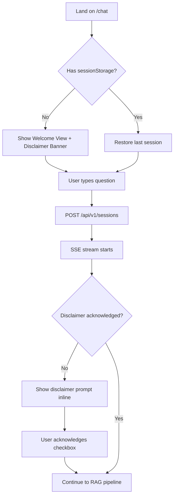
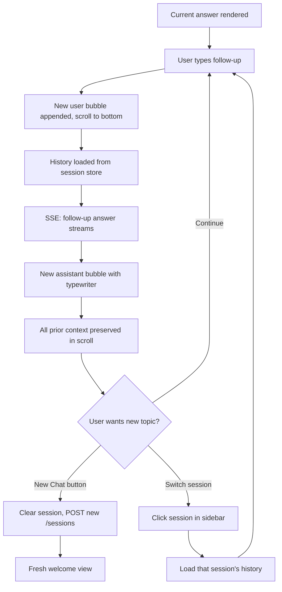

# UX Design Specification: Mushir Sharia Compliance Chatbot

**Author:** Ahmed
**Date:** 2026-05-14
**Project:** Mushir-Sharia-Bot
**Focus:** Full Chatbot UX Enhancement

---

## Executive Summary

### Project Vision

Mushir is a RAG-based Islamic finance compliance chatbot grounded in AAOIFI FAS standards. Users ask Sharia compliance questions in English or Arabic and receive grounded, citation-backed analyses with clear compliance verdicts (COMPLIANT / NON_COMPLIANT / PARTIALLY_COMPLIANT / INSUFFICIENT_DATA). The system supports multi-turn clarification, bilingual output, and SSE streaming.

### Target Users

Islamic finance professionals, Sharia compliance officers, banking analysts, scholars, and students — bilingual (English/Arabic), professional context, varying technical comfort. Primary use case is quick compliance due diligence on financial transactions, investments, and contracts.

### Key Design Challenges

1. **Bilingual/bidirectional UX** — Arabic RTL and English LTR must coexist gracefully in the same chat thread
2. **Information density** — Citations, compliance status badges, reasoning summaries, and limitations must be scannable without overwhelming
3. **Trust & authority signals** — Compliance analysis must feel grounded and transparent, not like a black-box LLM
4. **Clarification loop UX** — Back-and-forth fact-gathering must feel conversational, not like filling a form
5. **Mobile + desktop parity** — Professionals may use this on both phone and desktop

### Design Opportunities

1. **Compliance status as visual language** — Color-coded badges (green=compliant, red=non-compliant, amber=partial) create instant comprehension
2. **Citation cards as credibility anchors** — Expandable AAOIFI standard cards with excerpts build trust through transparency
3. **Streaming typewriter effect** — Token-by-token display creates the feeling of a thinking expert, not a batch processor
4. **Session history sidebar** — Lets users revisit past analyses and compare multiple rulings

## Core User Experience

### Defining Experience

The core loop is: **Ask → Retrieve → Generate → Verify.** Every UX decision serves this loop. Users type a Sharia compliance question, see it stream back with citations, and get a clear compliance status badge. All UI chrome exists only to make this loop faster, more transparent, and more trustworthy.

### Platform Strategy

- **Primary:** Responsive web application (desktop + mobile via same codebase)
- **Framework:** The current inline `CHAT_HTML` in `main.py` should be extracted to a proper HTML/CSS/JS frontend served by FastAPI static files
- **Mobile-first breakpoints** — the highest-growth usage scenario is quick checks from a phone
- **No native apps** — PWA-capable web app covers all use cases
- **Bidirectional input** — keyboard for text, touch for mobile, physical keyboards on desktop

### Effortless Interactions

| Interaction | Principle | UX Pattern |
|-------------|-----------|------------|
| Asking a question | Zero friction | Auto-focus input on load, placeholder hints, Enter to send |
| Reading an answer | Streaming typewriter | Token-by-token display with natural speed |
| Checking citations | One tap | Inline expandable citation cards — no page navigation |
| Re-asking / follow-up | Context carries over | Conversation history visible, auto-scroll to latest |
| Starting fresh | One click | New Chat button clears context instantly |
| Language switching | Invisible | Auto-detect from query, no manual toggle needed |

### Critical Success Moments

1. **First response arrives** — User sees the typewriter effect with a colored compliance badge appearing. This is the "aha" moment where trust begins.
2. **First citation tap** — User expands a citation and sees the actual AAOIFI standard text. This is the "credibility" moment — proves the answer isn't hallucinated.
3. **Follow-up works** — User asks a clarifying question and sees the thread preserved with context. This is the "this understands me" moment.
4. **Non-compliant verdict** — System says something is non-compliant and backs it up with a standard reference. This is the "valuable tool" moment.
5. **Error recovery** — Something fails but the retry works seamlessly. This is the "reliable" moment.

### Experience Principles

1. **Transparency above all** — Every answer must show its sources. No black-box LLM behavior.
2. **Speed feels like expertise** — Streaming text creates the perception of a knowledgeable scholar composing a careful response.
3. **Bilingual by default, not by toggle** — Detect language from input, respond in kind. No flags, no dropdowns.
4. **Trust is earned every turn** — Compliance badges, citation cards, and disclaimers are not afterthoughts — they're the core visual language.
5. **Conversational, not transactional** — Clarification feels like a dialogue with an expert, not filling out a form.

## Desired Emotional Response

### Primary Emotional Goals

**Trust** is the single emotional foundation. Mushir deals with Sharia compliance — users must feel every answer is grounded, citable, and authoritative. Secondary goals are **confidence** (instant comprehension via badges) and **curiosity** (citation cards invite exploration without demanding it).

### Emotional Journey Mapping

| Stage | Desired Feeling | UX Mechanism |
|-------|----------------|--------------|
| First visit | Welcomed & informed | Clear disclaimer without blocking — persistent banner |
| Asking a question | Confident | Placeholder hints, Enter-to-send, input stays visible |
| Waiting | Patient anticipation | Typewriter streaming creates "expert composing" perception |
| Reading answer | Trust & clarity | Colored compliance badge + citation cards + reasoning summary |
| Inspecting citation | Reassured | Expandable AAOIFI excerpt — "I can see the raw source" |
| Follow-up | Heard | Thread preserved, scroll stays contextual, history visible |
| Error | Not abandoned | Retry button, clear message, no silent 500s |

### Micro-Emotions

- **Confidence** through instant-priority — compliance badge is the first thing the eye lands on
- **Curiosity** through progressive disclosure — citation cards say "tap to see the source"
- **Relief** through transparency — typewriter motion proves the system is working
- **Respect** through cultural awareness — auto-RTL, proper Arabic typography
- **Safety** through persistent limitation footer — "informational guidance only"

### Emotions to Avoid

- **Confusion** — always distinguish AAOIFI source from LLM reasoning
- **Skepticism** — every claim must have a citable anchor
- **Abandonment** — loading states, retry, clear progress indicators
- **Overwhelm** — information density managed via progressive disclosure (citations collapsed by default)

### Emotional Design Principles

1. **Trust signals before anything else** — compliance badge + first citation render before the full answer text
2. **Transparency is the brand** — show the AAOIFI excerpt, not just the reference
3. **Never leave the user guessing** — every state has a visual indicator (typing, loading, error, done)
4. **Cultural fluency** — Arabic RTL, date formats, and typography must feel native, not bolted on

## UX Pattern Analysis & Inspiration

### Inspiring Products Analysis

| Product | Key UX Lesson | Mushir Application |
|---------|--------------|-------------------|
| **Perplexity AI** | Inline citation footnotes — tap to see source excerpt without leaving the answer | Citation cards expand inline below answer text |
| **ChatGPT streaming** | Typewriter effect at natural reading speed with blinking cursor | Streaming SSE text with "Mushir is composing..." indicator |
| **Duolingo** | Color-coded status that needs zero explanation | COMPLIANT=green, NON_COMPLIANT=red, PARTIAL=amber, INSUFFICIENT=gray |
| **Google Translate** | Auto-detect source language, no toggle needed | Detect Arabic/English from query, show subtle language badge |
| **WhatsApp Web** | Chat bubbles with auto-RTL, timestamps, scroll-to-bottom | Familiar chat UI pattern with bidirectional text support |

### Transferable UX Patterns

- **Inline citation footnotes** (Perplexity) — citations appear as numbered brackets in the answer text; tap expands the AAOIFI excerpt inline
- **Streaming cursor with status** (ChatGPT) — blinking cursor during generation, subtle "Mushir is composing..." text, then answer appears character by character
- **Color-coded compliance badges** (Duolingo) — pill badges with icon + status text, colored per verdict
- **Auto-detected language indicator** (Google Translate) — small `AR` or `EN` badge next to the answer, no user toggle
- **Chat bubble layout** (WhatsApp) — user right, assistant left, auto-detect RTL per-message, timestamps on each turn

### Anti-Patterns to Avoid

- **Loading spinners for LLM responses** — feels like a black box. Always use typewriter streaming.
- **Modal disclaimer popups** — first-visit modals are skipped/closed reflexively. Persistent banner is more effective.
- **Buried "sources" links** — footnotes at page bottom = nobody reads them. Inline expandable cards.
- **Language toggle flags** — flags are political and confusing. Auto-detect with text-only indicator.
- **Multi-step form-style clarification** — feels like filing paperwork. Keep it conversational within the chat thread.

## Design System Foundation

### Design System Choice

**Custom CSS Design System** — vanilla HTML/CSS/JS with CSS Custom Properties. No framework, no build step, zero new dependencies.

### Rationale for Selection

- The codebase has zero frontend build tooling (no Node.js, no bundler, no package.json)
- FastAPI serves static files natively via `StaticFiles` mount — adding a build pipeline is unnecessary complexity
- Winston confirmed: vanilla approach supports 10/14 priority enhancements with zero backend churn
- Amelia's implementation plan (Phase 1 = extract + CSS-only) depends on no framework overhead
- Arabic typography needs custom font handling (Noto Sans Arabic + system font stack)
- A framework would add 3-4x page weight for a single-page chat application
- CSS Custom Properties handle dark mode theming natively via `prefers-color-scheme`

### File Architecture

```
src/static/
├── index.html              # Chat UI shell (extracted from main.py)
├── css/
│   ├── base.css            # CSS reset, custom properties, typography
│   ├── chat.css            # Message bubbles, layout grid, input area
│   ├── components.css      # Badges, citation cards, disclaimer, buttons
│   └── dark.css            # Dark mode overrides (prefers-color-scheme)
└── js/
    ├── app.js              # Main controller, app initialization
    ├── sse-client.js       # EventSource wrapper with reconnect + event type dispatch
    ├── renderer.js         # DOM builder: messages, citations, badges, citations
    ├── storage.js          # sessionStorage persistence layer
    └── shortcuts.js        # Keyboard bindings (Enter send, Shift+Enter newline)
```

### Design Tokens (CSS Custom Properties)

```css
:root {
  /* Colors */
  --color-compliant: #1a7f4a;
  --color-non-compliant: #b33a3a;
  --color-partial: #b8860b;
  --color-insufficient: #6b7280;
  --color-surface: #fbfaf6;
  --color-chat-bg: #f7f5ef;
  --color-user-bubble: #e8f1ed;
  --color-assistant-bubble: #ffffff;
  --color-border: #ddd6c7;
  --color-text-primary: #1d2521;
  --color-text-secondary: #5f6b65;

  /* Typography */
  --font-arabic: 'Noto Sans Arabic', 'Segoe UI', sans-serif;
  --font-latin: Inter, ui-sans-serif, system-ui, -apple-system, sans-serif;

  /* Spacing */
  --chat-max-width: min(920px, calc(100vw - 32px));
  --bubble-max-width: 78%;
  --bubble-radius: 8px;

  /* Animation */
  --stream-speed: 25ms;  /* per-character delay */
}
```

### Accessibility Baseline

- All interactive elements keyboard-accessible
- ARIA live region on message area (`aria-live="polite"`) for screen reader streaming
- Focus-visible ring on all interactive elements
- Minimum color contrast ratios per WCAG AA
- `prefers-reduced-motion` respected for streaming animations

## Core User Experience

### Defining Experience

**"Ask a Sharia compliance question — get a grounded, citation-backed answer with a clear verdict."**

The defining interaction is the Ask → Stream → Verify loop. Users type a compliance question in natural language (English or Arabic), watch the answer stream in character by character (typewriter effect), see a color-coded compliance badge appear (green/red/amber/gray), and can tap any citation number to expand the AAOIFI source excerpt inline.

### User Mental Model

Users approach this as "chatting with a Sharia compliance expert." They type naturally — "Is investing in a tech company with 5% haram revenue okay?" — and expect a thoughtful, sourced response. The chat metaphor is the right container because:

- Zero learning curve: everyone knows how chat works
- Natural language input matches the complexity of compliance questions
- Conversation history preserves context for follow-ups
- Clarification questions feel like an expert asking "tell me more"

### Success Criteria

1. **First-token-to-screen < 3 seconds** — streaming begins fast enough to feel responsive
2. **Compliance badge scannable in < 1 second** — color + icon + short label
3. **Every factual claim has a citation anchor** — tap to see the raw AAOIFI excerpt
4. **Follow-up queries preserve thread context** — no re-explaining
5. **Clarification feels like conversation, not form-filling** — one question at a time, in the chat thread

### Experience Mechanics

| Phase | User Action | System Response | Feedback Signal |
|-------|------------|----------------|-----------------|
| Initiation | Starts typing placeholder hint | Input area focused, ready | Empty chat, waiting for first message |
| Send | Presses Enter (or clicks Send) | Message appears as right-aligned user bubble, input clears, scrolls to bottom | "Your turn is complete" |
| Waiting | Watches the answer area | Assistant bubble appears with blinking cursor → typewriter streaming begins | "System is working" |
| Streaming reads | Follows the text as it appears | Tokens stream at ~25ms/char, compliance badge renders first, then answer, then citation anchors | "It's composing a response" |
| Citation exploration | Taps a citation number | Card expands inline showing AAOIFI standard number, section, and excerpt text | "I can verify the source" |
| Follow-up | Types next question | History preserved, context carries, scroll stays at bottom | "The conversation continues" |

### Novel UX Patterns

While the chat container is established, Mushir introduces two semi-novel patterns:

1. **Compliance badge as first-class content** — The badge is not metadata displayed after the answer. It's the first thing that renders (before the text starts streaming), because the verdict is what users care about most.
2. **Citation anchors as inline tap targets** — Citations are not footnotes at the bottom. They're numbered anchors `[1]`, `[2]` inline in the answer text, and tapping them expands the source excerpt inline — no page navigation, no modals.

## Visual Design Foundation

### Color System

**Light Theme (default):**

| Role | Token | Hex | Usage |
|------|-------|-----|-------|
| Primary | `--color-primary` | `#214f44` | Header, Send button, links |
| Surface | `--color-surface` | `#fbfaf6` | Page background |
| Chat BG | `--color-chat-bg` | `#f7f5ef` | Message area background |
| Border | `--color-border` | `#ddd6c7` | Dividers, container edges |
| User bubble | `--color-user-bubble` | `#e8f1ed` | User message bg |
| Assistant bubble | `--color-assistant-bubble` | `#ffffff` | Assistant message bg |
| Text primary | `--color-text-primary` | `#1d2521` | Body text |
| Text secondary | `--color-text-secondary` | `#5f6b65` | Status, timestamps |

**Status Badge Colors:**

| Status | Hex | Meaning |
|--------|-----|---------|
| COMPLIANT | `#1a7f4a` | Green — permitted |
| NON_COMPLIANT | `#b33a3a` | Red — prohibited |
| PARTIALLY_COMPLIANT | `#b8860b` | Amber — caution |
| INSUFFICIENT_DATA | `#6b7280` | Gray — neutral |

**Dark Theme (via `prefers-color-scheme: dark`):**

| Token | Light | Dark |
|-------|-------|------|
| `--color-surface` | `#fbfaf6` | `#1a1f1d` |
| `--color-chat-bg` | `#f7f5ef` | `#141816` |
| `--color-assistant-bubble` | `#ffffff` | `#242b27` |
| `--color-border` | `#ddd6c7` | `#3a423e` |
| `--color-text-primary` | `#1d2521` | `#e3e8e4` |
| `--color-text-secondary` | `#5f6b65` | `#9aa39e` |

### Typography System

- **Latin font stack:** `Inter, ui-sans-serif, system-ui, -apple-system, sans-serif`
- **Arabic font stack:** `'Noto Sans Arabic', 'Segoe UI', sans-serif`
- **Scale:** 13px (events/status) → 15px (body) → 18px (chat bubble text) → 24px (header)
- **Line height:** 1.45 for chat bubbles, 1.35 for UI labels
- **RTL handling:** `dir="auto"` on message elements, Arabic font when Arabic ratio >30%

### Spacing & Layout

- **Base unit:** 4px (consistent spacing grid)
- **Max content width:** 920px (desktop), full-width on mobile
- **Bubble max width:** 78% on desktop, 100% on mobile (<640px)
- **Bubble padding:** 12px 14px (comfortable reading)
- **Message gap:** 12px (clear separation without waste)
- **Input area:** 72px min-height, 180px max-height, auto-grows
- **Touch targets:** ≥44px (Send button, citations, New Chat)

### Accessibility Considerations

- All interactive elements focus-visible (keyboard ring)
- `aria-live="polite"` on message area for screen reader streaming
- Minimum contrast ratio 4.5:1 for all text (WCAG AA)
- `prefers-reduced-motion`: disable typewriter animation, instant render
- `prefers-color-scheme`: automatic dark mode, no manual toggle
- Arabic font support for screen reader compatibility

## Design Direction — Party Mode Enhancements

The following refinements were surfaced through Party Mode with Maya (Design Thinking) and Caravaggio (Visual Communication). All accepted.

### Maya's Design Thinking Findings (Accepted)

**Emotional framing:** The user's dominant emotion is **anxiety** (not curiosity). Every pixel must signal "I've done the homework." Compliance badges are necessary but not sufficient — the verdict mechanism itself must earn trust.

**Assumptions to test with real users:**
1. **Chat-first vs. source-first** — Sharia professionals may prefer seeing sources first, then the synthesis. The chatbot-as-default interface should be validated.
2. **Trichotomy adequacy** — COMPLIANT / PARTIALLY_COMPLIANT / NON_COMPLIANT may flatten Sharia nuance. There's no "makruh" (permissible with dislike) or "silent on the matter" category.
3. **Citation authority signaling** — A citation card that doesn't indicate primary standard vs. commentary vs. minority opinion is just decoration. Authority level must be visually signaled.

**Clarification loop risk:** Every turn the bot takes to clarify is a turn where user confidence drops. This is the highest-risk interaction — prototype it mercilessly with real Sharia professionals.

**Bilingual blind spot:** AAOIFI standards are Arabic-first, English-second. When an Arabic citation appears alongside an English verdict, which language owns the truth? In RTL mode, consider revealing the Arabic source first, then the English badge — the order of revelation creates trust or distrust.

**Recommended validation:**
- **5-second test** on the welcome view — show to a user for 5 seconds, then ask "What can this tool NOT do?"
- **Verdict delivery test** — show 3 answer formats (badge-only, badge+one citation, badge+full source tree) to real Sharia board members

### Caravaggio's Visual Refinements (Accepted)

**Citation cards:** Replace expand/collapse with a **right-side flyout panel** (40% width, semi-transparent backdrop, slide-in animation). Keeps scroll position, allows glancing without losing place in the conversation. Citation corners reduced to 4px radius to distinguish "evidence" from "conversation."

**Bubble width:** Narrow from 78% to **65% max-width** on desktop. Narrower bubbles read faster and create better conversational rhythm.

**CTA color:** Bump primary interactive green from `#214f44` to **`#2e7a66`** for buttons and links. Headers remain `#214f44`. CTAs should direct attention, not whisper.

**Compliance badges — PARTIAL icon:** Replace warning triangle with a divided circle (half-check, half-X) — warning triangles read as "error," not "mostly yes."

**Dark mode fixes:**
- Compliance badges: use lighter greens (`#4ade80`) on dark surfaces — don't invert the same hex
- Card definition: switch from drop shadows to 1px `rgba(255,255,255,0.08)` border-only cards in dark mode

**Surface texture:** Add subtle grain or soft shadow stack to `--color-surface` so the background feels like crafted space, not a blank document.

**AAOIFI watermark:** 20px, 10% opacity, positioned bottom-right of the chat area. Brand reinforcement without being obtrusive.

**Sidebar collapse:** Replace hamburger icon with a permanent visible chrome bar (chevron handle) at the right edge of the sidebar. Zero learning curve.

**Welcome view:** Reduce placeholder hints to a single centered invitation: "Ask me anything about Sharia compliance." Remove example questions — they anchor users to narrow thinking.

## User Journey Flows

### Journey 1: First-Time User Onboarding



**Key design decisions:**
- No modal disclaimer — persistent banner is less intrusive, more effective
- Session restoration from localStorage means refresh preserves the thread
- Welcome view uses a single centered invitation (per Caravaggio critique)

### Journey 2: Compliance Analysis (with Clarification Loop)

```mermaid
flowchart TD
    A[User submits query] --> B[ApplicationService.answer]
    B --> C{Clarification needed?}
    C -->|Yes| D[Clarification question as assistant bubble]
    D --> E[User responds in same thread]
    E --> C
    C -->|No| F[RAG retrieval]
    F --> G{Chunks found?}
    G -->|No| H[INSUFFICIENT_DATA badge + message]
    G -->|Yes| I[SSE: started event]
    I --> J[Render compliance badge first]
    J --> K[SSE: token → typewriter stream answer]
    K --> L[SSE: citation → inline anchor [1], [2]]
    L --> M[SSE: done → full response]
    M --> N{User taps citation anchor?}
    N -->|Yes| O[Flyout panel slides in from right]
    O --> P[Shows AAOIFI standard + section + excerpt]
    N -->|No| Q[User reads full answer]
    Q --> R[User types follow-up → Journey 3]
```

**Key design decisions:**
- Compliance badge renders **before** the answer text — verdict is the priority information
- Clarification loop happens in the chat thread (not modal or separate form)
- Citations use right-side flyout panel (not expand/collapse) per Caravaggio
- Maya insight: in Arabic mode, consider revealing the Arabic source before the English badge

### Journey 3: Multi-Turn Follow-Up



**Key design decisions:**
- Session sidebar shows recent sessions with preview + timestamp
- New Chat button clears context instantly — no confirmation dialog
- Sidebar collapse handle always visible (per Caravaggio) — no hamburger hunt

### Journey Patterns

| Pattern | Applies To | UX Principle |
|---------|-----------|-------------|
| Progressive disclosure | Citations, clarification | Show what's needed now, reveal more on demand |
| Optimistic UI | User messages | Render user bubble immediately, no spinner |
| Stream-then-enrich | Answers | Badge first, stream text, then enrich with citations |
| Thread-first | Multi-turn | Full history visible, context carries automatically |
| One-tap recovery | Error, session switch | Clear error + retry, or instant new session |

## Component Strategy

### Custom Components (Custom CSS Design System)

Since the design system is a custom CSS approach, all components are purpose-built. The library is split into P0 (critical for MVP) and P1 (enhancement) tiers.

**P0 — Core Components (Required for MVP):**

| Component | States | Accessibility |
|-----------|--------|--------------|
| **Compliance Badge** | compliant, non-compliant, partial, insufficient | `role="status"` + aria-label |
| **Message Bubble** | user, assistant, streaming (pulse border), error (retry) | `aria-live` region |
| **Citation Anchor** | default, hover, tapped (expands flyout) | `role="button"`, keyboard activatable |
| **Citation Flyout** | closed, open, loading, error | `role="dialog"`, focus trap, Escape to close |
| **Disclaimer Banner** | visible, acknowledged | `role="alert"`, persistent |
| **Input Area** | default, active, disabled (during streaming) | Labeled by placeholder, Enter/Shift+Enter |

**P1 — Enhancement Components:**

| Component | Purpose |
|-----------|---------|
| **Session Sidebar** | History list, collapse/expand with visible chevron handle |
| **Typing Indicator** | Blinking cursor during streaming (1px width, no animation overkill) |
| **Welcome View** | Single centered invitation, no example queries |
| **Status Event** | Info/success/error non-message events in chat thread |

### Component Detail — Top 3 Critical

**1. Compliance Badge**
- Pill shape, 12px/700 text, 2px 10px padding
- Icon: checkmark (compliant), X (non-compliant), divided circle (partial), dash (insufficient)
- Per Caravaggio: PARTIAL uses divided circle, not warning triangle
- Renders as first content in assistant bubble, before text streams
- Dark mode: lighter status colors (`#4ade80` for compliant)
- Announced by screen reader immediately on render

**2. Citation Flyout**
- Right-side panel, 40% viewport width (max 400px), slide-in 200ms ease-out
- Semi-transparent backdrop overlay — tap to close
- Content: standard number | section | excerpt | confidence score
- Does NOT push/shift chat content — overlays
- Escape key closes, focus trapped inside when open
- Z-index: 100 (above chat, below header chrome)

**3. Message Bubble**
- User: right-aligned, `--color-user-bubble` bg, `--border-user` edge
- Assistant: left-aligned, `--color-assistant-bubble` bg
- `dir="auto"` per message for RTL detection
- Streaming variant: subtle bottom-border pulse animation
- Error variant: `--color-non-compliant` tinted bg + retry button
- Max-width: 65% desktop (Caravaggio), 100% mobile <640px
- Padding: 12px 14px, line-height: 1.5

### Implementation Roadmap

| Phase | Components | Backend Deps | Est. Effort |
|-------|-----------|-------------|-------------|
| Phase 1 | Message Bubble, Input Area, Disclaimer Banner | Static files extraction | 1-2 days |
| Phase 2 | Compliance Badge, Citation Anchor, Streaming cursor | SSE event type audit | 1-2 days |
| Phase 3 | Citation Flyout, Status Events | None (frontend only) | 1 day |
| Phase 4 | Session Sidebar, Welcome View | GET /sessions endpoint | 2 days |

## Responsive Design & Accessibility

### Responsive Strategy

Mobile-first responsive design. The chat is a single-column layout that adapts across device widths.

| Viewport | Bubble Width | Sidebar | Header | Input |
|----------|-------------|---------|--------|-------|
| <640px (mobile) | 100% | Hidden (hamburger access) | Compact 16px padding | Full width |
| 640–1024px (tablet) | 65% | Collapsible (visible chevron) | Standard 22px 28px | Centered |
| >1024px (desktop) | 65% | Visible by default | Standard | Centered |

Layout uses CSS grid: `grid-template-rows: auto 1fr auto` (header / messages / input). Sidebar sits alongside the main content via `display: flex` on desktop.

### Breakpoint Strategy

- **640px** — Mobile ↔ tablet: bubble width, sidebar visibility, header density
- **1024px** — Tablet ↔ desktop: sidebar default state (collapsed vs. expanded)
- No 320px breakpoint — the design is fluid below 640px via relative units

### Accessibility Strategy (WCAG AA)

| Requirement | Implementation |
|-------------|---------------|
| Color contrast | All text ≥4.5:1 ratio against background |
| Keyboard navigation | Tab through interactive elements, Enter to send, Shift+Enter newline, Escape to close flyout |
| Screen reader | `aria-live="polite"` on message area, `role="status"` on compliance badges |
| Focus management | Focus-visible ring (2px offset) on all interactive elements; focus trap in citation flyout |
| Motion sensitivity | `prefers-reduced-motion`: disable typewriter animation, render full answer instantly |
| Touch targets | All interactive elements ≥44px height (Send button, citation taps, New Chat, sidebar items) |
| Semantic HTML | Proper landmarks (`<header>`, `<main>`, `<section>`), heading hierarchy |

### Testing Strategy

- **Responsive:** Chrome DevTools device emulation (iPhone 14, Pixel 7, iPad) + real device testing
- **Accessibility CI:** `@axe-core/playwright` as gating check (per Amelia's recommendation)
- **Manual audit:** VoiceOver (macOS/iOS) + NVDA (Windows) screen reader testing on the 3 critical journeys
- **RTL testing:** Full Arabic chat flow (input → stream → badge → citation) on both mobile and desktop
- **Contrast validation:** All 4 compliance badge color pairs tested against both light and dark backgrounds

### Implementation Guidelines for Developer Agent

1. Mount `src/static/` via `FastAPI.staticfiles.StaticFiles` — one-line change in `main.py`
2. Extract current `CHAT_HTML` content into `src/static/index.html`
3. Add `event:` type prefixes to SSE stream (needed for EventSource discrimination — Amelia found this gap)
4. CSS custom properties in `:root` for all colors — dark mode via `@media (prefers-color-scheme: dark)`
5. JS modules: `app.js` (orchestrator), `sse-client.js` (EventSource + reconnect), `renderer.js` (DOM), `storage.js` (sessionStorage), `shortcuts.js` (keyboard)
6. No build step — vanilla ES modules served as static files

### Feedback Patterns

| Situation | Pattern | Visual Treatment |
|-----------|---------|-----------------|
| System working | Streaming typewriter + "Mushir is composing..." | 1px blinking cursor, subtle status text below bubble |
| System done | Compliance badge + full answer | Badge renders first, streaming stops, timestamps appear |
| No data found | INSUFFICIENT_DATA gray badge + explanation | Gray pill + "Not addressed in retrieved AAOIFI standards" |
| Clarification needed | Assistant bubble with question, styled as normal message | Same bubble as any other assistant message — keeps thread flow |
| Error (network/API) | Error bubble with retry button | Red-tinted assistant bubble + "Retry" CTA |
| Loading history | Skeleton placeholders | 3 gradient-shimmer lines in chat area |
| Disclaimer required | Persistent banner (not modal) | Below header, above messages, dismissible after ack |

### Action Hierarchy

| Level | Example | Style | Height |
|-------|---------|-------|--------|
| Primary | Send button | Filled `#2e7a66`, bold, white text | 48px |
| Secondary | New Chat, Retry | Outlined, `--color-border`, regular weight | 40px |
| Tertiary | Citation tap, Sidebar item | Text-only or borderless, 600 weight | auto |

### Empty States

- **Welcome:** Single centered "Ask Mushir about Sharia compliance" — no example queries (Caravaggio)
- **No sidebar sessions:** "Your previous conversations will appear here" (only shown when sidebar is new)
- **Error recovery:** "Something went wrong" + [Retry] + [New Chat] as two secondary buttons

### Navigation Patterns

Single-page chat application. No routing, no multi-page. Actions:
- **Send** → appends to current thread
- **New Chat** → resets state, POSTs new /sessions, shows welcome view (no confirmation dialog)
- **Sidebar session click** → loads that session's history into main view
- **Back** → always the chat thread (no deep navigation)
