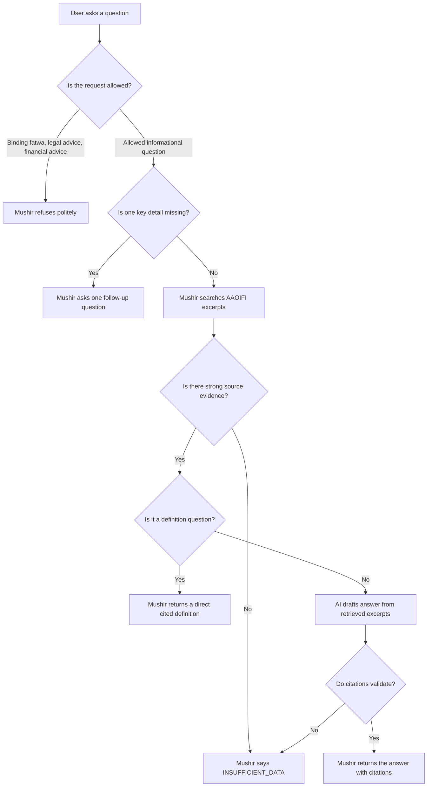
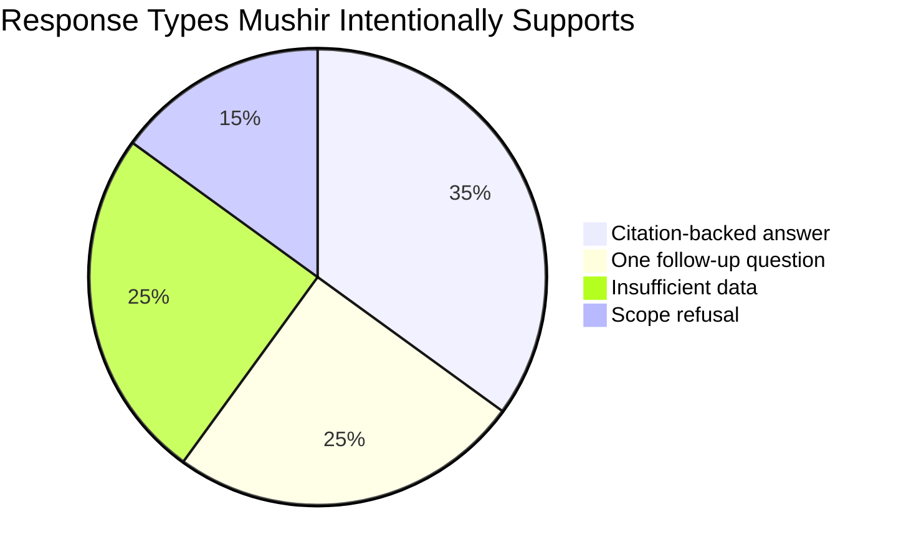
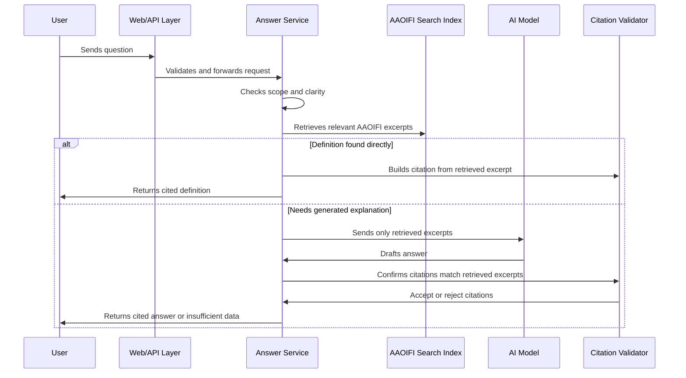
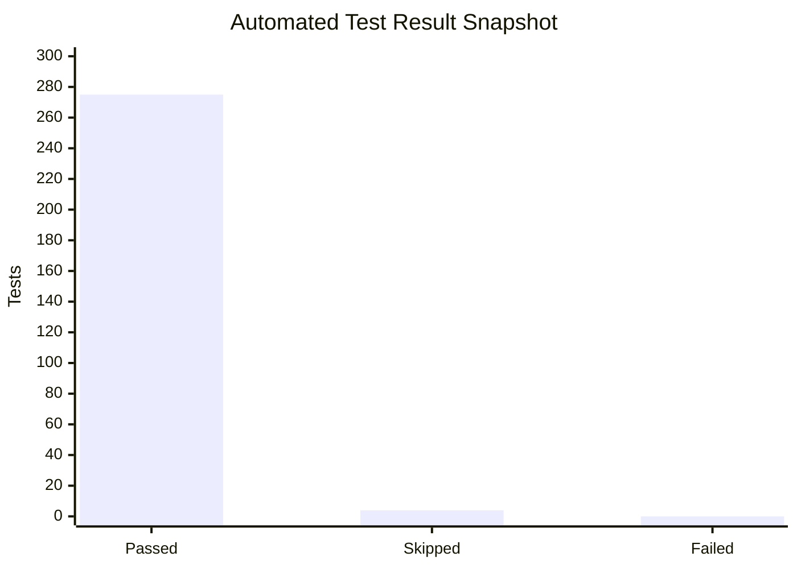

# Mushir Client Report: How The Chatbot Works

Last refreshed: 2026-05-17

This report explains Mushir in plain language for a non-technical client. It focuses on what the system does, how it keeps answers safe, and what a reviewer should expect from the live chatbot.

## Executive Summary

Mushir is a Sharia compliance research chatbot for Islamic finance questions. It searches the provided AAOIFI Financial Accounting Standards, gives citation-backed informational guidance, and avoids guessing when the evidence is weak.

Mushir is not a scholar and does not issue binding fatwas. It is best understood as a careful assistant that helps users find and summarize relevant AAOIFI evidence before a qualified Sharia scholar or compliance team makes the final decision.

## What Mushir Does

| Client need | Mushir behavior |
| --- | --- |
| Ask in English or Arabic | Accepts English, Arabic, and mixed-language questions |
| Ask a broad or unclear question | Asks one focused follow-up question |
| Ask a definition question | Gives a short source-backed definition when the standard contains one |
| Ask a transaction compliance question | Searches the standards and answers only with citations |
| Ask for a binding ruling or fatwa | Refuses and explains its informational-only scope |
| Ask something unsupported by the documents | Returns `INSUFFICIENT_DATA` instead of guessing |

## The Simple Flow

## Why The System Is Cautious

Islamic finance answers depend on details. For example, a Murabaha transaction can depend on ownership, asset transfer, price disclosure, profit disclosure, and payment terms. If those facts are missing, a confident answer would be risky.

Mushir is designed to be helpful without pretending to know more than the documents support.

The exact percentages above are representative, not production analytics. They show the intended balance: Mushir should not always answer. Sometimes the safest and most useful response is a clarification, refusal, or evidence gap.

## Example User Journeys

### 1. A clear definition question

User asks:

> ما هي المرابحة؟

Expected behavior:

1. Mushir recognizes this as a definition question.
2. It searches the AAOIFI excerpts.
3. It finds a citable Murabaha definition.
4. It returns the definition with a citation such as `[FAS-28]`.
5. It explains that a definition is not the same as a full compliance ruling.

Latest live verification:

| Question | Result |
| --- | --- |
| `ما هي المرابحة؟` | `INSUFFICIENT_DATA`, 1 citation, no clarification |
| `What is Murabaha?` | `INSUFFICIENT_DATA`, 1 citation, no clarification |

The `INSUFFICIENT_DATA` label is intentional here. The user asked for a definition, not a complete transaction ruling.

### 2. An unclear transaction question

User asks:

> أريد شراء سيارة بالمرابحة

Expected behavior:

Mushir should not ask a long checklist. It asks one focused follow-up question first:

> ما هو نوع السلعة أو الأصل المراد شراؤه؟

This keeps the conversation simple while collecting the most important missing detail.

### 3. A request outside Mushir's authority

User asks:

> Give me a binding fatwa.

Expected behavior:

Mushir refuses to issue a binding ruling and reminds the user that it only provides informational guidance from retrieved AAOIFI excerpts.

## What Happens Behind The Scenes

## Safety Controls

| Risk | Control |
| --- | --- |
| The AI guesses from general knowledge | Prompt requires answers only from retrieved AAOIFI excerpts |
| The AI invents a citation | Citation validator keeps only citations backed by retrieved chunks |
| Arabic retrieval silently fails | The app checks that the multilingual Arabic/English index is available |
| User asks an unclear question | Clarification engine asks exactly one focused follow-up |
| User asks for a fatwa or legal advice | Authority guard refuses within informational scope |
| Provider or model fails | API returns safe, helpful error messages |
| Secrets appear in docs or errors | Docs use placeholders and runtime errors are sanitized |

## Quality Snapshot

Latest local verification after the Arabic definition citation update:

Latest live deployment checks:

| Live check | Result |
| --- | --- |
| Health endpoint | Passed |
| Readiness endpoint | Passed |
| English definition query | Passed with citation |
| Arabic definition query | Passed with citation |
| Arabic unclear purchase query | Passed with one follow-up |

## What A Client Should Expect

Mushir is useful for:

- early Islamic finance compliance research;
- finding relevant AAOIFI excerpts quickly;
- preparing better questions for a scholar or compliance team;
- explaining why more facts are needed;
- providing English and Arabic informational guidance with citations.

Mushir is not suitable as the final authority for:

- binding Sharia rulings;
- legal decisions;
- investment recommendations;
- regulatory sign-off;
- cases where source documents are incomplete or not ingested.

## Client Acceptance Checklist

Before a client demo or handoff, verify:

- The chat page opens.
- `/health` returns healthy.
- `/ready` reports the retriever is ready.
- English definition query returns a citation.
- Arabic definition query returns a citation.
- Unclear Arabic transaction query asks one follow-up question.
- Binding fatwa request is refused safely.
- No API keys or credentials appear in screenshots, logs, docs, or responses.

## Plain-Language Bottom Line

Mushir is built to be careful. If it has AAOIFI evidence, it shows the answer with citations. If the user question is unclear, it asks one focused question. If the evidence is not strong enough, it says so instead of guessing.

That is the main trust promise of the product.
