# Mushir Client Report: Project Vision, Current System, Roadmap, And Client Walkthrough

Last refreshed: 2026-05-29

This document explains Mushir in plain language for clients, product owners, Islamic finance stakeholders, Sharia reviewers, and non-technical decision makers.

It covers the full project: what Mushir is, what problem it solves, what has already been implemented, how the chatbot works, what its safety boundaries are, what remains before release confidence, and how the future product direction can expand into a rules-first commercial-process assessment assistant.

---

## 1. Executive Summary

Mushir is an evidence-backed Islamic finance research assistant. It helps users ask questions about Islamic finance and receive careful, citation-backed guidance from the available AAOIFI standards corpus.

Mushir is intentionally cautious. It does not try to sound confident when the evidence is weak. It can answer when the retrieved source material supports the answer. It can ask one focused clarification question when the user's facts are incomplete. It can refuse requests that ask for a binding fatwa, legal opinion, or financial advice. It can return `INSUFFICIENT_DATA` when the indexed evidence is not strong enough.

In simple terms:

> Mushir is a careful standards-grounded assistant, not a final Sharia authority.

The project has already moved beyond a simple prototype. It includes a browser chat interface, REST API, streaming API, multilingual retrieval, citation validation, safe refusal behavior, readiness checks, operational documentation, and a planned path toward stronger source governance and future rules-first assessment.

---

## 2. The Product In One Picture

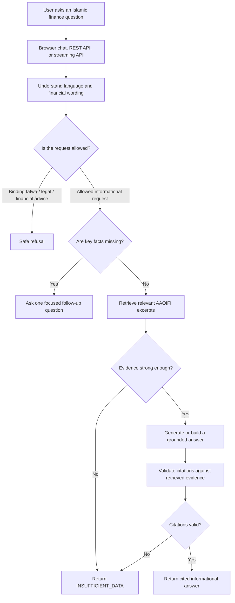

### What this means for the client

Mushir is built around trust. The system should not answer just because the AI can generate text. It should answer only after the question passes scope, clarity, evidence, and citation checks.

---

## 3. What Mushir Is

Mushir is a bilingual AAOIFI standards assistant for Islamic finance questions.

It is designed to:

| Client need | Mushir's role |
| --- | --- |
| Understand Islamic finance questions | Interpret English, Arabic, mixed-language, and common transliterated terms |
| Search standards | Retrieve relevant excerpts from the indexed AAOIFI corpus |
| Explain evidence | Produce understandable answers with citations |
| Reduce unsafe guessing | Ask one focused clarification when the user's scenario is vague |
| Support review work | Help users prepare better questions for scholars, auditors, or compliance teams |
| Stay within boundaries | Refuse binding rulings, legal opinions, and financial advice |
| Support future assessment | Prepare a path toward rules-first non-binding commercial-process review |

---

## 4. What Mushir Is Not

Mushir must not be positioned as a final authority.

It does not:

- issue binding fatwas;
- replace a qualified Sharia scholar;
- replace legal, accounting, investment, or financial advice;
- guarantee that a real-world contract is halal or haram;
- answer from the model's general training knowledge;
- invent standard numbers, sections, pages, or citations;
- treat accounting standards alone as enough for every permissibility question;
- support every Islamic finance product unless the required sources, rules, and review gates exist.

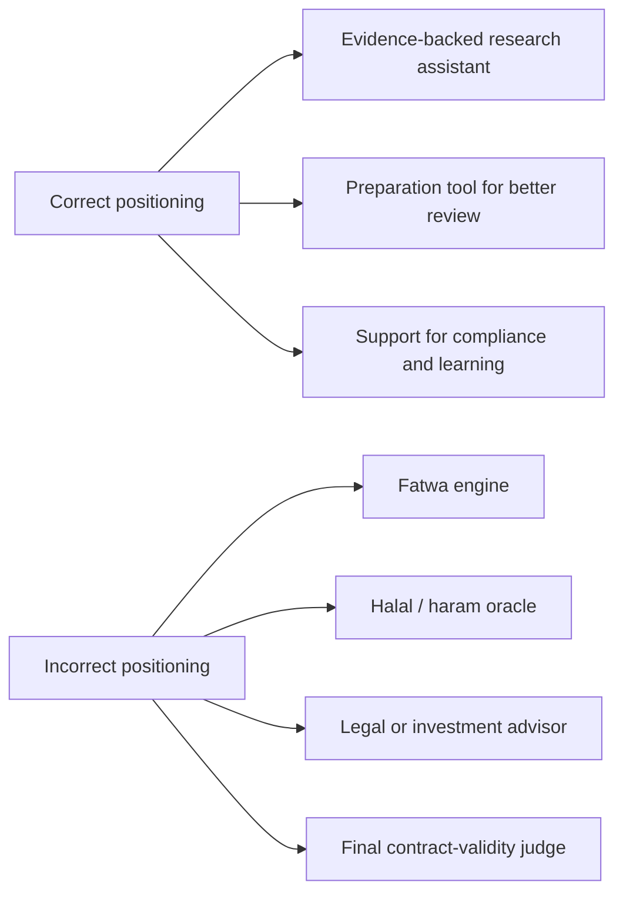

### Recommended client wording

> Mushir is a standards-grounded Islamic finance assistant. It helps users find relevant AAOIFI evidence, understand missing facts, and prepare better compliance questions. It is not a final Sharia authority.

---

## 5. Current Capabilities At A Glance

| Area | Current capability | Client value |
| --- | --- | --- |
| Browser experience | `/chat` web interface | Users can try the assistant visually |
| API access | REST endpoint `/api/v1/query` | Other systems can integrate with Mushir |
| Streaming access | `/api/v1/query/stream` | Frontends can receive streamed response events |
| Health check | `/health` | Basic service availability check |
| Readiness check | `/ready` | Shows whether runtime dependencies are ready |
| Metrics | `/metrics` | Gives operational visibility |
| Sessions | Session creation and history endpoints | Supports multi-turn usage patterns |
| English and Arabic | Language detection and bilingual prompting | Serves Arabic and English users |
| Retrieval | Searches AAOIFI corpus through vector search | Grounds answers in source material |
| Citation validation | Accepts only citations matching retrieved chunks | Reduces invented references |
| Clarification | Asks one focused missing-fact question | Avoids unsafe guesses |
| Refusal behavior | Refuses binding fatwa/legal/financial advice | Protects product scope |
| Caching | Caches safe non-clarification answers | Improves efficiency where appropriate |
| Audit hooks | Supports audit logging modes | Helps future governance and review |
| Deployment docs | Includes runbooks and readiness guidance | Supports controlled demo/release |

---

## 6. The User Journey

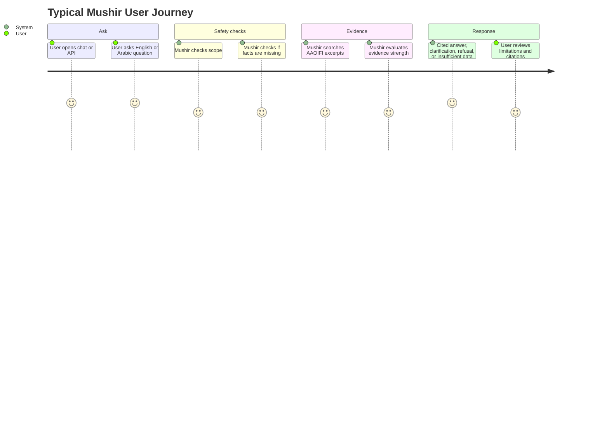

### Example outcomes

| User question type | Expected Mushir behavior |
| --- | --- |
| “What is Murabaha?” | Return a short cited definition if supported by retrieved evidence |
| “ما هي المرابحة؟” | Answer in Arabic where possible, with citation support |
| “I want to buy a car by Murabaha” | Ask one focused follow-up if ownership, possession, payment, or penalty facts are missing |
| “Is this contract halal?” with incomplete details | Ask for missing facts or return insufficient data |
| “Give me a binding fatwa” | Refuse politely and explain the informational-only boundary |
| Unsupported or weak-evidence question | Return `INSUFFICIENT_DATA` instead of guessing |

---

## 7. The Four Safe Response Types

Mushir should not always produce a confident answer. The safe behavior is to choose the right response type.

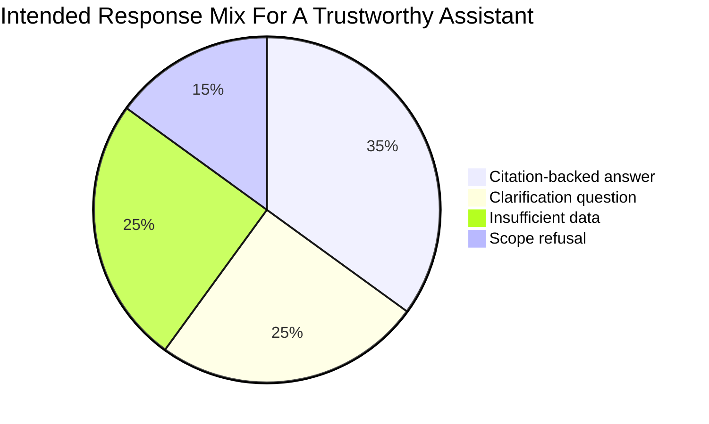

These percentages are illustrative, not production analytics. The point is that a trustworthy assistant should sometimes say “I need more detail,” “I do not have enough evidence,” or “this is outside my scope.”

---

## 8. Project Scope Map

```mermaid
flowchart TD
    Project["Mushir Project"] --> Current["Current implemented assistant"]
    Project --> Readiness["L5 release-readiness work"]
    Project --> Future["Future L6 product direction"]
    Project --> Corpus["Future Egypt institution evidence corpus"]

    Current --> UI["Browser chat"]
    Current --> API["REST and streaming API"]
    Current --> RAG["AAOIFI retrieval"]
    Current --> Citations["Citation validation"]
    Current --> Safety["Refusal, clarification, insufficient-data gates"]

    Readiness --> Tests["Quality and regression tests"]
    Readiness --> Arabic["Arabic/English retrieval proof"]
    Readiness --> Ops["Deployment, metrics, readiness, runbooks"]

    Future --> Scenario["Scenario extraction"]
    Future --> Routing["Source-family routing"]
    Future --> Rules["Executable rule checks"]
    Future --> Verdict["Non-binding structured assessment"]

    Corpus --> Registry["Institution registry"]
    Corpus --> Official["Official-source discovery"]
    Corpus --> Artifacts["Public document capture"]
    Corpus --> Review["Scholar-review dataset"]
```

### Client interpretation

The project has a working assistant today, an active readiness phase, and a carefully planned future direction. The future work should not be marketed as complete until the source, rules, and review gates are actually implemented and verified.

---

## 9. Current System Logic Step By Step

### Step 1 — User submits a question

The question can come from the browser chat, REST API, or streaming API.

### Step 2 — API checks the request

The API checks request format, rate limits, session context, and safe validation errors.

### Step 3 — Mushir checks product boundary

If the user asks for a binding fatwa, legal opinion, or financial advice, Mushir refuses safely.

### Step 4 — Mushir checks whether the question is clear enough

If the user gives an incomplete transaction scenario, Mushir asks one focused follow-up question.

### Step 5 — Mushir searches the evidence corpus

The retrieval layer searches indexed AAOIFI excerpts using multilingual embeddings and domain-aware reranking.

### Step 6 — Definition shortcut if possible

If the question is a simple definition and the system finds a directly citable definition excerpt, Mushir can answer without calling the LLM.

### Step 7 — LLM answer generation if needed

When generation is needed, the LLM receives only the retrieved evidence and strict instructions not to use external knowledge.

### Step 8 — Citation validation

The system checks whether the answer's citations actually match the retrieved chunks.

### Step 9 — Final response

The system returns one of the safe outcomes: cited answer, clarification question, insufficient data, or safe refusal.

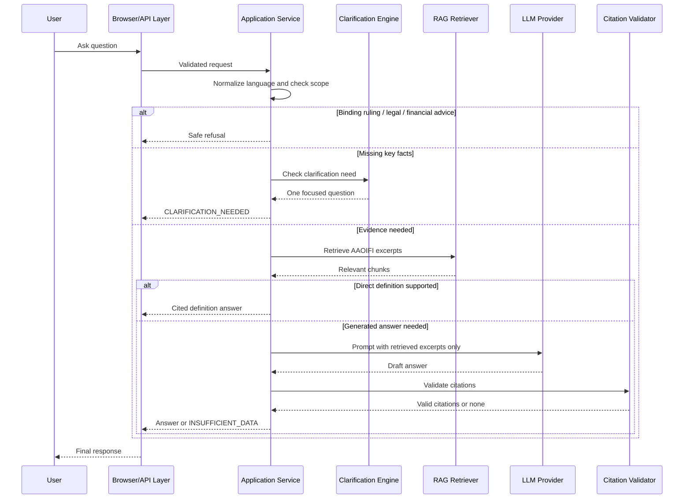

---

## 10. Current Architecture In Plain Language

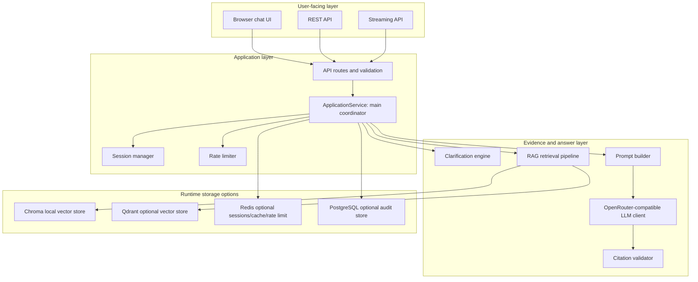

### Component summary

| Component | Simple explanation | Why it matters |
| --- | --- | --- |
| Browser chat UI | The visible demo screen | Lets non-technical users try Mushir |
| REST API | Standard app-to-app interface | Allows integration into other products |
| Streaming API | Sends answer events progressively | Supports modern chat UI experiences |
| ApplicationService | Main coordinator | Applies the safety and evidence workflow |
| Clarification engine | Decides when to ask a question | Prevents premature answers |
| RAG pipeline | Searches source excerpts | Grounds answers in standards |
| Prompt builder | Gives strict instructions to the model | Reduces hallucination and scope drift |
| LLM client | Calls the model provider | Produces natural-language explanations |
| Citation validator | Checks citations against retrieved evidence | Blocks unsupported references |
| Session/rate/cache/audit layers | Runtime support services | Improve reliability, control, and traceability |

---

## 11. Current Data Flow

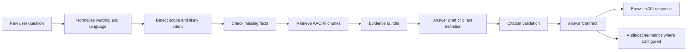

### What is an AnswerContract?

An `AnswerContract` is the structured result Mushir returns. In plain language, it is the answer package. It can include:

| Field | Meaning |
| --- | --- |
| `answer` | The user-facing answer text |
| `status` | The result type, such as compliant, insufficient data, or clarification needed |
| `citations` | Source references accepted by the citation validator |
| `reasoning_summary` | A short visible summary, not hidden chain-of-thought |
| `limitations` | Safety and scope limits |
| `clarification_question` | The one follow-up question, if needed |
| `metadata` | Technical context for audit and evaluation |

---

## 12. Why Mushir Is Cautious

Islamic finance answers depend heavily on facts.

A question like “Can I buy a car through the bank by installments?” may require knowing:

- whether the bank owns the car before selling it;
- whether the bank takes possession or bears risk;
- whether the final price is fixed;
- whether profit or markup is disclosed;
- whether there is a late-payment penalty;
- who receives any penalty;
- whether the contract wording matches the described process;
- whether the question is about accounting treatment or Sharia permissibility.

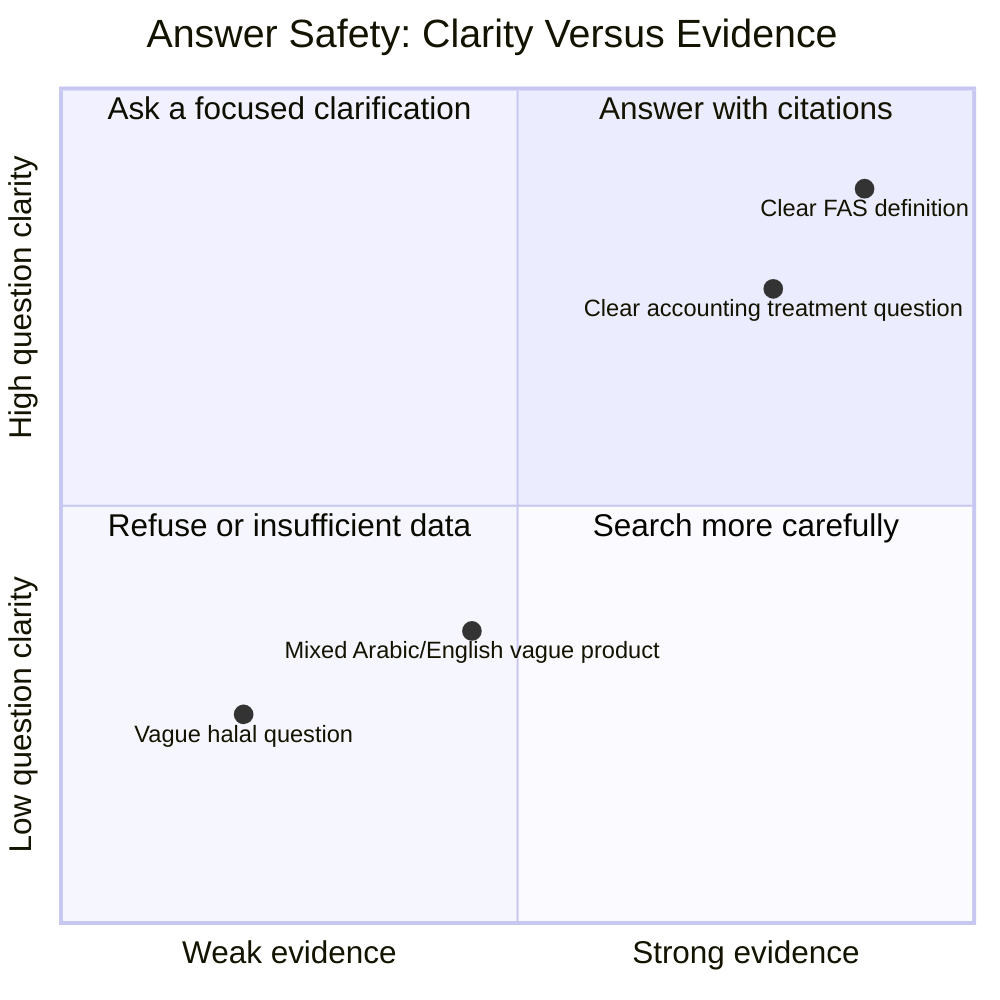

### Client interpretation

A cautious answer is not a weakness. For this domain, caution is a product feature. A system that refuses or asks for clarification at the right time is safer than a chatbot that always produces a confident paragraph.

---

## 13. Source Coverage And Boundaries

The current assistant is grounded in the indexed AAOIFI corpus configured for the project, with emphasis on Financial Accounting Standards material.

That is useful for:

- accounting treatment;
- recognition;
- measurement;
- presentation;
- reporting;
- disclosure;
- definitions that are directly supported by retrieved excerpts.

It is not automatically enough for:

- halal/haram conclusions;
- contract-validity decisions;
- full Sharia permissibility assessments;
- broad real-world contract judgments.

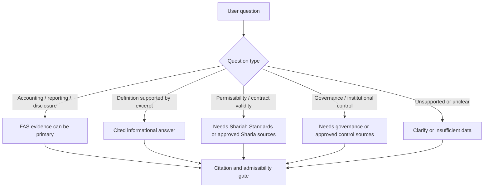

### Key business rule

FAS evidence is valuable, but FAS evidence alone should not be presented as a full halal/haram or contract-validity decision.

---

## 14. Source Governance: The Foundation For Trust

The future direction requires stronger source governance. This means every answer-supporting chunk should be traceable back to a known source record.

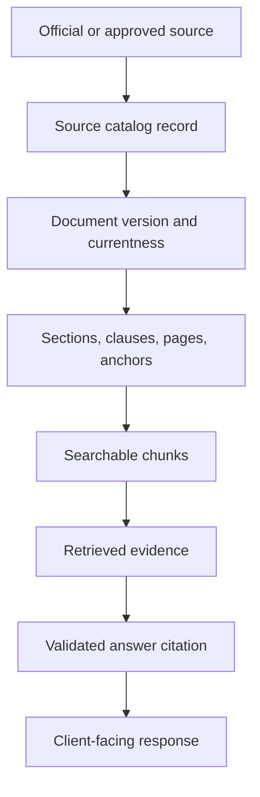

### Why this matters

Without source governance, the system may retrieve useful-looking text but still fail critical questions:

- Is this source current?
- Is this source official or derived?
- Is it an accounting standard or a Sharia standard?
- Was this standard superseded?
- Does the Arabic version align with the English version?
- Can we prove which source supported the answer?

---

## 15. Current Roadmap Levels

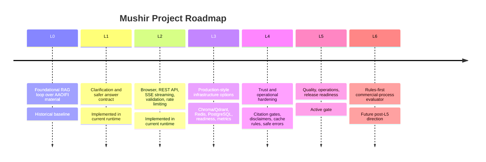

| Level | Plain-language meaning | Current project state |
| --- | --- | --- |
| L0 | First retrieval chatbot | Historical baseline completed |
| L1 | Safer answers and clarification | Implemented in current code path |
| L2 | API, browser, streaming, validation | Implemented in current code path |
| L3 | Production-style infrastructure options | Implemented as configurable modes and readiness checks |
| L4 | Trust, citations, disclaimers, safe failures | Implemented as current safety layer |
| L5 | Prove quality and release readiness | Active priority |
| L6 | Future rules-first assessment | Planned direction; scaffold exists, full evaluator not complete |

---

## 16. Current Work Completed So Far

### Product and user-facing work

- Browser chat page exists.
- REST query endpoint exists.
- Streaming query endpoint exists.
- Session endpoints exist.
- Disclaimer endpoint exists.
- Health, readiness, and metrics endpoints exist.

### Answer safety work

- Empty queries are handled safely.
- Arabic/English language detection exists.
- Authority requests are refused.
- Clarification logic asks one question when facts are missing.
- Weak evidence returns insufficient data.
- Citation validation checks answer citations against retrieved chunks.
- Definition questions can use a deterministic cited shortcut when evidence directly supports the definition.

### Retrieval and evidence work

- Multilingual embedding model support exists.
- Chroma local retrieval exists.
- Qdrant optional retrieval support is planned/available as an infrastructure mode.
- Arabic retrieval readiness checks are included.
- Query expansion and domain reranking are included.

### Operations work

- Readiness endpoint reports infrastructure status.
- Metrics endpoint exists.
- Redis-backed sessions, rate limiting, and cache are supported as production-style options.
- PostgreSQL audit logging is supported as an optional mode.
- Local fallbacks exist for development and demo environments.
- Deployment and runbook documentation exists.

### Planning and governance work

- Maintained source-governed requirements exist.
- L5 readiness plan exists.
- L6 rules-first evaluator plan exists.
- Egypt financial institutions evidence-corpus plan exists.
- Client-facing roadmap and plain-language documentation exist.

---

## 17. L5: Current Release-Readiness Focus

L5 is not mainly about adding new product features. It is about proving the current system is reliable enough for demo or controlled beta use.

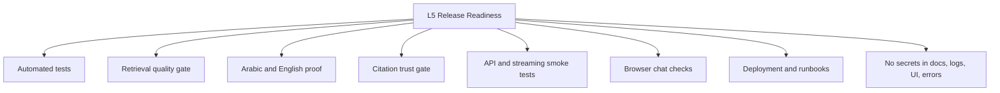

### L5 success criteria in client language

Before calling the current assistant demo-ready or beta-ready, the team should prove:

| Readiness area | What must be shown |
| --- | --- |
| English support | English definition and evidence-backed questions work |
| Arabic support | Arabic retrieval and Arabic answer behavior work |
| Citation safety | Citations cannot be invented or unsupported |
| Clarification | Vague transaction questions ask one focused question |
| Refusal | Fatwa/legal/financial advice requests are refused |
| Insufficient data | Weak evidence does not become a confident answer |
| API health | `/health`, `/ready`, `/chat`, REST, and streaming paths work |
| Operations | Logs, metrics, cache, audit, and docs avoid secrets |
| Provider safety | Free model routes are used conservatively |

---

## 18. L6: Future Rules-First Commercial-Process Evaluator

L6 is the future direction. It should expand Mushir from a citation-backed assistant into a structured non-binding commercial-process assessment assistant.

The most important change is this:

> The model should explain the result; it should not secretly become the judge.

In L6, the system should first extract transaction facts, route to the right source family, retrieve the required evidence, apply explicit rule checks where supported, validate citations, produce a structured verdict, and only then let the AI explain it in plain language.

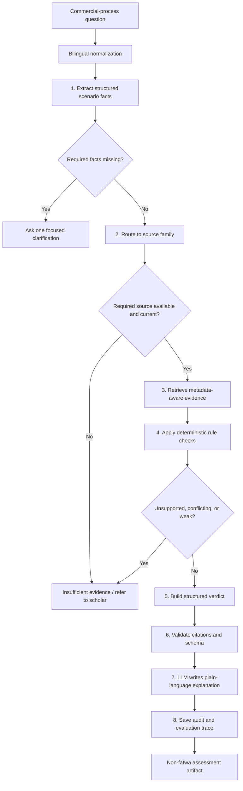

### L6 should start with limited domains

| Priority | Domain | Why it matters | Why it needs caution |
| --- | --- | --- | --- |
| 1 | Murabaha / deferred sale / installment purchase | Common and high-value | Needs ownership, possession, price, markup, payment facts |
| 2 | Late-payment penalties and default clauses | High-risk and frequently asked | Requires exact penalty handling and Sharia source evidence |
| 3 | Ijarah / lease and lease-to-own | Common commercial structure | Lease-to-own can be complex |
| 4 | Qard / loan / riba detection | Important red-line area | Must avoid broad fatwa-style conclusions |
| 5 | Wakala / investment agency | Useful for investment products | Needs mandate, roles, risk allocation, and guarantee facts |

---

## 19. Current RAG Assistant Versus Future Rules-First Assessment

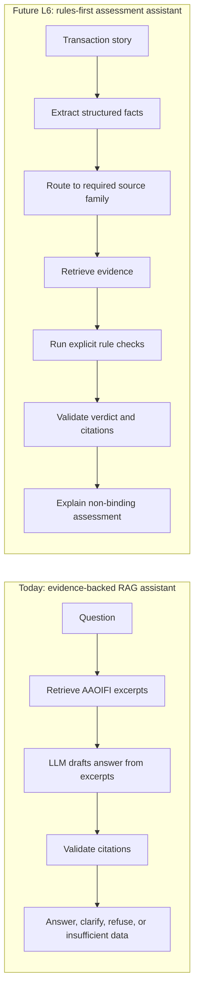

### Client interpretation

Today, Mushir is already cautious because it retrieves evidence and validates citations. L6 would make it more controlled by adding structured facts and explicit rules before the AI writes the explanation.

---

## 20. Egypt Financial Institutions Evidence Corpus

The Egypt institution evidence corpus is a planned L6-supporting data workstream. It is not the same as the chatbot itself.

Its purpose is to collect public evidence about Egyptian financial institutions, products, operations, contracts, tariffs, public disclosures, prospectuses, reports, and regulator materials.

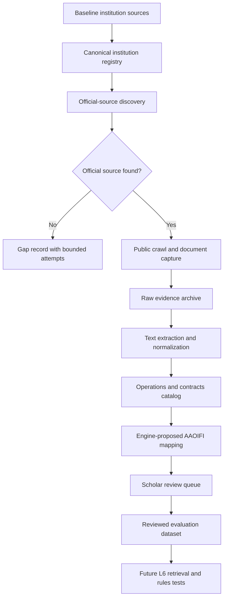

### Important boundary

This corpus should not automatically decide compliance. It should separate:

- public facts extracted from documents;
- machine-proposed classification;
- machine-proposed AAOIFI mapping;
- machine-proposed initial risk labels;
- scholar-reviewed judgments;
- accepted gold test cases.

Only reviewed records should become trusted evaluation truth.

---

## 21. Safety Controls

| Risk | Current or planned control |
| --- | --- |
| AI guesses from general knowledge | Prompt restricts answers to retrieved excerpts |
| AI invents citations | Citation validator accepts only retrieved-source citations |
| User asks a vague transaction question | Clarification engine asks one focused question |
| User asks for a binding fatwa | Authority guard refuses the request |
| Arabic retrieval silently fails | Readiness checks require multilingual index conditions |
| Provider/model failure | API returns safe, controlled error messages |
| Stale or wrong source | Source governance and currentness checks are planned/required |
| FAS used for halal/haram conclusion | Source-family routing should fail closed without Sharia source evidence |
| Hidden reasoning exposure | System returns visible summaries, not chain-of-thought |
| Overuse of free model routes | Docs require small smoke tests and fixture-based evaluation |
| Unreviewed institution data treated as truth | L6 corpus plan requires scholar review before gold-case use |

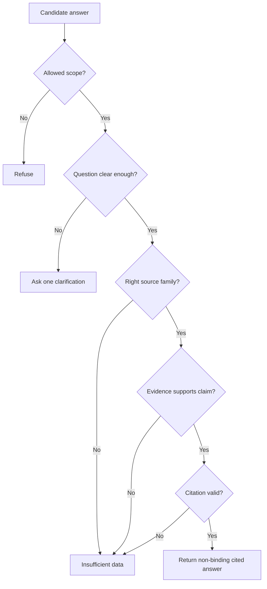

---

## 22. Main Risks And Gaps

```mermaid
flowchart TD
    Risks["Main project risks"] --> Source["Source risk"]
    Risks --> Product["Product-scope risk"]
    Risks --> Evidence["Evidence quality risk"]
    Risks --> Arabic["Arabic and mixed-language risk"]
    Risks --> LLM["AI behavior risk"]
    Risks --> Ops["Operational risk"]
    Risks --> Review["Human-review risk"]

    Source --> S1["Missing source catalog"]
    Source --> S2["Superseded source used as current"]
    Product --> P1["Assistant marketed as fatwa engine"]
    Product --> P2["FAS used for full permissibility"]
    Evidence --> E1["Weak retrieval treated as strong"]
    Evidence --> E2["Citation mismatch"]
    Arabic --> A1["Dialect or transliteration misunderstood"]
    Arabic --> A2["Arabic index not properly built"]
    LLM --> L1["Unsupported answer"]
    LLM --> L2["Invented citation"]
    Ops --> O1["Provider quota or rate limit"]
    Ops --> O2["Secrets exposed in logs or docs"]
    Review --> R1["No scholar-review workflow"]
    Review --> R2["Feedback not converted to tests"]
```

### Key gap summary

| Gap | Why it matters | Recommended action |
| --- | --- | --- |
| Source catalog maturity | Needed to prove every answer-supporting source | Prioritize source registry and currentness tracking |
| Shariah Standards availability | Needed for permissibility and contract-validity questions | Confirm acquisition/licensing/source strategy |
| L6 rules not complete | Prevents safe broad transaction assessment | Start with one domain after L5 and source gates |
| Egypt corpus not runtime-wired | Institution facts cannot yet support live answers safely | Complete pilot and review workflow first |
| Human review workflow | Needed for trust, correction, and gold-set growth | Define reviewer roles and correction lifecycle |
| Evaluation depth | Needed to prove improvements and prevent regressions | Expand gold cases, especially Arabic and source-gap cases |

---

## 23. Open Client / Stakeholder Decisions

These decisions should be confirmed before expanding the project scope.

| Decision | Options | Why it matters |
| --- | --- | --- |
| Production corpus scope | Accounting standards only, or accounting plus Shariah Standards | Determines what questions Mushir can safely answer |
| Permissibility handling | Always refer to scholar, or allow non-binding standards-based assessment when evidence exists | Defines product boundary and legal/religious risk |
| Approved future sources | AAOIFI only, or selected regulator/scholar-reviewed/internal sources | Controls evidence authority |
| Target user persona | Student, accountant, auditor, bank employee, Sharia reviewer, public user | Changes UX, explanation depth, and risk tolerance |
| Scholar review process | Manual review only, structured admin workflow, or dataset export/import | Determines how corrections become trusted tests |
| Release mode | Internal demo, controlled beta, or public demo | Determines authentication, logging, quota, and deployment requirements |

---

## 24. Recommended Next Steps

### Priority 1 — Finish L5 release readiness

Goal: prove the current assistant works reliably before expanding scope.

Actions:

- Run fast unit/service/API tests.
- Run retrieval quality gate.
- Verify Arabic and English answer behavior.
- Smoke test `/chat`, `/health`, `/ready`, `/api/v1/query`, and `/api/v1/query/stream`.
- Confirm no secrets appear in logs, docs, UI, screenshots, or error messages.

### Priority 2 — Strengthen source governance

Goal: make every answer-supporting source traceable and reviewable.

Actions:

- Maintain source catalog records.
- Track source family, standard number, language, currentness, and supersession.
- Link chunks to source records.
- Prevent answer-supporting chunks without required provenance.

### Priority 3 — Expand evaluation coverage

Goal: measure whether Mushir behaves safely across realistic cases.

Actions:

- Add English, Arabic, mixed-language, colloquial, and transliterated cases.
- Add answerable, ambiguous, weak-evidence, wrong-standard, and source-gap cases.
- Track citation support, expected-standard hit rate, refusal correctness, and clarification quality.

### Priority 4 — Confirm Shariah Standards strategy

Goal: decide whether and how Mushir can support non-binding permissibility assessment.

Actions:

- Confirm source acquisition/licensing.
- Confirm allowed source families.
- Confirm whether permissibility questions may ever receive non-binding assessments.
- Define required scholar-review rules.

### Priority 5 — Start L6 with one limited domain

Goal: avoid trying to support all Islamic finance at once.

Recommended first domain: Murabaha / deferred sale / installment purchase.

Required before implementation:

- source catalog records;
- concept-map entries;
- scenario schema fields;
- source-family route;
- explicit rule table;
- gold evaluation cases;
- red-line refusals;
- human-review criteria;
- fixture-backed tests;
- small live smoke plan.

### Priority 6 — Run Egypt institution corpus pilot

Goal: prove the public-source evidence process before scaling.

Actions:

- Pilot across mixed institution types.
- Include at least one hard no-public-details case.
- Capture public artifacts with hashes and timestamps.
- Extract operations and evidence spans.
- Export scholar-review rows.
- Do not treat machine labels as ground truth.

---

## 25. Suggested Client Review Process

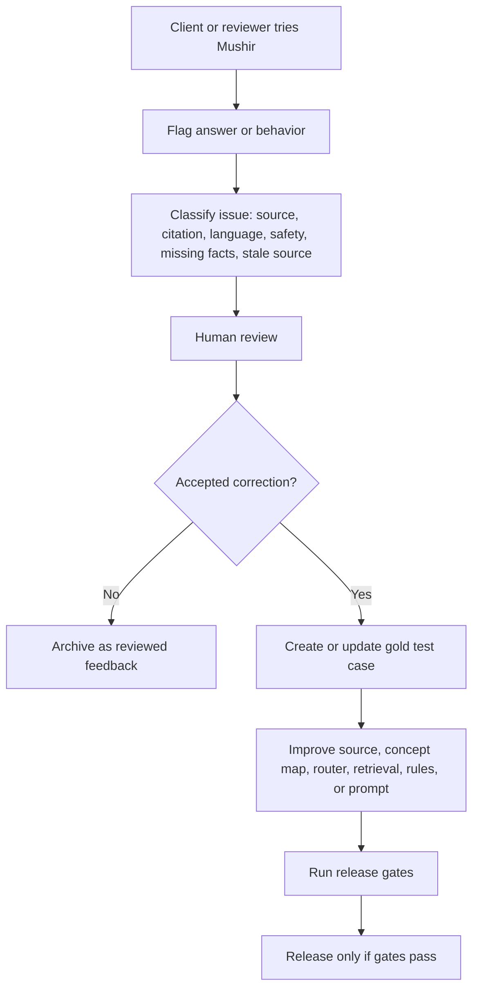

### Why this matters

Feedback should not silently change how Mushir answers. A reviewer should decide whether feedback changes the source catalog, concept map, router, rules, prompts, or evaluation cases.

---

## 26. Client Acceptance Checklist

Before a demo, handoff, or controlled beta, verify:

- [ ] The browser chat page opens.
- [ ] `/health` returns healthy.
- [ ] `/ready` reports expected runtime readiness.
- [ ] English definition question returns a cited informational answer when evidence exists.
- [ ] Arabic definition question returns a cited informational answer when evidence exists.
- [ ] Unclear transaction question asks one focused clarification.
- [ ] Binding fatwa request is refused safely.
- [ ] Unsupported or weak-evidence question does not produce a confident verdict.
- [ ] Citations point to retrieved source evidence.
- [ ] The response includes limitations.
- [ ] REST API works.
- [ ] Streaming API works.
- [ ] Rate-limit and provider-error messages are understandable.
- [ ] No secrets or API keys appear in screenshots, logs, docs, UI, or responses.
- [ ] OpenRouter/free smoke checks remain small and spaced out.
- [ ] Any future institution data is clearly marked as reviewed, unreviewed, or unavailable.

---

## 27. Simple Glossary

| Term | Simple meaning |
| --- | --- |
| AAOIFI | A standards-setting body for Islamic finance institutions |
| FAS | Financial Accounting Standards, useful for accounting/reporting/disclosure topics |
| Shariah Standards | Source family needed for permissibility and contract-validity questions |
| RAG | Retrieval-Augmented Generation: search documents first, then generate an answer |
| Vector database | A search database that finds text by meaning, not only exact words |
| Embedding | A numerical representation of text meaning |
| Chunk | A smaller searchable piece of a document |
| Citation validation | Checking whether an answer citation actually matches retrieved evidence |
| Clarification | A follow-up question asked before answering when facts are missing |
| Source catalog | A registry proving where each source came from and whether it is current |
| Supersession | When an older standard is replaced or updated by a newer one |
| Gold set | Trusted test questions used to measure system behavior |
| Rule engine | A controlled layer that applies explicit checks instead of relying on free-form AI reasoning |
| Non-binding assessment | An informational, review-supporting result that is not a fatwa |

---

## 28. Plain-Language Bottom Line

Mushir is built to be careful.

If the evidence is strong, Mushir answers with citations.

If the question is unclear, Mushir asks one focused question.

If the evidence is weak, Mushir says `INSUFFICIENT_DATA`.

If the user asks for a binding fatwa, legal opinion, or financial advice, Mushir refuses safely.

The current project is a working evidence-backed assistant with active release-readiness work. The future direction is stronger and more structured: source governance, better evaluation, official-source evidence, and rules-first non-binding assessment for limited domains.

The safest client-facing promise is:

> Mushir helps users understand relevant Islamic finance standards and prepare better compliance questions. Final Sharia decisions remain with qualified scholars and authorized reviewers.
