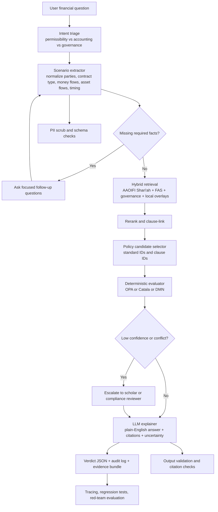
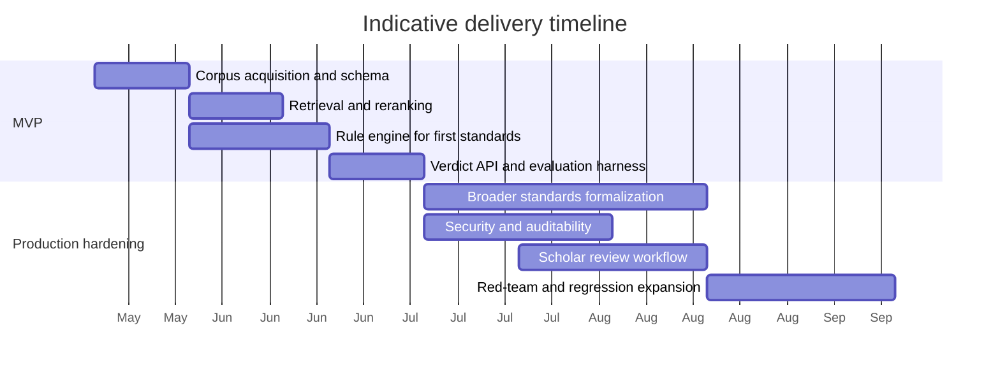

# Building a Sharia Mufti Chatbot with RAG and Executable AAOIFI Rule Evaluation

## Executive summary

The clearest finding from the web and GitHub search is that there is **no mature open-source project today that already does all of the following together**: authoritative AAOIFI retrieval, bilingual Arabic/English evidence handling, deterministic rule execution, and auditable Sharia-style verdict generation for user-described financial scenarios. The closest direct-domain repository found was `harithamiir/islamicFinance_AI`, which is useful as an architectural sketch because it already combines Islamic-finance-specific RAG, Qdrant, citations, domain guardrails, and source selection across AAOIFI/BNM/Qur’an/Hadith/scholar sources; but it is still a very small project with **0 stars, 0 forks, 9 commits, and no releases**. The realistic implementation path is therefore **compositional**: combine a mature RAG/orchestration layer such as Haystack, LlamaIndex, or LangGraph with a deterministic policy/rules layer such as OPA, Catala, OpenFisca, Drools, or Blawx, then add evaluation and validation layers such as RAGAS, TruLens, and Guardrails. citeturn11view0turn16view2turn16view3turn19view1turn21view0turn18view0turn14view1turn15view4turn16view1turn20view1turn15view2turn17view0

A second high-confidence conclusion is that a **true mufti chatbot cannot rely only on the AAOIFI accounting standards page**. AAOIFI itself separates its corpus into **54 Shari’ah standards** and a separate publication containing **26 accounting, 5 auditing, 2 ethics, and 7 governance standards**. The official Arabic issued-accounting page lists many financially relevant FAS items—such as **FAS 28 Murabaha and Other Deferred Payment Sales, FAS 31 Investment Agency, FAS 32 Ijarah, FAS 33 Investments in Sukuk/Shares, FAS 38 Wa’ad/Khiyar/Tahawwut, and FAS 40 Islamic Windows**—but permissibility questions also require retrieval over the **Shari’ah Standards**, including at minimum **SS 8 Murabahah** and **SS 30 Monetization (Tawarruq)**. In other words, the chatbot should treat AAOIFI’s **Shari’ah standards as the doctrinal permissibility layer** and the **FAS corpus as the accounting/reporting/disclosure layer**. citeturn7view3turn7view1turn33view0turn34search0turn34search1

My recommended target architecture is therefore **rules-first, evidence-backed RAG**: parse the user’s scenario into structured facts, retrieve relevant AAOIFI clauses, map the scenario to executable rules, run a deterministic evaluation, and then let the LLM write a human-readable explanation with citations, uncertainty flags, and follow-up questions only where facts are missing. This design is more defensible than a pure “ask the LLM over retrieved chunks” system because it separates **evidence selection**, **policy decisioning**, and **natural-language explanation**. That separation is exactly what the strongest repos in this scan are good at. citeturn13view0turn16view2turn16view3turn19view1turn20view1turn17view0turn10search0turn10search1

## AAOIFI source base and design implications

AAOIFI’s official site matters here in two distinct ways. First, it is the authoritative corpus: the organization states that it has issued **94 standards total**, split across **54 Shari’ah standards** and a separate publication for **40 accounting, auditing, ethics, and governance standards**. Second, AAOIFI explicitly warns users to rely on the **official website** for standards because the site is regularly updated and AAOIFI does not take responsibility for other circulating copies. That makes **source versioning, supersession tracking, and official-citation storage** non-optional design requirements for any production system. citeturn7view3turn7view1turn33view0

The official Arabic page for issued accounting standards is especially useful because it exposes the standards as a machine-addressable catalog and also records several **supersession relationships**. It shows, for example, that **FAS 2 and FAS 20 were replaced by FAS 28**, that **FAS 25 was later replaced by FAS 33**, and that **FAS 5 and FAS 6 were replaced by FAS 27**. A standards-aware chatbot should therefore maintain not just `standard_no`, but also `effective_date`, `supersedes`, `superseded_by`, `language`, and `official_url`. citeturn33view0

A practical first corpus for financial Q&A should prioritize the following AAOIFI materials:

| Priority source | Why it should be first-wave ingestion | Official evidence |
|---|---|---|
| **Shari’ah Standards publication** | Required for permissibility judgments; AAOIFI exposes the full Shari’ah standards corpus as a separate official publication. | citeturn7view1turn34search2 |
| **SS 8 Murabahah** | Core retail and SME financing topic; must be retrieved for murabaha questions. | citeturn34search0 |
| **SS 30 Monetization (Tawarruq)** | Required for commodity tawarruq and cash-generation scenarios; separate from murabaha routing. | citeturn34search1 |
| **FAS 28 Murabaha and Other Deferred Payment Sales** | Official Arabic announcement says it governs accounting/reporting for murabaha and other deferred sales, replacing FAS 2 and FAS 20. | citeturn31view0turn33view0 |
| **FAS 31 Investment Agency** | Official summary gives concrete rule logic around ownership, risks/returns, and off-balance-sheet treatment for the agent. | citeturn31view3 |
| **FAS 32 Ijarah** | Official summary covers classification, recognition, measurement, presentation, and disclosure for lessor/lessee ijarah transactions. | citeturn31view2 |
| **FAS 33 Investments in Sukuk, Shares and Similar Instruments** | Official summary covers classification, recognition, measurement, presentation, disclosure, and instrument types. | citeturn31view1turn33view0 |
| **FAS 18 Islamic Financial Services Offered by Conventional Financial Institutions** | Useful when users ask about Islamic windows or conventional-bank Islamic products. | citeturn33view0turn32search7 |
| **FAS 38 Wa’ad, Khiyar and Tahawwut** | Needed for hedging/promise/option-like structures in treasury and capital markets. | citeturn33view0turn32search0 |
| **FAS 40 Financial Reporting for Islamic Windows** | Critical if the product is offered through a window rather than a full Islamic institution. | citeturn33view0 |

The most important design implication is simple: **route by question type before retrieval**. “Is this permissible?” should retrieve Shari’ah standards first; “How should this be recognized or disclosed?” should prioritize FAS; and “How should an Islamic window or investment account be treated?” should combine accounting and governance contexts. That routing logic is more faithful to how AAOIFI organizes its own corpus. citeturn7view3turn7view1turn33view0

## Open-source repository landscape

The ranking below is by **practical relevance to your exact target system**, not by GitHub stars alone.

| Rank | Repository | Why it is relevant | Key files or modules | Languages / license | Maturity snapshot | Best mapping into a Sharia RAG pipeline |
|---|---|---|---|---|---|---|
| **High** | `harithamiir/islamicFinance_AI` | The closest direct-domain scaffold found: Islamic-finance assistant over AAOIFI, BNM, Qur’an, Hadith, scholar interpretation; hybrid RAG, citations, Flask UI. | `src/ingestion`, `src/retrieval`, `src/generation`, `pipeline.py`, `app.py`, `config.py` | Python / HTML / Dockerfile; no license surfaced in indexed page | 0★, 0 forks, 9 commits, no releases. citeturn11view0 | Use for inspiration on domain routing, trusted-domain search, and AAOIFI-specific indexing choices; do **not** use as the core production engine. citeturn11view0 |
| **High** | `open-policy-agent/opa` | The strongest production-grade deterministic policy engine in the scan; designed for declarative rule evaluation over structured facts and decisions. | `rego`, `loader`, `server`, `tester`, `wasm`, `cmd`, `main.go` | Go, Apache-2.0 | 11.7k★, 1.6k forks, latest release v1.16.2 on May 12, 2026. citeturn21view0 | Best default engine for verdict calculation once user facts are normalized into a schema. |
| **High** | `deepset-ai/haystack` | Mature Python RAG/orchestration framework with explicit control over retrieval, routing, filtering, and generation. | `haystack`, `examples`, `docker`, `e2e`, `test` | Python/MDX, Apache-2.0 | 25.3k★, 2.8k forks, latest release v2.29.0 on May 12, 2026. citeturn16view2turn19view3 | Strong choice for a modular, non-agentic or lightly agentic AAOIFI evidence pipeline. |
| **High** | `run-llama/llama_index` | Excellent at document-centric indexing, storage contexts, and retrieval integrations across many data sources. | `llama-index-core`, `llama-index-integrations`, `llama-index-instrumentation`, `docs` | Python/Jupyter, MIT | 49.5k★, 7.4k forks, latest release v0.14.22 on May 14, 2026. citeturn16view3turn19view4 | Strong if you want richer document ingestion and index abstractions than Haystack. |
| **High** | `CatalaLang/catala` | The most intellectually relevant formal-rules project in the scan for law/regulation encoding; purpose-built for executable implementations derived from legal text. | `compiler`, `runtimes`, `stdlib`, `tests`, `build_system`, `doc` | OCaml-heavy, Apache-2.0 | 2.3k★, 98 forks, latest release 1.1.0 on Jan 29, 2026. citeturn18view0turn35search0 | Best for a **high-assurance subset** of AAOIFI rules where you want literate, lawyer-reviewable source-of-truth semantics. |
| **High** | `openfisca/openfisca-core` | Mature “rules as code” engine used for legislation/regulation modeling and exposed via web API; strong conceptual fit for executable standards. | `openfisca_core`, `openfisca_web_api`, `tests`, `tasks` | Python, AGPL-3.0 | 222★, 85 forks, 448 tags; indexed page exposes rich history but not a clean latest release timestamp. OpenFisca’s broader ecosystem remains active. citeturn14view1turn20view3turn35search1turn35search5 | Best inspiration for **legislation-as-code data modeling** and for running executable scenarios over structured user inputs. |
| **High** | `langchain-ai/langgraph` | Excellent state machine for clarification dialogs, multi-step workflows, escalation, and tool orchestration. | `libs`, `examples`, `docs` | Python/TypeScript, MIT | 32.3k★, 5.5k forks, latest release 1.2.0 on May 12, 2026. citeturn13view3turn19view1 | Use when your chatbot must ask follow-up questions, branch to scholar review, or maintain auditable workflow state. |
| **High** | `qdrant/qdrant` | One of the strongest production vector DB choices in this scan; supports hybrid and multi-stage queries, payload filters, and strong deployment guidance. | `src`, `lib`, `openapi`, `tests`, `tools`, `config` | Rust/Python, Apache-2.0 | 31.4k★, 2.3k forks, latest release v1.18.0 on May 11, 2026. citeturn14view3turn19view2turn24search1 | Best default production vector store for clause-level AAOIFI retrieval. |
| **Medium** | `Lexpedite/blawx` | Rules-as-code environment expressly designed for encoding, testing, hypothetical reasoning, and explanation over legal rules. | `blawx`, `manage.py`, `load_data.py`, `Dockerfile`, `INSTALL.md` | HTML / JavaScript / Python, MIT | 142★, 16 forks, latest indexed commit 2 years ago. citeturn15view4turn20view2turn35search2 | Very useful for prototyping explainable legal-style reasoning and scenario exploration with scholars. |
| **Medium** | `apache/incubator-kie-drools` | Mature enterprise rule engine with DMN and CEP support; technically powerful, but heavier and more Java-centric. | `kie-dmn`, `kie-drl`, `drools-decisiontables`, `drools-ruleunits`, `drools-verifier` | Java, Apache-2.0 | 6.3k★, 2.6k forks, latest release 10.2.0 on Apr 28, 2026. citeturn16view1turn15view5 | Good for organizations with strong JVM/DMN skills or existing enterprise rule infrastructure. |
| **Medium** | `guardrails-ai/guardrails` | Validation layer for structured inputs/outputs and risk controls. | `guardrails`, `docs`, `tests`, `server_ci`, `test_spec.rail` | Python, Apache-2.0 | 6.9k★, 609 forks, latest release v0.10.0 on Apr 3, 2026. citeturn14view2turn20view1 | Use to enforce verdict-schema compliance, banned-answer patterns, and citation requirements. |
| **Medium** | `vibrantlabsai/ragas` | Strong offline evaluation toolkit for RAG quality, synthetic test generation, and feedback loops. | `src/ragas`, `examples`, `docs`, `tests` | Python, Apache-2.0 | 13.9k★, 1.4k forks, latest release v0.4.3 on Jan 13, 2026. citeturn15view2turn20view0 | Best for benchmark suites over AAOIFI QA and citation-grounded answers. |
| **Medium** | `truera/trulens` | Observability and evaluation for RAG/agents, with OTEL spans, RAG-specific metrics, and batch or inline evaluation. | `src`, `examples`, `benchmarks`, `release_dbs`, `docs` | Python/TypeScript, MIT | 3.3k★, 279 forks, latest release 2.8.1 on May 14, 2026. citeturn17view0 | Best for production tracing, auditability, evaluator pipelines, and regression tracking. |

Two patterns stand out from this repo landscape. First, the **direct Islamic-finance repo** is still too immature to be a reliable foundation. Second, the **best available building blocks are split by responsibility**: RAG frameworks retrieve evidence, vector DBs store clause embeddings, policy engines evaluate normalized facts, and evaluation/guardrail stacks monitor quality. That modular decomposition is not a weakness; for a regulated religious-finance assistant, it is actually the safer architecture. citeturn11view0turn16view2turn16view3turn21view0turn14view3turn20view1turn15view2turn17view0

A smaller “supporting inspiration” set is also worth noting. `jruizgit/rules` provides a polyglot event-capable rules engine with Python/Node/Ruby bindings and decent popularity; it is less standards-oriented than OPA or Catala but can still be useful for event-driven compliance workflows. `open-policy-agent/conftest` is also valuable if you adopt OPA, because it uses Rego to write tests over structured data and is a good pattern for policy CI. citeturn16view0turn6search3

## Recommended architecture for RAG and rule evaluation

The recommended pattern is **not** “LLM with retrieved PDFs.” It is **scenario extraction → evidence retrieval → rule execution → explanation**. That structure is aligned both with the original RAG literature, which treats retrieval as non-parametric memory for factual grounding, and with newer work such as Self-RAG, which improves quality by making retrieval and critique more adaptive rather than blindly stuffing passages into prompts. citeturn10search0turn10search1



In practice, the ingestion layer should preserve **document hierarchy**, not flatten everything into generic chunks. AAOIFI standards are inherently hierarchical: standard family → standard number → chapter/section → clause/exception → notes. The Arabic accounting page also shows supersession relationships, which means the index should track not just similarity but also **version lineage** and **currentness**. For long standards, a hybrid approach works best: clause-level chunks for final citation, plus section-level or tree summaries for retrieval recall. That general strategy is consistent with both the RAG literature and the only direct-domain Islamic-finance repo found, which explicitly uses flat RAG for highly structured corpora and RAPTOR-style hierarchical retrieval for standards/scholar materials. citeturn33view0turn10search0turn10search2turn11view0

The retrieval layer should be **hybrid**, not vector-only. Qdrant explicitly supports **hybrid and multi-stage queries** combining dense, sparse, and multi-vector retrieval; Weaviate similarly supports **hybrid BM25 + vector search**; Chroma supports **metadata filtering**; and Milvus supports **filtered search**. For a standards engine, that matters because users frequently refer to contract names, Arabic terms, standard numbers, or quasi-legal phrases that benefit from lexical matching, while paraphrased scenarios benefit from embeddings. citeturn24search1turn24search2turn24search0turn24search3

For prompt engineering, the prompt should **consume a structured scenario object and retrieved evidence bundle**, not raw free text alone. It should require the model to output a **strict verdict schema** with fields like `verdict`, `confidence`, `applied_standards`, `missing_facts`, `counterarguments`, and `citations`. Guardrails is relevant here because it is explicitly built for input/output guards and structured-data generation, while TruLens is relevant because it can trace retrieval and model spans in an OTEL-friendly way. citeturn14view2turn17view0

On chain-of-thought, the best practice for this use case is: **allow internal reasoning, but do not store or expose raw free-form chain-of-thought as the official explanation artifact**. The CoT literature shows that intermediate reasoning can improve difficult reasoning performance, but in a regulated religious-finance setting the user-facing artifact should be a **structured decision trace**, not a raw scratchpad. That trace should include: extracted facts, matched rules, rule outcomes, unresolved ambiguities, and exact AAOIFI citations. This recommendation is a synthesis, but it is strongly supported by the combination of CoT research, Guardrails-style schema enforcement, and TruLens-style tracing. citeturn10search3turn14view2turn17view0

## Encoding AAOIFI into executable rules

The most robust way to encode AAOIFI is to maintain **three synchronized representations** of every rule-bearing clause:

1. **Canonical source record**: the Arabic and English standard text, official URL, standard family, standard number, clause identifier, effective date, and supersession metadata.
2. **Semantic schema record**: machine-readable labels such as contract type, parties, preconditions, prohibitions, disclosures, exceptions, and evidentiary requirements.
3. **Executable rule record**: Rego, Catala, DMN, or Python logic that evaluates a normalized scenario against the semantic record.

The ontology should start small and domain-driven. A useful first version would include these dimensions:

| Ontology dimension | Examples for first release | Why it matters |
|---|---|---|
| **Contract family** | Murabaha, Ijarah, Mudaraba, Musharaka, Salam, Istisna, Investment Agency, Sukuk investment, Tawarruq, Islamic window | Governs routing to the right AAOIFI standard family. citeturn33view0turn34search0turn34search1 |
| **Party roles** | Customer, Islamic financial institution, principal, agent, lessor, lessee, investment account holder | Many AAOIFI summaries distinguish treatment by party role, especially FAS 31 and FAS 32. citeturn31view3turn31view2 |
| **Flow facts** | Asset ownership, risk/return transfer, payment timing, lease term, transfer of title, off-balance-sheet status | These are the factual hooks a rule engine needs to evaluate. FAS 31 explicitly turns on ownership/risk/returns and balance-sheet treatment. citeturn31view3 |
| **Question type** | Permissibility, accounting recognition, disclosure, governance, product comparison | Decides whether Shari’ah standards or FAS takes precedence. citeturn7view3turn7view1 |
| **Authority metadata** | standard family, number, language, official URL, effective date, supersedes/superseded_by | Needed because AAOIFI standards are updated and superseded over time. citeturn33view0 |

A canonical schema for one encoded rule should be explicit enough to survive model drift:

```json
{
  "rule_id": "AAOIFI-FAS31-agency-balance-sheet-treatment",
  "family": "FAS",
  "standard_no": 31,
  "title_en": "Investment Agency (Al Wakala Bi Al-Istithmar)",
  "title_ar": "الوكالة بالاستثمار",
  "effective_from": "2021-01-01",
  "applies_if": {
    "contract_family": "investment_agency"
  },
  "facts_required": [
    "principal_exists",
    "agent_exists",
    "ownership_transfers_to_agent",
    "risk_returns_transfer_to_agent"
  ],
  "assertions": [
    {"field": "ownership_transfers_to_agent", "must_equal": false},
    {"field": "risk_returns_transfer_to_agent", "must_equal": false},
    {"field": "agent_balance_sheet_treatment", "must_equal": "off_balance_sheet"},
    {"field": "principal_balance_sheet_treatment", "must_equal": "on_balance_sheet"}
  ],
  "source": {
    "official_standard_page": "AAOIFI",
    "official_summary_url": "AAOIFI announcement page",
    "language": ["ar", "en"]
  }
}
```

That example is not speculative: it is directly grounded in AAOIFI’s official summary of **FAS 31**, which says that investment agency does **not** transfer ownership, risks, or returns to the agent; the transactions should remain **outside the agent’s balance sheet** and the principal should record the assets or investments on its own books. citeturn31view3

A second useful encoding pattern is **routing logic** rather than final verdict logic. For example, AAOIFI separately surfaces **SS 8 Murabahah** and **SS 30 Monetization (Tawarruq)**, while the Arabic announcement of **FAS 28** states that the standard covers murabaha and other deferred sales but **does not apply to commodity murabaha and tawarruq**. That is enough to encode a reliable router even before you finish clause-level formalization of the Shari’ah standards. citeturn34search0turn34search1turn31view0

```rego
package aaoifi.router

route[result] {
  input.contract_family == "murabaha"
  result := {
    "primary_sources": ["SS-8", "FAS-28"],
    "question_mode": input.question_type
  }
}

route[result] {
  input.contract_family == "tawarruq"
  result := {
    "primary_sources": ["SS-30"],
    "secondary_sources": [],
    "note": "Do not treat FAS-28 as the primary standard for tawarruq routing."
  }
}

route[result] {
  input.contract_family == "investment_agency"
  result := {
    "primary_sources": ["FAS-31"]
  }
}
```

A sensible first test suite should focus on **routing correctness, fact sufficiency, and deterministic output shape** before it tries to encode every substantive Shari’ah clause:

| Test case | Expected source routing | Expected engine behavior |
|---|---|---|
| “My bank buys a car and sells it to me at a markup payable over 5 years.” | SS 8 + FAS 28 | Ask for missing factual details if ownership/timing/source documents are unclear; do not answer without citations. citeturn34search0turn31view0 |
| “The bank gives me cash using commodity transactions and I repay more later.” | SS 30 first | Route to Tawarruq standard; do not treat FAS 28 as primary route. citeturn34search1turn31view0 |
| “I appoint the bank to invest my funds for a fee.” | FAS 31 | Evaluate principal/agent role, ownership/risk/return transfer, and on/off-balance-sheet treatment. citeturn31view3 |
| “We leased equipment with an ownership-transfer feature at the end.” | FAS 32 plus corresponding Shari’ah sources | Evaluate ijarah structure and accounting treatment for lessor/lessee. citeturn31view2 |
| “How should sukuk holdings be classified and reported?” | FAS 33 | Evaluate classification, recognition, measurement, presentation, and disclosure path. citeturn31view1 |
| “A conventional bank offers this product through its Islamic window.” | FAS 18 and FAS 40 | Add institutional-structure and segregation checks; mark if governance context is missing. citeturn33view0 |

A practical end-to-end workflow can look like this:

```python
def answer_financial_question(user_text, user_locale="en", jurisdiction=None):
    scenario = extract_structured_scenario(user_text)
    scenario.question_type = classify_question_type(user_text)
    scenario.language = detect_language(user_text)

    required = required_facts_for_route(scenario)
    if missing(required, scenario):
        return ask_followup_questions(missing(required, scenario))

    route = standards_router(scenario)   # e.g. SS-8, SS-30, FAS-31, FAS-32
    evidence = hybrid_retrieve(
        query=user_text,
        filters={
            "standard_ids": route.standard_ids,
            "language": ["ar", "en"],
            "is_current": True
        }
    )
    evidence = rerank_and_link_clauses(evidence)

    policy_candidates = compile_candidate_rules(route, evidence)
    rule_result = policy_engine.evaluate(
        facts=scenario.to_dict(),
        policies=policy_candidates
    )

    if rule_result.conflict or rule_result.low_confidence:
        rule_result.status = "needs_human_review"

    verdict = llm_explainer.generate(
        scenario=scenario,
        rule_result=rule_result,
        evidence=evidence,
        output_schema=VERDICT_SCHEMA
    )

    validate_schema(verdict)
    validate_citations(verdict, evidence)
    audit_log(verdict, scenario, rule_result, evidence)

    return verdict
```

The critical point is that **the LLM is last**, not first. It should explain the outcome of the rule engine, not invent the outcome and then search for supporting text. That ordering is the single most important architectural safeguard for this use case. citeturn21view0turn18view0turn14view1turn16view1

## Recommended stack, trade-offs, and implementation roadmap

A good default stack for this product is:

| Layer | Recommended default | Strong alternatives | Why this is the default | Main trade-off |
|---|---|---|---|---|
| **Vector retrieval** | **Qdrant** | Chroma, Weaviate, Milvus | Qdrant has strong production signals, hybrid/multi-stage queries, payload filtering, and good deployment guidance. citeturn14view3turn24search1 | More operational overhead than Chroma for quick local prototypes. |
| **Local/dev vector store** | **Chroma** | Qdrant local mode | Chroma is easy for metadata filtering and developer-speed prototyping. citeturn24search0turn24search4 | Lighter operational model than Qdrant, but less compelling as a long-term production default. |
| **RAG orchestration** | **Haystack** | LlamaIndex, LangGraph | Best balance of modular pipelines, explicit control, and production-oriented design. citeturn16view2 | Less “document-agent” flavor than LlamaIndex. |
| **Document ingestion and index abstractions** | **LlamaIndex** | Haystack only | Best if your standards corpus, annotations, and citation needs become document-heavy. citeturn16view3 | Can become sprawling if used without clear boundaries. |
| **Workflow state and clarification loop** | **LangGraph** | Haystack pipelines only | Excellent for multi-turn fact collection, escalation, and branching states. citeturn13view3turn19view1 | More agent/workflow complexity than a straight pipeline. |
| **Executable rule engine** | **OPA** | Catala, Drools/DMN, OpenFisca, Blawx | Best default for deterministic, deployable decisions over structured facts. citeturn21view0 | Rego is flexible but less lawyer-readable than Catala. |
| **High-assurance formalization of critical standards** | **Catala** | OpenFisca, DMN | Best research-backed choice for executable legal/regulatory text with auditability. citeturn18view0turn35search0 | Higher modeling cost; not ideal for all clauses. |
| **Evaluation** | **RAGAS + TruLens** | One or the other alone | RAGAS gives retrieval/answer metrics and testset generation; TruLens adds tracing and production observability. citeturn15view2turn17view0 | Two-tool stack instead of one. |
| **Validation / guardrails** | **Guardrails** | NeMo Guardrails | Good fit for schema-enforced outputs and I/O validation. citeturn14view2turn2search3 | Adds latency and validator maintenance. |

For model choices, the cleanest split is between **open-weight deployment** and **premium hosted reasoning**. Among open-weight models, **Qwen3** stands out because its model card emphasizes **agent capabilities** and support for **100+ languages and dialects**, which is useful for Arabic/English financial questions; Meta’s **Llama 3.3** and newer **Llama 4** families remain strong open-weight options but use community licenses rather than permissive Apache-style licensing; Mistral’s current documentation also shows a broad lineup of open and commercial models. On the premium side, Anthropic’s current model docs and release notes make **Claude Sonnet/Opus** strong choices for long-context, tool-using reasoning workflows, and Google’s current model docs make **Gemini 2.5** a strong hosted option for high-volume reasoning and agentic use. citeturn27search6turn27search0turn25search6turn27search2turn26search9turn26search13turn28search1turn28search14turn25search2turn25search8

My default deployment recommendation would be:

- **MVP**: Haystack + Qdrant + OPA + Guardrails + RAGAS, with either a hosted premium model or a strong open-weight bilingual model depending on privacy constraints.
- **Production**: add LangGraph for clarification and escalation, TruLens for observability, and Catala for a small set of high-value standards whose semantics you want reviewed as “rules as code.”

The rough effort estimate is below. These are implementation estimates, not externally sourced facts.

| Workstream | MVP estimate | Production-hardening estimate |
|---|---:|---:|
| AAOIFI acquisition, parsing, version metadata, bilingual alignment | 1.5–2.5 person-weeks | 2–4 person-weeks |
| Scenario schema and fact extractor | 1–2 person-weeks | 2–3 person-weeks |
| Retrieval, indexing, reranking, citation packaging | 2–3 person-weeks | 3–5 person-weeks |
| Initial rule engine for 4–6 priority standards | 3–4 person-weeks | 6–10 person-weeks |
| UI / API / verdict schema / explanation templates | 1–2 person-weeks | 2–3 person-weeks |
| Evaluation harness, gold cases, regression testing | 1.5–2.5 person-weeks | 3–5 person-weeks |
| Security, privacy, auth, audit logging | 1–2 person-weeks | 3–5 person-weeks |
| Scholar-review workflow and governance | 0.5–1 person-week | 3–4 person-weeks |

That puts a credible **MVP at roughly 10–14 person-weeks** and a **production-grade system at roughly 24–36 additional person-weeks**, depending on how many standards you formalize deterministically versus handle as retrieval-backed explanation. The dominant cost driver is not the chatbot UI; it is the **AAOIFI rule formalization and regression suite**.



## Legal, ethical, and practical limits

The first limit is doctrinal, not technical: a “mufti chatbot” cannot truthfully present itself as an autonomous substitute for a qualified scholar or Shari’ah board. AAOIFI issues both **Shari’ah standards** and **accounting/governance standards**, and those are authoritative building blocks—but real-world permissibility determinations can still depend on **jurisdiction**, **institutional practice**, **local regulator overlays**, and **board-specific interpretations**. AAOIFI itself notes that its standards are mandatory in some jurisdictions and voluntary or used as internal guidance in others. citeturn7view2turn7view3

The second limit is source volatility. AAOIFI’s official Arabic standards page explicitly records standard replacement relationships and warns users to rely on the official website because standards are updated there. That means any serious system needs **version-aware citations**, **effective-date logic**, and a policy for what to do when a user asks about a transaction that occurred under an older standard version. A chatbot that answers from stale PDFs without supersession logic is materially misleading. citeturn33view0

The third limit is explainability risk. Even very strong LLMs can sound authoritative while being wrong. The mitigation is not “more prompting”; it is architectural: deterministic rule execution, schema validation, retrieval metrics, tracing, and explicit escalation states such as **insufficient facts**, **conflicting evidence**, or **human review required**. Guardrails, RAGAS, and TruLens are all relevant here because they directly address output validation, RAG quality measurement, and traceability. citeturn14view2turn15view2turn17view0

The fourth limit is privacy and adversarial robustness. Financial questions often contain personal, contractual, or institution-sensitive information. A production deployment therefore needs **PII scrubbing before indexing**, authenticated retrieval access, encryption at rest, tenant isolation, and hard checks against prompt injection and citation spoofing. Qdrant’s own quickstart warns that a bare local deployment is insecure without proper security configuration, and Guardrails is explicitly oriented toward input/output risk controls. citeturn13view4turn14view2

Open questions remain, and they are mostly governance questions rather than coding questions:

- How much of AAOIFI do you want to formalize deterministically in phase one: only routing and a few high-value rule sets, or full clause-level execution for priority products?
- Will the system issue only **research-style guidance** or also a stronger **recommended verdict**?
- Which local overlays will be authoritative when AAOIFI and local regulator practice diverge?
- Will your human-review layer sit with a scholar, a Shari’ah board, a legal/compliance team, or all three?

The best way to answer those questions is to treat the first production release not as a “mufti replacement,” but as an **AAOIFI-grounded analytical assistant** that produces structured, cited, reviewable draft answers. That framing is both technically realistic and institutionally safer.