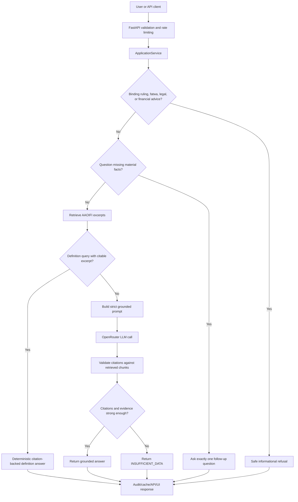
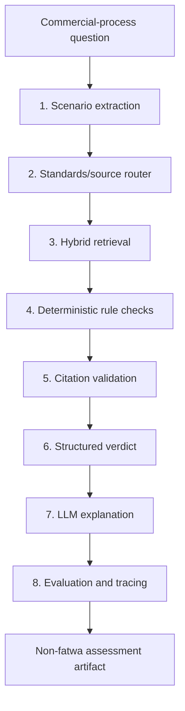
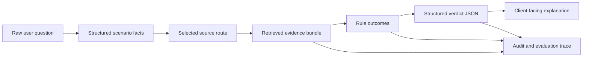

# Mushir Project Documentation

Mushir is a FastAPI-based Sharia compliance chatbot for Islamic finance questions. It uses retrieval-augmented generation (RAG) over AAOIFI Financial Accounting Standards excerpts, then validates that generated answers are grounded in retrieved citations.

This document describes the current project as implemented in the repository and explains how the planning roadmap maps to the built system.

Last refreshed: 2026-05-20

Current published demo:

- GitHub branch: `main`
- Hugging Face Space: `https://huggingface.co/spaces/AElKodsh/mushir-sharia-bot`
- Live app URL: `https://aelkodsh-mushir-sharia-bot.hf.space`
- Latest verified release behavior: `/health` and `/ready` return `200`; English and Arabic Murabaha definition questions return citation-backed `INSUFFICIENT_DATA` informational answers; unclear Arabic Murabaha purchase questions ask one follow-up question.

## Goals

Mushir is built to:

- answer Islamic finance compliance questions using AAOIFI FAS excerpts;
- support English, Arabic, and mixed-language questions;
- ask one focused clarification question when important facts are missing;
- cite retrieved AAOIFI standards in grounded answers;
- refuse binding rulings, fatwas, legal opinions, and financial advice;
- fail closed when retrieval, citations, or provider responses are not reliable;
- expose the behavior through a browser chat UI, REST API, and SSE streaming API.

## Planning And Implementation Summary

The planning files under `.kiro/specs/sharia-compliance-chatbot/next-level-plans/` are now split into historical implementation levels, the active L5 readiness gate, and the proposed L6 product direction.

| Level | Purpose | Current repository state |
| --- | --- | --- |
| L0 | Foundational RAG loop over AAOIFI material | Historical baseline; superseded by the current application service and API runtime |
| L1 | Clarification, safer answer contract, provider error handling, and service orchestration | Implemented through `ApplicationService`, `ClarificationEngine`, prompt building, citation validation, and focused tests |
| L2 | Browser/API transport, REST endpoint, SSE streaming, validation, and rate limiting | Implemented through `src/api/`, `/chat`, `/api/v1/query`, `/api/v1/query/stream`, sessions, and API schemas |
| L3 | Production-style infrastructure options and observability | Implemented as selectable modes for Chroma/Qdrant, Redis-backed stores, PostgreSQL audit, readiness, and metrics |
| L4 | Trust, citation quality, disclaimers, caching rules, and operational hardening | Implemented through citation-gated answers, disclaimer behavior, safe errors, cache rules, and deployment docs |
| L5 | Quality, operations, release readiness, and demo gates | Active gate; tracked by `docs/l5-production-readiness.md` and `L5-QUALITY-OPS-RELEASE-READINESS-PLAN.md` |
| L6 | Rules-first Sharia commercial-process evaluator | Proposed future direction; foundational runtime scaffolding is implemented, full evaluator is not active scope yet |
| L6 evidence corpus | Egypt financial institutions public operations and contracts corpus | Planned data-acquisition workstream; registry seed folders and docs are prepared, broad scraping is not implemented yet |

The active implementation priority is L5. L6 full evaluator work should begin only after L5 quality and runtime gates are green and official-source acquisition/versioning decisions are complete. A small L6 foundation now exists in runtime code to extract scenario metadata, route by source family, detect retrieved source families, and fail closed for late-payment/default permissibility questions when Shari'ah-standard evidence is absent.

## Current Vs Future Scope

The current system is a citation-grounded assistant over the configured AAOIFI corpus, with strong fail-closed behavior. It is not yet a complete commercial-process evaluator.

The proposed L6 direction widens the product in a controlled way:

- permissibility and contract-validity questions should route first to AAOIFI Shari'ah Standards or approved Sharia sources;
- FAS remains the accounting layer for recognition, measurement, presentation, reporting, and disclosure;
- broad transaction questions should be converted into structured transaction scenarios before retrieval;
- supported scenarios should run through executable rules before the LLM explains the result;
- every output remains non-binding and must escalate when facts, sources, or rules are incomplete.

This distinction matters. A RAG answer with FAS citations can support research and explanation, but it should not be presented as a full halal/haram decision for real-world contracts.

## Non-Goals

Mushir must not:

- replace a qualified Sharia scholar;
- issue binding religious rulings;
- answer from the model's general training data;
- invent AAOIFI standard numbers, pages, sections, or citations;
- expose hidden reasoning or provider stack traces;
- leak API keys or credentials in docs, logs, errors, or responses.

## Repository Layout

| Path | Purpose |
| --- | --- |
| `src/api/` | FastAPI app, routes, schemas, rate limiting, API error handling |
| `src/chatbot/` | Main answer service, prompt builder, LLM client, citation validator, clarification engine |
| `src/rag/` | Embeddings, query preprocessing, Chroma/Qdrant retrieval, chunking |
| `src/models/` | Shared data models and answer contracts |
| `src/storage/` | Cache and audit-store implementations |
| `src/static/` | Browser chat UI |
| `scripts/` | Corpus conversion, ingestion, evaluation, deployment, smoke checks |
| `tests/` | Unit, service, API, integration, smoke, and readiness tests |
| `docs/` | Current technical, operations, stakeholder, research, and AI handoff documentation |
| `.kiro/specs/` | Historical planning files and active readiness plans |
| `gemini-gem-prototype/knowledge-base/` | AAOIFI markdown corpus used for ingestion |
| `data/source_registry/` | Small tracked source-category and regulator-source seeds for the planned Egypt institution corpus |
| `data/fixtures/l6_scrape/` | Tiny fixtures for future scraper tests |
| `artifacts/l6_scrape/` | Runtime scrape artifacts, ignored except the README |

## Main Runtime Flow

The current answer path is:



## API Layer

The FastAPI app is created in `src/api/main.py`.

It provides:

- `GET /`: browser chat page;
- `GET /chat`: browser chat page;
- `GET /api`: API metadata;
- `GET /health`: basic liveness check;
- `GET /ready`: runtime readiness check;
- `GET /metrics`: plain-text app metrics;
- `POST /api/v1/query`: normal JSON answer endpoint;
- `POST /api/v1/query/stream`: Server-Sent Events stream endpoint;
- `POST /api/v1/sessions`: create a session;
- `GET /api/v1/sessions/{session_id}/history`: retrieve session history;
- `GET /api/v1/compliance/disclaimer`: disclaimer text and translations.

The app also adds:

- request IDs through `X-Request-ID`;
- safe validation errors;
- content security headers;
- CORS configuration from `CORS_ORIGINS`;
- a shared startup-built retriever when available.

## Request Validation And Error Handling

`src/api/routes.py` handles:

- rate limiting before expensive validation or generation;
- query validation through `InputValidator`;
- safe provider error messages for configuration, rate limits, and unusable model responses;
- SSE event envelopes for `started`, `retrieval`, `token`, `citation`, `done`, and `error`.

User-facing errors should explain the cause enough to be useful without exposing internals.

## Answer Contract

The response contract is defined by:

- `src/models/ruling.py`
- `src/api/schemas.py`

Each answer includes:

- `answer`;
- `status`;
- `citations`;
- `reasoning_summary`;
- `limitations`;
- `clarification_question`;
- `metadata`.

Grounded answers require citations. Clarification responses require exactly one concise question. This prevents the bot from giving unsupported answers or overwhelming users with long question lists.

## Application Service

`src/chatbot/application_service.py` is the main orchestrator.

It performs:

1. Empty-query handling.
2. English/Arabic query normalization.
3. Language detection.
4. Optional disclaimer acknowledgement enforcement.
5. Authority-request refusal for binding fatwa/legal/financial advice.
6. Response cache lookup.
7. Clarification check.
8. Retriever initialization fallback.
9. RAG retrieval.
10. Deterministic definition-answer handling when a retrieved AAOIFI excerpt directly defines the requested term.
11. Prompt building.
12. LLM generation.
13. Citation validation.
14. LLM uncertainty conversion into one follow-up question.
15. Compliance status derivation.
16. Audit logging.
17. Safe response caching.

The service returns `INSUFFICIENT_DATA` when the evidence path is not strong enough.

For definition-style questions such as `What is Murabaha?` or `ما هي المرابحة؟`, the service now prefers a direct citation-backed excerpt answer before calling the model. This avoids a fragile dependency on whether a free model formats Arabic citations exactly as requested.

## Clarification Logic

`src/chatbot/clarification_engine.py` collects the minimum facts needed before retrieval.

It detects broad transaction categories such as:

- loan;
- investment;
- purchase;
- contract.

When important facts are missing, it asks one question at a time. For example, an unclear investment question first asks for the company or business activity. It avoids asking multiple questions in one response.

The app also checks LLM output after generation. If the model itself says more information is needed, the service converts that output into the same clean `CLARIFICATION_NEEDED` contract.

## Retrieval

`src/rag/pipeline.py` implements RAG retrieval.

Key behavior:

- uses a multilingual sentence-transformer embedding model by default;
- expands query terms for cross-language Arabic/English retrieval;
- validates that Chroma contains matching embedding metadata, normalized embeddings, and both Arabic and English rows when Arabic retrieval is required;
- supports Chroma locally and Qdrant as an optional production vector store;
- reranks candidates using similarity, lexical hits, and language preference;
- returns `SemanticChunk` objects with citation metadata.

Default retrieval settings:

- model: `sentence-transformers/paraphrase-multilingual-mpnet-base-v2`;
- Chroma directory: `./chroma_db_multilingual`;
- collection: `aaoifi`.

## Prompting

`src/chatbot/prompt_builder.py` builds strict prompts.

The prompt tells the model to:

- use only retrieved AAOIFI excerpts;
- avoid external knowledge;
- cite every compliance claim;
- ask exactly one follow-up question when facts are unclear;
- return `INSUFFICIENT_DATA` when excerpts are not enough;
- avoid hidden reasoning and chain-of-thought exposure;
- answer in English or Arabic depending on the detected language.

## LLM Provider

`src/chatbot/llm_client.py` uses an OpenAI-compatible client for OpenRouter.

Important settings:

- `OPENROUTER_API_KEY`;
- `OPENROUTER_MODEL`;
- `OPENROUTER_MAX_TOKENS`.

The client raises typed errors for missing configuration, rate limits, and unusable model responses. API routes map these to safe messages.

## Citation Validation

`src/chatbot/citation_validator.py` parses citations in generated answers and keeps only citations that match retrieved chunks.

The validator accepts short English-style and Arabic-style AAOIFI references, including:

- `[FAS-28]`
- `[FAS-28 §8]`
- `[AAOIFI FAS-28, Section 8, page 8]`
- `[معيار أيوفي FAS-28، القسم 8، صفحة 8]`

Accepted answer statuses include:

- `COMPLIANT`;
- `NON_COMPLIANT`;
- `CONDITIONALLY_COMPLIANT`;
- `INSUFFICIENT_DATA`;
- `CLARIFICATION_NEEDED`.

If no valid citation supports a compliance answer, the system falls back to insufficient data.

When a retrieved chunk does not have section metadata, the validator can still accept a standard-level citation for that retrieved standard. When section metadata exists, mismatched sections remain rejected.

## L6 Future Architecture

L6 is documented in `.kiro/specs/sharia-compliance-chatbot/next-level-plans/L6-RULES-FIRST-SHARIA-COMMERCIAL-EVALUATOR-PLAN.md`. It is still a planning direction for the full evaluator, but the first runtime foundation is now present in `src/chatbot/commercial_assessment.py` and `src/models/commercial.py`.

The short version of the target architecture is:

```text
Scenario extraction -> standards/source router -> hybrid retrieval -> deterministic rule checks -> citation validation -> structured verdict -> LLM explanation -> evaluation/tracing
```

In simple engineering terms, L6 should stop treating the model as the judge. The system first converts the user's story into structured facts, finds the right source family, retrieves evidence, applies explicit rules where they exist, validates citations, and only then lets the LLM write the explanation. The LLM becomes the narrator of an audited decision path, not the hidden decision-maker.

The target L6 pipeline is:



### What Each Stage Means

| Stage | Plain meaning | Technical role | Failure behavior |
| --- | --- | --- | --- |
| Scenario extraction | Turn the user's paragraph into clear fields | Extract parties, asset, contract type, payment terms, ownership, possession, risk, late-payment terms, missing facts, and uncertainty flags | Ask a focused follow-up when required facts are absent |
| Standards/source router | Decide which source family should answer the question | Route permissibility to Shari'ah Standards, accounting/reporting to FAS, governance to governance sources, and unsupported topics to a safe gap state | Do not answer halal/haram questions from FAS-only evidence |
| Hybrid retrieval | Search with both meaning and exact terms | Combine semantic retrieval with lexical/metadata filtering for Arabic terms, English terms, standard numbers, contract names, and source-family filters | Return insufficient evidence when source coverage is weak |
| Deterministic rule checks | Apply explicit rules to normalized facts | Use decision tables or a rule engine for supported structures such as Murabaha, late-payment clauses, Ijarah, or Wakala | Flag unsupported, ambiguous, or conflicting cases for review |
| Citation validation | Prove every claim is tied to retrieved evidence | Verify cited standard, section, clause, or source metadata against retrieved chunks | Remove unsupported citations or downgrade to insufficient evidence |
| Structured verdict | Produce a machine-checkable assessment record | Return status, confidence, applied rules, matched evidence, missing facts, limitations, and review flags | Prefer `requires_clarification`, `insufficient_evidence`, or `refer_to_scholar` over a weak verdict |
| LLM explanation | Make the audited result readable | Explain the structured verdict in the user's language without adding new authority or hidden reasoning | If explanation drifts beyond evidence, reject or regenerate |
| Evaluation/tracing | Keep proof that the system behaved correctly | Log retrieval, routing, rule outcomes, citation checks, schema validity, and test metrics for regression review | Block release when gold cases, citation metrics, or rule correctness fail |

### Representative Data Flow



The important boundary is between the verdict and the explanation. The verdict is the controlled artifact that can be tested. The explanation is user-facing language generated from that artifact and its citations.

Required L6 components:

- source-family catalog with Shari'ah Standards, FAS, governance, ethics, auditing, fatwa, and local-overlay metadata;
- transaction scenario schema for parties, asset, cash flows, ownership, possession, risk bearing, payment terms, late-payment terms, agency roles, guarantees, missing facts, and uncertainties; the initial dataclass and deterministic extractor are implemented;
- standards router that separates permissibility, accounting, governance, explanation, and unsupported questions; the initial router is implemented;
- executable rule layer using a selected rules approach after a spike, such as Python decision tables, OPA/Rego, DMN-style tables, Catala, or OpenFisca-style modeling; the current runtime only returns a placeholder rule trace and human-review flags;
- verdict contract with statuses such as `likely_permissible`, `likely_impermissible`, `conditionally_permissible`, `requires_clarification`, `insufficient_evidence`, and `refer_to_scholar`;
- QA gates for source coverage, rule correctness, citation recall/precision, answer faithfulness, language preservation, and refusal consistency.

L6 must not expose raw chain-of-thought. The auditable artifact should be a structured decision trace: extracted facts, matched rules, evidence IDs, limitations, and review flags.

## Egypt Financial Institutions Evidence Corpus

The next L6 data workstream is the Egypt financial institutions public-source evidence corpus. It is documented in `.kiro/specs/sharia-compliance-chatbot/next-level-plans/L6-EGYPT-FINANCIAL-INSTITUTIONS-EVIDENCE-CORPUS-PLAN.md` and summarized in `docs/l6-egypt-institution-scrape/README.md`.

The workstream starts from:

- `.kiro/specs/sharia-compliance-chatbot/Egypt Financial Institutions Refresh for Sharia Screening.md`;
- `.kiro/specs/sharia-compliance-chatbot/Egypt_Financial_Institutions_COMPLETE.xlsx`;
- `.kiro/specs/sharia-compliance-chatbot/Egyptian_Financial_Institutions_Complete_Presentation.pdf`.

The workbook and presentation are baseline inputs, not production authority. The implementation must revalidate institutions against current regulator sources before broad crawling.

The intended corpus covers CBE banks, payment-service sources, capital-market institutions, insurance and takaful entities, mortgage finance, leasing, consumer finance, microfinance and SME finance, fintech licensees, Islamic funds, sukuk sources, and FRA model-contract sources.

The data pipeline should separate:

- canonical institution registry;
- bounded official-source discovery;
- public artifact capture;
- text extraction and evidence spans;
- operations and contracts catalog;
- engine-proposed AAOIFI mapping;
- scholar-review dataset;
- accepted gold cases.

The most important control is negative evidence handling. If an official site, contract, tariff, prospectus, or policy wording is not publicly found after the configured attempt budget, the record should say `official_site_not_found`, `not_publicly_available`, `document_not_public`, `blocked_by_security`, or another explicit status. It should not guess.

The scraper must respect robots.txt, site terms, rate limits, login walls, CAPTCHA, paywalls, and access controls. Blocked or gated material is a dataset status, not a target for bypass.

Machine-proposed AAOIFI mappings and initial compliance-risk labels are review candidates only. Scholar-reviewed records become the supervised truth used for evaluation. Future answers may use institution pre-knowledge as context, but user-supplied facts override stored assumptions and stale or conflicting public data must be flagged.

## Browser Chat UI

The browser interface lives in `src/static/`.

It supports:

- chat input;
- disclaimer acknowledgement;
- request/session context;
- REST and streaming query paths;
- citation rendering;
- compliance labels;
- clarification display;
- helpful validation and provider error messages.

## Runtime Storage

Default local storage is intentionally simple:

- in-memory sessions;
- in-memory rate limiter;
- in-memory response cache;
- null audit store;
- local Chroma vector index.

Production-like modes can use:

- Redis for sessions, rate limiting, and cache;
- PostgreSQL for audit logging;
- Qdrant for vector retrieval.

The app falls back to local runtime components when optional infrastructure is unavailable, but `/ready` reports the selected mode and degraded production readiness when required components are missing.

## Environment Configuration

Minimum live-answer configuration:

```env
OPENROUTER_API_KEY=your-openrouter-api-key-here
OPENROUTER_MODEL=openrouter/free
OPENROUTER_MAX_TOKENS=1024
EMBED_MODEL=sentence-transformers/paraphrase-multilingual-mpnet-base-v2
VECTOR_DB_TYPE=chroma
CHROMA_DIR=./chroma_db_multilingual
CORPUS_DIR=./gemini-gem-prototype/knowledge-base
```

`OPENROUTER_MODEL=openrouter/free` is deliberate for demo and low-cost testing:
OpenRouter routes to whatever free chat models are currently available. Do not
stress that shared API node with large answer-generation loops. Use fake LLM
fixtures, retrieval-only probes, and `RAG_EVAL_MODE=true` for scenario matrices;
reserve live `/api/v1/query` checks for a small number of smoke calls with
backoff between requests.

Important release settings:

```env
APP_ENV=production
CORS_ORIGINS=["https://your-approved-origin.example"]
AUTH_TOKEN=your-auth-token
AUDIT_DATABASE_URL=your-postgres-url
REQUIRE_ARABIC_RETRIEVAL=true
```

Do not commit real credentials.

## Setup

Create and activate the virtual environment:

```powershell
py -3.11 -m venv .venv
.\.venv\Scripts\Activate.ps1
```

Install dependencies:

```powershell
.\.venv\Scripts\python.exe -m pip install -r requirements.txt
```

Create `.env` from `.env.example` and set provider credentials locally.

Build or refresh the vector index:

```powershell
.\.venv\Scripts\python.exe scripts\ingest.py --reset --languages en,ar
```

Run the app:

```powershell
.\.venv\Scripts\python.exe -m uvicorn src.api.main:app --host 127.0.0.1 --port 8000
```

Open:

```text
http://127.0.0.1:8000/chat
```

## Testing

Full test suite:

```powershell
.\.venv\Scripts\python.exe -m pytest -q --timeout=90
```

Fast gate:

```powershell
.\.venv\Scripts\python.exe -m pytest -m "unit or service or api" -q --timeout=60
```

Retrieval quality gate:

```powershell
$env:CHROMA_DIR=".\chroma_db_multilingual"
$env:EMBED_MODEL="sentence-transformers/paraphrase-multilingual-mpnet-base-v2"
.\.venv\Scripts\python.exe scripts\evaluate_rag.py --gold tests\fixtures\gold_eval.yaml --min-hit-at-k 0.70 --min-recall-at-k 0.70 --min-mrr 0.30 --min-answerable-cases 3 --max-unanswerable-retrieval-rate 1.00
```

API smoke:

```powershell
curl.exe http://127.0.0.1:8000/health
curl.exe http://127.0.0.1:8000/ready
curl.exe -X POST http://127.0.0.1:8000/api/v1/query -H "Content-Type: application/json" -d "{\"query\":\"Can Mushir give a binding fatwa?\"}"
```

## Deployment

The Docker image runs:

```text
uvicorn src.api.main:app --host 0.0.0.0 --port 7860
```

The Dockerfile sets local defaults for:

- Chroma retrieval;
- multilingual embedding model;
- Arabic retrieval requirement;
- OpenRouter model;
- API port `7860`.

Hugging Face Spaces deployment uses Docker frontmatter in `README.md` and the deployment helper scripts under `scripts/`.

Before treating any deployment as live, verify:

- `/health`;
- `/ready`;
- `/chat`;
- one English answerable question;
- one Arabic answerable question;
- one English definition query, such as `What is Murabaha?`;
- one Arabic definition query, such as `ما هي المرابحة؟`;
- one unanswerable or out-of-scope question;
- no secrets in logs or responses.

## Latest Verification Snapshot

Last verified on 2026-05-17 against the Hugging Face Space:

| Check | Expected result | Observed result |
| --- | --- | --- |
| `/health` | HTTP 200 | HTTP 200 |
| `/ready` | HTTP 200 with retriever ready | HTTP 200 |
| `What is Murabaha?` | Citation-backed informational definition | `INSUFFICIENT_DATA`, 1 citation |
| `ما هي المرابحة؟` | Citation-backed informational definition | `INSUFFICIENT_DATA`, 1 citation |
| `أريد شراء سيارة بالمرابحة` | One Arabic follow-up question | `CLARIFICATION_NEEDED` |

The `INSUFFICIENT_DATA` status for definition questions is intentional: a definition is useful informational guidance, but it is not a full compliance ruling for a concrete transaction.

## Operational Checks

Use `/ready` to confirm:

- vector store mode;
- retriever readiness;
- provider configuration;
- auth configuration;
- durable audit/session/cache/rate-limit mode.

Use `/metrics` to inspect request counts and latency buckets.

Production should be considered degraded if required production checks fail.

## Known Constraints

- Mushir covers AAOIFI FAS excerpts in the configured corpus. It does not automatically cover every AAOIFI standard family unless those documents are ingested.
- Strong answer quality depends on the corpus, embeddings, and retrieval threshold.
- Free-tier hosting can be memory constrained because sentence-transformer models are loaded at runtime.
- Binding Sharia decisions still require qualified human review.

## Maintenance Rules

- Keep `project-context.md` updated when architecture or safety rules change.
- Keep this document current when endpoints, runtime modes, or answer flow change.
- Add tests for every safety behavior change.
- Run the focused gate before the full suite during active development.
- Use placeholders in docs and examples.
- Re-run secret scans after handling real credentials or deployment incidents.
